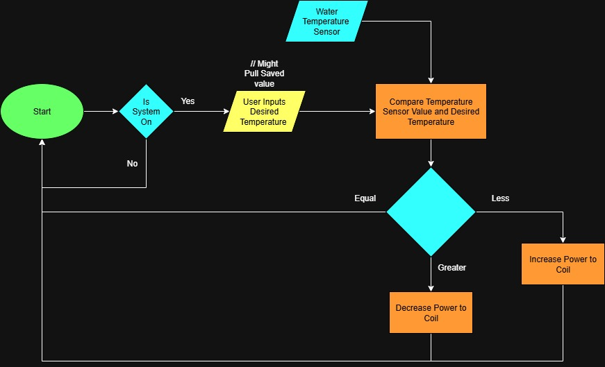

# Conceptual Design

This document outlines the objectives of a conceptual design. After reading your conceptual design, the reader should understand:

- The fully formulated problem.
- The fully decomposed conceptual solution.
- Specifications for each of the atomic pieces of the solution.
- Any additional constraints and their origins.
- How the team will accomplish their goals given the available resources.

With these guidelines, each team is expected to create a suitable document to achieve the intended objectives and effectively inform their stakeholders.

## General Requirements for the Document
- Submissions must be composed in Markdown format. Submitting PDFs or Word documents is not permitted.
- All information that is not considered common knowledge among the audience must be properly cited.
- The document should be written in the third person.
- An introduction section should be included.
- The latest fully formulated problem must be clearly articulated using explicit "shall" statements.
- A comparative analysis of potential solutions must be performed
- The document must present a comprehensive, well-specified high-level solution.
- The solution must contain a hardware block diagram.
- The solution must contain an operational flowchart.
- For every atomic subsystem, a detailed functional description, inputs, outputs, and specifications must be provided.
- The document should include an acknowledgment of ethical, professional, and standards considerations, explaining the specific constraints imposed.
- The solution must include a refined estimate of the resources needed, including: costs, allocation of responsibilities for each subsystem, and a Gantt chart.

## Introduction - John
***

Induction heating remains one of the most effective methods for transferring energy into conductive materials by applying time-varying magnetic fields to create eddy current. Performance, repeatability, and efficiency are all fundamentally determined by the level of control over the physical process of induction heating. The controller allows for the delivery of power, measures and adjusts temperature, and ensures operational safety. Even a well-designed induction coil cannot consistently provide precise heating performance without an efficient controller.

This project addresses the challenge of by designing and prototyping a custom induction heater controller capable of heating both the internal and surface-level regions of circular metallic elements such as bar stock and standard black pipe. Unlike commercial cooktop controllers, which operate in open-loop configurations, this system will implement closed-loop control to verify temperature rise against electrical power input, gather experimental data, and allow flexible user-defined operating modes.

The fully formulated problem is essentially to design a controller that can sense and control temperature, safely and effectively manage power delivery, and provide real-time feedback for experimental validation of induction heating performance. To meet customer requirements and IEEE safety standards, the system shall strike a balance between safety, measurement accuracy, and adaptability.

This conceptual design expands upon the original project proposal by breaking down the system into functional subsystems, defining their specifications, and identifying hardware, software, and safety requirements that collectively achieve these goals. The following sections restate the detailed problem statement, present the system architecture, and outline the printed circuit board (PCB) subsystem that integrates the control and power electronics required to operate the induction heater safely and effectively.

## Restating the Fully Formulated Problem - John
***

The fully formulated problem is the overall objective and scope complete with the set of shall statements. This was part of the project proposal. However, it may be that the scope has changed. So, state the fully formulated problem in the introduction of the conceptual design and planning document. For each of the constraints, explain the origin of the constraint (customer specification, standards, ethical concern, broader implication concern, etc).

## Comparative Analysis of Potential Solutions - Cole
***

In this section, various potential solutions are hypothesized, design considerations are discussed, and factors influencing the selection of a solution are outlined. The chosen solution is then identified with justifications for its selection.

open loop vs. closed loop [Cole]

Lochinvar has supplied the team with an OMEO SK-IH18G23T induction cooker [1]. This induction cooker is designed to be used with smooth, flat bottom base cookware. The cooker utilizes an open loop control system operating based on user selected power and time settings. This cooker has no feedback to know the actual temperature of the part heated, but it is able to predict the temperature from the power selected by the user. The cooker is preprogrammed to 10 temperatures of 120°F to 460°F correlating to 180 Watts to 1800 Watts [2]. Preprogrammed open loop control provides a cost effective and user intuitive solution, but the relation between temperature and power would need to be tested using a temperature sensor to meet this project's specifications. A sensor would need to be budgetted for whether the team utilzes open or closed loop control becasue of this. Closed loop control requires more time to design the system to properly integrate the sensor(s) into feedback loops, but it would allow for more accurate and reliable temperature control. 

Safety controls will be essential to prevent overheating of components. The OMEO SK-IH18G23T, though the heating itself is open loop, contains sensors providing feedback to protect the cooker. Notably it contains a thermocouple to measure the surface temperature of the induction cooker and an IGBT sensor placed underneath the heatsink to ensure the PCB was not getting too hot. 

OMEO PCB with Heatsink:

OMEO PCB without  Heatsink: 

The surface temperature is kept below 280°F while the PCB is kept under 105°F [2]. Ideally, the cooker should remain relatively cool while the part is being heated. If the cooker's surface temperature or the IGBT's temperature rises too high, the controller produces an error code and stops heating [2]. The cooker's heat sink absorbs much of the heat, but if the heat sink fails the controller's components will fail due to overheating and may fail violently at risk of causing harm to operators. The team's solution will include similar safety controls to protect the user and the controller itself. 
 

pancake coil vs. wrapped coil for bar end heating [Cole]

The project shall be able to induce surface eddy currents and produce internal heating. The OMEO SK-IH18G23T induction cooker achieves this by utilizing is a pancake coil configuration that rest flat against the part being heated. This configuration would be sufficient but not very efficient in order to heat circular bar stock. If the circular bar stock is laid flat on its end heated utilizing bar end heating, the end heated would heat much faster than the opposite end. More efficient bar end heating operates by wrapping around one end of the circular bar stock, but this would require rearranging the existing pancake coil without compromising its ability to properly induce currents on the part heated. For simplicity and to remain within the scope of the project, the team will utilize the existing solution of the pancake coil configuration while acknowledging that this may not be the most efficient set up for heating circular bar stock with a long length. 

Microcontroller and PCB stuff which one [Dow] and [John]

power stuff -> full bridge rectifier, DC transformers, filtering / resonance, transistors  [Austin]

The induction cooker given by Lochinvar interfaces with a standard 120 VAC outlet and draws 110 V constant. The frequency remains constant around 20 kHz.  The PWM switching speed is what changes the amount of current delivered since power is the time derivative of energy. This concept of varying the on/off time of the transistors to dictate the amount of energy transferred over time to change the power is seen in pretty much every induction heating design. There were 2 different types of induction cookers given to us as reference by our EE contact, Mr. Rushing. These solutions are real life designs that have been implemented for civilian-use. The way these designs differ is by the way the voltage source signal is rectified.  

A full-bridge rectifier shall be chosen over a half-bridge rectifier because it provides better efficiency and utilization of the transformer’s secondary winding, delivering a higher average DC output voltage and smoother waveform with reduced ripple. In design, key considerations include voltage and current ratings of the diodes, transformer configuration, power efficiency, and cost versus performance trade-offs. Factors such as load requirements, available supply voltage, and desired output smoothness influence the decision. The full-bridge configuration is selected because it ensures maximum power transfer, improved DC output quality, and better performance for high-power applications, justifying its use despite the slightly higher component count.

## High-Level Solution - Cole
***

This section presents a comprehensive, high-level solution aimed at efficiently fulfilling all specified requirements and constraints. The solution is designed to maximize stakeholder goal attainment, adhere to established constraints, minimize risks, and optimize resource utilization. Please elaborate on how your design accomplishes these objectives.

[Brainstorm,Fix/RemoveLater]
User has options to choose 10 different power levels to produce certain temperatures on the circular bar stock. This will be accomplished user a human machine interface (HMI) that will talk to the microcontroller to tell it to change the current induced to the coils. We will utilize a thermocouple temperature sensor to measure the temperature of the part to calculate the temperature rise and display to the user using the HMI / LCD. We will also calculate the total power consumed using a wattmeter and display that to the LCD. The microcontroller will be able to send feedback to adjust the current delivered as needed.

[Power]
This controller shall operate at a constant voltage to maintain compatibility with standard 120 VAC wall outlets. 

[HeatControl] 
This controller shall be able to induce surface eddy currents and be able to produce internal heating on a circular bar stock. The controller will utlize a closed loop feedback control system to ensure that the circular bar stock is heated accurately and in a consistent, repeatable manner. When the user selects a desired power level, the controller will recognize that input and adjust the power / current delivered to the induction coil. The controller will interface with temperature sensors to verify that the circular bar stock is being heated correctly. The controller will utilize feedback loops to make adjustments to the power / current delivered to the induction coil as needed to prevent over- or under-heating of the circular bar stock. 

[SafetyControl]
This controller shall implement safety controls to prevent overheating of the controller to minimize operating risks. 

[Software]
This controller shall have preprogrammed power settings to ensure a user friendly and safe heating operation. 

-> add stuff about LCD or keypad input or whatever

[PCB]

### Hardware Block Diagram - John & Everyone
***

Block diagrams are an excellent way to provide an overarching understanding of a system and the relationships among its individual components. Generally, block diagrams draw from visual modeling languages like the Universal Modeling Language (UML). Each block represents a subsystem, and each connection indicates a relationship between the connected blocks. Typically, the relationship in a system diagram denotes an input-output interaction.

In the block diagram, each subsystem should be depicted by a single block. For each block, there should be a brief explanation of its functional expectations and associated constraints. Similarly, each connection should have a concise description of the relationship it represents, including the nature of the connection (such as power, analog signal, serial communication, or wireless communication) and any relevant constraints.

The end result should present a comprehensive view of a well-defined system, delegating all atomic responsibilities necessary to accomplish the project scope to their respective subsystems.

### Operational Flow Chart - Dow & Everyone
***

Similar to a block diagram, the flow chart aims to specify the system, but from the user's point of view rather than illustrating the arrangement of each subsystem. It outlines the steps a user needs to perform to use the device and the screens/interfaces they will encounter. A diagram should be drawn to represent this process. Each step should be represented in the diagram to visually depict the sequence of actions and corresponding screens/interfaces the user will encounter while using the device.

https://drive.google.com/file/d/1H84D3nlYPLJDFGQF3kWs2CwpNOFCGdcv/view?usp=sharing

## Atomic Subsystem Specifications
***

Based on the high-level design, provide a comprehensive description of the functions each subsection will perform.

Inclued a description of the interfaces between this subsystem and other subsystems:
- Give the type of signal (e.g. power, analog signal, serial communication, wireless communication, etc).
- Clearly define the direction of the signal (input or output).
- Document the communication protocols used.
- Specifying what data will be sent and what will be received.

Detail the operation of the subsystem:
- Illustrate the expected user interface, if applicable.
- Include functional flowcharts that capture the major sequential steps needed to achieve the desired functionalities.

For all subsystems, formulate detailed "shall" statements. Ensure these statements are comprehensive enough so that an engineer who is unfamiliar with your project can design the subsystem based on your specifications. Assume the role of the customer in this context to provide clear and precise requirements.

( We need to address what each system is doing as well as what systems our system supports/provides information to. Each system should have a customer and a )

### Power System - Austin 

### Control System - Cole and Aaron

- #### Heat Generation - Cole
This controller shall be able to induce surface eddy currents and be able to produce internal heating on a circular bar stock. The Heat Generation Control subsystem shall be able to ensure that the circular bar stock is heated accurately and in a consistent, repeatable manner. When the user selects a desired power level, this subsystem will recognize that input and adjust the power / current delivered to the induction coil. As the induction coil produces a magnetic field and induces eddy currents on the part, this subsystem will interface with temperature sensors to verify that the part is being heated in a consistent, repeatable manner. The subsystem will utilize feedback loops implemented using software to make adjustments to the power / current delivered to the induction coil as needed to prevent over- or under-heating. 

- #### Safety and Protection Controls - Aaron

This subsystem is responsible for ensuring the induction heater operates within safe limits, protecting both the user from harm and the device from damage. It will function in the background, continuously monitoring signals such as temperature and current to ensure the system is operating within these safe limits, and if not, shuts down accordingly. It directly enforces the constraints set in ethical, professional, and standards considerations.

1. The safety subsystem shall continuously monitor the temperature of the power switching transistors' (IGBT) heatsink using a dedicated thermocouple.
2. The safety subsystem shall shut down the induction heating if the IGBT heatsink temperature exceeds 105°F (40.5°C) [2].
3. The safety subsystem shall trigger a system shutdown if the heating surface temperature exceeds 280°F (138°C) when no workpiece is present [2].
4. The safety subsystem shall continuously monitor the total AC current drawn by the device.
5. The safety subsystem shall trigger a system shutdown if the current draw exceeds the rated amperage of a standard 15A circuit for more than 500 milliseconds.
6. The safety subsystem shall limit ground fault current such that no more than 50 volts appears on any accessible metal part, per NEC Article 665 [4].
7. The "Off" switch shall physically open all ungrounded conductors, ensuring no power can be supplied to the heating coil, per NEC Article 427 [5].
8. The safety subsystem shall prevent the induction coil from energizing if a compatible workpiece (circular bar stock, pipe) is not detected.
9. Upon detecting any fault condition, the safety subsystem shall provide a specific error code to the user display that identifies the cause of the fault.
10. Once a fault state is triggered, the safety subsystem shall remain in a safe, non-operational mode until the user performs a manual power cycle.

##### Interfaces with Other Subsystems
The Safety and Protection Controls subsystem acts as the central control. It will be crucial for monitoring and responding to hazards. It interfaces with nearly all other project subsystems. In the following descriptions, an output signal refers to a signal sent from the safety subsystem to another system, while an input signal refers to a signal received by the safety subsystem.

##### - Power System

Output Signal : Digital Signal

Data: A binary signal. A logic LOW signal will be sent to the power transistors (IGBTs/MOSFETs) or a relay to immediately cutting off power to the induction coil in the event of a fault condition.

Input Signal : Analog Voltage

Data: A voltage signal proportional to the total current draw, received from a current sensor located in the power system. This is used for over-current monitoring.

##### - Heat Generation Control

Input Signal: Analog Voltage

Data: Temperature readings from thermocouples placed on the heatsink (monitoring IGBT temperature), the cooking surface, and the workpiece itself.

Output Signal: Digital Interrupt

Data: A signal sent to the Heat Generation software module to command it to stop PWM signal generation in the event of a fault.

##### - Embedded System (Software & User Interface)

Output Signal: Error Codes

Data: Error codes and status flags will be sent to the embedded subsystem to be displayed on the LCD screen.

### Embedded System - Dow and John

- #### Software Subsystem - Dow
This software shall interpret the output of sensors, toggle the output of pins on a microcontroller, calculate the how much power to send to the induction coil, and transcribe inputs from the user to set the desired values. The software will understand the sensors via a few methods. If the sensor outputs on or off, no parsing is required. Some sensors output a voltage range which also does not usually need much more processing than scaling the voltage.  Others output a digital waveform which is on or off or specific amounts of time representing a binary value similar to a morris code of sorts. This digital waveform can be interpreted using timers and interrupts on the board. There is also digital protocols for getting information from sensors which use APIs to process what it send to the microcontroller.
- #### PCB Subsystem - John

## Ethical, Professional, and Standards Considerations - Aaron
***

In the project proposal, each team must evaluate the broader impacts of the project on culture, society, the environment, public health, public safety, and the economy. Additionally, teams must consider relevant standards organizations that will inform the design process. A comprehensive discussion should be included on how these considerations have influenced the design. This includes detailing constraints, specifications, and practices implemented as a result, and how these address the identified considerations.

## Resources
***

You have already estimated the resources needed to complete the solution. Now, let's refine those estimates.

### Budget - Aaron

Develop a budget proposal with justifications for expenses associated with each subsystem. Note that the total of this budget proposal can also serve as a specification for each subsystem. After creating the budgets for individual subsystems, merge them to create a comprehensive budget for the entire solution.

#### Controls System Budget

#### Power Systems Budget

#### Embedded Systems Budget

### Division of Labor - Aaron

First, conduct a thorough analysis of the skills currently available within the team, and then compare these skills to the specific requirements of each subsystem. Based on this analysis, appoint a team member to take the specifications for each subsystem and generate a corresponding solution (i.e. detailed design). If there are more team members than subsystems, consider further subdividing the solutions into smaller tasks or components, thereby allowing each team member the opportunity to design a subsystem.

To accomplish our projects goals, it is crucial to appoint specific members to areas they will achieve the highest success in. 

### Timeline - Aaron

Revise the detailed timeline (Gantt chart) you created in the project proposal. Ensure that the timeline is optimized for detailed design. Address critical unknowns early and determine if a prototype needs to be constructed before the final build to validate a subsystem. Additionally, if subsystem $A$ imposes constraints on subsystem $B$, generally, subsystem $A$ should be designed first.

## References - Everyone
***

All sources utilized in the conceptual design that are not considered common knowledge must be properly cited. Multiple references should be included.

[1] “Amazon.com: OMEO Portable Induction Cooktop Hot Plate Countertop Burner 1800 Watts Induction Burner with LCD Sensor Touch, LED Display, 10 Temperature Levels, Child Safety Lock, Auto Shutoff Function: Home & Kitchen,” Amazon.com, 2025. https://www.amazon.com/OMEO-Portable-Induction-Cooktop-Function/dp/B0CQMHM9G6?th=1 (accessed Oct. 04, 2025).

[2] “INDUCTION COOKER User Manual Model: SK-IH18G23T.”

[3] J. Lasobras, R. Alonso, C. Carretero, E. Carretero, and E. Imaz, “Infrared Sensor-Based Temperature Control for Domestic Induction Cooktops,” Sensors, vol. 14, no. 3, pp. 5278–5295, Mar. 2014, doi: https://doi.org/10.3390/s140305278.

[4] opitts2k, “Article 665,” The NEC Wiki, 2021. https://thenecwiki.com/2021/02/article-665/ (accessed Sep. 29, 2025).

[5] opitts2k, “Article 427,” The NEC Wiki, 2021. https://thenecwiki.com/2021/02/article-427/ (accessed Sep. 25, 2025).
‌

## Statement of Contributions - Everyone
***

Each team member is required to make a meaningful contribution to the project proposal. In this section, each team member is required to document their individual contributions to the report. One team member may not record another member's contributions on their behalf. By submitting, the team certifies that each member's statement of contributions is accurate.

Comparative Analysis of Existing Solutions - Power System  - [Austin]
Comparative Analysis of Existing Solutions - Control System  - [Cole]

clear
