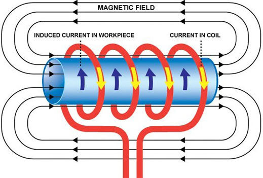
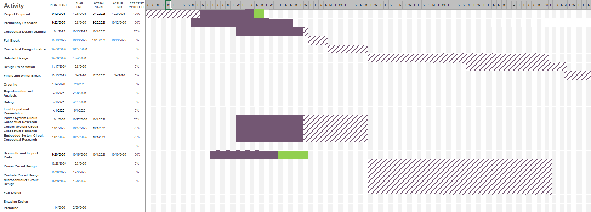
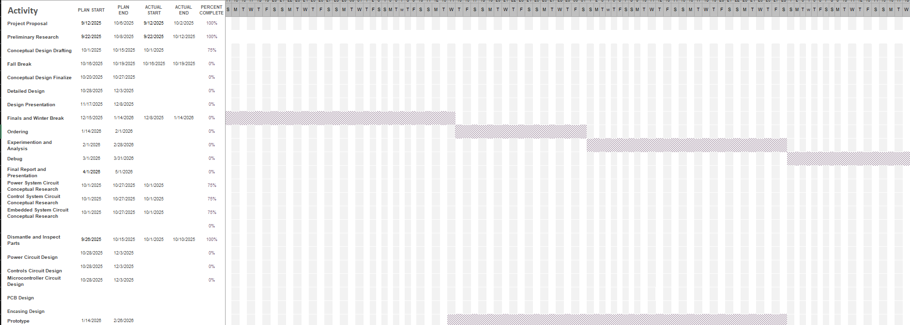

# Conceptual Design
## Introduction
***

Induction heating remains one of the most effective methods for transferring energy into conductive materials by applying time-varying magnetic fields to induce eddy currents. The performance, repeatability, and efficiency of this process are fundamentally determined by the degree of control applied to it. The controller allows power delivery, measures and adjusts temperature, and ensures operational safety. Even a well-designed induction coil cannot consistently achieve precise heating performance without an efficient control system.

This project addresses that challenge by designing and prototyping a custom induction heater controller capable of heating both the internal and surface regions of circular metallic elements such as bar stock and standard black pipe. Unlike commercial cooktop controllers, which operate in open-loop configurations, this system will implement closed-loop control to verify temperature rise against electrical power input, collect experimental data, and support flexible user-defined operating modes.

The fully formulated problem is to design a controller that can accurately sense and regulate temperature, safely and effectively manage power delivery, and provide real-time feedback for experimental validation of induction heating performance. To satisfy customer requirements and comply with IEEE and NEC safety standards, the system shall strike a balance between safety, measurement accuracy, and operational adaptability.

This conceptual design document will flesh out the original project proposal by classifying each system into subsystems, by explaining and going into detail about their specifications, the safety requirements, and what’s the achievable goal. The following sections include reformulating the problem, comparative analysis of potential solutions, specifications of the subsystems, and considerations of both ethical and professional designs for the project.

## Restating the Fully Formulated Problem
***

The objective of this project is to design and prototype a custom induction heating controller that can safely heat  metallic materials such as bar stock and/or regular black pipe in a repeatable fashion. This system will apply closed-loop feedback controls that uses temperature sensors to monitor and control heat production in real time, differing from typical commercial induction cooktops that depend on open-loop controls and lack temperature sensors.

The scope of the project includes:  
- Designing a controller to integrate power and measurement systems.  
- Applying control algorithms that grant user-selectable power modes and maintain consistent thermal output.  
- Measuring and displaying both electrical input power and resulting temperature rise.  
- Ensuring compliance with Lochinvar’s customer specifications and relevant NEC and IEEE safety standards.  

The controller will act as a proof-of-concept platform that illustrates the connection between electrical input power and thermal output while carrying-out safety, measurement precision, and adaptability.

### Shall Statements and Constraint Origins

| **ID** | **System Requirements**                                                                                                                           | **Origin of Constraint (Reference)**                                                                |
| :----: | :------------------------------------------------------------------------------------------------------------------------------------------------ | :-------------------------------------------------------------------------------------------------- |
|   1    | This controller **shall** provide multiple power settings, allowing for adjustable heating levels.                                                | Customer specification (Lochinvar requirement)                                                      |
|   2    | This controller **shall** cause internal heating and surface eddy currents in cylindrical metallic samples (bar stock and/or regular black pipe). | Functional design requirement; project objective; supported by induction heating models  [32], [34] |
|   3    | This controller **shall** measure and display electrical input power and corresponding temperature rise.                                          | Customer specification; data acquisition requirement [1], [2]                                       |
|   4    | This controller **shall** prevent energization when in the OFF state by making sure all ungrounded conductors are disconnected.                   | Safety requirement; NEC Article 427 (Fixed Electric Heating Equipment) [10]                         |
|   5    | This controller **shall** have overheating and overcurrent fault protection to avoid hardware failure.                                            | Standards compliance; IEEE 844-2000 (Impedance, Induction, and Skin-Effect Heating) [28]            |
|   6    | This controller **shall** have an LCD screen to show temperature, power, and current flow data.                                                   | Customer usability requirement; supported by OMEO cooktop interface [1], [2], [8]                   |
|   7    | This controller **shall** be housed in an insulated, non-conductive enclosure.                                                                    | NEC 665, Part II; ethical responsibility for user safety [9]                                        |
|   8    | This controller **shall** not exceed a maximum enclosure temperature of 105°C during operation.                                                   | Component protection limit; derived from OMEO SK-IH18G23T analysis [2]                              |
|   9    | This controller **shall** adhere to ethical engineering practices.                                                                                | Ethical and professional standards (IEEE Code of Ethics) [28], [35]                                 |

## Comparative Analysis of Potential Solutions
***

### Control System 

Lochinvar has supplied the team with an OMEO SK-IH18G23T induction cooker [1]. This induction cooker is designed to be used with smooth, flat bottom base cookware. The cooker utilizes an open loop control system operating based on user selected power and time settings. This cooker has no feedback to know the actual temperature of the part heated, but it is able to predict the temperature from the power selected by the user. The cooker is preprogrammed to 10 temperatures of 120°F to 460°F correlating to 180 Watts to 1800 Watts [2]. Preprogrammed open loop control provides a cost effective and user intuitive solution, but the relation between temperature and power would need to be tested using a temperature sensor to meet this project's specifications. A sensor would need to be budgetted for whether the team utilzes open or closed loop control becasue of this. Closed loop control requires more time to design the system to properly integrate the sensor(s) into feedback loops, but it would allow for more accurate and reliable temperature control.

Safety controls will be essential to prevent overheating of components. The OMEO SK-IH18G23T, though the heating itself is open loop, contains sensors providing feedback to protect the cooker. Notably it contains a thermocouple to measure the surface temperature of the induction cooker and an IGBT sensor placed underneath the heatsink to ensure the PCB was not getting too hot.

OMEO PCB with Heatsink:

OMEO PCB without  Heatsink:

The surface temperature is kept below 280°F while the PCB is kept under 105°F [2]. Ideally, the cooker should remain relatively cool while the part is being heated. If the cooker's surface temperature or the IGBT's temperature rises too high, the controller produces an error code and stops heating [2]. The cooker's heat sink absorbs much of the heat, but if the heat sink fails the controller's components will fail due to overheating and may fail violently at risk of causing harm to operators. The team's solution will include similar safety controls to protect the user and the controller itself.

### Microcontroller and PCB
Microcontroller Options:

| Stat            | [ESP32-C61](https://www.espressif.com/en/products/devkits) for [$9.00](https://www.digikey.com/en/products/detail/espressif-systems/ESP32-C61-DEVKITC-1-N8R2/26763163?s=N4IgTCBcDaIKIGUAKBmMBaAwgNgIzoBEBTANwGkBLAF03VxAF0BfIA) [3] | [ST-Nucleo-G474RE](https://os.mbed.com/platforms/ST-Nucleo-G474RE/) for [$15.56](https://www.digikey.com/en/products/detail/stmicroelectronics/NUCLEO-G474RE/10231585) [4] | [ST-Nucleo-L476RG](https://os.mbed.com/platforms/ST-Nucleo-L476RG/) for [$14.85](https://www.digikey.com/en/products/detail/stmicroelectronics/NUCLEO-L476RG/5347711) [5] | [DISCO-L4S5I](https://os.mbed.com/platforms/B-L4S5I-IOT01A/) [$55.26](https://www.digikey.com/en/products/detail/stmicroelectronics/B-L4S5I-IOT01A/12395902) [6] | [STM32F413H-DISCO](https://os.mbed.com/platforms/ST-Discovery-F413H/) for [$76.09](https://www.digikey.com/en/products/detail/stmicroelectronics/STM32F413H-DISCO/6709885?s=N4IgjCBcoLQBxVAYygMwIYBsDOBTANCAPZQDaIALAJwDsIAugL6OEBMZIAygCoCyAzKwBiFMPwASMACIBJTgGEA8g0ZA) [7] |
| :-------------- | :---------------------------------------------------------------------------------------------------------------------------------------------------------------------------------------------------------------------------------- | :------------------------------------------------------------------------------------------------------------------------------------------------------------------------- | :------------------------------------------------------------------------------------------------------------------------------------------------------------------------ | ---------------------------------------------------------------------------------------------------------------------------------------------------------------: | ----------------------------------------------------------------------------------------------------------------------------------------------------------------------------------------------------------------------------------------------------------------------------: |
| ADCs            | 1                                                                                                                                                                                                                                   | 5                                                                                                                                                                          | 3                                                                                                                                                                         |                                                                                                                                                                1 |                                                                                                                                                                                                                                                                             1 |
| ADC Sample Rate | 2 Msps                                                                                                                                                                                                                              | 4 Msps                                                                                                                                                                     | 5 Msps                                                                                                                                                                    |                                                                                                                                                           5 Msps |                                                                                                                                                                                                                                                                      2.4 MSPS |
| ADC Channels    | 4                                                                                                                                                                                                                                   | 26                                                                                                                                                                         | 16                                                                                                                                                                        |                                                                                                                                                               16 |                                                                                                                                                                                                                                                                            16 |
| Wifi            | 2.1 GHz                                                                                                                                                                                                                             | N/A                                                                                                                                                                        | N/A                                                                                                                                                                       |                                                                                                                                                            Maybe |                                                                                                                                                                                                                                                                         Maybe |
| Bluetooth       | BT5                                                                                                                                                                                                                                 | N/A                                                                                                                                                                        | N/A                                                                                                                                                                       |                                                                                                                                                            Maybe |                                                                                                                                                                                                                                                                         Maybe |
| 16 bit Timer    | 0                                                                                                                                                                                                                                   | 3                                                                                                                                                                          | 9                                                                                                                                                                         |                                                                                                                                                            Maybe |                                                                                                                                                                                                                                                                         Maybe |
| 32 bit timer    | 0                                                                                                                                                                                                                                   | 2                                                                                                                                                                          | 2                                                                                                                                                                         |                                                                                                                                                            Maybe |                                                                                                                                                                                                                                                                         Maybe |
| 52 bit timer    | 2                                                                                                                                                                                                                                   | 0                                                                                                                                                                          | 0                                                                                                                                                                         |                                                                                                                                                                0 |                                                                                                                                                                                                                                                                             0 |
| PWM Chanels     | 6                                                                                                                                                                                                                                   | 8                                                                                                                                                                          | 6                                                                                                                                                                         |                                                                                                                                                            Maybe |                                                                                                                                                                                                                                                                         Maybe |
| LCD Driver      | Yes                                                                                                                                                                                                                                 | Yes                                                                                                                                                                        | Yes                                                                                                                                                                       |                                                                                                                                                            Maybe |                                                                                                                                                                                                                                                                         Maybe |

Hardware control is not desirable because the parts can have long lead times and the project does not have high voltage components that would necessitate the need for relays or similar hardware.

### Power System Overview:

1. A full-bridge rectifier shall be chosen over a half-bridge rectifier because it provides better efficiency and utilization of the AC line. This delivers a higher average DC output voltage and smoother waveform with reduced ripple. Compared to half-wave designs, the full-bridge configuration uses both halves of the AC waveform, resulting in more continuous conduction and a higher transformer utilization factor (TUF), which contributes to improved power efficiency and output quality [30]. Additionally, the bridge rectifier produces a smaller ripple for a given load and requires less filtering, enhancing overall DC smoothness [31]. In design, key considerations include voltage and current ratings of the diodes, power efficiency, and cost versus performance trade-offs. Factors such as load requirements, available supply voltage, and desired output smoothness influence the decision. The full-bridge configuration is selected because it ensures maximum power transfer, improved DC output quality, and better performance for high-power applications, justifying its use despite the slightly higher component count [32].

2. Adequate voltage filtering in the power board of an induction heater is essential to suppress DC-link ripple, reduce switching noise, and prevent voltage overshoot that can stress semiconductor devices. The most common solution is bulk capacitive filtering, where large electrolytic or film capacitors are placed across the DC bus to provide a low impedance path for high-frequency components. This configuration smooths the DC voltage and reduces electromagnetic interference (EMI) by bypassing switching transients to ground [11]. Low-ESR and low-ESL capacitors are preferred for this purpose, as they handle high ripple currents effectively. The main advantages of capacitive filtering include its simplicity, compactness, and low cost. However, disadvantages include high in-rush current during startup, aging under thermal stress, and limited attenuation of low-frequency ripple components [12].

An alternative or complementary approach is inductive filtering, where a series choke or inductor is inserted between the rectifier and DC-link capacitor. Inductors resist rapid current changes, reducing the propagation of voltage spikes and attenuating higher-order harmonics [13]. When combined with capacitors, this technique offers enhanced voltage stability and suppression of switching-induced noise. However, inductive elements introduce conduction and magnetic core losses, add voltage drop under load, and require large cores to avoid saturation at high current levels [14]. Standalone inductive filters are seldom sufficient for high-frequency switching noise suppression and are usually integrated with capacitive stages for optimal performance.

A more advanced option LC low-pass filter, which combines the strengths of capacitors and inductors to achieve wideband ripple suppression and improved voltage regulation. The first capacitor attenuates high-frequency components, the series inductor blocks intermediate harmonics, and the output capacitor smooths the remaining ripple [15]. Properly designed LC or π-filters can meet EMI compliance standards while maintaining stable DC-link voltage [16]. However, this approach introduces added complexity, cost, and physical size. Unintended resonance between the inductive and capacitive elements can also occur, necessitating damping or snubber circuits to maintain system stability. Effective layout and component selection are therefore critical to ensuring reliable voltage filtering performance in high-power induction heating applications [17].

Incorporating all three filtering strategies—capacitive, inductive, and LC filtering at different locations on an induction heater power board provides comprehensive voltage conditioning across a wide frequency spectrum. Bulk capacitors placed near the rectifier output stabilize the DC-link by absorbing large low-frequency voltage ripples from rectification, ensuring a smooth supply for subsequent power conversion stages. Series inductors or chokes positioned between switching devices and the load suppress high-frequency transients and limit di/dt, reducing electromagnetic interference (EMI) propagation through the power traces. Finally, LC filters located closer to sensitive control or measurement circuits offer targeted attenuation of both medium and high-frequency harmonics, protecting signal integrity and minimizing voltage ripple at precision nodes. The combination of these methods ensures not only improved voltage stability and system efficiency but also compliance with EMI standards and enhanced longevity of semiconductor and capacitor components through reduced electrical stress [18].

3. The selection of switching devices is critical for efficient and reliable operation of an induction heater power board, as transistor characteristics directly influence switching losses, thermal behavior, and control complexity. Insulated Gate Bipolar Transistors (IGBTs) are widely used in medium-to-high power induction heating applications due to their ability to handle high voltage and current levels efficiently. Their low conduction losses at elevated currents and relatively stable thermal performance make them well-suited for moderate switching frequencies, typically in the tens of kilohertz range [18]. IGBTs also exhibit favorable cost-to-performance ratios and ruggedness under demanding load conditions. However, their slower switching speed and characteristic “tail current” during turn-off introduce switching losses, particularly in high-frequency operations. Additionally, IGBTs often require external freewheeling diodes and more complex drive circuitry compared to MOSFETs [19],[20].

Metal–Oxide–Semiconductor Field-Effect Transistors (MOSFETs) offer faster switching and higher input impedance, making them ideal for high-frequency induction heater designs where rapid gate control and low switching losses are essential [21]. Their voltage-driven operation simplifies gate driving, and their low on-resistance (Rds(on)) contributes to high efficiency in lower-voltage applications. MOSFETs, however, suffer from increased conduction losses at high voltages due to their rising Rds(on) and are more sensitive to overvoltage stress, thermal variation, and gate overdrive. This necessitates careful protection and thermal management [22]. While silicon MOSFETs dominate in lower voltage ranges, wide-bandgap devices such as silicon carbide (SiC) or gallium nitride (GaN) transistors extend the switching frequency range and improve efficiency, albeit at higher cost [21].

By contrast, Bipolar Junction Transistors (BJTs), though once popular, are now less favored for modern induction heating systems due to their slow switching and complex base drive requirements. BJTs require significant base current drive, reducing system efficiency and complicating circuit design [23]. They also exhibit longer storage times during saturation and are more prone to thermal instability and current hogging when used in parallel configurations [24]. Nonetheless, BJTs offer ruggedness and low saturation voltage under certain conditions, making them suitable for low-cost, lower-frequency systems where simplicity and robustness are prioritized [25]. Overall, IGBTs provide the best compromise for high-power applications, MOSFETs excel in high-frequency designs, and BJTs remain viable only for basic or legacy systems with limited frequency demands.

Insulated Gate Bipolar Transistors (IGBTs) are chosen for the induction heater power board due to their superior performance in medium-to-high power applications, where both high voltage and current handling are required. They provide a strong balance between conduction efficiency and switching losses, offering reliable operation at moderate frequencies typical of induction heating systems. Additionally, IGBTs exhibit robust thermal characteristics, high ruggedness under transient conditions, and a favorable cost-to-performance ratio compared to MOSFETs or BJTs. These characteristics make them the optimal choice for achieving efficient energy transfer, stable operation, and long-term durability in induction heating environments.

### Electronic Housing System
The housing needs to be splash resistant so the options are a typical electrical Box or a custom housing. The electrical Box would be simpler to implement.

### Coil Configuration

Lochinvar specified that the controller shall heat the pipe using an induction coil wrapped around the pipe. 

This is a simple but effective configuration that evenly induces current on the pipe. It is a low cost implementation requiring only a malleable conductor that can easily be reshaped into coils with a diameter slightly greater than the diameter of the pipe. A common solution is to use copper as that malleable conductor, as seen in the flat pancake coil configuration utilized in the OMEO induction cooktop. 

### Water Heating System
There are two options primary method for transferring heat from a induced material to water. The induced material can either be in the water or the container of the water. The first option would make the pipe safer to touch and the heating more efficient. However, for the induced material to be in the water it requires a high temperature insulating pipe material which is very expansive and adds complexity since the coil's field has to go through water and an insulator. Option two is a lot more economical. The copper coil wire can use solid, stranded or litz wire. Litz wire has even smaller stands than stranded wire. The Coil will have to be a fairly very thick gauge since to heat a small flow rate of 0.5 gallons per minute to household hot water temperatures requires about 5 kW of power. At 240 V and 5kW thats 20 A. The standard is 3% At 20Khz we need 8 AWG solid copper wire for a 7 feet coil. For Litz the wire seems to be about 14 AWG. Stranded would be in between since the skin effect wouldn't be as pronounced. Stranded and Litz wire can be smaller solid wire as solid wire has the skin effect where the current flows on the skin or edge of the conductor but braided types of wire the effect is either less or not their depending on the number of strands. The values are found from 3% voltage drop with the resistance equation with skin effect at high frequencies. Which the NEC states that branch circuits shouldn't have more than 3% voltage drop [26]. Also, ferrite might need to be around the  coil to direct the field toward the pipe to improve the efficiency of the induction. [27]

## High-Level Solution

**Power**
This controller shall operate at a constant voltage to maintain compatibility with a 240 VAC connection. The controller must be able to convert the 240 VAC to a DC bus that is roughly 340 VDC, then step that voltage down to 5 V to ensure a safe operating voltage for the microcontroller that will operate as the brain for our control system. Also, there will be additional power routing of 18 VDC tapped from the DC bus to run auxillary circuits to power the integrated circuits and various components such as a fan. These IC's will perform different tasks such as gate driving, DC regulation, and more. The rectification section of the design will effectively convert our AC voltage to DC with minimal losses and risk. The filtering design of the power board will ensure that the power signals delivered to the different sections of the board are smooth and low interference. The main DC bus delivers voltage across the main section of the board that deals with the induction heating. This DC bus shall provide an acceptable waveform to the transistors that will create the pulsating signals that the induction coil will receive. The controller shall be able to adjust the PWM switching speed to change the amount of current delivered to the coils by changing the on/off time of the transistor gates. This will allow the controller to change adjust the eddy currrents produced which is proportional to the temperature rise of the water in the pipe.  

**HeatControl**
This controller shall be able to induce surface eddy currents and be able to produce internal heating on a circular bar stock. This controller shall interface with an induction coil wrapped around the circular bar stock to ensure magnetic isolation is achieved to prevent stray or uneven heating. The controller will utlize a closed loop feedback control system to ensure that the circular bar stock is heated accurately and in a consistent, repeatable manner. When the user selects a desired power level, the controller will recognize that input and adjust the power / current delivered to the induction coil. The controller will interface with temperature sensors to verify that the circular bar stock is being heated correctly. The controller will utilize feedback loops to make adjustments to the power / current delivered to the induction coil as needed to prevent over- or under-heating of the circular bar stock.

**SafetyControl**
This controller shall implement safety controls to prevent overheating of the controller to minimize operating risks to the controller and the user. The controller shall continuously monitor signals such as temperature and current to ensure the system is operating within safe limits and turn the device off whenvever the system is not. The controller shall have additional user protections to ensure that the controller cannot operate when the user desires it to be off and produce error codes to tell the user why the system is not letting them do something that could be potentially dangerous.

**Software**
This controller shall utilize a microcontroller to be able to receive and interpret signals from the thermocouples and from user interfaces. The microcontroller will serve as the brain for the control system. The microcontroller will be the connection point between the data transmitted from the sensors and user inputs, and it will be programmed by the team to control the PWM signals determining the amount of current delivered to the induction coil which determines the amount of heating produced on the circular bar stock.

**PCB**
This controller shall provide a user interface by utilizing a PCB. The PCB will be connected to the microcotroller that will communicate to the user through a LCD screen and a keypad interface. The LCD screen will display the total temperature rise of the metal and the total electrical power consumed by the controller. The keypad thats connected to the microcontroller will be the main form of control for the user, allow them to select the temperature for the heater, start or stop the heating process, and reset the system if a fault condition occurs. Status LEDs on the PCB will indicate power on is on for the PCB and microntroller, fault, and heating activity condition.  

**Electronic Housing**
This housing shall be water resistant so if a leak happens the appliance voltage and current does not short. The housing shall contain all all the electronics except the coil and pipe so that the water is separated.

**Water Heating**
The water shall be heated while flowing without a reservoir. Coil shall wrap around the pipe and be connected to the power board. The Pipe shall have a Steel A rating greater than 400 or be iron so that the pipe is ferromagnetic. The Pipe shall connect to standard housing water pipes and the connectors shall be temperature resistant and water tight. The Pipe's flow rate stall be controlled with a manfully operated value.

### Hardware Block Diagram
***
A Hardware Block Diagram showing an overview of our project and its subsystems is shown below in Figure .

.png>)

### Operational Flow Chart
***

.png>)

## Atomic Subsystem Specifications
***

### Power System

The power system is responsible for providing adequate power to all loads across the Induction Heater Controller. All the power distribution will be across a PCB. In addition to power supply, this system will ensure the power signals transferred across the power system and other systems receive smooth and stable signals without major noise or surges.

1. The Power System shall encompass safe and proper Ports between all subsections of the project.
2. The Power shall be able to take in a rectified DC bus and properly convert to each loads specified voltage need.
3. The Power shall be placed in a design such that all I/O ports are properly mapped and subsection Ports are clear and efficient.
4. The Power System shall ensure the power is properly filtered to ensure stable voltage levels.

##### Interfaces with Other Subsystems
The Power System subsystem acts as the catalyst. This subsystem provides power to all other systems to allow them to perform their operations. It interfaces with all other project subsystems.

- **Control System**
The control system will have a voltage signal sent to it from the IGBT voltage-monitoring circuit on the PCB.
The control system will have a voltage signal sent to it from the IGBT current-monitoring circuit on the PCB.
The control system will have a voltage signal sent to it from the Pulse detection circuit on the PCB.
The control system will have a voltage signal sent to it from the IGBT Temp circuit on the PCB.

- **Microcontroller**
The microcontroller(within the Control System) will send a digital PWM high or low signal to an IC that converts the PWM signals to Power signals to control the gates of the IGBT's located on the PCB in the Power System. Also, the Power System is supplying 5V DC power signal to the microcontroller.

- **Embedded system**
The Power System will route power throughout the PCB in such a way that tap-points for 18 VDC and 5 VDC are available for whatever needs arise. This signal is in the form of a power signal.

#### Power Tree

Please view the Power Tree below to see how the power will be distributed to across the design.

.png>)

For the color Red, the voltage level is to be a DC HV bus.
For the color green, the voltage level is to be the HV DC bus upon input, but through this section, the DC goes to High-frequency AC and then is stepped down to low AC before recitification to DC once more.
For color Orange, the voltage level is to be 5 VDC.
For color Blue, the voltage level is to be 18VDC at input.
The rectifier will take the AC and rectify it to choppy DC before filtering.

- **Overview of Power System Functionality**

To start, the Power system recieves AC power from the wall. Next, the rectification process begins as AC power from a wall is not useful in our application. Our main circuit follows the rectification path and then through some smoothing capacitors to provide smooth DC across the induction coil. For the design, there is a coil, CT(Current Transformer), and IGBT's in series together. The IGBT's simulate AC at high frequency across the induction coil.

The other circuit branch takes in the HV DC and delivers it to the Off-line SMPS ( switched-mode power supply) which then in turn uses the internal transistor to switch the DC to AC high frequency. It is then fed to an AC step-down transformer to 18 VAC. On the secondary side, the AC is rectified to DC and smoothed once again to receive 18 VDC that is electrically-isolated from the main circuit supply. The 18 VDC then is also branched and fed to a DC-DC converter or regulator that reduces the voltage to 5 volts. ALl equipment can be tapped from these points to receive power to operate.

### Control System

- #### Heat Generation
This subsystem is responsible for ensuring the induction heater is able to produce accurate temperature outputs based on user-specified power inputs. This subsystem ensures that customer specifications are met accurately and reliably utilizing closed loop feedback.

1. The heat generation subsystem shall measure the initial temperature of the bar stock using a thermocouple and store this temperature using a microcontroller.
2.  The heat generation subsystem shall ensure magnetic isolation is obtained by checking for over- and under- heating throughout the length of the bar stock using thermocouple(s).
3. The heat generation subsystem shall increase the power delivered to the induction coil if the thermocouple senses temperatures below the desired temperature output based on user specified power input.
4. The heat generation subsystem shall reduce the power delivered to the induction coil if the thermocouple senses temperatures exceeding the desired temperature output based on user specified power input.
5. The heat generation subsystem shall accurately measure the final temperature of the bar stock using thermocouple and store this temperature using a microcontroller.
6. The heat generation subsystem shall not heat the circular bar stock to a temperature exceeding 1200°F (649°C) as per IEEE recommended max maintainance temperature for induction heating [28].

The heat generation subsystem primarily focuses on ensuring the output temperature is reached and providing critical information specified by the customer such as total power consumed and total temperature rise of the metal. This subsystem serves as the basis for correcting any errors in the output to best meet customer specifications.

##### Inputs and Outputs

- **Inputs:**
  - Analog voltage signal from microcontroller specifying what power level / temperature is desired

- **Outputs:**
  - PWM signal from microcontroller to tell the power subsystem to increase the duty cycle to increase power delivered or decrease duty cycle to decrease power delivered to increase / decrease temperature of part respectively  
  - Analog voltage signal from feedback thermocouple sensors specifying what actual temperature is
  - Analog voltage signal from feedback wattmeter sensors specifying what actual power consumed is

##### Operation Flow
Shown below is a detailed flow chart of the Heat Generation Subsystem:

- #### Safety and Protection Controls
This subsystem is responsible for ensuring the induction heater operates within safe limits, protecting both the user from harm and the device from damage. It will function in the background, continuously monitoring signals such as temperature and current to ensure the system is operating within these safe limits, and if not, shuts down accordingly. It directly enforces the constraints set in ethical, professional, and standards considerations.

1. The safety subsystem shall continuously monitor the temperature of the power switching transistors' (IGBT) heatsink using a dedicated thermocouple.
2. The safety subsystem shall shut down the induction heating if the IGBT heatsink temperature exceeds 105°F (40.5°C) [2].
3. The safety subsystem shall trigger a system shutdown if the heating surface temperature exceeds 280°F (138°C) when no workpiece is present [2].
4. The safety subsystem shall continuously monitor the total AC current drawn by the device.
5. The safety subsystem shall trigger a system shutdown if the current draw exceeds the rated amperage of a standard 15A circuit for more than 500 milliseconds.
6. The safety subsystem shall limit ground fault current such that no more than 50 volts appears on any accessible metal part, per NEC Article 665 [9].
7. The "Off" switch shall physically open all ungrounded conductors, ensuring no power can be supplied to the heating coil, per NEC Article 427 [10].
8. The safety subsystem shall prevent the induction coil from energizing if a compatible workpiece (circular bar stock, pipe) is not detected.
9. Upon detecting any fault condition, the safety subsystem shall provide a specific error code to the user display that identifies the cause of the fault.
10. Once a fault state is triggered, the safety subsystem shall remain in a safe, non-operational mode until the user performs a manual power cycle.

##### Interfaces with Other Subsystems
The Safety and Protection Controls subsystem acts as the central control. It will be crucial for monitoring and responding to hazards. It interfaces with nearly all other project subsystems. In the following descriptions, an output signal refers to a signal sent from the safety subsystem to another system, while an input signal refers to a signal received by the safety subsystem.

##### - Power System

- **Input Signal**: Analog Voltage
  **Data**: A voltage signal proportional to the total current draw, received from a current sensor located in the power system. This is used for over-current monitoring.

  **Input Signal**: Analog Voltage
  **Data**: A voltage signal corresponding to the temperature readings from thermocouples on the IGBT's.

##### - Heat Generation Control

 - **Input Signal**: Analog Voltage
  **Data**: Temperature readings from thermocouples placed on the workpiece itself as well as the water temperature sensors.

 - **Output Signal**: Digital Interrupt
  **Data**: A signal sent to the Heat Generation software module to command it to stop PWM signal generation in the event of a fault.

##### - Embedded System (Software & PCB)

 - **Output Signal**: Error Codes
  **Data**: Error codes and status flags will be sent to the embedded subsystem to be displayed on the LCD screen.

#### Operation Flow
Shown below is a detailed flow chart of the Safety and Protections Subsystem:

.png>)

### Embedded System

- #### Software Subsystem
This software shall interpret the output of sensors, toggle the output of pins on a microcontroller, calculate the how much power to send to the induction coil, and transcribe inputs from the user to set the desired values. The software will understand the sensors via a few methods. If the sensor outputs on or off, no parsing is required. Some sensors output a voltage range which also does not usually need much more processing than scaling the voltage.  Others output a digital waveform which is on or off for specific amounts of time representing a binary value similar to a morris code of sorts. This digital waveform can be interpreted using timers and interrupts on the board. There is also digital protocols for getting information from sensors which use APIs to process what it send to the microcontroller. Once the microcontroller interprets the sensor it must convert it to some output; for instance, power or amperage. The microcontroller stall read the keypad through scanning each row and column. The keypad will change the mode of the lcd and set the deserted value depending on the buttons pressed. The sensors and desired value will be combined via a starting value which will calculate a power out to start with then using the temperature sensor value the power output will be adjusted to get a closer value to the desired value.

- #### PCB Subsystem

The induction heater controller is physically and electrically supported by the Printed Circuit Board (PCB) Subsystem. It unites power electronics, sensors, embedded systems, and user interface components all together into a single component. The PCB has to gurantee correct routing of signals, comunication of components, grounding of wires, and isolation between voltage regions, otherwise failure is inbound. The PCB’s design directly impacts how accurately the controller can function and do what's is sole purpose is.

#### Functional Overview

The main purpose of the PCB is to allocate high and low power circuitry in a single unified design securely and reliably. The board will maintain control logic, sensor interfaces, rectification and filtering circuits, and the power inverter section. Careful component placement and arrangement is vital for sensitive analog measurements and high frequency switching signals being interfered with. To protect users and components on the board, the PCB will also need to include fuses and thermal shutdown circuits.

#### Inputs and Outputs

- **Inputs:**
  - 120 VAC main power (via shielded connector)  
  - Sensor feedback (thermocouple signal, current, and voltage sense lines)  
  - User input commands from the HMI (LCD buttons or keypad)  

- **Outputs:**
  - PWM gate control signals to the power switching devices (MOSFETs/IGBTs)  
  - Digital data to the LCD display (SPI or I²C communication)  
  - Safety disable signals to cut power during fault conditions  

#### Expected User Interaction

 The PCB will connect to a microcontroller; from there the microcontroller will communicate with the user through an LCD screen with a keypad interface for user input.  The keypad will be the main source of communication for the user to the microcontroller.  The keypad will allow the user to start and stop the heating process. The LCD screen will prompt the user different modes of functionality, specifically selecting the power level for the induction heater.  Once a power level is selected, Live data will be supplied to the user through the LCD screen; this includes Temperature, power, and current flow values.  There will also be LEDs on the power PCB, prompting to the user that the Power PCB is getting power, the microcontroller is on, the heating process status, as well as a fault LED that blinks for any error occurred.   

#### Subsystem Operation

The power PCB will convert AC input power into DC through the rectification process; it will then distribute its power to the inverter circuit when powered on. The PCB will wait in standby mode, waiting for user input from the keypad. when the user has decided to activate the heater, the PWM gat will send signals to the inverter circuit. The microcontroller will do adjustments to the PWM duty cycle to prevent overheating and maintain the desired power level. with that said, the temperature, power, and current flow data will be monitored and fed to the microcontroller through ADC, then shown through the LCD screen. If in the occasion of any faults occur, the microcontroller will send a singal to the PCB to shutdown, afterwards a faulty message will pop up of which error occured (overheating, overcurrent, open circuit, etc).

#### Subsystem “Shall” Statements

1. This PCB **shall** incorporate both high- and low-voltage circuits while maintaining isolation between them. [9], [28]  
2. This PCB **shall** include fault detection and shutdown circuitry to prevent hardware failure. [28]  
3. This PCB **shall** maintain appropriate trace width, clearance distances, and protective coatings to ensure reliability. [9], [17], [36], [37]
4. This Microcontroller **shall** not exceed 100°C during operation.  [12]  
5. This Microcontroller **shall** control the switching frequency of the power board. [18], [19], [20], [22]  
6. This Microcontroller **shall** output PWM and toggle its pins. [19], [20], [22]  
7. This Microcontroller **shall** interpret sensors.   [37]  
8. This Microcontroller **shall** have Analog-to-Digital converting capabilities.   [37]
9. This Microcontroller **shall** interpret user interface inputs. 
10. This Microcontroller **shall** interface with an LCD. [38]

### Electronic Housing System

#### Functional Overview
The Housing shall protect the sensitive electronics from the elements. The Housing will have water resistant ports for the power board and sensors so that the water can be safely heated at the high power. The shall have water resistant ports for the LCD and user interface to pass through.

#### Subsystem “Shall” Statements
1. This Housing **shall** be water resistant to prevent damage and harm if a leak occurs
2. This Housing **shall** have water resistance port for the LCD and user interface to be on the outside of the housing.
3. This Housing **shall** be large enough to fit the power board, microcontroller and input and board sensors.
4. This Housing **shall** have water resistant ports for the coil to be outside the housing.

### Water Heating System

#### Functional Overview
The Coil will receive power from the power board to heat the pipe which will heat the water. The pipe will be insulated so less heat is wasted and more heat ends up in the water. The insulation will reduce the amount of power that will need to be sent since less heat is lost. The Pipe will be equipped with sensors which will have at least flow and temperature sensors.

#### Subsystem “Shall” Statements
1. This Coil **shall** be thick enough to not over heat from the required power to heat moving water
2. This Pipe **shall** be ferromagnetic to be heated by the coil.
3. This Connectors **shall** work with standard water pipe.
4. This Coil **shall** connect to the power board and receive a current at a high frequency.
5. This Pipe and Coil **shall** be insulated so that heat is not wasted.
6. This Pipe **shall** be able to be compatible with different sensors for controlling properties of the water

## Ethical, Professional, and Standards Considerations
***

The design and prototyping of an induction heater controller has a crucial need for ethical engineering practices, professional responsibilities, and adherence to industry standards. These considerations are important to ensure the system's safety, reliability, and societal impact.

#### Public Health and Safety
The main priority when it comes to ethics and professional responsibility is the users safety. The use of regulatory standards is crucial to prevent harm and damage to the system.

**Electrical Safety**: The design will adhere to NEC Article 427 [10] and NEC Article 665 [9], which govern fixed electric heating equipment and induction heating equipment, respectively.

Key considerations from these two codes include:

 - Ensuring the "OFF" switch physically disconnects all ungrounded conductors, preventing automatic energization [10].

 - Limiting ground fault current to prevent more than 50 volts to ground on accessible parts [9].

 - Implementing a dead-front construction for the control panel to protect users from live circuits [9].

**Thermal Safety**: The controller will incorporate multiple safety features to prevent overheating of both the workpiece and the device itself.

 - Monitoring the IGBT heatsink temperature and triggering a fault state shutdown if it exceeds 105°C (221°F).

 - Shutting down if the heating surface temperature exceeds 280°F (138°C).

 - Preventing the workpiece from exceeding 1200°F (649°C) based on an IEEE recommended maximum maintenance temperature for induction heating.

**User Notification**: An important ethical consideration for induction cooktops is the lack of visible heating. The controller will address this by providing clear user feedback through an LCD screen and status LEDs, indicating power on, heating activity, and error codes if applicable. This ensures users are aware of the system's current state, preventing accidental burns or misuse.

**Enclosure Design**: The system will be housed in an insulated, non-conductive encasing to protect users from the high-frequency circuits inside, in accordance with NEC 665, Part II[9].

**Improved Efficiency**: Induction heating is inherently more energy-efficient than traditional resistive heating methods, as it directly transfers energy to the material. The controller's ability to precisely control power delivery and heating profiles will further optimize efficiency, reducing energy waste and operating costs

**Ethical Engineering Practices:** The project explicitly commits to adhering to ethical engineering practices, including the IEEE Code of Ethics. This includes transparent reporting of costs, ensuring the system operates within intended temperatures, and preventing excessive power draw.

To summarize, the induction heater controller's design process is built off of a foundation of ethical, professional, and standards-based considerations. These aspects are integrated into every layer of the design, from the functional requirements and safety protocols to the selection of components and user interface, ensuring a responsible and high-performing solution.

## Resources
***

### Budget

The budget of the project will need to not only meet the expenses required for any components required for the induction controller but also consider unforeseen expenses.

#### Controls System Budget
The Controls System budget is based on the need for sensors measuring temperature, current, and voltage coming from the IGBT's, the heating surface, and the actual work piece being heated.

| Components                                                                  | Estimated Cost | Link                                                                                                                                                                                                                                      |
| --------------------------------------------------------------------------- | -------------- | ----------------------------------------------------------------------------------------------------------------------------------------------------------------------------------------------------------------------------------------- |
| Adjustable Ring Thermocouple                                                | $32            | [Link](https://www.digikey.com/en/products/detail/olimex-ltd/TC-K-TYPE/21662067)                                                                                                                                                          |
| Self-Adhesive Patch Thermocouple                                            | $28            | [Link](https://www.tcdirect.com/product-2-180-22/Self-Adhesive-Patch-Thermocouple)                                                                                                                                                        |
| Safety & Monitoring Sensors (Thermistors, Current Sensors, Voltage Sensors) | $32            | [Link](https://www.digikey.com/en/products/detail/littelfuse-inc/103FG1K/4027447?gclsrc=aw.ds&gad_source=4&gad_campaignid=20232005509&gclid=Cj0KCQjw6bfHBhDNARIsAIGsqLjZe2uuipLixISORm3qzIifPLPojmfRx1Rdaim569587GjOb78s3EIaAlwXEALw_wcB) |
| Control Subsystem Total                                                     | $92            |

#### Power Systems Budget

| Components                | Estimated Cost                     | Link                                                                                                                             |
| ------------------------- | ---------------------------------- | -------------------------------------------------------------------------------------------------------------------------------- |
| Litz Wire                 | $50 ( Some Provided by Lochinvar ) | [Link]                                                                                                                           |
| Current Transformer       | $10                                | [Link](https://www.mouser.com/c/power/transformers/current-transformers/)                                                        |
| Capacitors                | $10                                | [Link](https://www.mouser.com/c/?q=Capacitors)                                                                                   |
| Inductors                 | $8                                 | [Link](https://www.mouser.com/c/?q=inductors)                                                                                    |
| Diodes                    | $4                                 | [Link](https://www.mouser.com/c/?q=diodes%2020%20A)                                                                              |
| Zener Diodes              | $2                                 | [Link](https://www.mouser.com/c/semiconductors/discrete-semiconductors/diodes-rectifiers/zener-diodes/?orgKeyword=zener%20diode) |
| PWM Gate Driver IC        | $5                                 | [Link](https://www.mouser.com/c/?q=PWM%20Gate%20Driver%20IC)                                                                     |
| Cooldown Fan              | $5                                 | N/A                                                                                                                              |
| VDC regulators            | $20                                | [Link](https://www.mouser.com/c/?q=DC%20regulators%2018%20V%20-%205V)                                                            |
| AC HF transformer         | $10                                | N/A                                                                                                                              |
| IBGT Transistors          | $12                                | [Link](https://www.mouser.com/c/?q=IGBT%20transistors)                                                                           |
| SMPS control IC           | $3                                 | [Link](https://www.mouser.com/c/?q=Offline%20SMPS%20control%20IC)                                                                |
| Resistors (Power/Signal)  | $5                                 | [Link](https://www.mouser.com/c/passive-components/resistors/?orgKeyword=resistors)                                              |
| PCB connectors            | $10                                | N/A                                                                                                                              |
| Power System Budget Total | $154                               | N/A                                                                                                                              |

#### Embedded Systems Budget
Based on our specifcations, we are split between multiple Microcontrollers that range from $9.00-76.09. These are not the only ones being considered.
Microcontroller Options:
 - [ST-Nucleo-G474RE](https://os.mbed.com/platforms/ST-Nucleo-G474RE/) DAC and ADC for [$15.56](https://www.digikey.com/en/products/detail/stmicroelectronics/NUCLEO-G474RE/10231585)
 - [ST-Nucleo-G474RE](https://os.mbed.com/platforms/ST-Nucleo-L476RG/) DAC and ADC for [$14.85](https://www.digikey.com/en/products/detail/stmicroelectronics/NUCLEO-L476RG/5347711)
 - [DISCO-L4S5I](https://os.mbed.com/platforms/B-L4S5I-IOT01A/) DAC, ADC and WIFI for [$55.26](https://www.digikey.com/en/products/detail/stmicroelectronics/B-L4S5I-IOT01A/12395902)
 - [STM32F413H-DISCO](https://os.mbed.com/platforms/ST-Discovery-F413H/) DAC ADC and wifi for [$76.09](https://www.digikey.com/en/products/detail/stmicroelectronics/STM32F413H-DISCO/6709885?s=N4IgjCBcoLQBxVAYygMwIYBsDOBTANCAPZQDaIALAJwDsIAugL6OEBMZIAygCoCyAzKwBiFMPwASMACIBJTgGEA8g0ZA)

We will estimate a budget of $40 for the microcontroller.

| Components            | Estimated Cost | Link      |
| --------------------- | -------------- | --------- |
| Microcontroller       | $40            | See Above |
| PCB Design            | $50            | N/A       |
| LCD Display/Keypad    | $10            | N/A       |
| Encasing Budget Total | $100           |

#### Encasing/Workpiece Budget
| Components                      | Estimated Cost | Link |
| ------------------------------- | -------------- | ---- |
| Housing                         | $65            | N/A  |
| Heatsink                        | $35            | N/A  |
| Ferromagnetic Piping            | $50            | N/A  |
| Ferrite For Field Concentration | $100           | N/A  |
| Encasing/Workpiece Budget Total | $250           |

#### Total Project Budget
| Components                | Estimated Cost | Link |
| ------------------------- | -------------- | ---- |
| Controls Systems Budget   | $92            | N/A  |
| Power Systems Budget      | $154           | N/A  |
| Embedded Systems Budget   | $100           | N/A  |
| Encasing/Workpiece Budget | $250           | N/A  |
| Project Budget Total      | $596           |

### Division of Labor

First, a thorough analysis of the skills currently available within the team was conducted, and then these skills were compared to the specific requirements of each subsystem. Based on this analysis, a team member has been appointed to take the specifications for each subsystem and generate a corresponding detailed design.

The responsibilities for designing each subsystem are allocated as follows:

* <u>**Power Subsystem**</u>
    * Assigned to: **Austin**, based on his focus on power system design.
      - Austin is assigned the task of creating the schematics for the AC-DC rectifier, DC-link filtering, the high-frequency inverter, and all power distribution rails (5 VDC, 18 VDC). He will also design the analog monitoring circuits for voltage, current, and temperature, and will select all critical power components needed to complete the circuit.

* <u>**Controls Subsystem**</u>
    * <u>**Heat Generation Control:**</u> Assigned to **Cole**, based on his background in Mechatronics and Controls.

      - Cole is responsible for designing the closed-loop control system of our induction heater. This involves selecting the appropriate thermocouples for accurate workpiece measurement and defining the control logic that uses temperature errors to change the power system's PWM signal.
    * <u>**Safety and Protections Control:**</u> Assigned to **Aaron**, based on his focus in Control Systems and skills in Safety Analysis.
      - Aaron will design the safety and protection control system. This includes the logic for detecting all fault conditions (overcurrent, IGBT overtemperature) and designing the interrupts that place the system into a non-operational fault state.

* <u>**Embedded Subsystem**</u>
    * <u>**Software:**</u> Assigned to **Dow**, due to his knowledge of microcontrollers and software design concepts.
      - Dow is tasked with programming the microcontroller to operate with the control systems in place. This includes writing drivers for reading sensor data, managing user input from the keypad, and controlling the LCD display.

    * <u>**PCB:**</u> Assigned to **John**, based on his experience in PCB design, debugging, and testing.
      - John will be creating the physical design of all electrical components used in the project.

### Timeline

## References
***

[1] “Amazon.com: OMEO Portable Induction Cooktop Hot Plate Countertop Burner 1800 Watts Induction Burner with LCD Sensor Touch, LED Display, 10 Temperature Levels, Child Safety Lock, Auto Shutoff Function: Home & Kitchen,” Amazon.com, 2025. https://www.amazon.com/OMEO-Portable-Induction-Cooktop-Function/dp/B0CQMHM9G6?th=1 (accessed Oct. 04, 2025).

[2] “INDUCTION COOKER User Manual Model: SK-IH18G23T.”

[3] ESP32-C61 ESP-dev-kits documentation release master Espressif systems, https://docs.espressif.com/projects/esp-dev-kits/en/latest/esp32c61/esp-dev-kits-en-master-esp32c61.pdf (accessed Oct. 25, 2025). 

[4] STM32G4 nucleo-64 boards (MB1367) - user manual, https://www.st.com/resource/en/user_manual/dm00556337-stm32g4-nucleo-64-boards-mb1367-stmicroelectronics.pdf (accessed Oct. 25, 2025). 

[5] STM32 NUCLEO-L476xx, https://www.st.com/resource/en/datasheet/stm32l476je.pdf (accessed Oct. 25, 2025).

[6] Discovery kit with STM32F413ZH MCU, https://www.st.com/content/ccc/resource/technical/document/data_brief/group1/42/31/99/b3/da/7d/4f/54/DM00451091/files/DM00451091.pdf/jcr:content/translations/en.DM00451091.pdf (accessed Oct. 25, 2025). 

[7] Discovery kit for IoT node, multi-channel communication with STM32L4+ Series, https://www.st.com/resource/en/data_brief/dm00697666.pdf (accessed Oct. 25, 2025). 

[8] J. Lasobras, R. Alonso, C. Carretero, E. Carretero, and E. Imaz, “Infrared Sensor-Based Temperature Control for Domestic Induction Cooktops,” Sensors, vol. 14, no. 3, pp. 5278–5295, Mar. 2014, doi: https://doi.org/10.3390/s140305278.

[9] opitts2k, “Article 665,” The NEC Wiki, 2021. https://thenecwiki.com/2021/02/article-665/ (accessed Sep. 29, 2025).

[10] opitts2k, “Article 427,” The NEC Wiki, 2021. https://thenecwiki.com/2021/02/article-427/ (accessed Sep. 25, 2025).

[11] Coil Technology Corporation. “Input and Output Filter Design for Power Conversion Equipment.” PowerCTC, 2023, https://www.powerctc.com/en/node/5523

[12] Enisz, K., G. Kohlrusz, D. Fodor, and L. Kovacs. “Degradation Analysis of DC-Link Aluminium Electrolytic Capacitors Operating in PWM Power Converters.” Power Engineering and Electrical Engineering, vol. 18, no. 2, 2020, https://www.researchgate.net/publication/342538837_Degradation_Analysis_of_DC-Link_Aluminium_Electrolytic_Capacitors_Operating_in_PWM_Power_Converters

[13] Coil Technology Corporation. “Input and Output Filter Design for Power Conversion Equipment.” PowerCTC, 2023, https://www.powerctc.com/en/node/5523

[14] MadPCB. “Low-Pass Filter Overview and Applications.” MadPCB, 2021, https://madpcb.com/glossary/low-pass-filter

[15] “Low-Pass Filters in Power Electronics.” All About Circuits, 2020, https://www.allaboutcircuits.com/textbook/alternating-current/chpt-8/low-pass-filters

[16] Coil Technology Corporation. “Input and Output Filter Design for Power Conversion Equipment.” PowerCTC, 2023, https://www.powerctc.com/en/node/5523

[17] Interference Technology. “EMI Filter Design Guide.” 2016, https://www.interferencetechnology.com/wp-content/uploads/2016/10/2016_IT_EMC_Filters_Guide.pdf
‌
[18] “IGBTs for Induction Heaters.” Power Electronics News, 2023, https://www.powerelectronicsnews.com/igbts-for-induction-heaters/

[19] Arrow Electronics. What's the Right Switch for You? When to Use Si MOSFETs, IGBTs, and SiC Devices. Arrow Whitepaper, 2023. PDF, https://static4.arrow.com/-/media/Arrow/Files/Pdf/Arrow-IGBT7-Whitepaper.pdf

[20] “MOSFET vs. IGBT: Key Differences.” AllPCB, 2022, https://www.allpcb.com/allelectrohub/mosfet-vs-igbt-key-differences

[21] “Difference Between IGBT and MOSFET Performance.” Chip-Chip Blog, 2022, https://blog.chip-chip.com/difference-between-igbt-and-mosfet-performance/

[22] “IGBT vs. MOSFET: Choosing the Right Semiconductor for High-Power Applications.” JSW XDH, 2021, https://www.jswxdh.com/IGBT-Vs-MOSFET-Choosing-The-Right-Semiconductor-for-High-Power-Applications-id40319716.html

[23] “Bipolar Junction Transistors (BJT) Working and Applications.” Hackatronic, 2021, https://hackatronic.com/bipolar-junction-transistors-bjt-working-and-applications/amp/

[24] “Bipolar Junction Transistor (BJT): Construction and Applications.” Sathyabama Institute of Science and Technology, 2020, https://sist.sathyabama.ac.in/sist_coursematerial/uploads/SEE1305.pdf

[25] “Bipolar Junction Transistor (BJT).” GeeksforGeeks, 2023, https://www.geeksforgeeks.org/bipolar-junction-transistor/

[26]  "NEC 2017 210.19b note No. 2"

[27] P. Cui, W. Zhu, H. Li, S. Hu, B. Hu, F. Yang, C. Hang, and M. Li, “Ultra-efficient localized induction heating by dual-ferrite synchronous magnetic field focusing,” Applied Energy, vol. 348, p. 121535, 2023, (doi:10.1016/j.apenergy.2023.121535)[https://www.sciencedirect.com/science/article/abs/pii/S0306261923008991].

[28] N. R. Rafferty and G. Tarbutton, “IEEE 844-2000: Recommended Practice for Electrical Impedance, Induction, and Skin Effect Heating of Pipelines and Vessels,” IEEE Transactions on Industry Applications, vol. 38, no. 4, pp. 921–926, Jul. 2002, doi: https://doi.org/10.1109/tia.2002.800586.  

[29] Electronics-Tutorials. “Full Wave Rectifier & Bridge Rectifier Theory.” https://www.electronics-tutorials.ws/diode/diode_6.html

[30]B. Daly, “Solenoid Coil Designs & Calculations for Efficient Induction Heating,” Ambrell.com, May 20, 2019. https://www.ambrell.com/blog/solenoid-coil-designs-calculations-for-efficient-induction-heating (accessed Oct. 14, 2025).

[31] Visintini, R. “Rectifiers.” CERN Accelerator School, 2007. https://cds.cern.ch/record/987551/files/p133.pdf

[32] ScienceDirect. “Bridge Rectifier — an Overview.” https://www.sciencedirect.com/topics/engineering/bridge-rectifier

[33] “Thermal Analysis of Electromagnetic Induction Heating for Cylinder-Shaped Objects.” Electrophoresis, 2025.

[34] Jankowski, T. A., et al. “Approximate Analytical Solution for Induction Heating of Solid Cylinders.” Applied Mathematical Modelling, 2015.
[35] S. Salkowski, “Hot Topic: Dispelling the Myths About Induction Stoves.” Acadia Center, 2025.
‌
[36] IPC Association Connecting Electronics Industries, "IPC-2221B: Generic Standard on Printed Board Design," IPC, Bannockburn, IL, 2012.
[37] IPC Association Connecting Electronics Industries, "IPC-2222: Sectional Design Standard for Rigid Organic Printed Boards," IPC, Bannockburn, IL, 2013.

[38] IPC Association Connecting Electronics Industries, "IPC-7351B: Generic Requirements for Surface Mount Design and Land Pattern Standard," IPC, Bannockburn, IL, 2010.
## Statement of Contributions
***

Introduction - [John]
Restating the Fully Formulated Problem - [John]
Comparative Analysis of Existing Solutions - Power System  - [Austin]
Comparative Analysis of Existing Solutions - Control System  - [Cole]
Comparative Analysis of Existing Solutions - Mirocontrollers - [Dow]
Started Operational Flow Chart - [Dow]
Atomic Subsystem Specifications - Power System - [Austin]
Atomic Subsystem Specifications - Heat Generation Control - [Cole]
Atomic Subsystem Specifications - Software - [Dow]
Atomic Subsystem Specifications - PCB System - [John]
Atomic Subsystem Specifications - Electrical Housing  - [Dow]
Atomic Subsystem Specifications - Water Heating System - [Dow]
Atomic Subsystem Specifications - Safety and Protections Control - [Aaron]
High-Level Solution - Software - [Dow]
Resources: Budget, Timeline, Division of Labor - [Aaron]

https://www.st.com/resource/en/datasheet/stm32g474cb.pdf
https://www.st.com/resource/en/datasheet/stm32l476je.pdf
