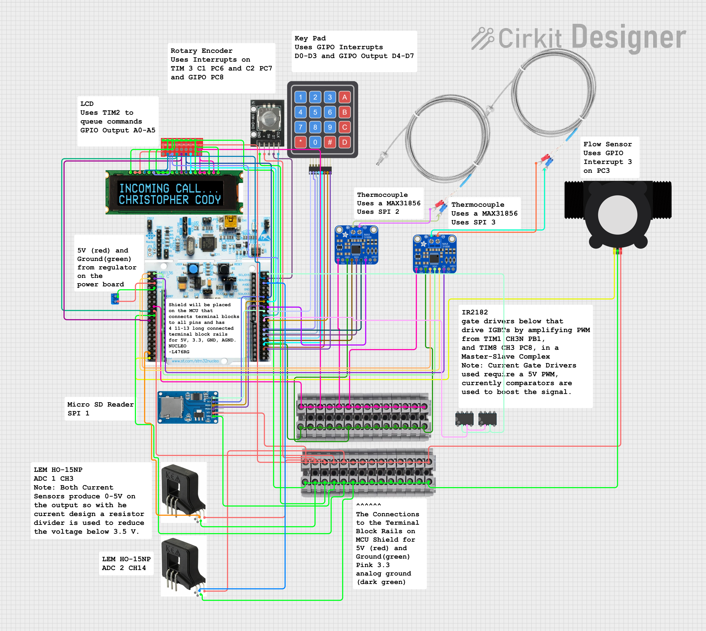
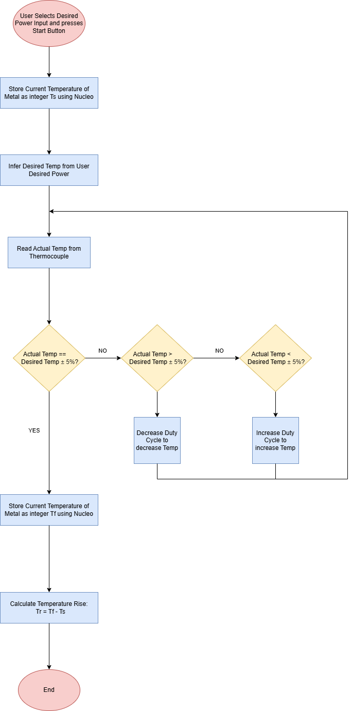

# Detailed Design

<!-- This document delineates the objectives of a comprehensive system design. Upon reviewing this design, the reader should have a clear understanding of:

- How the specific subsystem integrates within the broader solution
- The constraints and specifications relevant to the subsystem
- The rationale behind each crucial design decision
- The procedure for constructing the solution

## General Requirements for the Document

The document should include:

- Explanation of the subsystem’s integration within the overall solution
- Detailed specifications and constraints specific to the subsystem
- Synopsis of the suggested solution
- Interfaces to other subsystems
- 3D models of customized mechanical elements*
- A buildable diagram*
- A Printed Circuit Board (PCB) design layout*
- An operational flowchart*
- A comprehensive Bill of Materials (BOM)
- Analysis of crucial design decisions

*Note: These technical documentation elements are mandatory only when relevant to the particular subsystem. -->

## Function of the Subsystem

<!-- This segment should elucidate the role of the subsystem within the entire system, detailing its intended function, aligned with the conceptual design. -->

The Embedded Subsystem describes the software for the microcontroller, the connections the microcontroller, and the connections to the sensors, power PCB, etc. The software on the microcontroller will control the heating of the pipe and the water, check for faults with in the system, display to the lcd, interpret sensors and use inputs. The connections will be via terminal blocks on other peripherals and on the shield PCB for the microcontroller. 

## Specifications and Constraints

1. This Microcontroller **shall** not exceed 100°C during operation.  [1]  
2. This Microcontroller **shall** control the switching frequency of the power board. [2], [3], [4], [5]  
3. This Microcontroller **shall** output PWM and toggle its pins. [3], [4], [5]  
4. This Microcontroller **shall** interpret sensors.   [6]  
5. This Microcontroller **shall** have Analog-to-Digital converting capabilities.   [6]
6. This Microcontroller **shall** interpret user interface inputs. 
7. This Microcontroller **shall** interface with an LCD. [7]
   
## Overview of Proposed Solution

 1. The microcontroller should not exceed 100°C so that the microcontroller does not overheat requiring the MCU to be replaced.
 2. The microcontroller should control the switching frequency of the power board gate drivers. The frequency will control the power level as the frequency shifts away from the resonance frequency of the coil.
 3. The Microcontroller will use GPIO pins to interface with peripherals and use PWM signals to control the frequency sent to the gate drivers.
 4. The Microcontroller will interpret sensors using SPI, I2C commutation protocols and ADC then scale the value.
 5. The Microcontroller will need ADC to read sensors.
 6. The Microcontroller will interpret user input from a rotary encoder and keypad. The rotary encoder will be used to change constants within the system. The keypad will be used to change number values as well and change the mode of the lcd.
 7. The Microcontroller will interface with an LCD to display the current value of sensors, constants, and the current mode. 

<!-- This section should provide a list of constraints applicable to the subsystem, along with the rationale behind these limitations. For instance, constraints can stem from physics-based limitations or requirements, subsystem prerequisites, standards, ethical considerations, or socio-economic factors.

The team should set specifications for each subsystem. These specifications may require modifications, which must be authorized by the team. It could be necessary to impose additional constraints as further information becomes available.

Every subsystem must incorporate at least one constraint stemming from standards, ethics, or socio-economic factors. -->

<!-- Describe the solution and how it will fulfill the specifications and constraints of this subsystem. -->
## Interface with Other Subsystems

Provide detailed information about the inputs, outputs, and data transferred to other subsystems. Ensure specificity and thoroughness, clarifying the method of communication and the nature of the data transmitted.

### - Inputs:
#### Overview:
 1. 5V DC from the power board
 2. Reading Micro SD Interface
 3. MAX31856 ADC to SPI for a Thermocouple
 4. MAX31856 ADC to SPI for a Thermocouple
 5. MCP9600 ADC to I2C for a Thermocouple
 6. AD8495 Amplification of a Thermocouple
 7. Keypad
 8. Rotary Encoder
 9. Flow Sensor
 10. Current Sensor

#### Specifics:
 1. 5V DC from the power board. 
   The STM32l476RG needs 5V volts from the power board to run all the devices [8].  
 2. Reading Micro SD Interface
   A micro SD card interface will be read using SPI 1. SPI 1 MISO on PA7 will receive the data off the SD card. SP1 SCLK will output a clock signal to time the data being received on PA5. The CS Pin which enables data transfer is on on PB6. The Micro SD interface will be used to grab the old state of the system including the desired temperature, what mode the lcd is in, etc [8] [9].
 3. MAX31856 ADC to SPI for a Thermocouple 
   MAX31856 ADC to SPI for a Thermocouple will take the < 50 mV signal from the Thermocouple then amplify the signal. Next, it ADCs the signal and sends that information bit by bit via SPI in this case SPI 2. This Thermocouple converter will be for the Pipe temperature. Uses SPI 2 MISO on PB14 to receive the data. The SPI 2 CN pin is on PB12 which enables the data reception. The SPI 2 SCLK is on PB13 to time the data. The Over Temperature Fault signal will be on PA11 interrupt [8] [10].
 4. MAX31856 ADC to SPI for a Thermocouple
   MAX31856 ADC to SPI for a Thermocouple will measure the temperature of the IGBT Temp. Uses SPI 3 MISO on PC11. The SPI 3 SCLK pin is on PC10. The CN pin is on PD2 [8] [10].
 5. MCP9600 ADC to I2C for a Thermocouple
   MCP9600 ADC to I2C for a Thermocouple is to measure the Input water Temperature on the power board to make sure it is not exceeding 100°C. The I2C 1 SDA is on SB9 which is the data pin and I2C 1 SCL is the clock pin on PB8 [8] [11] [12].
 6. AD8495 Amplification of a Thermocouple
   AD8495 Amplification of a Thermocouple will amplify the thermocouple voltage so that the board can ADC the voltage to get a temperature. This thermocouple converter will be for the pipe that is being heated. The signal be received to ADC 1 CH14 on PC4. [8] [13].
 7. Keypad
   The Keypad will be check via on PIN D0-D3 assigned to interrupts. Then D4-D7 will be output pins and will be scanned to determine which button was pressed. The keypad will be able to set values for the system and change the mode of the LCD [8] [14].
 8. Rotary Encoder
   The Rotary Encoder will be able to change values for the system as well depending on the mode of the lcd. This uses TIM 3 in encoder mode on channels 1 and 2 on interrupts to determine if the encoder has changed position. PC6 is TIM 3 CH1 and PC7 is TIM 3 CH2. the Buttons use on PC8 is TBD [8] [15].
 9. Flow Sensor
   The flow sensor will use GPIO Interrupt 3 on PC3. The flow sensor will detect when the water is flowing then turn of the induction gate driver [8] [16].
 10. Current Sensor
   The current sensor will use ADC 2 CH 3 on PC2. The current sensor will make electrical current flowing in the system is at a safe value so that components don't explode [17] [8].

### - Outputs:
#### Overview:
 1. LCD
 2. PWM signals to Gate Drivers
 3. Writing Micro SD Interface
 4. Setting Pipe Fault Temperature For Amplifier
 5. Setting IGBT Fault Temperature For Amplifier

#### Specifics:
 1. LCD
   The LCD uses GPIO Pins A0-A5. A0 which is PA0, connects to the register Select, RS pin. The read/write pin is tied to ground since the LCD only needs to be written to. A1 which is PA1, connects to the Enable pin, EN pin. A2-A5, which is pins PA4, PB0,PC1, and PC0 respectively, is connected to data pin D4-D7 [8].
 2. PWM signals to Gate Drivers
   PWM signals to Gate Drivers are driven using TIM8 CH3 and TIM8 CH4N to get the same frequency signals but 180 degrees out of phase. TIM8 CH3n is on PB1 and TIM8 CH4 is on PC9. TIM4 Ch2 on PB8 will send a 80KHz PWM signal to the power board [8].
 3. Writing Micro SD Interface
   Writing Micro SD Interface uses SPI 1 MOSI on PA7 to write data to micro SD card. Inputs 2. explains the rest of the connection for the SD card interface [8] [9].
 4. Setting Pipe Fault Temperature For Amplifier
   Setting Pipe Fault Temperature uses SPI 2 MOSI on PB15. Inputs 4. explains the rest of the connections for the Pipe Temperature Amplifier [8] [10].
 5. Setting IGBT Fault Temperature For Amplifier
   Setting IGBT Fault Temperature uses SPI 3 MOSI on PC12. Inputs 5. explains the rest of the connections for the IGBT Temperature Amplifier [8] [10].

## Buildable Schematic 

<!-- Integrate a buildable electrical schematic directly into the document. If the diagram is unreadable or improperly scaled, the supervisor will deny approval. Divide the diagram into sections if the text and components seem too small.

The schematic should be relevant to the design and provide ample details necessary for constructing the model. It must be comprehensive so that someone, with no prior knowledge of the design, can easily understand it. Each related component's value and measurement should be clearly mentioned. -->
#### Embedded System Connection Diagram

## Printed Circuit Board Layout

<!-- Include a manufacturable printed circuit board layout. -->

The microcontroller will have a terminal shield that the PCB subsystem will design. The shield will have 2 sets of double female headers 19 long which will mate to the 2 sets of double male headers on the microcontroller. The female double headers will be soldered to the shield. The left and right side, which will be 19 pins long, of the double headers will be connected to terminal blocks through copper PCB traces. The rows terminal blocks are soldered to the opposite side of the pcb as the female headers. Each pin on the headers will have its own terminal block. Both sets of the headers will be connect to single row terminal blocks. The headers are on opposite sides to the Terminal blocks. The headers and Terminal Blocks pins are spaced 2.54 mm apart. In between the inner rows of terminal blocks, there will be 4 rows of 10 for the microcontroller 5V, 3.3V, ground, and analog ground. The output of the sensor ADCS and amimplfiers will be Terminal blocked as well.

## Flowchart

For sections including a software component, produce a chart that demonstrates the decision-making process of the microcontroller. It should provide an overview of the device's function without exhaustive detail.

### Proportional Differential Integral Controller Flow Chart

  
  

## BOM

Provide a comprehensive list of all necessary components along with their prices and the total cost of the subsystem. This information should be presented in a tabular format, complete with the manufacturer, part number, distributor, distributor part number, quantity, price, and purchasing website URL. If the component is included in your schematic diagram, ensure inclusion of the component name on the BOM (i.e R1, C45, U4).

| Component Name                                | Component Id      | Cost   | Operating Voltage (V) | Max Operating Current (mA) | Power Cost (mW)  | Amount | Total Power (mW) | Total Cost ($) |
| --------------------------------------------- | ----------------- | ------ | --------------------- | -------------------------- | ---------------- | ------ | ---------------- | -------------- |
| STM32Microcontroller [8] [19]                 | NUCLEO-L476RG     | $14.52 | 5-12                  | 500                        | 2500 (at 5 V)    | 1      | 2500.0           | $14.52         |
| Adafruit SPI Thermocouple Amplifier  [10]     | MAX31856 Breakout | $17.50 | 3.3                   | 1.5                        | 4.95             | 2      | 9.9              | $35.12         |
| Adafruit I2C Thermocouple Amplifier [12] [11] | MCP9600 Breakout  | $15.95 | 2.7-5                 | 2.5                        | 8.25 (at 3.3 V)  | 1      | 8.25             | $15.95         |
| Analog Output Thermocouple Amplifier [13]     | AD8495 Breakout   | $11.95 | 2.7-36                | 0.180                      | 0.594 (at 3.3 V) | 1      | 0.594            | $11.95         |
| Keypad [20] [14]                              | 3844              | $5.95  | 3.3                   | 33                         | 108.9            | 1      | 108.9            | $5.95          |
| Rotary Encoder [21] [15]                      | SEN0235           | $2.90  | 5V                    | 10                         | 50               | 1      | 50               | $2.90          |
| LCD [22] [18]                                 | NHD-0216CW-AB3    | $30.87 | 3.3-5                 | 135                        | 675  (at 5 V)    | 1      | 135.0            | $30.87         |
| Adafruit Micro SD Card Interface [23] [9]     | N/A               | $3.50  | 3.3                   | 150                        | 495              | 1      | 495.0            | $3.50          |
| Lem Electric Current Sensor [24] [17]         | Lem HO-10p        | $12.75 | 5                     | 25                         | 125              | 1      | 125.0            | $12.75         |
| Liquid Flow Meter 1/2" [25] [16]              | YF-S201           | $9.95  | 5-18                  | 15                         | 85               | 1      | 85               | $9.95          |
| Total (electricals not including MCU)         | N/A               | N/A    | N/A                   | 203.53 mA (at 5V) < 500 mA |                  | N/A    | 1017.64          | $143.46        |
## Analysis

<!-- Deliver a full and relevant analysis of the design demonstrating that it should meet the constraints and accomplish the intended function. This analysis should be comprehensive and well articulated for persuasiveness. -->

NUCLEO-L476RG is the microcontroller used since it what the team is most comfortable with. Also, the MCU fits the teams needs of being low power and having GPIO, ADC, TIMERS, 80MHZ max clock, I2C, SPI, and PWM capabilities. THe proportional integral deferential controller will be implemented on the microcontroller ran on an 100ms interval [8].

The purpose of the delay system is to not busy wait for a long duration. The system checks every millisecond, counting down from the delay value. This allow other processes to run between the millisecond checks/runs. The contrast is HAL_Delay() which uses a while loop checking how many ticks have past while is why the system is micro-tasked. Run interval is to repeatably run a task at a specific interval. The run timeout delays for a specific amount of time then runs the task. The run interval until will run a task specific interval until the until callback returns true. [8]

The LCD system is micro-tasked as the LCD displaying information is not as important as for example the PID controller. Writing data and commands to the lcd will queue to instructions in a circular queue so that reading the next instruction and adding the the queue is O(1) time. The queue runs on an 200 microsecond interval so it can write a char per 1 ms. The micro-tasked system allows for other tasks to run between the LCD writes so that the processor is more efficiently used. HAL_Delay() is also removed from the system to not have any busy waiting which this can happen as a uint is stored in the queue. the most significant 7 bits are the after the LCD instruction delay from 0-127 ms. The delay is so that the LCD can process the instruction until the next command. The Delay is set based on the LCD data-sheet per command execution time [18]. The 9th bit controls whether the instruction is data or a command. Then the 8 Least significant bits are the data. [8]

Interrupts will be used over polling for user inputs as actions for inputs will only need to take up the thread when the users interacts with a interface. The keypad is for buttons to control the lcd and set values. A rotary controller will also be used to set values. Then fault display signals from the sensors will be on interrupts. For less important display and setting of inputs they will be on Interrupts so CPU time is not wasted [8].

Reading the sensors temperature sensors will be polled with PID logic as the temperature sensors do not need to be as fast. The shut off temperatures for the objects the sensors are measuring can be programed on amplifier the signal directly a fault after the temperature passes a certain threshold For the MCP9600 and MAX31856 via I2C and SPI respectively [10] [11]. The direct wiring of fault signals from the amplifier would speed up a issue disabling the circuit. Due to majority of the pins on the microcontroller being used, the termocouples will need to be amplified in different ways. There is only 3 ADC, 3 SPI, and 3 I2C [8]. Since the system has 6 interfaces/sensors, they have to be spread across the ways of interfacing. The thermocouple that is reading the pipe can have the amplifier setup to fault pass a certain temperature. The direct fault signal will speed up the disabling of the system bypassing SPI interfacing speeds. To set the threshold fault temperature SPI MOSI will be used. The IGBT termocouples on the power board will have a similar capability. The IGBT will be setup similar to the pipe amplifier. The IGBT and Pipe will be amplified and ADCed via a MAX31856 via SPI 3 and SPI 2 respectively both configured to full duplex master meaning the MCU can input from and to output the device. The output water temp will be amplified via a AD8495 and ADC 1 as ADC reads a lot faster than I2C. The input water temp will be amplified via a MCP9600 via I2C as it does not not need to read as fast the output since it will change at a minimum of every hour. 

The keypad will be used to set the desired temp and interface with the system. the A-C will set 3/4 modes of the LCD. The First 3 are the display temp mode (A key), the set temp (B key), and set power level (C key). The display temp mode displays the desired temperature or power level, the pipe temperature, the output and input water temperature, and the IGBT temperature. Basically a system vitals mode. The second mode allows the user to change the desired temperature via the keypad or the rotary encoder. The temperature is entered when the user presses pound on the keypad. The same operation is down for the third mode but for the power level. The 4th mode is the fault mode it occurs when the system has a fault via over Current in the current transducer or over temp fault from any MAX31856 amplifier. Faults are only cleared via the star key. The keypad and rotary encoder will work off of interrupts. D0-D3 interrupts and TIM 3 configured to encoder mode with interrupts [8].

Adafruit Micro SD Card Interface will be used to save the state of the system and log the systems vials over time. The Micro SD Interface is used over ROM as the Interface is easier viewable on a computer for displaying data. The Interface will use SPI 1 configured to full duplex master. [9]

Liquid Flow Meter will determine if the system is sending power. Having a flow meter to control the sending of power is standard in most tankless water heaters. The system will use a GPIO Interrupts to count the pulses per second which is 7.5 times more than the flow rate in Liters per minute. [16] [8]

The Microcontroller will have to interface will the power board by sending 20-50Khz PWM signals. Two that are 180 degrees out of phase which can be done via a negated timer alternate pin. The power board also needs a 80Khz PWM signal. The MCU will also receive 5V from a regulator on the power board. [8]

## References

All sources that have contributed to the detailed design and are not considered common knowledge should be duly cited, incorporating multiple references.

## References

[1] K. Enisz, G. Kohlrusz, D. Fodor, and L. Kovacs, "Degradation Analysis of DC-Link Aluminum Electrolytic Capacitors Operating in PWM Power Converters," Power Engineering and Electrical Engineering, vol. 18, no. 2, 2020. Available: https://www.researchgate.net/publication/342538837_Degradation_Analysis_of_DC-Link_Aluminium_Electrolytic_Capacitors_Operating_in_PWM_Power_Converters (Accessed: Nov. 23, 2025).

[2] Power Electronics News, "IGBTs for Induction Heaters," 2023. Available: https://www.powerelectronicsnews.com/igbts-for-induction-heaters/ (Accessed: Nov. 23, 2025).

[3] Arrow Electronics, "What’s the Right Switch for You? When to Use Si MOSFETs, IGBTs, and SiC Devices," Whitepaper, 2023. Available: https://static4.arrow.com/-/media/Arrow/Files/Pdf/Arrow-IGBT7-Whitepaper.pdf (Accessed: Nov. 23, 2025).

[4] AllPCB, "MOSFET vs. IGBT: Key Differences," 2022. Available: https://www.allpcb.com/allelectrohub/mosfet-vs-igbt-key-differences (Accessed: Nov. 23, 2025).

[5] JSW XDH, "IGBT vs. MOSFET: Choosing the Right Semiconductor for High-Power Applications," 2021. Available: https://www.jswxdh.com/IGBT-Vs-MOSFET-Choosing-The-Right-Semiconductor-for-High-Power-Applications-id40319716.html (Accessed: Nov. 23, 2025).

[6] IPC, "IPC-2222: Sectional Design Standard for Rigid Organic Printed Boards," 2013.

[7] IPC, "IPC-7351B: Generic Requirements for Surface Mount Design and Land Pattern Standard," 2010.

[8] STMicroelectronics, "STM32 Nucleo-64 boards (MB1136) user manual (UM1724)," PDF, Available: https://www.st.com/resource/en/user_manual/um1724-stm32-nucleo64-boards-mb1136-stmicroelectronics.pdf (Accessed: Nov. 23, 2025).

[9] Adafruit, "MicroSD SPI/SDIO Library Guide," PDF, Available: https://cdn-learn.adafruit.com/downloads/pdf/adafruit-microsd-spi-sdio.pdf (Accessed: Nov. 23, 2025).

[10] Analog Devices, "MAX31856 Cold-Junction Compensated Thermocouple-to-Digital Converter," Datasheet, Available: https://www.analog.com/media/en/technical-documentation/data-sheets/MAX31856.pdf (Accessed: Nov. 23, 2025).

[11] Microchip, "MCP9600 Thermocouple EMF Converter with Cold-Junction Compensation," Datasheet, Available: https://cdn.sparkfun.com/assets/a/b/e/5/5/MCP9600-Data-Sheet-DS20005426D.pdf (Accessed: Nov. 23, 2025).

[12] Adafruit, "MCP9600 I2C Thermocouple Amplifier," Guide, Available: https://cdn-learn.adafruit.com/downloads/pdf/adafruit-mcp9600-i2c-thermocouple-amplifier.pdf (Accessed: Nov. 23, 2025).

[13] Analog Devices, "AD8494/AD8495/AD8496/AD8497 Thermocouple Amplifiers," Datasheet, Available: https://cdn-shop.adafruit.com/datasheets/AD8494_8495_8496_8497.pdf (Accessed: Nov. 23, 2025).

[14] Adafruit, "3844 Membrane Keypad Technical Docs," PDF, Available: https://mm.digikey.com/Volume0/opasdata/d220001/medias/docus/761/3844_Web.pdf (Accessed: Nov. 23, 2025).

[15] DFRobot, "EC11 Rotary Encoder Module Datasheet," PDF, Available: https://raw.githubusercontent.com/Arduinolibrary/DFRobot_SEN0235_EC11_Rotary_Encoder_Module/master/EC11I-152%20Datasheet.pdf (Accessed: Nov. 23, 2025).

[16] Adafruit, "YF-S201 Flow Meter Datasheet," PDF, Available: https://cdn-shop.adafruit.com/product-files/828/C898+datasheet.pdf (Accessed: Nov. 23, 2025).

[17] LEM, "HO 6/10/25-P Series Datasheet," PDF, Available: https://www.lem.com/sites/default/files/products_datasheets/ho_6_10_25-p_series.pdf (Accessed: Nov. 23, 2025).

[18] Newhaven Display, "NHD-0216CW-AB3 Specification," PDF, Available: https://newhavendisplay.com/content/specs/NHD-0216CW-AB3.pdf (Accessed: Nov. 23, 2025).

[19] STMicroelectronics, "NUCLEO-L476RG Product Page," Available: https://www.digikey.com/en/products/detail/stmicroelectronics/NUCLEO-L476RG/5347711 (Accessed: Nov. 23, 2025).
[20] Adafruit, "Membrane Keypad - 3x4," Product Page, Available: https://www.digikey.com/en/products/detail/adafruit-industries-llc/3844/9561536 (Accessed: Nov. 23, 2025).

[21] DFRobot, "SEN0235 EC11 Rotary Encoder Module," Product Page, Available: https://www.digikey.com/en/products/detail/dfrobot/SEN0235/7597223 (Accessed: Nov. 23, 2025).

[22] Newhaven Display, "NHD-0216CW-AB3 16x2 OLED Module," Product Page, Available: https://www.digikey.com/en/products/detail/newhaven-display-intl/NHD-0216CW-AB3/5022941 (Accessed: Nov. 23, 2025).

[23] Adafruit, "MicroSD Card Breakout Board+," Product Page, Available: https://www.adafruit.com/product/4682 (Accessed: Nov. 23, 2025).

[24] LEM, "HO 10-P Current Transducer," Product Page, Available: https://www.digikey.com/en/products/detail/lem-usa-inc/HO-10-P/4990653 (Accessed: Nov. 23, 2025).

[25] Adafruit, "Liquid Flow Meter - 1/2\"," Product Page, Available: https://www.adafruit.com/product/828 (Accessed: Nov. 23, 2025).

[26] GIFAR, "GFC1602AK-BNFA-JP Character LCD Module Specifications," PDF, Available: http://file.gifar.com.tw/gifar/character/spec/GFC1602AK-BNFA-JP_Ver.C.pdf (Accessed: Nov. 23, 2025).