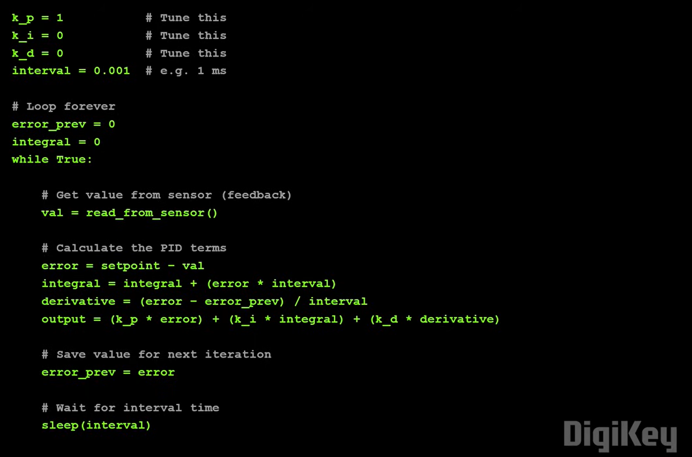
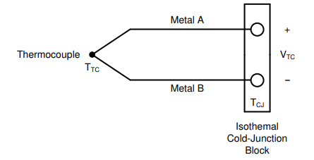
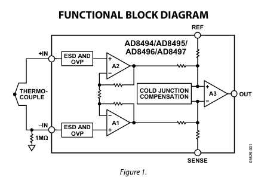
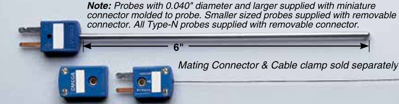
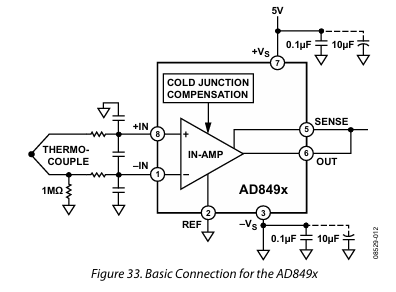
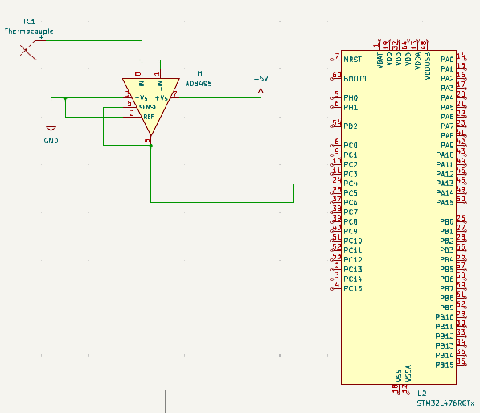
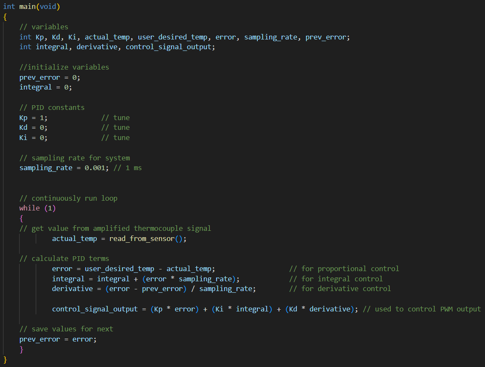
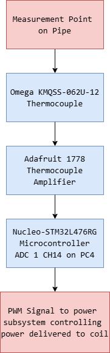
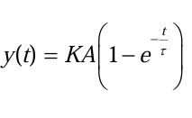
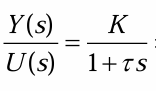

# Detailed Design

## Function of the Subsystem 

The Heat Generation Subsystem is the part of the project that contols the induction heating. This subsystem ensures that customer specifications are met accurately and reliably by utilizing closed loop feedback to compare the actual temperature of the pipe to the reference temperature inferred from user-specified power inputs. This subsystem provides information critical to meeting customer specifcations such as the total temperature rise of the metal. The Heat Generation Subsystem primarily consists of the thermocouples used to measure the temperature of the pipe and the PID control logic implemented using software to reduce error and ensure consistent results. 

## Specifications and Constraints

### Specifications
The deliverables given to us by Lochinvar:
1. This controller shall have multiple power settings similar to current induction cook tops.
2. This controller shall be capable of inducing surface eddy currents and internal heating.
3. This controller shall test circular bar stock and standard black pipe thermocouple in such a manner to validate the success of the heating.
4. This controller shall measure total electrical power consumed.  
5. This controller shall measure the total temperature rise of the metal.

This subsystem is primarily concerned with meeting the customer Specifications 3 and 5, and interfacing with the other subsystems to meet Specifications 1, 2, and 4. 

1. The heat generation subsystem shall measure the initial temperature of the bar stock using a thermocouple and store this temperature using a microcontroller.
2. The heat generation subsystem shall check for over- and under- heating of the bar stock using a thermocouple.
3. The heat generation subsystem shall increase the power delivered to the induction coil if the thermocouple senses temperatures below the desired temperature output based on user specified power input.
4. The heat generation subsystem shall reduce the power delivered to the induction coil if the thermocouple senses temperatures exceeding the desired temperature output based on user specified power input.
5. The heat generation subsystem shall accurately measure the final temperature of the bar stock using thermocouple and store this temperature using a microcontroller.

### Contraints

ANSI/IEEE 844-200 [1] applies directly to induction heating for pipelines and vessels. This standard states that the electric shock hazard for induction heating is minimal, but the high temperatures and induced current flow are design considerations, maximum maintainance temperature is anything exceeding 1200°F (649°C), and magnetic isolation is required. For the heat generation subsystem, the high temperatures are the main consideration. 

1. The subsystem shall limit the temperature rise of the metal to meet customer specs. The application is primarily a water heater rather than a water boiler, so the temperature of the metal does not need to greatly exceed 212°F (100°C). Many sensor bodies are rated for temps up to 425°F (220°C), so this subsystem will set the max temp induced to be 350°F (177°C) to ensure specs are met without damaging equipment. 
2. The Embedded Subsytem utilizes a Nucleo-STM32L476RG microcontroller, so any control implemented must be compatible with that microcontroller. 
3. The Power Subsystem will be responsible for generating heat on the pipe by inducing current on the coil, and the 240 V voltage source should remain constant. So, the primary method of control will operate by changing the duty cycle of the current delivered to the coil.  

## Overview of Proposed Solution

The subsystem can be best understood using a control block diagram: 

For our system: 
 - R(s) = user desired temperature (based on user power input)
 - Y(s) = temperature of the pipe
 - G(s) = dynamics of the induction heating 
 - H(s) = dynamics of the thermocouple sensor
 - Gc(s) = PID compensation to implemented using microcontroller 
 - summing junction = signals to and from microcontroller

PID control [2] is compensation solution that is the most comprehensive of compensators available. PID by definition is a Proportional, Integral, and Derivative control that allows for the reduction of error, noise, and chattering of signals respectively. This is achieved primarily by adjusting the values of and ratios of constants Kp, Ki, and Kd associated with each PID parameter. 

These constants can be calculated using control theory if the system specifications are known and the transfer functions of the plant and sensor are known. For most applications, including this one, the dynamics of the system and the dynamics of the sensor are not easily determined. However, these dynamics can be approximated using experimental data and knowledge of the behavior of the systems [3]. It is not always necessary to know the exact physics of these systems since the controller / compensator can be tuned as needed to ensure the best response is attained. This can be attained using Zigler-Nichols Tuning Rules, trial and error, or similar ad hoc approaches [4].  

PID can be implemented using software or hardware, but it is typically done using software for modern applications [3]. The chosen microcontroller of the Software Subsystem is a Nucleo-STM32L476RG, so this subsystem will implement the PID control using C code to ensure compatibility. 

Typical PID control implemented using C code is of the following form according to Digikey [5]: 

Where the constants are adjusted using control theory or ad hoc methods, the interval is the sampling rate of the microcontroller, and the output for this system is the PWM signal controlling the duty cycle controlling the amount of amps delivered to the coil which controls the temperature of the pipe. The PID controller recieves an error signal based on the difference between the actual temperature of the pipe and the user desired temperature of the pipe, and the controller outputs a controller signal that determines the PWM signal delivered to the power subsystem. 

An additional part of this subsystem is the implementation of thermocouple sensors. A PID controller operates by trying to reduce the error of output by as much as possible, and thus requires feedback sensors to be able to read error values. Thermocouples are used as these sensors to meet customer specs. Thermocouples operate by producing a Seebeck voltage in reponse to metals being heated, and this voltage can be measured by an ADC (analog to digital converter) to tell the controller the measured temperature of the part [6].

Thermocouple Voltage [6]: 

When an ADC is used the Nucleo operates on an analog supply voltage between 1.62 and 3.6 V [7]. This is much higher than the typical millivolt output of a thermocouple [6]. Therefore, amplification will be required for this system's thermocouples. This can be accomplished a number of ways using standard circuit components, but can be more easily done using dedicated thermocouple amplifiers. 

Adafruit produces an AD8495 K-Type Thermocouple Amplifier [8] that solves both the issue of amplification and cold junction amplification: 

There are many different K-type thermocouples available with price mostly depending on how the thermocouple connects to the workpiece. The critical requirement for the thermocouple chosen for this application is electromagnetic interference (EMI) shielding. This is because of the chosen coil geometry. 

Recall, the induction coil will be wrapped around the pipe: 

The thermocouple must be placed near or around such coil geometry in order to best measure the temperature rise of the pipe due to induction. Thus, to reduce the noise from EMI, the thermocouple used requires EMI shielding. The Omega KMQSS-062U-12 thermocouple has a 0.062" diameter 304 Stainless Steel (SS) sheath [9] that provides decent EMI shielding, mechanical strength, and corrosion resistance [10] that will be useful for an application involving noise from the induction coil and ensure durability from potential hazards such as heat or water: 

The implementation of the Omega KMQSS-062U-12 thermocouple and AD8495 thermocouple amplifier will allow for accurate temperature measurements of the pipe being heated. The Nucleo will need to be able to store these temperature measurements in order to measure the total temperature rise of the metal. This can be accomplished fairly simply by writing a program to store the measured temperature of the pipe when the user selects to start the operation and to store the measured temperature of the pipe when the measured temperature is within ± 5% of the user desired temperature. 

The user desired temperature shall be determined from the user desired power input setting and common practices. Typical hot water temperatures for residential use vary between 120 °F and 160 °F [11], so the pipe should be heated to around those temperatures. However, the heating of the water would be slower than the heating of the pipe, so the pipe temperature may be increased if faster water heating is desired. For this application, temperature values between 120 °F and 160 °F provide a good baseline for desired temps. 

## Interface with Other Subsystems

This subsystem primarily consists of the thermocouple sensors, any necessary components to make the thermocouples work, and the PID controller code to control the system. 

#### 1. Power Subsystem 
- **Inputs:**
The AD8495 thermocouple amplifier is the primary component of this subsystem requiring power. According to the datasheet the AD8495 works best when supplied with 5 V [8] with a power consumption of less than 1 mW. It should be noted that the KMQSS-062U-12 thermocouple does not require any power input, only the amplifier. 
- **Outputs:**
The Nucleo shall send a PWM signal controlling the duty cycle controlling the amount of amps delivered to the coil which controls the temperature of the pipe. 

#### 2. Embedded Subsystem 
- **Outputs:**
The AD8495 thermocouple amplifier shall connect to the Nucleo-STM32L476RG ADC 1 CH14 on PC4 providing an analog voltage signal.The Nucleo provides the brain act as a controller to enable the sending of a PWM signal to the power subsystem.

## Buildable Schematic 

Recommended Schematic from Adafruit [8]: 

Simplified KiCAD Schematic with Nucleo Connection: 

Pseudo Code for system implemented in the Nucleo: 

## Flowchart

Shown below is a detailed flow chart of the Heat Generation Subsystem's Hardware Components: 

Shown below is a detailed flow chart of the Heat Generation Subsystem's Software Components: 

where: 
- red ellipses are start and end points
- blue rectangles and squares are actions
- yellow diamonds are questions

## BOM

| Component | Manufactuer | Part Number | Distrubutor | Distributor Part Number | Quantity | Price | Purchasing Website URL |
| --------- | ----------- | ----------- | ----------- | ----------------------- | -------- | ----- | ---------------------- |
| Surface Temp Thermocouple | Omega | KMQSS-062U-12 | Digikey | 5880-KMQSS-062U-12-ND | 1 | $70.82 | [Link](https://www.digikey.com/en/products/detail/omega/KMQSS-062U-12/25632840) |
| Thermocouple Amplifier | Adafruit | 1778  | Digikey | 1528-1778-ND | 2 | $11.95 | [Link](https://www.digikey.com/en/products/detail/adafruit-industries-llc/1778/5638304) |
| Total Cost | N/A | N/A | N/A | N/A | N/A | $82.77 | N/A |

## Analysis

Temperature systems have plant dynamics that can be approximated as a first order order system due to the dynamics of their operation. 

Typical response of a temperature system [12]: 

First order approximation [13]: 

where: 

  yss = steady state output 
  A = analog input 

This model should give an approximation of the the system dynamics, but it would be necessary to experimentally collect data in order to find values of K and tau which cannot be accomplished until the coil and pipe hardware are implemented. Thus this model will serve primarily as an approximation of the expected dynamics to make the PID constants a bit easier to predict.  

It is difficult to accurately predict the exact response of the system without having an physical model of the pipe and coil. Typical system identification using the black box method requires the ability to get experimental data from the system given a known input and output [3]. An alternative method is to analytically derive the transfer function of the system using the laws of physics. This would require knowledge about the material, the resistance, the length, and the diameter of the section of the pipe heated; the number of turns of and the material of the coil; and knowledge about thermodynamics. It is difficult to determine analytically the exact temperature output in response to a certain current input. 

It is more practical and efficient to experimentally derive the plant dynamics when able, but this will not be practical for this application until Capstone 2 Spring 2026 (currently Capstone 1 Fall 2025) when the team is able to start constructing the physical system and able to obtain experimental data. When the team is experimenting with the system in Spring 2026 the current delivered to the coil will be kept low with the ability to stop the system using an emergency stop if the temperature output is suspected of being unstable. Once this data is obtained it will be possible to analytically and experimentally determine the values for the PID constants. 

This systems PID control is implemented using C code to ensure compatibility with the Nucleo-STM32L476RG. It is possible to implement PID control using dedicated PID blocks using PLC or LabVIEW software, but these items would add unneccessary cost and compatibility issues to the system. Implementing PID control using C code is best to keep costs low and maximize compatibility with the Nucleo. 

Thermocouples are used as the sensors to meet customer specs. Thermocouples operate by producing a Seebeck voltage in reponse to metals being heated, and this voltage can be measured by an ADC (analog to digital converter) to tell the controller the measured temperature of the part [6]. Thermocouple sensors themselves do not require any power to operate, but thermocouples do require power for their peripherals interpreting the data being sent. For this subsystem, the only peripheral is the thermocouple amplifier, which only consumes approximately 1 milliWatt [8]. 

The Nucleo-STM32L476RG has three 12 bit ADCs with 16 channels each and three SPIs. When an ADC is used the Nucleo operates on an analog supply voltage between 1.62 and 3.6 V [7]. This is much higher than the typical millivolt output of a thermocouple [6]. Therefore, amplification will be required for this system's thermocouples. This can be accomplished a number of ways using standard circuit components, but can be more easily done using dedicated thermocouple amplifiers. Dedicated thermocouple amplifiers interface easily with microcontrollers and thermocouples which would lead to faster and more efficient build times [12]. Thermocouples typically require cold junction compensation because the standard reference tables in use are designed for a reference temperature of 0˚C [14]. Cold junction compensation is often included with dedicated thermocouple amplifiers [8]. 

Adafruit produces an AD8495 K-Type Thermocouple Amplifier [8] that solves both issues of amplification and cold junction amplification: 

The Adafruit AD8495 K-Type Thermocouple Amplifier is a cheaper option available since it can only read K-type thermocouples. K-type thermocouples are general purpose thermocouples and have a temperature range [6] suitable for this system's applications. Thus, this amplifier will be a good low cost solution to quickly and efficiently measure the temperature of the workpiece using a K-type thermocouple.

The critical requirement for the thermocouple chosen for this application is the reduction of noise in the sensor in order to maintaining accurate readings. Thus determining the proper thermocouple focused on noise reduction as the critical factor and focusing on other features later to isolate the exact model to implement. 

The thermocouple must be placed near or around such coil geometry in order to best measure the temperature rise of the pipe due to induction. Thus, to reduce the noise from EMI, the thermocouple used requires EMI shielding. This can be accomplished on the wire by buying mineral insulated thermocouples, or by buying shielded thermocouple extension wire. Mineral insulated thermocouples have EMI shielding by nature. The Omega KMQSS-062U-12 has a 304 Stainless Steel (SS) sheath [9] that provides decent EMI shielding and physical protections [10] that will be useful for an application involving noise from the induction coil and ensure durability from potential hazards such as heat or water. 

Thermocouples are available in grounded, ungrounded, and exposed junctions configurations. Grounded and exposed junctions have typically have faster temperature resonses, but they are more susceptible to noise due to the electrical contact [4]. Ungrounded junctions have slower temperature responses, but ungrounded junctions isolate the sensor from noise [12]. Isolation from noise is desirable due to the EMI of the coil; therefore, the thermocouple shall be ungrounded. The Omega KMQSS-062U-12 is ungrounded [9]. 

The sheath diameter can be decreased to increase response time [12], but it also reduces durability so the KMQSS-062U-12's 0.062" diameter sheath should be a good compromise as it is half the size of Omega's next largest diameter 0.125" diameter sheaths but within a few thousandths of the other sizes offered [9]. The KMQSS-062U-12's standard 12" is preferred to ensure the thermcouple can measure the length of the pipe as needed without picking up too much noise from the coil since the pipe measured is expected to be at least 1-2 feet or greater. The standard 6" provides less reach capabilities for only a couple US Dollars less. 

The Omega KMQSS-062U-12 Thermocouple will need to be mechanically attached to the pipe's surface. This can be accomplished a few different ways, but welding the thermocouple to the pipe is gold standard [15]. Welding eliminates any air gaps that would create insulation between the thermocouple and pipe that would interfere with the readings. Capacitive discharge (CD) welding is recommended for welding thermocouples to pipe [15]. CD welding minimizes thermal distortion [16] which helps prevents damage to the thermocouple or changing of the pipe's material properties [15]. One downside of welding the thermocouple would be that thermocouple could not be moved to measure other locations on the pipe. An alternative solution would be to utilize pipe clamps to connect the thermocouple to the pipe, but these can add additional parts costs to the BOM. A pipe clamp would be more convenient to move the thermocouple compared to welding, but ideally the KMQSS-062U-12 thermocouple should not have to be moved.

The Omega KMQSS-062U-12 thermocouple should be placed along the pipe a short distance away from the coil but not inside the coil. The electromagnetic field within the coil could induce voltage and / or heating in the thermocouple [17]. This would create unstable reading and potentially damage the thermocouple. The pipe should be heated outside the coil by conduction and allow for accurate readings. This provides about two potential locations for the thermocouple to measure, to the left or to the right of the coil. Thus, welding's permanence should not be an issue for control as the temperature of the pipe should not drastically change from one side to another. 

The Nucleo will need to be able to store the temperature measurements from the Omega KMQSS-062U-12 thermocouple as amplified by the AD8495 thermocouple amplifier in order to measure the total temperature rise of the metal. This will be accomplished by writing a program to store the measured temperature of the pipe when the user selects to start the operation and to store the measured temperature of the pipe when the measured temperature is within ± 5% of the user desired temperature, which will be around 120 °F and 160 °F [11]. The Embedded Subsystem will also include a SD card act as memory to store these values, with more details on that implementation in that Subsystem's document. 

## References
[1] N. R. Rafferty and G. Tarbutton, “IEEE 844-2000: Recommended Practice for Electrical Impedance, Induction, and Skin Effect Heating of Pipelines and Vessels,” IEEE Transactions on Industry Applications, vol. 38, no. 4, pp. 921–926, Jul. 2002, doi: https://doi.org/10.1109/tia.2002.800586.  

[2] E. Chen, “Controls and Signals Maslab IAP 2011.” Accessed: Oct. 27, 2025. [Online]. Available: https://web.mit.edu/6.186/2011/Lectures/controls/ControlsandSignals.pdf

[3] MATLAB, "What Is System Identification?," https://youtu.be/Z1QS6FsxrJI?si=gIbGyuVUAKYjSpp5 (accessed Nov. 04, 2025).

[4] J. Bennett, “9.3: PID Tuning via Classical Methods,” Engineering LibreTexts, May 19, 2020. https://eng.libretexts.org/Bookshelves/Industrial_and_Systems_Engineering/Chemical_Process_Dynamics_and_Controls_(Woolf)/09%3A_Proportional-Integral-Derivative_(PID)_Control/9.03%3A_PID_Tuning_via_Classical_Methods

[5] “What is a PID Controller? | DigiKey,” www.youtube.com. https://www.youtube.com/watch?v=tFVAaUcOm4I (accessed Nov. 02, 2023).

[6] J. Wu, “A Basic Guide to Thermocouple Measurements.” Accessed: Nov. 06, 2025. [Online]. Available: https://www.ti.com/lit/an/sbaa274a/sbaa274a.pdf?ts=1762432799418&ref_url=https%253A%252F%252Fwww.google.com%252F

[7] “STM32L476RG Datasheet,” ST, 2019. Available: https://www.st.com/resource/en/datasheet/stm32l476rg.pdf

[8] “AD8495 Datasheet,” Adafruit Industries, 2011. Available: https://cdn-shop.adafruit.com/datasheets/AD8494_8495_8496_8497.pdf
‌
[9] “Omega KMQSS-062U-12 Datasheet,” Omega, Accessed: Nov. 17, 2025. [Online]. Available: https://assets.omega.com/pdf/test-and-measurement-equipment/temperature/sensors/thermocouple-probes/JMQSS.pdf

[10] “What is the Best Material for EMI Shielding? 10 Top Recommendations for 2025,” www.emcnoordin.com, May 20, 2025. https://www.emcnoordin.com/what-is-the-best-material-for-emi-shielding10-top-recommendations-for-2025/ (accessed Nov. 17, 2025).

[11] State Water Heaters, "A Technical Guide to Designing Energy-Efficient Commercial Water Heater Systems," Available: https://assets.statewaterheaters.com/damroot/Original/10008/317913-000.pdf (accessed 18 Nov. 2025).

[12] D. Dlugos, “Grounded vs. Ungrounded Thermocouple Junctions: Why Select One over the Other?,” Ashcroft.com, Sep. 26, 2024. https://blog.ashcroft.com/grounded-vs-ungrounded-thermocouple-junctions (accessed Nov. 17, 2025).

[13] Alouani, Ali. ECE 3260_DAQ_Notes P.12.

[14] D. Szmulewicz, “Implementing a Thermocouple Interface With ADC12_A Application Report Implementing a Thermocouple Interface With ADC12_A,” 2011. Accessed: Nov. 12, 2025. [Online]. Available: https://www.ti.com/lit/an/slaa501/slaa501.pdf?ts=1762893695464

[15] “Correct Mounting Techniques for Surface and Immersion Thermocouples,” Instrunexus.com, 2025. https://instrunexus.com/correct-mounting-techniques-for-surface-and-immersion-thermocouples/ (accessed Nov. 24, 2025).
‌
[16] “Understanding Capacitor Discharge Welding: An In-Depth Technical Overview | Process Equipment Company Welding Services,” Peco-us.com, 2025. https://peco-us.com/understanding-capacitor-discharge-welding-an-in-depth-technical-overview/ (accessed Nov. 24, 2025).
‌
[17] “Temperature Measurement in Electromagnetic Environments,” https://www.dwyeromega.com/en-us/, 2023. https://www.dwyeromega.com/en-us/resources/temperature-measurement-in-electromagnetic-environments
‌