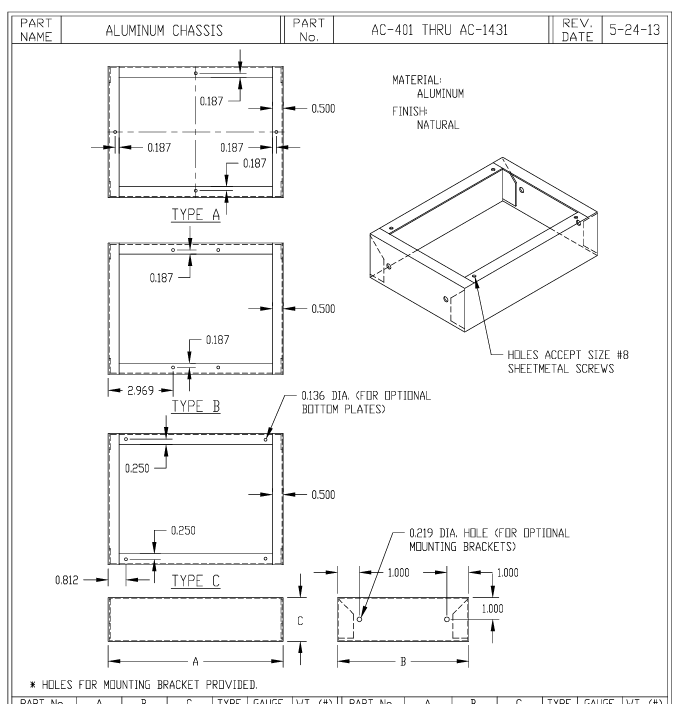
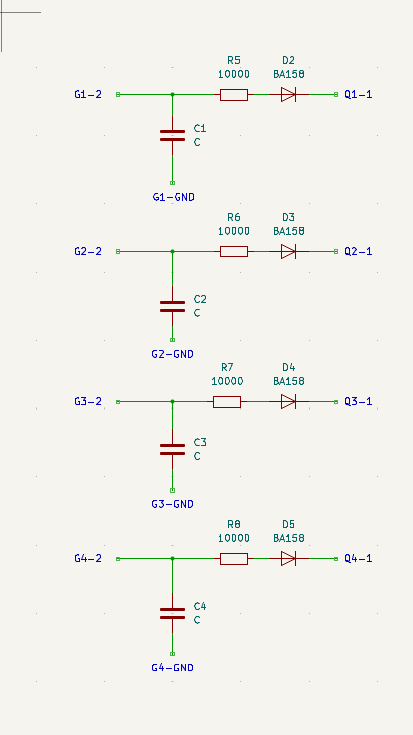
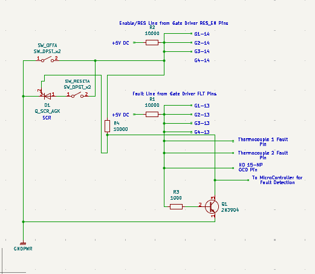
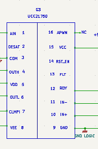
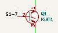
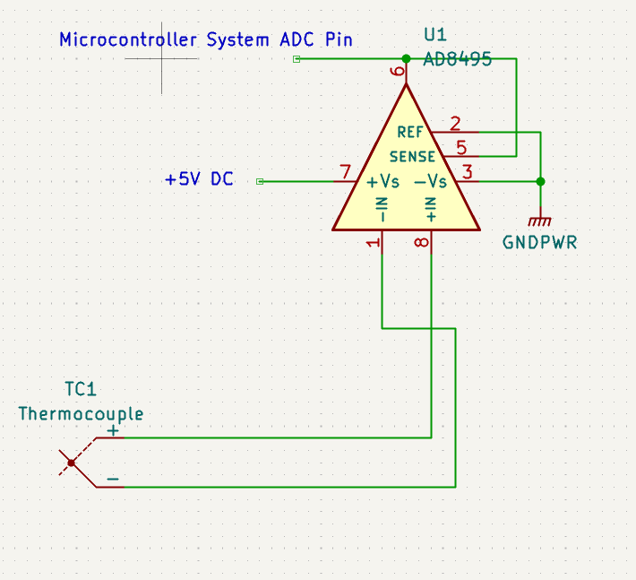

# Detailed Design

## Function of the Subsystem

The Safety and Protection Controls subsystem is responsible for ensuring the induction heater operates within safe limits, protecting both the user from harm and the device from hardware damage. This system functions continuously in the background, monitoring critical signals such as temperature and current.

If any signal exceeds a predefined safe limit, this subsystem will trigger a fault state, shut down heating operations, and provide a specific error code to the user via the embedded system's LCD screen. It is the primary subsystem responsible for enforcing the constraints set by ethical, professional, and industry standards like the NEC. This subsystem's scope is expanded to include the design of the physical electronics housing to ensure electrical safety and leak prevention.

## Specifications and Constraints

The subsystem's design is governed by the following specifications, which are derived from customer requirements, standards compliance, and analysis of existing hardware:
1. **IGBT Monitoring**: The subsystem shall continuously monitor the temperature of the power switching transistors' (IGBT) heatsink using a dedicated thermocouple.
2. **IGBT Thermal Shutdown**: The subsystem shall shut down induction heating if the IGBT heatsink temperature exceeds $105^\circ\text{C}$ ($\text{221}^\circ\text{F}$).
3. **Current Monitoring**: The subsystem shall Continuously monitor total AC current draw (LEM HO 10-P) from the device [1].
4. **Overcurrent Shutdown**: The subsystem shall trigger a system shutdown if the current draw exceeds the rated amperage of a standard 30A circuit.
5. **IGBT Desaturation Protection**: The subsystem shall include hardware-based Insulated Gate Bipolar Transistor (IGBT) desaturation detection that trips a shutdown latch within 5-20 microseconds of a fault.
6. **Ground Fault Protection**: The subsystem shall limit ground fault current such that no more than 50 volts appears on any accessible metal part, per NEC Article 665.
7. **Disconnect Switch**: The "Off" switch shall physically open all ungrounded conductors, ensuring no power can be supplied to the heating coil, per NEC Article 427.
8. **Workpiece Detection**: The subsystem shall prevent the induction coil from energizing if a compatible workpiece, like the steel pipe, is not detected.
9.   **User Notification**: Upon detecting any fault condition, the subsystem shall provide a specific error code to the user display.
10.  **Fault State Latching**: Once a fault state is triggered (either by software or hardware), the subsystem shall remain in a safe, non-operational mode until the user performs a manual power cycle.

## Overview of Proposed Solution

The proposed solution is a hybrid software and hardware design to ensure continuous protection.

 - **Software Controls**: 
The microcontroller will be the primary brain for monitoring slow-moving fault conditions. It will continuously read and condition signals from sensors for total current draw, IGBT heatsink temperature, and water flow. 
    - **IGBT Temperature:** The temperature of the IGBT heatsink is provided by a K-Type Thermocouple connected through the AD8495 Thermocouple Amplifier via a dedicated Analog-to-Digital Converter (ADC) channel. This thermocouple will be threaded and screwed on to the heatsink to ensure a proper connection to the heatsink. The software will process this linear voltage output to determine the absolute temperature. 
    - **Water Flow:** A Hall-Effect-based flow sensor outputs a digital pulse train. The microcontroller will use an external interrupt pin to count these pulses over a time interval and calculate the flow rate in Liters Per Minute (LPM).

    - **Current Monitoring:** The total AC current draw is monitored by the LEM HO 10-P Hall-Effect Current Sensor. This sensor outputs a linear analog voltage signal, already centered around 2.5V (for 0A AC), which is directly compatible with the microcontroller's Analog-to-Digital Converter (ADC) input. A potentiometer will be used to adjust this 2.5V offset voltage. This manual calibration step, performed during initial system setup, ensures the highest possible accuracy by removing any DC bias error, allowing the software to precisely determine the peak current and calculate the RMS value. If the calculated current exceeds the limit for more than 500ms, the software will initiate a shutdown.
  
    - **A Shutdown Event:** If any fault condition is met (thermal, flow, or prolonged over-current), the software will:

       - Immediately send a digital interrupt to the Heat Generation Control subsystem to stop PWM signal generation.

       - Send a specific error code to the Embedded System (PCB) to be displayed on the LCD screen.

       - Enter a latched fault state that requires a manual reset.

 - **Hardware Controls**: For fast-moving catastrophic events, such as an IGBT desaturation or a severe over-current event, a dedicated hardware latch will be implemented. This circuit will operate in parallel with the microcontroller.

     - The DESAT (desaturation) pin on each of the four UCC21750 gate drivers will monitor its respective IGBT's collector voltage [2]. If the collector voltage rises excessively while the gate is high (a desaturation event), the driver will immediately pull its FLT (Fault) pin low. This signal will trip an SCR (Silicon Controlled Rectifier) [4], which will immediately pull the RST_EN (Reset/Enable) pin of all gate drivers low, disabling them and placing them in a safe, non-operational state. A physical "OFF" switch will be wired in parallel with this SCR to provide a manual hardware override. This hardware latch will also be tied to the microcontroller's fault state, ensuring the system software is aware of the shutdown.

This combined approach provides the flexibility of software for general monitoring and the microsecond-level detection of a hardware latch to prevent catastrophic IGBT failure.

### *Enclosure - Proposed Solution*
The proposed enclosure utilizes a robust aluminum chassis to meet the functional requirements of housing sensitive electronics while rigorously adhering to safety standards, specifically NEC mandates.

- **Primary Enclosure Material:** While the original plan referenced a non-conductive polycarbonate housing for electrical safety, we propose using an aluminum enclosure for its superior performance characteristics, which significantly enhance system reliability:
  - **EMI/RFI Shielding:** Aluminum provides excellent containment of the high-frequency electrical noise generated by the induction heating process, ensuring the sensitive control electronics are protected from interference [9].
  - **Thermal and Mechanical Strength:** The material offers high mechanical durability and acts as a beneficial element in the system's thermal management plan.
  
  **Mitigation of Conductivity:** To safely utilize the conductive aluminum, the chassis will be bonded to earth ground to comply with NEC Article 665 [9], eliminating shock hazards. Furthermore, all power electronics (IGBTs, heatsink, DC bus capacitors) will be mounted either on a separate, non-conductive substrate (thick fiberglass) or isolated from the chassis using electrically insulating thermal pads and bushings.

#### Safety Aspects
The design incorporates redundant safety features focused on compliance and water resistance:

**Electrical Disconnect and Latching:** The mandatory manual "OFF" switch (which performs a hard shutdown by pulling the RST_EN line low) will be externally mounted and clearly marked. Additionally, a main circuit breaker/disconnect switch will be installed at the power entry point, physically opening all ungrounded conductors as required by NEC Article 427.
**Grounding Integrity:** A heavy-gauge copper wire will be used to create a reliable bond between the aluminum enclosure chassis and the incoming AC power cord's earth ground pin [9], ensuring immediate fault current interruption.  

**Wet/Dry Compartmentalization:** The enclosure will be seperated by a solid internal barrier to create two electrically isolated zones:
  - **Power Zone:** This area houses all of the power electronics as well as the induction coil connections. 
  - **Control Zone:** This area houses the low-voltage control PCB and sensing electronics. The water flow sensor cable will pass between zones only through a sealed connection[10].
  - 
All connectors entering the enclosure will be watertight (IP-rated glands or compression fittings) to prevent fluid migration [10].

#### Thermal Management
Using the following methods, the enclosure is designed to efficiently remove the heat from the IGBT heatsink.
- **Heatsink Integration:** The IGBT heatsink will be mounted to the enclosure wall to use the entire aluminum chassis as a secondary heat sink [11]. This mounting requires two specific steps:
  1. **Preparation:** The heatsink base must be drilled and tapped to secure the four IGBT modules.
   2. **Joining the Wall and Heatsink**: A custom aluminum bracket will be used, along with thermal paste, to thermally and mechanically couple the heatsink base (from the bottom of the enclosure) to the adjacent vertical chassis wall, ensuring efficient heat transfer to the larger cooling surface.
- **Active Cooling and Venting:** Two well placed vents will ensure effective cooling: one vent will be positioned near the bottom of the enclosure to draw in cooler ambient air, and a second vent, assisted by a fan, will be located near the top to efficiently exhaust warmer air and maintain optimal internal operating temperatures.

## Interface with Other Subsystems

This subsystem acts as a central monitor and interfaces with nearly all other subsystems.

- **Power System**

  - **Input:**  Receives a 2.5V-biased AC voltage signal from the Current Transformer (CT) circuit (LEM HO 10-P) [1]. This signal's DC bias voltage is precisely set using the added $10\text{k}\Omega$ trim potentiometer before being fed into the microcontroller's ADC pin.

  - **Input:** Receives an analog voltage from an AD8495 thermocouple amplifier, which corresponds to the IGBT heatsink temperature [3].

  - **Input:** Receives direct voltage feedback from the IGBT collectors for the UCC21750 desaturation detection circuits [2].

  - **Output:** Sends a hardware-level signal (from the SCR latch or manual "OFF" switch) to pull the RST_EN (Enable) line of all gate drivers low, disabling them [2].

- **Heat Generation Control**

  - **Input:** Receives temperature readings from thermocouples on the workpiece.

- **Water Heating System**

  - **Input:** Receives an digital signal proportional to the water flow rate.

- **Embedded System (Software & PCB)**

  - **Analog Output:** A linear voltage signal from the AD8495 Thermocouple Amplifier, directly proportional to the IGBT heatsink temperature. This signal is routed directly to the microcontroller's Analog-to-Digital Converter (ADC) input pin for software processing.
  - **Analog Output:** A 2.5V-biased AC voltage signal (from the LEM HO 10-P sensor). This signal is routed to a dedicated ADC input pin and requires the software to calculate RMS current and check for a 30A overcurrent condition over a 500ms duration. The 2.5V DC offset is trimmed using a potentiometer.
  - **Digital Output:** A digital square wave pulse from the Hall-Effect flow sensor. This signal is routed to a Digital Input/External Interrupt pin for real-time frequency counting to determine the flow rate in LPM.
  - **Hardware Latch Status Output:** A Digital HIGH / LOW signal from the transistor Q1 on the latch circuit. This signal is routed to a Digital Input/Interrupt pin. A change in state indicates that a fast-moving fault (like IGBT desaturation) has occurred, the SCR has latched, and the system is in a hard shutdown state. This allows the software to confirm the hardware status and display the specific error code.

## 3D Model of Custom Mechanical Components

***Figure 1 - Datasheet for Enclosure Base that will be used and modified***

**Full 3D model to come, just submitting now to get reviewed! Waiting on PCB boards to know full size of enclosure.**

## Buildable Schematic 

The electrical schematics below detail the hardware safety circuits: the IGBT desaturation sensing circuits, the central hardware fault latch, the heatsink temperature sensor, and the AC current sensor.

### Specifications from Schematics
**Protections Latch**
The schematic is divided into two parts:
1.  **Desaturation Sensing:** The UCC21750 gate driver (G1-G4) provides a built-in DESAT pin (pin 2). This pin is connected to the collector of its respective IGBT (Q1-Q4) via a high-voltage, fast-recovery diode (D1-D4). The driver internally handles the blanking time, which is set by an external resistor (R4-R7) and capacitor (CX-C3) connected in parallel from the DESAT pin to that driver's isolated ground (COM) [5].
***Figure 2 - Desaturation Sensing Circuit***

1. **Hardware Fault Latch:** This circuit creates a physical "memory" of a fault and provides a manual "OFF" switch.
     - **Fault Trigger:** When any driver detects a desaturation event, its FLT pin (pin 13) is pulled low [5]. All four FLT pins are connected in parallel with a pull-up resistor (R1) to the +5VDC logic rail. This forms a single FAULT_LINE.
     - **Signal Inverter:** A SCR requires a positive voltage on its gate to trigger. The FAULT_LINE provides the opposite (a LOW signal), so it must be inverted. The FAULT_LINE is connected to the base of an NPN transistor (Q1) via a current-limiting resistor (R3). During normal operation, this transistor is held ON, keeping the SCR's gate at ground.
     - **Fault Latch:** When a fault pulls the FAULT_LINE LOW, Q1 turns OFF. This allows a pull-up resistor (R4) to send a HIGH signal to the Gate (pin 2) of the Silicon-Controlled Rectifier (SCR) (D2). The SCR latches ON.
     - **Shutdown Action:** The SCR's Anode (pin 1) is connected to the ENABLE_LINE (which is pulled up to +5VDC by R2 and connects to all RST_EN driver pins, pin 14). The SCR's Cathode (pin 3) is connected to GNDPWR. When the SCR latches on, it creates a direct short from the ENABLE_LINE to GNDPWR. This pulls all RST_EN pins low and instantly disables all four drivers.
     - **Manual Off Switch:** A standard SPST "OFF" switch is connected in parallel with the SCR (from the ENABLE_LINE to GNDPWR). When flipped, this switch performs the same action as the SCR, manually pulling the ENABLE_LINE low and disabling the drivers.
     - **Reset:** The only way to turn off the latched SCR is to interrupt its anode current. This is achieved when the user performs a manual power cycle, which fulfills the "Fault State Latching" specification.

***Figure 3 - Hardware Fault Latch***

References to the Power Systems Circuit are shown in Figure 4 (ie, Q1, ..., Q4, G1,..., G4).

***Figure 4 & 5 - Power Systems Circuit***

**Sensor Interfaces**
The following circuits condition the sensor signals for the microcontroller's analog-to-digital converter (ADC).

  1. **Heatsink Temperature Sensor:** A K-Type ring-terminal thermocouple is bolted to the IGBT heatsink. Its small voltage output is fed into an AD8495 thermocouple amplifier. The amplifier is powered by +5VDC and outputs a clean, linear analog voltage (0V-5V) proportional to the temperature, which is fed directly into an ADC pin on the microcontroller [3].

  

  2. **AC Current Sensor:** The LEM HO 10-P Hall-Effect Current Sensor is a self-contained unit that outputs a voltage proportional to the AC current. Crucially, its output is already centered around 2.5V when supplied with a 5V reference voltage, which is directly compatible with the microcontroller's ADC input [1].

## Printed Circuit Board Layout

***Will include PCB Layout when Received***

## Flowchart

The operational logic of the Safety and Protections Controls Subsystem is detailed in the flowchart below. This flowchart primarily represents the software-based monitoring loop; the hardware latch operates in parallel to this loop.

## BOM

Provide a comprehensive list of all necessary components along with their prices and the total cost of the subsystem. This information should be presented in a tabular format, complete with the manufacturer, part number, distributor, distributor part number, quantity, price, and purchasing website URL. If the component is included in your schematic diagram, ensure inclusion of the component name on the BOM (i.e R1, C45, U4).

*The following Bill of Materials includes only the discrete components required to implement the safety and sensing circuits discussed above. Components from the main power board or driver sheets (UCC21750 drivers) are listed for reference.*

| Component Name | Description | Manufacturer | Part Number | Distributor | Distributor P/N | Qty | Price (ea) | Total |
| :--- | :--- | :--- | :--- | :--- | :--- | :--- | :--- | :--- |
| **Desaturation Sensing (From Driver Sheet)** | | | | | | | | |
| D2, D3, D4, D5 | Diode, Ultrafast, 600V, 1A | onsemi | `MUR160GOS-ND` | Digi-Key | `MUR160G` | 4 | $0.23 | $0.92 |
| R5, R6, R7, R8 | Resistor, 10k $\Omega$, 1/4W | Yageo | `RC0603FR-0710KL` | Digi-Key | `13-RC0603FR-1075KLTR-ND` | 4 | $0.01 | $0.04 |
| C1, C2, C3, C4 | Cap, 100nF, 50V, X7R | Yageo | `CC0603KRX7R9BB104` | Digi-Key | `311-1344-2-ND` | 4 | $0.08 | $0.32 |
| **Hardware Fault Latch** | | | | | | | | |
| D1 | SCR, 600V, 800mA, 200µA Gate | onsemi | `MCR100-6G` | Digi-Key | `MCR100-6GOS-ND` | 1 | $0.34 | $0.34 |
| R1, R2, R4 | Resistor, 10k $\Omega$, 1/4W | Yageo | `RC0603FR-0710KL` | Digi-Key | `13-RC0603FR-1075KLTR-ND` | 3 | $0.01 | $0.03 |
| R3 | Resistor, 1k $\Omega$, 1/4W | Yageo | `RC0603FR-071KL` | Digi-Key | `13-RC0603FR-7W100RLTR-ND` | 1 | $0.01 | $0.01 |
| SW_OFF | Switch, Toggle | CIT | `	ANT11SECQE` | Digi-Key | `	2449-ANT11SECQE-ND` | 1 | $1.94 | $1.94 |
| Q1 | Transistor, NPN, 40V, 200mA | onsemi | `2N3904BU` | Digi-Key | `2N3904BU-ND` | 1 | $0.28 | $0.28 |
| **Heatsink Temp Sensor** | | | | | | | | |
| U1 | IC, Thermocouple Amp, K-Type | Adafruit Industries LLC | `1528-1778-ND` | Digi-Key | `	1778` | 1 | $11.95 | $11.95 |
| TC1 | Thermocoule, K-Type, Bolt-On | McMASTER-CARR | `3648K24` | McMASTER-CARR | `3648K24` | 1 | $36.57 | $36.57 |
| **Current Transformer** | | | | | | | | |
| SEN-Current | Hall-Effect Current Sensor | LEM | `398-1172-ND` | Digi-Key | `	HO 10-P` | 1 | $12.75 | $12.75 |
| R_Trim | Potentiometer, $10\text{k}\Omega$, Trim, SMD | Bourns | `3386F-1-103LF` | Digi-Key | `3386F-103LF-ND` | 1 | $1.37 | $1.37 |
| **Enclosure** | | | | | | | | |
| N/A | AC-428 | Bud Industries | `AC-428` | Digi-Key | `377-1031-ND` | 1 | $57.20 | $57.20 |
| N/A | BPA-1598 - Bottom Plate to AC-428 | Bud Industries | `BPA-1598` | Digi-Key | `377-1054-ND` | 1 | $19.90 | $19.90 |
| N/A | 510-6U - Aluminum Heatsink | Wakefield Thermal Solutions | `510-6U` | Digi-Key | `345-1200-ND` | 1 | $64.82 | $64.82 |
| N/A | TC3-1G Thermal Paste | Chip Quik Inc. | `TC3-1G` | Digi-Key | `315-TC3-1G-ND` | 2 | $5.95 | $11.90   |
| N/A | Insulating Shoulder Washer | Essentra Components | `MNI-M3-1.3` | Digi-Key | `MNI-M3-1.3-ND` | 5 | $0.304 | $1.52 |
| N/A | Mica Insulator for IGBT Isolation | Aavid | `56-77-9G` | Mouser | `532-56-77-9G` | 6 | $0.75 | $4.5 |
| N/A | Steel Pipe | Ferguson | `GBSPA106BD` | Ferguson | `GBSPA106BD` | 6ft | $3.29 | $19.74 |
| N/A | Fan | Orion Fans | `OD6025-12HSS` | Digi-Key | `1053-1238-ND` | 2 | $7.93 | $15.86 |
| | | | | | **Subsystem Total:** | **$261.96** | |  |

## Analysis
The system employs a hybrid safety architecture; integrating a high-speed hardware latch with versatile software monitoring. This hybrid approach ensures protection against all identified failure modes, from slow thermal issues to catastrophic, microsecond-level component failures.

### Hardware Analysis
This sections is dedicated to rapid shutdown events that occur "faster than the clock" of the microcontroller, preventing catastrophic damage.
- **IGBT Desaturation Protection:** The dedicated hardware latch, triggered by the UCC21750's DESAT pin, is essential for microsecond-level detection of IGBT failure.
- **SCR Latching Mechanism:** The choice of the sensitive-gate SCR MCR100 provides the necessary "memory" of the fault. The $SCR latches ON when the fault TRIGGER signal goes high (after logic inversion by the NPN transistor Q1), immediately pulling the RST_EN line low and disabling all drivers. This fulfills the 'Fault State Latching' requirement, guaranteeing the system remains non-operational until a manual power cycle interrupts the SCR's anode current.
- **Manual Override:** The manual "OFF" switch wired in parallel with the SCR provides a critical, physical means of disabling the drivers, ensuring the "Off" state is a true, hardware-enforced shutdown, not just a software standby request.

### Software Analysis
This section handles slower, environmental, and prolonged fault conditions by using the microcontroller's ADC and Digital interrupt capabilities.

For Heatsink Temperature monitoring, the system utilizes a K-Type Thermocouple paired with the AD8495 Amplifier. This amplifier simplifies the software by providing a clean, linear, 5V-compatible analog output and crucially handling the internal Cold-Junction Compensation CJC. The system will trigger a shutdown if the IGBT heatsink temperature exceeds the conservative limit of $105^\circ\text{C}$ ($\text{221}^\circ\text{F}$).

AC Current is monitored using the LEM HO 10-P Hall-Effect Sensor. This sensor was selected over traditional Current Transformers CT for its superior galvanic isolation and built-in signal conditioning. The software must continuously sample the resulting 2.5V-biased AC voltage and calculate the RMS current. A fault is logged if the calculated RMS current exceeds the 30A circuit limit for more than the specified 500 milliseconds. To ensure maximum accuracy in this measurement, a $10\text{k}\Omega$ Trim Potentiometer (R_TRIM) is included. This trim pot allows for the precise manual adjustment (nulling) of the sensor's 2.5V DC offset, which is critical for maximizing the ADC's effective resolution, especially when detecting low current states required for workpiece sensing.

Finally, Water Flow is monitored using a Hall-Effect Flow Sensor. This sensor is beneficial as it provides a digital pulse train, eliminating the need for an ADC channel. The signal is routed to an External Interrupt pin, where the microcontroller accurately calculates the flow rate. This allows the software to enforce a shutdown if the flow rate drops below a minimum safety threshold for a prolonged period.

### Enclosure Design and Safety Compliance
The selection of a grounded aluminum enclosure is a safety-critical design decision driven by the need for EMI shielding and mechanical strength.
- **EMI/RFI Shielding:** The aluminum chassis acts as an effective Faraday cage, protecting sensitive control electronics from the high dV/dt noise inherent to induction heating [9].
- **NEC Compliance and Grounding:** Using conductive aluminum requires strict adherence to NEC Article 665. This is achieved by:Rigorously connecting the chassis to the earth ground pin [9].Isolating all high-voltage components (IGBTs) from the grounded chassis using insulating pads.
- **Environmental Safety:** The seperation of sections into a "Wet/Power Zone" and "Dry/Control Zone" is essential to prevent coolant leaks from contacting the PCB's, ensuring both electrical safety and device longevity.
- **Thermal Management:** The selection of the Wakefield 510-6U extruded aluminum heatsink and associated components is a critical engineering decision designed to meet the IGBT heatsink temperature limit. 
  - **High-Performance Heatsink:** The Wakefield 510-6U is specifically chosen for its low thermal resistance under forced air conditions. This heatsink is mounted to the large AC-428 aluminum chassis to utilize the enclosure wall as a secondary heatsink [11], maximizing passive heat dissipation in conjunction with the active cooling fans.
  - **Thermal Interface with IGBT:** Two units of TC3-1G Thermal Paste are budgeted to ensure optimal heat transfer. This high-conductivity TIM must be applied both between the IGBT isolating pads and the heatsink, and also between the heatsink's base (via the custom bracket) and the aluminum chassis wall.
  - **Crucial Electrical Isolation:** To prevent the high-voltage IGBT collector tabs from shorting to the grounded heatsink and chassis, meticulous isolation is enforced:
    - **Mica Insulators:** Mica Insulators (Aavid 56-77-9G) are used as the primary thermal barrier between the IGBT case and the Wakefield heatsink. Along with thermal insulation, it will help provide electrical isolation between the heatsink and the IGBT's.

## References

[1] LEM, "HO 6/10/25-P Series Hall Effect Current Sensor Datasheet," 2022. [Online]. Available: https://www.lem.com/sites/default/files/products_datasheets/ho_6_10_25-p_series.pdf

[2] Texas Instruments, "UCC21750-Q1 Isolated Single Channel Gate Driver With 30-A Peak Source, 30-A Peak Sink," 2020. [Online]. Available: https://www.ti.com/lit/ds/symlink/ucc21750-q1.pdf

[3] Analog Devices, "AD8494/AD8495/AD8496/AD8497 K-Type Thermocouple Amplifier," 2017. [Online]. Available: https://www.analog.com/media/en/technical-documentation/data-sheets/ad8494_8495_8496_8497.pdf

[4] T. Kuphaldt, "The Silicon-Controlled Rectifier (SCR)," All About Circuits, 2023. [Online]. Available: https://www.allaboutcircuits.com/textbook/semiconductors/chpt-7/the-silicon-controlled-rectifier-scr/

[5] Onsemi, "MCR100-3, MCR100-4, MCR100-6, MCR100-8 Sensitive Gate Silicon Controlled Rectifiers," 2005. [Online]. Available: https://www.onsemi.com/pdf/datasheet/mcr100-d.pdf

[6] Littelfuse, "C106 Series Sensitive Gate SCRs," 2017. [Online]. Available: https://www.littelfuse.com/~/media/electronics/datasheets/switching_thyristors/littelfuse_thyristor_c106_datasheet.pdf.pdf

[7] Onsemi, "2N3904, MMBT3904, PZT3904 General Purpose Transistors," 2016. [Online]. Available: https://www.onsemi.com/pdf/datasheet/pzt3904-d.pdf

[8] T. Williams, "Oscillator, Shutdown Circuitry," Seven Transistor Labs, 2005. [Online]. Available: https://www.seventransistorlabs.com/tmoranwms/Elec_IndHeat6.html

[9] M. J. Orloff, "Shielding and Grounding Principles for Noise Reduction," Interference Technology EMC Directory & Design Guide, 2018.

[10] National Electrical Manufacturers Association (NEMA), NEMA Standards Publication 250: Enclosures for Electrical Equipment (1000 Volts Maximum), 2014.

[11] R. D. White, "Thermal Management in Power Electronics: Using the Enclosure as a Heat Sink," Power Systems Design, 2021.