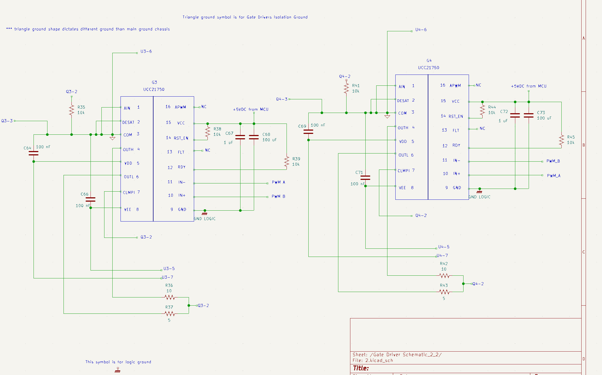
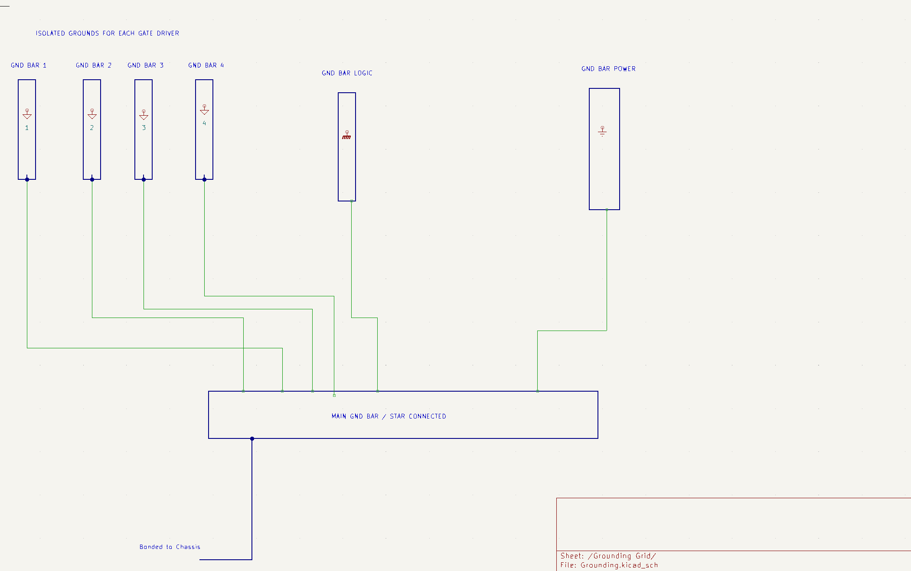

# Detailed Design

### Power Subsystem

## Function of the Subsystem

The Power Subsystem serves as the foundational energy source and conditioning stage for the induction-heating system. Its primary function is to convert the 240 VAC mains input into a regulated, high-frequency AC waveform capable of efficiently energizing the induction work coil. This subsystem provides all electrical power necessary to induce eddy-current heating within the steel pipe, ensuring the system can deliver the targeted thermal output to the load.

To accomplish this, the Power Subsystem performs several key tasks. First, it rectifies and filters the incoming AC line voltage to produce a stable high-voltage DC bus suitable for high-power switching. This includes the integration of EMI-compliant line-side filtering, and DC-bus energy storage to meet safety and regulatory requirements. Next, the subsystem utilizes a full-bridge inverter stage—driven by isolated gate drivers to convert the DC bus into a controlled, high-frequency AC excitation waveform at approximately 30 kHz. This waveform drives the resonant LC tank composed of the work coil and high-current resonant capacitors, enabling efficient power transfer into the pipe.

In addition to generating the required heating power, the Power Subsystem also interfaces with the Embedded and Controls subsystems to adjust power delivery, ensuring the heating process remains within the desired performance envelope. Overall, the Power Subsystem provides the controlled, high-frequency power necessary for induction heating, while also providing power to allow for the other subsystems to operate in harmony.

## Specifications and Constraints

***Specifications
1. The Power shall be able to take in a rectified DC bus and properly convert to each loads specified voltage need.
2. The Power shall be placed in a design such that all I/O ports are properly mapped and subsection Ports are clear and efficient.
3. The Power System shall ensure the power is properly filtered to ensure stable voltage levels are provided throughout the circuit.
4. The Power System shall be able to provide high power heating to a steel water pipe load as requested by Lochinvar, the customer. 

***Constraints 
1. EMI compliance:
    The line-side EMI filter and shielding should be designed so that conducted and radiated emissions from the induction-heating inverter comply with the limits for industrial ISM equipment specified in CISPR 11. [1]

2. 120 VAC US standard AC main supply. This Voltage level was chosen for testing purposes due to the limitations imposed by cost, time, and spacing.

3. Ensuring compliance with NEC standards. 

    -Non–current-carrying conductive parts must be connected to the equipment grounding conductor to prevent shock hazards. [2]

    -The branch-circuit rating supplying a fixed appliance must be sized for the appliance’s load, and continuous loads must be multiplied by 125%. [3]
4. This system shall operate within the bounds of a standard 40A breaker without causing issues.

## Extra Specification

This system is designed with components to handle a 240 VAC connection also. In order to do so, the fuses must be upgraded along with the PCB traces. For more information on the PCB specifications for 240 VAC integration, please see the PCB detailed design document.

For the scope of the project as mentioned above, testing will be done on a 120 VAC system to show closed-loop control over an induction heater coil.

## Overview of Proposed Solution

The proposed Power Subsystem converts the 120 VAC mains supply into the regulated, high-frequency power required to energize the induction-heating resonant tank while meeting all subsystem specifications and mandatory constraints. The AC input first passes through a line-side EMI filter, which suppress both differential-mode and common-mode noise to ensure compliance with CISPR 11 limits for industrial ISM equipment [1]. This filtering prevents high-frequency switching noise generated by the inverter from being conducted back onto the line.

After EMI filtering, the 120 VAC input is intentionally divided into three independent AC branches, each serving a different function:

##### Branch 1 — Main Power Path to High-Voltage DC Bus

The first AC branch feeds the primary full-bridge diode rectifier responsible for generating the high-voltage DC bus used by the induction-heating inverter. Bulk capacitors smooth the rectified voltage, and bleed resistors ensure safe discharge of stored energy after shutdown. This DC bus forms the power backbone for the full-bridge inverter that drives the resonant LC tank which in turn transfers energy via induction onto a steel pipe workpiece.

##### Branch 2 — Auxiliary Power Flyback Converter (12 V and 5 V Rails)

The second AC branch routes the filtered 120 VAC into a separate rectification stage dedicated to the auxiliary flyback supply. A rectifier diode and filter capacitor convert the AC input into a high-voltage DC level suitable for the flyback controller IC. The flyback converter then steps this voltage down to produce a regulated 12 VDC rail, which powers the system’s cooling fans and other low-voltage auxiliary components that could be integrated in the future. From the 12 V output, a linear low-dropout regulator produces a clean and low-noise 5 VDC rail required by the microcontroller and digital logic circuitry. This arrangement satisfies the specification that the subsystem provide well-filtered, stable voltages for downstream electronics.

##### Branch 3 — Dedicated AC-to-DC 15 V Gate-Driver Supply

The third AC branch supplies a fully independent AC-to-DC conversion module that generates a regulated 15 VDC rail exclusively for the gate-driver circuitry. This rail is isolated and electrically separate from both the auxiliary 12 V / 5 V rails and the main DC bus. Using a standalone conversion module ensures that high-frequency switching demands of the gate drivers do not disturb digital logic or auxiliary loads, improving switching integrity and preventing ground-loop coupling.

The design complies with NEC safety requirements. NEC 250.4 mandates that all non–current-carrying conductive parts be bonded to the equipment grounding conductor to eliminate shock hazards [2]. NEC 422.10(A) requires that branch circuits supplying fixed appliances be sized at 125% of continuous load [3], ensuring the subsystem can operate safely on a standard 20 A, 120 VAC circuit without overheating or nuisance breaker operation.

At the core of the main power path, a high-frequency full-bridge inverter converts the stabilized DC bus into a ~30 kHz AC excitation waveform used to drive the resonant LC tank. Full-bridge resonant inverters are widely used in induction-heating applications due to their high power capability, bidirectional coil current, and efficient energy transfer [4]. This topology produces the high reactive and real currents needed to heat the steel pipe as specified by the customer.

Finally, all subsystem interfaces which include AC inputs, the three AC branches, DC-bus nodes, auxiliary rails, and resonant-tank connections, are clearly mapped and organized to ensure clean routing and efficient subsystem integration.

Collectively, the EMI filter, main rectification stage, three-branch AC distribution network, isolated gate-driver supply, auxiliary flyback converter, and full-bridge inverter form a cohesive power solution that fulfills all subsystem specifications while satisfying CISPR 11 EMI constraints, NEC grounding and load-sizing rules, and 20 A branch-circuit limitations.

## Interface with Other Subsystems

##### Microcontroller system interfacing

The Microcontroller will transmit a PWM high and low  input signal through PCB tracing to the  4 UCC21750 Gate Driver IC's IN+ Pins. From there, the Power systems' circuits will effectively amplify and use the signal provided to drive the gates of the Full-bridge configuration on the DC main portion of the power board. 

*See the Buildable Schematic section for more info on how the signal logic is configured to eventually drive the IGBT gates*. 

##### Safety P&C system interfacing

The Safety and P&C system will recieve control signals which will then be used to apply control logic to the system for proper safety shutdown sequences when issues arise with voltage and current instability. These signals are taken by being branched off of various sections of circuitry in the design. *Please See the Safety P&C Detailed Design for more on that section*.

##### PCB system interfacing

The Power Subsystem will need to be able to be integrated onto a PCB for physical implementation of the design. Thus, it is crucial that the Power Subsystem has easy-to-incorporate schematics that can be interpreted with little confusion. 

## Buildable Schematic 

The following images show the circuit diagram layouts for the Power System. After this section, please refer to the following section where the schematic BOM will be nested.

        **Figure 1, AC main -> Rectified DC bus -> Inverter

        **Figure 2, Gate Driver IC's for IGBT 1 and 2.

        **Figure 3, Gate Driver IC's for IGBT 3 and 4.

        **Figure 4, Branch conversion for DC buses.

        **Figure 5, DC bus routing to small loads.

        **Figure 6, AC conversion to DC for Gate Driver IC operation.

        **Figure 7, Grounding Grid layout.

## BOM

This Section will detail ALL of the necessary information to acquire all components shown in the schematic section above.

| Components         | Manufacturer |  Part#      | Distributor | Dist. Part# | Qty. | Price |  Link |
| ------------------ | ------------ | ----------- | ----------- | ---------- | ---- | ----   | ----- |           
| FB1                |  Panjit      | GBJ3510     | Mouser Electronics | 241-GBJ3510_T0_00601 |1| $2.27 |[mouser.com](https://www.mouser.com/c/semiconductors/discrete-semiconductors/diodes-rectifiers/bridge-rectifiers/?q=GBJ3510 )|       
| Q1,Q2,Q3,Q4        |  ROHM        | RGW80TS65DGC13 | Mouser Electronics | 755-RGW80TS65DGC13 |4|$24.96 | [mouser.com](https://www.mouser.com/ProductDetail/ROHM-Semiconductor/RGW80TS65DGC13?qs=dbcCsuKDzFUOUanxGPiR5w%3D%3D)|
| G1,G2,G3,G4        | Texas Instruments | UCC21750 | Mouser Electronics |595-UCC21750DWR |4 | $18.20|[mouser.com](https://www.mouser.com/c/semiconductors/power-management-ics/galvanically-isolated-gate-drivers/?q=UCC21750 )|  
| LT8316   |  Analog Devices | LT8316 |    Mouser Electronics   | 584-LT8316EFE#PBF| 1 |$7.69 |[mouser.com](https://www.mouser.com/c/semiconductors/power-management-ics/voltage-regulators-voltage-controllers/switching-controllers/?q=LT8316 )|                          
| T1 |  Wurth Elektronik | 750317463| Digikey | 1297-750317463-ND | 1 | $10.98 |[digikey.com](https://www.digikey.com/en/products/detail/w%C3%BCrth-elektronik/750317463/22040899 )|                             
| U1,U2,U3,U4  | MURATA | MGJ2D151505SC | Mouser Electronics |580-MGJ2D151505SC| 4 |$33.84 |[mouser.com](https://www.mouser.com/ProductDetail/Murata-Power-Solutions/MGJ2D151505SC?qs=xLDY6iXSiQYIfXYEkf8RzA%3D%3D )|          
|MPM-10-15| MEAN WELL| MPM-10-15 | Mouser Electronics| 709-MPM10-15|  1 | $10.10| [mouser.com](https://www.mouser.com/ProductDetail/MEAN-WELL/MPM-10-15?qs=xhbEVWpZdWesTikav2ic2A%3D%3D)|                             
| U6  | Microchip Technology |  MIC5219-29YM5-TR  | Mouser Electronics | 998-MIC5219-2.9YM5TR | 1 | $1.28|[mouser.com](https://www.mouser.com/ProductDetail/Microchip-Technology/MIC5219-2.9YM5-TR?qs=U6T8BxXiZAUu28ZTWpa0Sw%3D%3D )|    
| F1,F2        |Littelfuse Inc.|0314030.MXP | Digikey |F4830-ND |2 |$3.64 |[digikey.com](https://www.digikey.com/en/products/detail/littelfuse-inc/0314030-MXP/778344)|
| C1 | KEMET| R46KN410045N1K | Mouser Electronics     |    80-R46KN410045N1K |1|$1.47|[mouser.com](https://www.mouser.com/ProductDetail/KEMET/R46KN410045N1K?qs=sGAEpiMZZMsh%252B1woXyUXj4OxC4raikkmeB%2FwhDzdQF8%3D)|                         
| C2,C3 | KEMET| R46KN347000S0K | Mouser Electronics|  80-R46KN347000S0K |2 |$3.36 |[mouser.com](https://www.mouser.com/ProductDetail/KEMET/R46KN347000S0K?qs=zsw%2FKduBDDCxrxFscGQ5uQ%3D%3D)|        
| C49 |EPCOS - TDK Electronics|B32676E6205K000 |  Digikey|495-2967-ND | 1  |$3.49| [digikey.com](https://www.digikey.com/en/products/detail/epcos-tdk-electronics/B32676E6205K000/1277731?s=N4IgTCBcDaIEIGYwDYDsyCiywAYCsA0jsSALoC%2BQA )|    
| C53,C56 |Panasonic Electronic Components| ECW-FE2J104PD| Digikey |P124888-ND |2 |$1.48 | [digikey.com](https://www.digikey.com/en/products/detail/panasonic-electronic-components/ECW-FE2J104PD/10292125?gclid=52232bb22e4e1d00d749429b369ded47&gclsrc=3p.ds&msclkid=52232bb22e4e1d00d749429b369ded47)|  
|  C4_Bank | Vishay / Sprague | TVA1703| Mouser Electronics |75-TVA1703 | 1 | $7.81 | [mouser.com](https://www.mouser.com/ProductDetail/Vishay-Sprague/TVA1703?qs=Jc0vmPlqnSzO64EtNsmyOw%3D%3D)| 
| C52| Nichicon | UVR2WR47MPD1TA |Mouser Electronics |647-UVR2WR47MPD1TA |1 |$0.27 |[mouser.com](https://www.mouser.com/ProductDetail/Nichicon/UVR2WR47MPD1TA?qs=sGAEpiMZZMvwFf0viD3Y3bXvgfG2gej7dC5wqpdmRvg7M7%252BgfNUw5Q%3D%3D )| 
|C_resonant_bank |WIMA |MKP10-.22/630/5P22  | Mouser Electronics |505-MKP10-.226305P22 |4 |$7.52 |[mouser.com](https://www.mouser.com/ProductDetail/WIMA/MKP10-22-630-5P22?qs=FsJ%2FjdNESOVRKe%2FLwIXG3Q%3D%3D&mgh=1&utm_source=chatgpt.com)|         
|  L1_choke(20A)|KEMET |SC-20-104  | Digikey |399-SC-20-104-ND |1 | $9.60| [digikey.com](https://www.digikey.com/en/products/detail/kemet/SC-20-104/10385029 )|
|R1  | YAGEO |   RSF50SJT-52-330K|  Mouser Electronics|603-RSF50SJT-52-330K |1 |$0.18 |[mouser.com](https://www.mouser.com/ProductDetail/YAGEO/RSF50SJT-52-330K?qs=sGAEpiMZZMtlubZbdhIBIMMVXX%252BgggzkwMlyWq3j6Pk%3D )|  
| R9 |  Bourns  | 3362U-1-504RLF  | Mouser Electronics |652-3362U-1-504RLF |1 |$2.05 |[mouser.com](https://www.mouser.com/ProductDetail/Bourns/3362U-1-504RLF?qs=sGAEpiMZZMtlubZbdhIBIAQM2Qjzi%2FAyAEPNZgNnw3U%3D )|
|  R22 | Bourns | PV32H105A01B00| Mouser Electronics | 81-PV32H105A01B00 |1 |$2.59|[mouser.com](https://www.mouser.com/ProductDetail/Bourns/PV32H105A01B00?qs=sGAEpiMZZMtlubZbdhIBIIiZvkqlAA9uzG1McxUFrHs%3D )|
|EMI_Choke| KEMET |SC-30-E100 | Digikey|399-SC-30-E100-ND |1 |$15.13 |[digikey.com](https://www.digikey.com/en/products/detail/kemet/SC-30-E100/10385065 )|
|C44,C46,C50,C48,C69,C64,C66,C71,C15,C6,C8,C10,C12,C28,C30,C32,C33,C36,C37,C40,C41|Murata Electronics |RDER71E104K0P1H03B|Digikey| 490-8809-ND| 21 | $5.14 |[digikey.com](https://www.digikey.com/en/products/detail/murata-electronics/RDER71E104K0P1H03B/4770964?s=N4IgTCBcDaIEoBECicDsBGJ6AMAWA0tgAroAS2AzAEIAEIAugL5A )| 
| C56,C51,C72,C67 |TDK Corporation|FG18X7R1E105KRT06  | Digikey|445-173261-1-ND - Cut Tape (CT) |4 | $1.20 |[digikey.com](https://www.digikey.com/en/products/detail/tdk-corporation/FG18X7R1E105KRT06/5802875)| 
|C29,C31,C34,C35,C38,C39,C42,C43,C13,C11,C9,C7,C23,C24,C4,C21 | Panasonic Electronic Components|ECA-1EM100|Digikey| P5148-ND|17 | $2.61 |[digikey.com](https://www.digikey.com/en/products/detail/panasonic-electronic-components/ECA-1EM100/245007?s=N4IgTCBcDaIKIGECChEAgIxwLJoAw5ALoC%2BQA )|
| C14 |Murata Electronics| RCER71E475K2M1H03A | Digikey|490-7509-1-ND - Cut Tape (CT) | 1 |$0.73 |[digikey.com](https://www.digikey.com/en/products/detail/murata-electronics/RCER71E475K2M1H03A/4277133 )|     
| C16 |KEMET | C322C475K5R5TA7301 |Mouser Electronics|80-C322C475K5R-TR|1 |$1.99|[mouser.com](https://www.mouser.com/ProductDetail/EPCOS-TDK/B32674D4475K?qs=sGAEpiMZZMsh%252B1woXyUXj6jSAy4%2FtCnJkKSVxQvMcVI%3D)| 
|C17 |  KYOCERA AVX | SR155A470JAR| Mouser Electronics|581-SR155A470JAR |1 | $0.55|[mouser.com](https://www.mouser.com/ProductDetail/KYOCERA-AVX/SR155A470JAR?qs=sGAEpiMZZMsh%252B1woXyUXj9XEEC6i9cfsz0UPinQS4Ko%3D )|
|C18 |Murata Electronics | RHS7J2H152J2M2H01A | Digikey |490-17418-1-ND - Cut Tape (CT) |1 |$1.01 |[digikey.com](https://www.digikey.com/en/products/detail/murata-electronics/RHS7J2H152J2M2H01A/7802750 )|
| C19 |KEMET  |C322C471K3G5TA |Digikey|399-C322C471K3G5TA-ND |1 |$0.38|[digikey.com](https://www.digikey.com/en/products/detail/kemet/C322C471K3G5TA/6656585 )|
| C20,C22 |TDK Corporation |FG18X5R1E225KRT06|Digikey|445-173253-1-ND - Cut Tape (CT) |2 |$0.64|[digikey.com](https://www.digikey.com/en/products/detail/tdk-corporation/FG18X5R1E225KRT06/5802867 )|
| D10,D11|onsemi|UF4007| Digikey |UF4007CT-ND |2 |$0.70 |[digikey.com](https://www.digikey.com/en/products/detail/onsemi/UF4007/965478 )|
| D2 |onsemi | MUR860G | Digikey| MUR860GOS-ND  |1 |$1.19 |[digikey.com](https://www.digikey.com/en/products/detail/onsemi/MUR860G/919926s=N4IgTCBcDaILIFUBKAOAbABgOIgLoF8g )|
| D1 |Diodes Incorporated|MUR160 |Digikey|31-MUR160CT-ND |1 |$0.27 |[digikey.com](https://www.digikey.com/en/products/detail/diodes-incorporated/MUR160/16375595 )|
| D12 |Bourns Inc. |SMBJ200A  | Digikey|SMBJ200ABBCT-ND |1 |$0.38 |[digikey.com](https://www.digikey.com/en/products/detail/bourns-inc/SMBJ200A/6153725 )|
|  Q5 |	STMicroelectronics |STD6N90K5 | Digikey|497-17072-1-ND |1 |$3.10 |[digikey.com](https://www.digikey.com/en/products/detail/stmicroelectronics/STD6N90K5/6616047?s=N4IgTCBcDaIMoBUAiA2AcgTgAwGsCsIAugL5A)|
| C5|EPCOS - TDK Electronics |B32774H4106K000 |Digikey|495-76663-ND |1 |$4.24 |[digikey.com](https://www.digikey.com/en/products/detail/epcos-tdk-electronics/B32774H4106K000/8569179)|
| R17|Stackpole Electronics Inc | MPR5JB50L0 |Digikey|MPR5JB50L0-ND | 1  |$1.05 |[digikey.com](https://www.digikey.com/en/products/detail/stackpole-electronics-inc/MPR5JB50L0/1646071 )|
| R11| Stackpole Electronics Inc|CF14JT20K0|Digikey|CF14JT20K0CT-ND |1 |$0.10 |[digikey.com](https://www.digikey.com/en/products/detail/stackpole-electronics-inc/CF14JT20K0/1741340 )|
| R12| Stackpole Electronics Inc |RNF14FTD61K9| Digikey |RNF14FTD61K9CT-ND|1 |$0.10 |[digikey.com](https://www.digikey.com/en/products/detail/stackpole-electronics-inc/RNF14FTD61K9/1682378)|
| R15|Vishay Dale | RN60D5001FB14 | Digikey| 541-RN60D5001FB14-ND| 1|$0.71 |[digikey.com](https://www.digikey.com/en/products/detail/vishay-dale/RN60D5001FB14/3193918)|
| R14| Stackpole Electronics Inc |CF14JT110K | Digikey |CF14JT110KCT-ND |1 |$0.10 |[digikey.com](https://www.digikey.com/en/products/detail/stackpole-electronics-inc/CF14JT110K/1741271 )|
|  R16|YAGEO |MFR-25FRF52-44K2 | Digikey|13-MFR-25FRF52-44K2CT-ND |1 |$0.10 |[digikey.com](https://www.digikey.com/en/products/detail/yageo/MFR-25FRF52-44K2/15044 )|
| R6,R18,R23,R26,R27,R20,R35,R38,R39,R41,R44,R45,R13 | Stackpole Electronics Inc|CF14JT10K0|Digikey|CF14JT10K0CT-ND|13 |$0.50|[digikey.com](https://www.digikey.com/en/products/detail/stackpole-electronics-inc/CF14JT10K0/1741265)|
|-------------------|--------------|------------------|-------------|-----------|-------|-------|--------------|
|Total: $203.77|

## Power Budgeting
The power budget tables are here to note the normal operation maximums of the components in the system, as well as detailing the expected power losses of components that have a significant impact on the efficiency of the system. Table 1 details the power consumption of the system components.  Table 2 details the power losses of the system.

Table 1:

| Components          | Power Consumption (Watts) |        
| ------------------ | ------------ | 
| Fans x 3           | 6             |  
| MCU                | 1             | 
| Pipe Workpiece     | 1600          | 
| Total              | 1607          |

Table 2 below details the estimated losses of the power subsystem.

| Components          | Power Loss (Watts) |        
| ------------------ | ------------ |
| FB1                | 77            |
| Q1,Q2,Q3,Q4        | 100           |
| G1,G2,G3,G4        | 1.5           |  
| U1,U2,U3,U4        | 0.25          |  
| MPM-10-15          | 0.35          |  
| T1                 | 0.75          |  
| LT8316             | 0.01          |  
| U6                 |  1            |  
| Bleed Resistors    |  1.5          |
| Tank Coil Copper Loss |  20        |
| Total              |  221.36       |

Efficiency of system:   (Load_Power / Input_Power) * 100

        Input Power = Table 1 total + Table 2 total

        
Efficiency will be around 90%

IF the power dissipation of the transistors was a datasheet worst, then the system efficiency would drop to 82%. The IGBT's will not get to that point because of ensured operational conditions.

## Analysis

The presented induction-heater power system integrates AC input conditioning, high-voltage DC rectification, a full-bridge resonant inverter, fully isolated gate-driver subsystems, and multiple auxiliary low-voltage supplies into a cohesive, robust architecture capable of delivering approximately 4-5 kW of power into a resonant LC heating network. The design begins at the 240 VAC input, where a pair of 30 A line fuses establishes the primary over-current protection boundary. Immediately downstream, the EMI line filter—composed of a 1 mH/30 A common-mode choke and an across-the-line differential capacitor—reduces both common- and differential-mode conducted emissions generated by the high-frequency switching. This filtering stage is critical for compliance with electromagnetic interference regulations and for protecting upstream mains wiring from high-frequency harmonic content. After filtering, the AC line is intentionally branched into three independent paths: a main rectification line that feeds the high-power inverter, a path that supplies an isolated 15 V AC-DC conversion stage, and a high-voltage DC branch that feeds a flyback converter responsible for generating the 12 V and 5 V low-voltage system rails. Branching at the AC stage ensures that the auxiliary systems—namely the gate-drive supplies, the microcontroller, and cooling fans—do not introduce load perturbations onto the resonant DC bus, which preserves inverter stability and improves overall system reliability.

The main power stage rectifies the filtered AC through a GBJ3510 35 A, 1000 V bridge rectifier [5], providing a nominal 169 V DC bus under 120 VAC input. Due to real life voltage drops from filtering and rectification, DC bus voltage will be more in the 167 VDC range. This component is appropriately rated for the anticipated 10-12 A DC current range associated with a 1.7 kW load, and its surge current capability offers margin for capacitor charging and transient events. The rectifier output feeds a multi-stage DC-link network consisting of a 5 mF bulk capacitor, a 5 mH/20 A series DC choke, and several high-frequency film and ceramic decoupling capacitors positioned close to the inverter bridge. This network fulfills two roles: first, it attenuates the 120 Hz ripple inherent to rectified mains; second, it provides a tightly-coupled energy reservoir for the high-frequency switching currents demanded by the full-bridge inverter. The combination of bulk capacitance, film capacitors, and ceramic capacitors is standard practice in high-power converter design, as it simultaneously supports slow-timescale load transients, medium-frequency ripple, and extremely fast switching edges. Bleeder resistors across both the DC-bus electrolytics and the EMI capacitors ensure that stored energy safely dissipates after shutdown, improving maintenance safety and preventing shock hazards. The following figures below are placed to show why proper capacitive filtering is needed.

        **Figure 8, No smoothing Capacitor on DC mains.
 
        **Figure 9, Smoothing Capacitor on DC mains.

At the center of the design is the full-bridge inverter composed of four high-voltage IGBTs [6] arranged in a standard H-bridge topology. This inverter is responsible for generating the high-frequency bipolar AC waveform that excites the resonant heating tank. The inverter midpoints feed a parallel LC resonant network consisting of a 25 µH induction coil and a capacitor bank totaling approximately 1.16 µF. The actual inductance of the coil will be able to be tuned in real life to achieve resonance with the capacitance value. This parallel configuration produces a resonant frequency around 30 kHz and presents a high impedance at resonance, which naturally limits inverter current even as coil current becomes large. Such behavior is advantageous in induction-heating applications, which often demand high circulating currents at the load but moderate bus currents at the switching bridge. The use of localized high-frequency decoupling capacitors across each half-bridge minimizes voltage overshoot due to parasitic inductance and improves switching performance. Collectively, these measures ensure the inverter can reliably operate at the required switching frequency while controlling switching losses, limiting electromagnetic emissions, and maintaining stable resonant operation.

The gate-driver topology is designed with particular attention to safety, isolation integrity, and transient immunity. Each IGBT is driven by a dedicated UCC21750 isolated gate-driver IC, powered by its own fully isolated 15 V DC supply derived from Murata MGJ2D151505SC modules [10]. This structure provides four distinct galvanically isolated drive domains, preventing cross-talk between high-side and low-side devices and ensuring that each IGBT gate is referenced cleanly to its own emitter node, which is essential in a full-bridge inverter where both high-side devices experience rapid dv/dt at their gate-drive reference. The UCC21750 [7] devices incorporate desaturation protection, fault-reporting, and Miller-clamp functionality, enabling controlled shutdown during short-circuit or fault events and preventing false turn-on during high-frequency switching transients. Each driver is further supported by local ceramic decoupling capacitors, selected gate resistances, and single-point logic grounding, forming a noise-resilient and electrically robust control interface to the inverter.

The auxiliary power architecture provides clean, stable low-voltage rails necessary for system control and thermal management. An LT8316-based flyback converter [8], supplied from a high-voltage DC branch tapped and rectified from the AC mains, generates a regulated 12 V rail used to drive the forced-air cooling fans. This flyback supply is well-suited for high-voltage, isolated bias generation and incorporates transformer-based galvanic isolation [9] to ensure the logic subsystem is electrically separated from the high-voltage domain. A MIC5219 low-dropout regulator [12] derives a stable, low-noise 5 V rail for the microcontroller and logic circuits, with appropriate output filtering to minimize ripple and ensure digital-signal integrity. The totality of the auxiliary supply chain is electrically and physically segregated from the gate-drive islands, reducing noise coupling and ensuring stable operation even during high-power switching events.

Thermally, the design incorporates fans driven directly from the auxiliary supply, providing forced airflow over the IGBTs, rectifier, and choke assembly. Given expected DC-bus currents near 11 A and switching losses associated with tens of kilohertz operation, enforced convection cooling is essential to maintain semiconductor junction temperatures within safe operating limits. Component ratings—including the 35 A bridge rectifier, 20 A DC choke, 40 A IGBT switches, and 18 A input fuses are selected with deliberate headroom to improve thermal survivability and long-term reliability under sustained load.

Overall, the system architecture demonstrates a disciplined application of power-electronics design principles. The AC input filtering and protective devices satisfy safety and EMC constraints, the DC-bus network provides a stable high-voltage energy reservoir, and the full-bridge inverter with a parallel resonant tank is suited for delivering high circulating current to an induction coil with controlled bus stress. The use of isolated gate drivers with independent floating power domains ensures correct gate-emitter referencing and protects the logic subsystem from high dv/dt environments. The auxiliary supplies are well-segregated and capable of powering the control electronics independently from the resonant stage. With proper PCB layout and heatsinking, the design is well-positioned to achieve the intended performance objectives, meet electrical and thermal constraints, and operate safely and reliably as a high-frequency induction-heating power platform.

See reference [13] to learn more on the full bridge inverter topology that is utilized in this design.

## References

[1] International Electrotechnical Commission. (2024). IEC CISPR 11:2024 — Industrial, scientific and medical equipment – Radio-frequency disturbance characteristics – Limits and methods of measurement. IEC. 

[2] National Electrical Code (NEC) 2023. NFPA, Article 250, Sec. 250.4(A)(3), National Fire Protection Association, 2023.
[3] National Electrical Code (NEC) 2023. NFPA, Article 422, Sec. 422.10(A), National Fire Protection Association, 2023.
[4] Kolla, S. R., and M. K. Kazimierczuk. “Analysis and Design of High-Frequency Series-Resonant Inverters for Induction Heating.” IEEE Transactions on Power Electronics, vol. 21, no. 5, 2006, pp. 1313–1321.

[5] Panjit International Inc., GBJ3510 Glass Passivated Bridge Rectifier (GBJ-2) Datasheet, Feb. 2025. [Online]. Available: https://www.mouser.com/datasheet/3/3736/1/GBJ3510.pdf
. [Accessed: 28-Nov-2025].

[6] ROHM Semiconductor, RGW80TS65DGC13 Field-Stop Trench IGBT Datasheet. [Online]. Available: https://www.mouser.com/ProductDetail/ROHM-Semiconductor/RGW80TS65DGC13?qs=dbcCsuKDzFUOUanxGPiR5w%3D%3D
. [Accessed: 28-Nov-2025].

[7] Mouser Electronics, Galvanically Isolated Gate Drivers – Product Category Page. [Online]. Available: https://www.mouser.com/c/semiconductors/power-management-ics/galvanically-isolated-gate-drivers/?q=UCC21750
. [Accessed: 28-Nov-2025].

[8] delete all this in the document.

[9] DELETE this in the document

[10] Murata Power Solutions, MGJ2D151505SC 2W Isolated DC/DC Converter – Product Page. [Online]. Available: https://www.mouser.com/ProductDetail/Murata-Power-Solutions/MGJ2D151505SC?qs=xLDY6iXSiQYIfXYEkf8RzA%3D%3D
. [Accessed: 28-Nov-2025].

[11] MEAN WELL, MPM-10-15 10 W AC-DC Converter Module – Product Page, Mouser Electronics. [Online]. Available: https://www.mouser.com/ProductDetail/MEAN-WELL/MPM-10-15?qs=xhbEVWpZdWesTikav2ic2A%3D%3D
. [Accessed: 28-Nov-2025].

[12] Microchip Technology, MIC5219-2.9YM5-TR Low-Dropout Voltage Regulator – Product Page. [Online]. Available: https://www.mouser.com/ProductDetail/Microchip-Technology/MIC5219-2.9YM5-TR?qs=U6T8BxXiZAUu28ZTWpa0Sw%3D%3D
. [Accessed: 28-Nov-2025].

[13] S. Abdel-Rahman, Resonant LLC Converter: Operation and Design, Application Note AN 2012-09, V1.0, Infineon Technologies, Sep. 2012. [Online]. Available: https://www.infineon.com/assets/row/public/documents/24/42/infineon-design-example-resonant-llc-converter-operation-and-design-applicationnotes-en.pdf