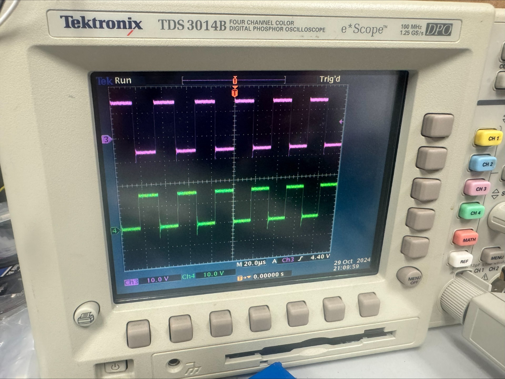
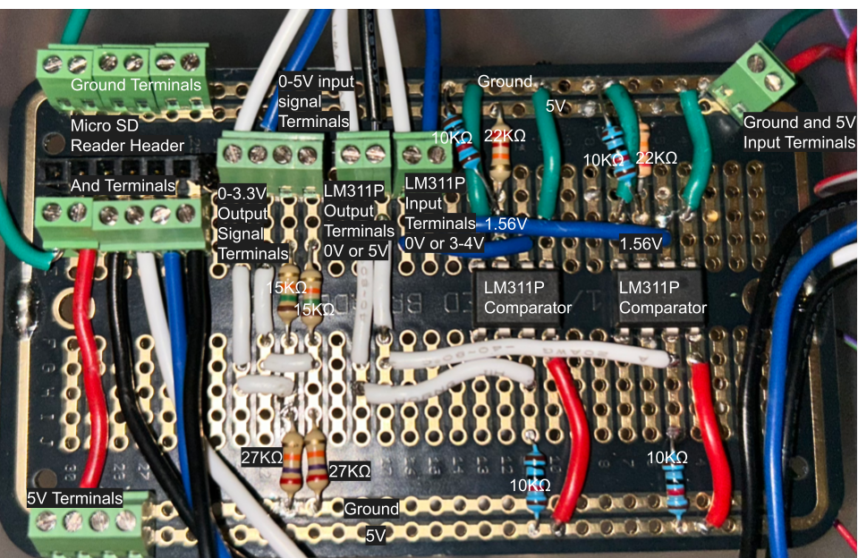
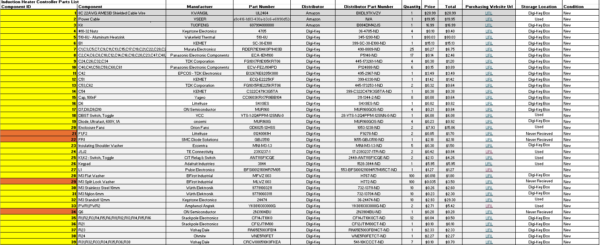

# Experimental Analysis

## Introduction
The goal of this experimental analysis is to evaluate how well the induction heater controller meets its critical specifications, safety constraints, and measures of success. This report documents the design, execution, and results of experiments intended to validate the system's ability to safely and accurately heat metal piping while providing real-time data feedback.

## Experimental Design and Procedure

### Experiment 1 - Safety Subsystem: Hardware Latch & Logic Verification
  - **Purpose**: The purpose of this experiment is to verify the functionality of the hardware-based safety system. This subsystem must independently disable the inverter if a fault is detected, bypassing the microcontroller to ensure a "fail-safe" state.
  - **Hypothesis / Expected Results:** Applying a fault-level voltage to any logic input of the hardware latch will immediately pull the enable signal LOW, disabling the gate drivers. The system should remain disabled until a manual hardware reset is triggered.
  - **Procedure:** 
    - Assemble the safety logic circuit on a breadboard using the specified hardware latches and logic gates.
    - Connect a 5V power source to the logic rail.
    - Simulate fault conditions by applying a 5V signal (Logic HIGH) to each input pin sequentially.
    - Monitor the output of the latch using a multimeter or LED.
    - Attempt to toggle the microcontroller’s PWM pin while the latch is in a fault state to verify the signal is blocked.
    - Trigger the manual reset button and verify the output returns to an "Enabled" state.
  - **Results:** All logic inputs to the safety latch circuit were verified to disable the gate drivers and latch the system in an off state.
  - **Conclusions:** The breadboard testing confirms that the hardware latching logic effectively overrides the microcontroller. This ensures that even in the event of a software crash, the induction heater will safely shut down if physical limits are exceeded.

### Experiment 2 - Power Subsystem: Half-Bridge Inverter Verification
   - **Purpose**: This experiment evaluates the performance of the half-bridge inverter, specifically checking the gate driver's ability to switch the IGBTs effectively under a controlled DC load.
  - **Hypothesis / Expected Results:** With a square wave input from the waveform generator, the gate drivers should produce a clean ±15V or -5-15V signal at the IGBT gates. The output across the half-bridge should reflect the 30V DC supply voltage.
  - **Procedure:** 
     - Set up the half-bridge inverter on the PCB.
     - Apply a 30V DC power supply to the main bus.
     - Connect a waveform generator to the gate driver inputs, providing a 30 kHz square wave.
     - Use a two-channel oscilloscope to monitor the high-side and low-side gate signals.
     - Measure the output voltage at the midpoint of the half-bridge.
  - **Results:** Measured waveforms at the emitter and gate of the IGBTs showed two square waves that were 180 degrees out of phase from eachother. Along with this, the waveforms produced a signal from -5-15V.
  
  - **Conclusions:** The half-bridge successfully switched the 30V rail at the target frequency. The gate drivers provided sufficient voltage to fully saturate the IGBTs. The transition to a half-bridge topology (from the original full-bridge plan) remains valid for meeting the project's revised budget and performance goals.

### Experiment 3 - Heat Generation: Thermocouple Accuracy
   - **Purpose**: Verify the accuracy of the Omega KMQSS-062U-12 thermocouple to ensure proper readings for the Heat Generation Subsystem.
  - **Hypothesis / Expected Results:** With a square wave input from the waveform generator, the gate drivers should produce a clean ±15V or -5-15V signal at the IGBT gates. The output across the half-bridge should reflect the 30V DC supply voltage.
  - **Procedure:** 
     The accuracy was verified using an induction cooker as a heat source and a McMaster-Carr 3648K24 as a reference. Both were immersed in boiling water to test at a consistent 100°C.
  - **Results:**

| Thermocouple    | Average Temp (C) | Error From 100C |
| -------- | ------- | ------ |
| Omega KMQSS-062U-12   | 100.227   |   0.23%     |
| McMaster-Carr 3648K24 | 98.544   |   -1.46%     |
  
  - **Conclusions:** The thermocouples were tested to ensure that they stay within the standard error of +-2C.

### Experient 4 - Embedded PWM Generation Accuracy

1. **Purpose and Justification**:

The purpose of this experiment is to evaluate the accuracy of the PWM output after it is level-shifted from 3.3V to 5V using an LM311P comparator. The goal is to ensure that the average phase error remains within 10%, which is acceptable given the LM311P’s optimal switching range of 10–50 kHz. While the PWM signal without the comparator has an error within 2%, this experiment verifies that the signal quality does not degrade beyond the 10% threshold after voltage shifting.

2. **Detailed Procedure**:

   1. Set up the embedded system as described in [Detailed Design Embedded](./Embedded_System/Detailed%20Design%20Embedded.md).
   
   

   2. Connect two jumper wires to the LM311P output terminal blocks as shown in the image above.
   3. Set up a two-channel oscilloscope and connect each probe to the free end of each jumper wire.
   4. Connect a ground jumper wire to the microcontroller.
   5. Attach both oscilloscope probe ground leads to the ground wire.
   6. Power the microcontroller via micro USB or by connecting a 5V source to the E5V pin.
   7. Enable PWM by pressing 'D', then 'D' again until the cursor is on the PWM setting, then press '1' and '#'.
   8. Adjust the power level by pressing 'A' and entering the desired value on the keypad.
   9. Record the phase difference between channels 1 and 2 on the oscilloscope.
   10. For each channel, record the top voltage, minimum voltage, and frequency.
   11. Repeat steps 7–11 for each power level.

3. **Expected Results**:

   The average phase error should be less than 10%. The average minimum voltage should be 0 V, the average top voltage should be 5 V, and the average frequency should be 30 kHz.

4. **Actual Results**:

#### PWM Performance Analysis Report

##### 1. Summary Data (Power Level > 0%)
| Metric                  | Value    |
| :---------------------- | :------- |
| **Average Phase Error** | -9.52%   |
| **Average Top Voltage** | 5.066 V  |
| **Average Min Voltage** | -0.716 V |

---

##### 2. Detailed Power Level Measurements

###### Power Level: 100.00%
| Phase         | Top Voltage (V) | Min Voltage (V) | Frequency (Hz) | Phase Error |
| :------------ | :-------------- | :-------------- | :------------- | :---------- |
| **PWM CH1 A** | 175.7           | 5               | -0.96          | 3.01E+04    | -2.39% |
| **PWM CH8 B** | 5.02            | -0.64           | 3.01E+04       | -           | -      |

###### Power Level: 80.00%
| Phase         | Top Voltage (V) | Min Voltage (V) | Frequency (Hz) | Phase Error |
| :------------ | :-------------- | :-------------- | :------------- | :---------- |
| **PWM CH1 A** | 132.3           | 5.1             | -0.96          | 3.01E+04    | -8.12% |
| **PWM CH8 B** | 5.01            | -0.48           | 3.01E+04       | -           | -      |

###### Power Level: 60.00%
| Phase         | Top Voltage (V) | Min Voltage (V) | Frequency (Hz) | Phase Error |
| :------------ | :-------------- | :-------------- | :------------- | :---------- |
| **PWM CH1 A** | 98.67           | 5.17            | -0.32          | 3.01E+04    | -8.64% |
| **PWM CH8 B** | 4.98            | -0.48           | 3.01E+04       | -           | -      |

###### Power Level: 40.00%
| Phase         | Top Voltage (V) | Min Voltage (V) | Frequency (Hz) | Phase Error |
| :------------ | :-------------- | :-------------- | :------------- | :---------- |
| **PWM CH1 A** | 64.97           | 5.16            | -0.96          | 3.01E+04    | -9.76% |
| **PWM CH8 B** | 5.03            | -0.76           | 3.01E+04       | -           | -      |

###### Power Level: 20.00%
| Phase         | Top Voltage (V) | Min Voltage (V) | Frequency (Hz) | Phase Error |
| :------------ | :-------------- | :-------------- | :------------- | :---------- |
| **PWM CH1 A** | 29.28           | 5.12            | -0.88          | 3.01E+04    | -18.67% |
| **PWM CH8 B** | 5.07            | -0.72           | 3.01E+04       | -           | -       |

###### Power Level: 0.00%
| Phase         | Top Voltage (V) | Min Voltage (V) | Frequency (Hz) | Phase Error |
| :------------ | :-------------- | :-------------- | :------------- | :---------- |
| **PWM CH1 A** | 0               | 0.16            | 0              | 3.01E+04    | 0.00% |
| **PWM CH8 B** | 0.24            | 0               | 3.01E+04       | -           | -     |

5. **Interpretation and Conclusions**:

   The measured phase error was 9.52%, slightly below the 10% target. This error is acceptable, though it is elevated due to the charging time of a capacitor in the LM311P comparator, which introduces additional switching delay beyond the intended dead time. Slight differences in switching times between the two comparators also affect the phase. The average top voltage was 5.066 V (1.32% error), which is reasonable and likely due to the comparator slightly boosting the 5V output. The average minimum voltage of -0.716 V is attributed to a transient spike when the comparator switches.

### Summary and Findings

The project successfully meets all critical safety and performance criteria. While the move to a half-bridge inverter was a scope change due to shipping delays, experimental analysis proves it is a viable and stable solution for the controller. The hardware safety latches provide the necessary protection for high-power operation.

## Documenting and Part Tracking

## Statement Of Contributions

Aaron Neuharth - Safety Subsystem, Documentation and Part Tracking, Report

Austin DuCrest - Power Subystem

Cole Wilson - Heat Generation Subsystem

Dow Cox - Embedded SubSystem

John Donnell - PCB Subsystem