# Table of Contents
1. Project Proposal
2. Conceptual Design
3. Detailed Design

     a. Power Subsystem

   
     b. Safety and Protections Subsystem

   
     c. PCB Subsystem

   
     d. Heat Generation Subsystem

   
     e. Embedded Subsystem

   
4. Experimental Analysis 

# 1. Project Proposal

## Introduction

Induction heating has proven itself to be a reliable and effective method for transferring energy into materials. By allowing eddy currents to flow through conductive materials, this technology enables accurate and controllable heating for various applications, including industrial metal processing and consumer induction cooktops. Although the fundamentals of the heating process are well known, the controller, on the other hand, the component that is responsible for regulating power delivery, modes of operation, as well as feedback measurements, wholeheartedly determines the performance of the induction system.

This project proposes the design and prototyping of an induction heater controller that can heat both the internal and surface-level material of a circular heating element. The prototype will also be able to verify temperature rise against electrical power, as well as deliver measured performance data and offer a variety of user-selectable power settings. This prototype will also be validated by its effectiveness through testing circular bar stock and standard black pipe, with thermocouples measuring temperature rise against electrical power input. With the gathering of this data, the system will supply a clear display of how different control modes can and will affect heating performance, efficiency, and usability.

Within this proposal, the remainder of the document will discuss:
- The formulation of the problem at hand 
- The background of induction heating and control systems 
- The specifications anf constraints that go into the controller 
- Surveying of already existing solutions to the problem of controlling induction heating
- Timeline of the project 
- What will be the expected outcome and benefits of the project

## Formulating the Problem

The issue at hand is not the induction heater itself; however, it’s the controller that needs to be able to be customizable for the many applications and particular use cases. There are industrial and commercial induction heaters that lack vital measurement capabilities in addition to the flexibility required for controlled testing and validation. A customized controller is necessary if wanted to show variable heating performances, collect data, and act as a prototype platform for additional research.

The controller must safely and efficiently handle high power transfer while also allowing accurate user control and measurement; this is not a single person task.  Current consumer grade induction heaters lack the instrumentation and adjustability needed for this project because they are designed for cooking applications. Thus, a customized engineered system is required, which involves a multiple disciplinary engineering effort.

### Background

Induction heating is a non-contact method of transferring energy into conductive materials through electromagnetic induction. When a time-varying magnetic field surrounds a conductive body, eddy currents are induced within the material, and in ferromagnetic materials additional heat arises from magnetic hysteresis losses [1]. These induced currents are typically concentrated near the surface due to the skin effect, which means the depth of heating strongly depends on frequency and material properties [2]. The technique is valued for its efficiency, cleanliness, and ability to deliver rapid and localized heating [3].

In applications where uniform heating is critical, focusing exclusively on surface-level heating can lead to overheating of the outer regions while the core lags behind in temperature. Conversely, targeting only internal heating may cause surface underheating or delays in reaching the desired surface temperature. This imbalance reduces efficiency and can compromise performance. For circular heating elements in particular, temperature uniformity is heavily influenced by coil geometry, pattern design, and coil–workpiece spacing; suboptimal coil layouts produce visible non-uniformities across the surface [4]. Multi-field finite element and semi-analytical simulations confirm that coupling between electromagnetic fields and thermal diffusion results in uneven temperature distribution, especially in thicker or more complex shapes [5].

The key to addressing this challenge lies in the design of the induction heater’s controller. By enabling real-time adjustment of inverter frequency and output power, the controller can shift the balance between surface-level and internal heating depending on operational needs [6]. Modern inverter designs use resonant tracking, frequency modulation, and energy-dosing strategies to maintain efficiency while adapting penetration depth [7],[8]. Furthermore, modern control strategies integrate feedback from sensors—ranging from infrared temperature sensors to magnetic-field or inductive sensors that respond to changes near the Curie point—allowing closed-loop operation that dynamically adapts to the heating profile [9]. Such adaptive approaches improve energy efficiency, enhance safety, and expand the flexibility of induction heating systems in both industrial and consumer applications [10].

# 2. Conceptual Design
## Introduction
***

Induction heating remains one of the most effective methods for transferring energy into conductive materials by applying time-varying magnetic fields to induce eddy currents. The performance, repeatability, and efficiency of this process are fundamentally determined by the degree of control applied to it. The controller allows power delivery, measures and adjusts temperature, and ensures operational safety. Even a well-designed induction coil cannot consistently achieve precise heating performance without an efficient control system.

This project addresses that challenge by designing and prototyping a custom induction heater controller capable of heating both the internal and surface regions of circular metallic elements such as bar stock and standard black pipe. Unlike commercial cooktop controllers, which operate in open-loop configurations, this system will implement closed-loop control to verify temperature rise against electrical power input, collect experimental data, and support flexible user-defined operating modes.

The fully formulated problem is to design a controller that can accurately sense and regulate temperature, safely and effectively manage power delivery, and provide real-time feedback for experimental validation of induction heating performance. To satisfy customer requirements and comply with IEEE and NEC safety standards, the system shall strike a balance between safety, measurement accuracy, and operational adaptability.

This conceptual design document will flesh out the original project proposal by classifying each system into subsystems, by explaining and going into detail about their specifications, the safety requirements, and what’s the achievable goal. The following sections include reformulating the problem, comparative analysis of potential solutions, specifications of the subsystems, and considerations of both ethical and professional designs for the project.

## Restating the Fully Formulated Problem
***

The objective of this project is to design and prototype a custom induction heating controller that can safely heat  metallic materials such as bar stock and/or regular black pipe in a repeatable fashion. This system will apply closed-loop feedback controls that uses temperature sensors to monitor and control heat production in real time, differing from typical commercial induction cooktops that depend on open-loop controls and lack temperature sensors.

The scope of the project includes:  
- Designing a controller to integrate power and measurement systems.  
- Applying control algorithms that grant user-selectable power modes and maintain consistent thermal output.  
- Measuring and displaying both electrical input power and resulting temperature rise.  
- Ensuring compliance with Lochinvar’s customer specifications and relevant NEC and IEEE safety standards.  

The controller will act as a proof-of-concept platform that illustrates the connection between electrical input power and thermal output while carrying-out safety, measurement precision, and adaptability.

### Shall Statements and Constraint Origins

| **ID** | **System Requirements**                                                                                                                           | **Origin of Constraint (Reference)**                                                          |
| :----: | :------------------------------------------------------------------------------------------------------------------------------------------------ | :-------------------------------------------------------------------------------------------- |
|   1    | This controller **shall** provide multiple power settings, allowing for adjustable heating levels.                                                | Customer specification (Lochinvar requirement)                                                |
|   2    | This controller **shall** cause internal heating and surface eddy currents in cylindrical metallic samples (bar stock and/or regular black pipe). | Functional design requirement; project objective; supported by induction heating models   [1] |
|   3    | This controller **shall** measure and display electrical input power and corresponding temperature rise.                                          | Customer specification; data acquisition requirement [2], [3]                                 |
|   4    | This controller **shall** prevent energization when in the OFF state by making sure all ungrounded conductors are disconnected.                   | Safety requirement; NEC Article 427 (Fixed Electric Heating Equipment) [4]                    |
|   5    | This controller **shall** have overheating and overcurrent fault protection to avoid hardware failure.                                            | Standards compliance; IEEE 844-2000 (Impedance, Induction, and Skin-Effect Heating) [5]       |
|   6    | This controller **shall** have an LCD screen to show temperature, power, and current flow data.                                                   | Customer usability requirement; supported by OMEO cooktop interface [2], [3], [6]             |
|   7    | This controller **shall** be housed in an insulated, non-conductive enclosure.                                                                    | NEC 665, Part II; ethical responsibility for user safety [7]                                  |
|   8    | This controller **shall** not exceed a maximum enclosure temperature of 105°C during operation.                                                   | Component protection limit; derived from OMEO SK-IH18G23T analysis [3]                        |
|   9    | This controller **shall** adhere to ethical engineering practices.                                                                                | Ethical and professional standards (IEEE Code of Ethics) [5], [8]                             |

## Comparative Analysis of Potential Solutions
***

### Control System 

Lochinvar has supplied the team with an OMEO SK-IH18G23T induction cooker [2]. This induction cooker is designed to be used with smooth, flat bottom base cookware. The cooker utilizes an open loop control system operating based on user selected power and time settings. This cooker has no feedback to know the actual temperature of the part heated, but it is able to predict the temperature from the power selected by the user. The cooker is preprogrammed to 10 temperatures of 120°F to 460°F correlating to 180 Watts to 1800 Watts [3]. The OMEO SK-IH18G23T, though the heating itself is open loop, contains sensors providing feedback to protect the cooker. Notably it contains a thermocouple to measure the surface temperature of the induction cooker and an IGBT sensor placed underneath the heatsink to ensure the PCB was not getting too hot. The surface temperature is kept below 280°F while the PCB is kept under 105°F [3]. Ideally, the cooker should remain relatively cool while the part is being heated. If the cooker's surface temperature or the IGBT's temperature rises too high, the controller produces an error code and stops heating [3]. The cooker's heat sink absorbs much of the heat, but if the heat sink fails the controller's components will fail due to overheating and may fail violently at risk of causing harm to operators.

OMEO PCB with Heatsink:

OMEO PCB without  Heatsink:

The system the team will be implementing can be best understood using a control block diagram: 

.png>)

For our system: 
 - R(s) = user desired power
 - Y(s) = temperature of the pipe
 - G(s) = dynamics of the induction heating 
 - H(s) = dynamics of the thermocouple sensor
 - Gc(s) = compensation to be implemented to ensure specifications are met
 - summing junction = signals to and from microcontroller

The team's system will require a thermocouple sensor to meet customer specifications and ensure that a the induction heater controller produces a temperature rise on the metal. The team shall implement a closed loop control system to ensure that customer specifications are met in an accurate and consistent manner. Open loop control is better for cost efficiency primarily by eliminating the cost of a sensor measuring the part heated, but measuring the part heated is a requirement for this project. 

For this system, the critical component to be implemented will be the compensator and the summing junction to ensure that the temperature output is accurate to the user's input and remains at a safe level. This can be accomplished using hardware, software, or a mix of both. Deciding which to use primarily depends on balancing the need for speed and reliability using hardware like physical relays [9] versus using software to increase reprogrammability and reduce lead times by reducing number of parts ordered. Typically industrial settings implement their control using digital software for this reason to be able to improve performance of a system without having to order multiple resistor and capacitor components for a hardware solution, while power substations will use physical relays to handle higher voltage requirements and prevent fatal errors. 

#### Heat Generation Controls 
Heat Generation Controls will be the controls implemented to meet customer specifications. 

These controls will require: 
- ability to increase and decrease temperature of pipe 
- ability to determine user's desired temp from the user inputted power level
- temperature sensor to ensure actual temp approximates desired temp
- reprogrammability to ensure controller meets specifications despite noise of system dynamics 

This can be attained using: 
- ##### PID Control implemented using a microcontroller 
PID control [10]is compensation solution that is the most comprehensive of compensators available. PID by definition is a Proportional, Integral, and Derivative control that allows for the reduction of error, noise, and chattering of signals respectively. This is achieved primarily by adjusting the values of and ratios of constants Kp, Ki, and Kd associated with each PID parameter. These constants can be calculated using control theory if the system specifications are known and the transfer functions of the plant and sensor are known. These can be determined experimentally, but the constants are usually set in a more ad hoc manner to save time. In both cases the PID control is usually fine tuned by adjusting the constants as needed to get the best response. PID can be implemented using software or hardware, but it is typically done using software. Software allows for reprogrammability, and can be implemented easily using a microcontroller. Hardware PID involves longer lead times to receive multiple parts and would be difficult to fine tune without even longer lead times. For this system, the proportional control will be critical to remove the error signal between the user desired temperature and the actual temperature of the pipe. The other parameters will not be as critical, but they will still be useful to ensure customer specifications are met. 

Using a microcontroller has the additional benefit that the microcontroller will be able to send and receive signals to / from the system. A microcontroller would be able to receive information from the sensor's actual temperature and user's desired temperature and send information to that the system needs to adjust to match actual temp to desired temp. Implementing this control in a microcontroller reduces the need for additional components requiring additional connections to communicate with each other. 

There are less comprehensive compensators available such as phase lead and phase lag, and PID can be reduced to P and so on as needed to reduce costs if needed. However, by implementing this control using software in a microcontroller the team should not incur any additional cost by implementing PID. 

### Safety and Protections
#### Safety Controls 
Safety Controls will be the controls implemented to meet safety and ethical standards. 

These controls will require: 
- reliable shut off mechanisms in event of faults or overheating to ensure safety maintained
- production of error codes to inform user of system issues: e.g. overheating cause controller to prevent heating and produce error code to inform user prevention of heating is intentional
- ensurance that controller is unable to produce heating on the pipe when the controller is in the designated "off" mode 

This can be attained using: 
- ##### Hardware: 

A hardware solution can be made to lock out any signals sent to the coil to prevent heating. This would be a reliable solution to ensure the controller is unable to heat the pipe when it is not supposed to. In the event of an overload or other safety event, an overload latch can be used to prevent damage to the IGBT's. The goal of this latch is to clamp the system's duty cycle control and stop oscillation from occurring. Implementing this, however, would require additional hardware to properly interface this circuit with our power and controls circuit. Despite this, a hardware implementation is needed in order to respond quickly to protect the system.

- ##### Software Safety Implemented using a Microcontroller: 
This solution uses code to prevent the system from operating dangerously by using software checks (e.g. if statements). Primarily this would lock out signals being sent to the IGBTs. This solution would efficiently utilize the microcontroller already being utilized to send and receive information from the system, and would benefit by operating parallel to the heat generation controls implemented to the microcontroller. This would streamline the control process overall and allow the software safety control to directly control the heat generation control. However, the downside of this solution is that the safety control will be based on the clock of the microcontroller and how fast that is. This would become an issue if the system fails faster than the clock. 

#### Electronics Housing
Existing solutions for electrical housings used in induction heater controller systems vary based on power level, environmental exposure, and heat management requirements. The most common types include metal enclosures (such as aluminum or steel), plastic housings (such as polycarbonate or ABS), and hybrid designs combining both materials. Metal enclosures are often preferred for high-power induction heating systems because of their excellent electromagnetic shielding and heat dissipation properties, which protect sensitive circuitry and power devices such as IGBTs and rectifiers from interference and thermal stress [11]. However, metal housings are typically heavier, more expensive, and prone to corrosion if not properly treated. They may also require grounding and insulation measures to ensure user safety in high-voltage systems [12].

Plastic housings, by contrast, offer several advantages for compact or medium-power induction heater controllers. Materials like polycarbonate or ABS are lightweight, corrosion-resistant, and electrically insulating, reducing the need for additional safety grounding [13]. While plastics naturally lack EMI shielding and strong heat conduction, these limitations can be mitigated through conductive coatings, internal grounding strips, or external heat sinks [14]. Hybrid housings that combine a metal base with a plastic top are also used when both thermal and safety considerations must be met. These materials comply with international safety standards such as IEC 60529 (IP ratings) for ingress protection and UL 94 for flammability, making them suitable for industrial and laboratory environments [15].

For this project, a plastic housing—specifically polycarbonate—is chosen due to its balance of strength, insulation, and practicality. Polycarbonate provides excellent impact resistance, chemical durability, and electrical insulation, making it ideal for enclosing induction heater control electronics in both laboratory and semi-industrial environments [16]. It also offers greater design flexibility for custom layouts, openings, and mounting options while reducing total system weight and manufacturing cost. Additionally, polycarbonate’s resistance to moisture and its non-conductive nature enhance operator safety. This makes a plastic housing the most suitable choice for a reliable, cost-effective, and easily serviceable induction heater controller enclosure [17].

#### Water Heating Protection

The design of the water heating interface is critical for overall system safety, as it manages the boundary between the water being heated and the high-voltage induction electronics.

**Thermal and Physical Isolation:** There are two primary methods for heating the water. The first, placing the induction element inside the water, is inherently safer from a user-touch perspective but requires expensive, high-temperature insulating pipes. The second method, heating the exterior of the metallic pipe, is more economical but introduces a key protection challenge: the hot pipe and live coil must be completely isolated from the user. This isolation will be a primary function of the electronic housing and coil insulation.

**Electrical Safety and Component Sizing:** The coil itself presents a significant safety consideration. To heat a 0.5 GPM flow rate requires approximately 5 kW of power. With an input voltage of 240V, that would be drawing 20A. To handle this current at high frequencies without overheating and creating a fire hazard, component selection is critical. Due to the skin effect, a solid 8 AWG copper wire would be required. Using Litz wire at a gauge of 14 AWG can mitigate this effect, allowing for a smaller, more flexible wire while still safely handling the current. This choice directly impacts thermal management and component-level safety, ensuring the wire operates within its rated temperature and complies with NEC voltage drop standards [18].

**Leak Prevention:** The physical connections between the system and the piping are a primary failure point. A leak could cause a failure in the event it occurs near the electronics used for induction. The connections for the value and the pipe the pipe and the water input can be done a few different ways. One option is using a compression fitting which more or less uses friction to create a seal. Compression can use bare metal to metal or rubber o-rings. Another way is soldering which take a lower meting point metal like tin or lead and joins the two metals together with the solder bridge of sorts. Then there is threading which is as simple has it should you just screw the pipes together provided they have threads to do so. Teflon Tape is recommended to complete the seal. Compression is probably the easiest way but depending on the water pressure compression might not work. Threading is an option but requiring a tool to tap the threads. Soldering may also have pressure issue but tends to be somewhat stronger than compression. Whichever method chosen, the connection needs to ensure a water-tight seal that can withstand our estimated water pressure and temperature without failure.

### Microcontroller and PCB
Microcontroller Options:

| Stat            | [ESP32-C61](https://www.espressif.com/en/products/devkits) for [$9.00](https://www.digikey.com/en/products/detail/espressif-systems/ESP32-C61-DEVKITC-1-N8R2/26763163?s=N4IgTCBcDaIKIGUAKBmMBaAwgNgIzoBEBTANwGkBLAF03VxAF0BfIA) [19] | [ST-Nucleo-G474RE](https://os.mbed.com/platforms/ST-Nucleo-G474RE/) for [$15.56](https://www.digikey.com/en/products/detail/stmicroelectronics/NUCLEO-G474RE/10231585) [20] | [ST-Nucleo-L476RG](https://os.mbed.com/platforms/ST-Nucleo-L476RG/) for [$14.85](https://www.digikey.com/en/products/detail/stmicroelectronics/NUCLEO-L476RG/5347711) [21] | [DISCO-STM32L4S5I](https://os.mbed.com/platforms/B-L4S5I-IOT01A/) [$55.26](https://www.digikey.com/en/products/detail/stmicroelectronics/B-L4S5I-IOT01A/12395902) [22] | [DISCO-STM32F413H](https://os.mbed.com/platforms/ST-Discovery-F413H/) for [$76.09](https://www.digikey.com/en/products/detail/stmicroelectronics/STM32F413H-DISCO/6709885?s=N4IgjCBcoLQBxVAYygMwIYBsDOBTANCAPZQDaIALAJwDsIAugL6OEBMZIAygCoCyAzKwBiFMPwASMACIBJTgGEA8g0ZA) [23] |
| :-------------- | :----------------------------------------------------------------------------------------------------------------------------------------------------------------------------------------------------------------------------------- | :-------------------------------------------------------------------------------------------------------------------------------------------------------------------------- | :------------------------------------------------------------------------------------------------------------------------------------------------------------------------- | ---------------------------------------------------------------------------------------------------------------------------------------------------------------------: | -----------------------------------------------------------------------------------------------------------------------------------------------------------------------------------------------------------------------------------------------------------------------------: |
| ADCs            | 1                                                                                                                                                                                                                                    | 5                                                                                                                                                                           | 3                                                                                                                                                                          |                                                                                                                                                                      1 |                                                                                                                                                                                                                                                                              1 |
| ADC Sample Rate | 2 Msps                                                                                                                                                                                                                               | 4 Msps                                                                                                                                                                      | 5 Msps                                                                                                                                                                     |                                                                                                                                                                 5 Msps |                                                                                                                                                                                                                                                                       2.4 MSPS |
| ADC Channels    | 4                                                                                                                                                                                                                                    | 26                                                                                                                                                                          | 16                                                                                                                                                                         |                                                                                                                                                                     16 |                                                                                                                                                                                                                                                                             16 |
| Wifi            | 2.1 GHz                                                                                                                                                                                                                              | N/A                                                                                                                                                                         | N/A                                                                                                                                                                        |                                                                                                                                                                2.4 GHz |                                                                                                                                                                                                                                                                        2.4 GHz |
| Bluetooth       | Yes                                                                                                                                                                                                                                  | N/A                                                                                                                                                                         | N/A                                                                                                                                                                        |                                                                                                                                                                    Yes |                                                                                                                                                                                                                                                                             No |
| 16 bit Timer    | 0                                                                                                                                                                                                                                    | 3                                                                                                                                                                           | 9                                                                                                                                                                          |                                                                                                                                                                     11 |                                                                                                                                                                                                                                                                             12 |
| 32 bit timer    | 0                                                                                                                                                                                                                                    | 2                                                                                                                                                                           | 2                                                                                                                                                                          |                                                                                                                                                                      2 |                                                                                                                                                                                                                                                                              2 |
| 52 bit timer    | 2                                                                                                                                                                                                                                    | 0                                                                                                                                                                           | 0                                                                                                                                                                          |                                                                                                                                                                      0 |                                                                                                                                                                                                                                                                              0 |
| PWM Channels    | 6                                                                                                                                                                                                                                    | 8                                                                                                                                                                           | 6                                                                                                                                                                          |                                                                                                                                                            6x13 timers |                                                                                                                                                                                                                                                                    4x14 timers |
| LCD Driver      | Yes                                                                                                                                                                                                                                  | Yes                                                                                                                                                                         | Yes                                                                                                                                                                        |                                                                                                                                                                    Yes |                                                                                                                                                                                                                                                                            Yes |
| Built in LCD    | No                                                                                                                                                                                                                                   | No                                                                                                                                                                          | No                                                                                                                                                                         |                                                                                                                                                                     No |                                                                                                                                                                                                                                                                            Yes |
| Magnetometer    | No                                                                                                                                                                                                                                   | No                                                                                                                                                                          | No                                                                                                                                                                         |                                                                                                                                                                    Yes |                                                                                                                                                                                                                                                                             No |

The ESP32-C61 is the option which will most likely be used since its the cheapest and seems have a lot of capability provided more capability is not needed. The middle tier boards, ST-Nucleo-G474RE and ST-Nucleo-L476RG have more ADC channels than the ESP32 which may come in handy if we need more sensors. The G4 seems to be the more capable option of the 2 for being able to have more sensors. The higher tier boards have similar abilities as the middle tier boards but they have Wifi which may be helpful for more commercialized controllers. Furthermore, the Disco F4 has an built in LCD on the and the DISCO L4 has an Magnetometer. Most likely to keep cost down unless Wi-Fi and a lot of ADC and PWM output are needed, an external LCD and possibly an external Magnetometer will be used since integrating them into the board drives up cost. Other boards could work but from my research these board are good options.

### Power System Overview:

1. A full-bridge rectifier shall be chosen over a half-bridge rectifier because it provides better efficiency and utilization of the AC line. This delivers a higher average DC output voltage and smoother waveform with reduced ripple. Compared to half-wave designs, the full-bridge configuration uses both halves of the AC waveform, resulting in more continuous conduction and a higher transformer utilization factor (TUF), which contributes to improved power efficiency and output quality [24]. Additionally, the bridge rectifier produces a smaller ripple for a given load and requires less filtering, enhancing overall DC smoothness [25]. In design, key considerations include voltage and current ratings of the diodes, power efficiency, and cost versus performance trade-offs. Factors such as load requirements, available supply voltage, and desired output smoothness influence the decision. The full-bridge configuration is selected because it ensures maximum power transfer, improved DC output quality, and better performance for high-power applications. This justifies its use despite the slightly higher component count [26].

2. Adequate voltage filtering in the power board of an induction heater is essential to suppress DC-link ripple, reduce switching noise, and prevent voltage overshoot that can stress semiconductor devices. The most common solution is bulk capacitive filtering, where large electrolytic or film capacitors are placed across the DC bus to provide a low impedance path for high-frequency components. This configuration smooths the DC voltage and reduces electromagnetic interference (EMI) by bypassing switching transients to ground [27]. Low-ESR and low-ESL capacitors are preferred for this purpose, as they handle high ripple currents effectively. The main advantages of capacitive filtering include its simplicity, compactness, and low cost. However, disadvantages include high in-rush current during startup, aging under thermal stress, and limited attenuation of low-frequency ripple components [28].

An alternative or complementary approach is inductive filtering, where a series choke or inductor is inserted between the rectifier and DC-link capacitor. Inductors resist rapid current changes, reducing the propagation of voltage spikes and attenuating higher-order harmonics [29]. When combined with capacitors, this technique offers enhanced voltage stability and suppression of switching-induced noise. However, inductive elements introduce conduction and magnetic core losses, add voltage drop under load, and require large cores to avoid saturation at high current levels [30]. Standalone inductive filters are seldom sufficient for high-frequency switching noise suppression and are usually integrated with capacitive stages for optimal performance.

A more advanced option LC low-pass filter, which combines the strengths of capacitors and inductors to achieve wideband ripple suppression and improved voltage regulation. The first capacitor attenuates high-frequency components, the series inductor blocks intermediate harmonics, and the output capacitor smooths the remaining ripple [31]. Properly designed LC or π-filters can meet EMI compliance standards while maintaining stable DC-link voltage [32]. However, this approach introduces added complexity, cost, and physical size. Unintended resonance between the inductive and capacitive elements can also occur, necessitating damping or snubber circuits to maintain system stability. Effective layout and component selection are therefore critical to ensuring reliable voltage filtering performance in high-power induction heating applications [33].

Incorporating all three filtering strategies—capacitive, inductive, and LC filtering at different locations on an induction heater power board provides comprehensive voltage conditioning across a wide frequency spectrum. Bulk capacitors placed near the rectifier output stabilize the DC-link by absorbing large low-frequency voltage ripples from rectification, ensuring a smooth supply for subsequent power conversion stages. Series inductors or chokes positioned between switching devices and the load suppress high-frequency transients and limit di/dt, reducing electromagnetic interference (EMI) propagation through the power traces. Finally, LC filters located closer to sensitive control or measurement circuits offer targeted attenuation of both medium and high-frequency harmonics, protecting signal integrity and minimizing voltage ripple at precision nodes. The combination of these methods ensures not only improved voltage stability and system efficiency but also compliance with EMI standards and enhanced longevity of semiconductor and capacitor components through reduced electrical stress [34].

3. The selection of switching devices is critical for efficient and reliable operation of an induction heater power board, as transistor characteristics directly influence switching losses, thermal behavior, and control complexity. Insulated Gate Bipolar Transistors (IGBTs) are widely used in medium-to-high power induction heating applications due to their ability to handle high voltage and current levels efficiently. Their low conduction losses at elevated currents and relatively stable thermal performance make them well-suited for moderate switching frequencies, typically in the tens of kilohertz range [34]. IGBTs also exhibit favorable cost-to-performance ratios and ruggedness under demanding load conditions. However, their slower switching speed and characteristic “tail current” during turn-off introduce switching losses, particularly in high-frequency operations. Additionally, IGBTs often require external freewheeling diodes and more complex drive circuitry compared to MOSFETs [35],[36].

Metal–Oxide–Semiconductor Field-Effect Transistors (MOSFETs) offer faster switching and higher input impedance, making them ideal for high-frequency induction heater designs where rapid gate control and low switching losses are essential [37]. Their voltage-driven operation simplifies gate driving, and their low on-resistance (Rds(on)) contributes to high efficiency in lower-voltage applications. MOSFETs, however, suffer from increased conduction losses at high voltages due to their rising Rds(on) and are more sensitive to overvoltage stress, thermal variation, and gate overdrive. This necessitates careful protection and thermal management [38]. While silicon MOSFETs dominate in lower voltage ranges, wide-bandgap devices such as silicon carbide (SiC) or gallium nitride (GaN) transistors extend the switching frequency range and improve efficiency, albeit at higher cost [37].

By contrast, Bipolar Junction Transistors (BJTs), though once popular, are now less favored for modern induction heating systems due to their slow switching and complex base drive requirements. BJTs require significant base current drive, reducing system efficiency and complicating circuit design [39]. They also exhibit longer storage times during saturation and are more prone to thermal instability and current hogging when used in parallel configurations [40]. Nonetheless, BJTs offer ruggedness and low saturation voltage under certain conditions, making them suitable for low-cost and lower-frequency systems where simplicity and robustness are prioritized [41]. Overall, IGBTs provide the best compromise for high-power applications, MOSFETs excel in high-frequency designs, and BJTs remain viable only for basic or legacy systems with limited frequency demands.

Insulated Gate Bipolar Transistors (IGBTs) are chosen for the induction heater power board due to their superior performance in medium-to-high power applications, where both high voltage and current handling are required. They provide a strong balance between conduction efficiency and switching losses, offering reliable operation at moderate frequencies typical of induction heating systems. Additionally, IGBTs exhibit robust thermal characteristics, high ruggedness under transient conditions, and a favorable cost-to-performance ratio compared to MOSFETs or BJTs. These characteristics make them the optimal choice for achieving efficient energy transfer, stable operation, and long-term durability in induction heating environments.

### Coil Configuration

Lochinvar specified that the controller shall heat the pipe using an induction coil wrapped around the pipe. 

This is a simple but effective configuration that evenly induces current on the pipe. It is a low cost implementation requiring only a malleable conductor that can easily be reshaped into coils with a diameter slightly greater than the diameter of the pipe. A common solution is to use copper as that malleable conductor, as seen in the flat pancake coil configuration utilized in the OMEO induction cooktop. 

The primary issue that arises using this configuration is that the user should not be exposed to the conductor, otherwise they risk an electric shock or, for induction heating, a burning hazard. The team will need to implement protections to ensure that the user is not exposed to these risks. Possible solutions include insulating the wire or enclosing the wire using a case that presents no shock / burn hazard to users. For this system, using a case will be a better solution to prevent both hazards, while insulating the wire would only prevent shock hazards. 

## High-Level Solution

**Power**
This subsystem shall operate at a constant voltage to maintain compatibility with a 240 VAC connection. The subsystem must be able to convert the 240 VAC to a DC bus that is roughly 340 VDC, then step that voltage down to 5 V to ensure a safe operating voltage for the microcontroller that will operate as the brain for our control system. Also, there will be additional power routing of 18 VDC tapped from the DC bus to run auxiliary circuits to power the integrated circuits and various components such as a fan. These IC's will perform different tasks such as gate driving, DC regulation, and more. The rectification section of the design will effectively convert our AC voltage to DC with minimal losses and risk. The filtering design of the power board will ensure that the power signals delivered to the different sections of the board are smooth and low interference. The filtering will be done with combinations of capacitors and inductors. The main DC bus delivers voltage across the main section of the board that deals with the induction heating. This DC bus shall provide an acceptable waveform to the transistors that will create the pulsating signals that the induction coil will receive. The controller shall be able to adjust the PWM switching speed to change the amount of current delivered to the coils by changing the on/off time of the transistor gates. This will allow the controller to change adjust the eddy currents produced which is proportional to the temperature rise of the water in the pipe.  

**HeatControl**
This subsystem shall be able to induce surface eddy currents and be able to produce internal heating on a circular bar stock. This controller shall interface with an induction coil wrapped around the circular bar stock to ensure magnetic isolation is achieved to prevent stray or uneven heating. The controller will utilize a closed loop feedback control system to ensure that the circular bar stock is heated accurately and in a consistent, repeatable manner. When the user selects a desired power level, the controller will recognize that input and adjust the power / current delivered to the induction coil. The controller will interface with temperature sensors to verify that the circular bar stock is being heated correctly. The controller will utilize feedback loops to make adjustments to the power / current delivered to the induction coil as needed to prevent over- or under-heating of the circular bar stock.

**Safety and Protection**

This subsystem shall implement safety controls to prevent overheating of the controller to minimize operating risks to the system and the user. The subsystem shall continuously monitor signals such as temperature and current to ensure the system is operating within safe limits and turn the device off whenever the system is not. The subsystem shall have additional user protections to ensure that the subsystem cannot operate when the user desires it to be off and produce error codes to tell the user why the system is not letting them do something that could be potentially dangerous.

Along with this, the electronic housing shall be water resistant so if a leak happens the appliance voltage and current does not short. The housing shall contain all the electronics except the coil and pipe so that the water is separated. This housing shall be protective against electrical shocks and other mishaps.

Finally, the water shall be heated while flowing without a reservoir. The coil shall wrap around the pipe and be connected to the power board. The Pipe shall be ferromagnetic (Steel A rating > 400 or iron) and connect to standard housing water pipes using temperature-resistant, water-tight connectors. The Pipe's flow rate shall be controlled with a manually operated valve.

**Software**
This subsystem shall utilize a microcontroller to be able to receive and interpret signals from the thermocouples and from user interfaces. The microcontroller will serve as the brain for the control system. The microcontroller will be the connection point between the data transmitted from the sensors and user inputs, and it will be programmed by the team to control the PWM signals determining the amount of current delivered to the induction coil which determines the amount of heating produced on the circular bar stock.

**PCB**
This subsystem shall provide a user interface by utilizing a PCB. The PCB will be connected to the microcontroller that will communicate to the user through a LCD screen and a keypad interface. The LCD screen will display the total temperature rise of the metal and the total electrical power consumed by the controller. The keypad thats connected to the microcontroller will be the main form of control for the user, allow them to select the temperature for the heater, start or stop the heating process, and reset the system if a fault condition occurs. Status LEDs on the PCB will indicate power on is on for the PCB and microcontroller, fault, and heating activity condition.  

### Hardware Block Diagram
***
A Hardware Block Diagram showing an overview of our project and its subsystems is shown below in Figure .

.png>)

### Operational Flow Chart
***

.png>)

## Atomic Subsystem Specifications
***

### Power System

The power system is responsible for providing adequate power to all loads across the Induction Heater Controller. All the power distribution will be across a PCB. In addition to power supply, this system will ensure the power signals transferred across the power system and other systems receive smooth and stable signals without major noise or surges.

1. The Power System shall encompass safe and proper Ports between all subsections of the project.
2. The Power shall be able to take in a rectified DC bus and properly convert to each loads specified voltage need.
3. The Power shall be placed in a design such that all I/O ports are properly mapped and subsection Ports are clear and efficient.
4. The Power System shall ensure the power is properly filtered to ensure stable voltage levels.

##### Interfaces with Other Subsystems
The Power System subsystem acts as the catalyst. This subsystem provides power to all other systems to allow them to perform their operations. It interfaces with all other project subsystems.

- **Control System**
The control system will have a voltage signal sent to it from the Pulse detection circuit on the PCB.
The control system will have a voltage signal sent to it from the IGBT Temp circuit on the PCB.

- **Safety and Protection**
The Safety and Protection system will have a voltage signal sent to it from the IGBT voltage-monitoring circuit on the PCB.
The Safety and Protection system will have a voltage signal sent to it from the IGBT current-monitoring circuit on the PCB.

- **Microcontroller**
The microcontroller(within the Control System) will send a digital PWM high or low signal to an IC that converts the PWM signals to Power signals to control the gates of the IGBT's located on the PCB in the Power System. Also, the Power System is supplying 5V DC power signal to the microcontroller.

- **Embedded system**
The Power System will route power throughout the PCB in such a way that tap-points for 18 VDC and 5 VDC are available for whatever needs arise. This signal is in the form of a power signal.

#### Power Tree

Please view the Power Tree below to see how the power will be distributed to across the design.

.png>)

For the color Red, the voltage level is to be a DC HV bus. (Please note that the IGBT voltage is labeled as high DC voltage due to it monitoring this part of the circuit)
For the color green, the voltage level is to be the HV DC bus upon input, but through this section, the DC goes to High-frequency AC and then is stepped down to low AC before rectification to DC once more.
For color Orange, the voltage level is to be 5 VDC.
For color Blue, the voltage level is to be 18VDC at input.
The rectifier will take the AC and rectify it to choppy DC before filtering.

- **Overview of Power System Functionality**

To start, the Power system receives AC power from the wall. Next, the rectification process begins as AC power from a wall is not useful in our application. Our main circuit follows the rectification path and then through some smoothing capacitors to provide smooth DC across the induction coil. For the design, there is a coil, CT(Current Transformer), and IGBT's in series together. The IGBT's simulate AC at high frequency across the induction coil.

The other circuit branch takes in the HV DC and delivers it to the Off-line SMPS ( switched-mode power supply) which then in turn uses the internal transistor to switch the DC to AC high frequency. It is then fed to an AC step-down transformer to 18 VAC. On the secondary side, the AC is rectified to DC and smoothed once again to receive 18 VDC that is electrically-isolated from the main circuit supply. The 18 VDC then is also branched and fed to a DC-DC converter or regulator that reduces the voltage to 5 volts. ALl equipment can be tapped from these points to receive power to operate.

### Control System

- #### Heat Generation
This subsystem is responsible for ensuring the induction heater is able to produce accurate temperature outputs based on user-specified power inputs. This subsystem ensures that customer specifications are met accurately and reliably utilizing closed loop feedback.
<!--  -->
1. The heat generation subsystem shall measure the initial temperature of the bar stock using a thermocouple and store this temperature using a microcontroller.
2.  The heat generation subsystem shall ensure magnetic isolation is obtained by checking for over- and under- heating throughout the length of the bar stock using thermocouple(s).
3. The heat generation subsystem shall increase the power delivered to the induction coil if the thermocouple senses temperatures below the desired temperature output based on user specified power input.
4. The heat generation subsystem shall reduce the power delivered to the induction coil if the thermocouple senses temperatures exceeding the desired temperature output based on user specified power input.
5. The heat generation subsystem shall accurately measure the final temperature of the bar stock using thermocouple and store this temperature using a microcontroller.
6. The heat generation subsystem shall not heat the circular bar stock to a temperature exceeding 1200°F (649°C) as per IEEE recommended max maintenance temperature for induction heating [5].

The heat generation subsystem primarily focuses on ensuring the output temperature is reached and providing critical information specified by the customer such as total power consumed and total temperature rise of the metal. This subsystem serves as the basis for correcting any errors in the output to best meet customer specifications.

##### Inputs and Outputs

- **Inputs:**
  - Analog voltage signal from microcontroller specifying what power level / temperature is desired
  - Analog voltage signal from feedback thermocouple sensors specifying what actual temperature is
  - Analog voltage signal from feedback wattmeter sensors specifying what actual power consumed is

- **Outputs:**
  - PWM signal from microcontroller to tell the power subsystem to increase the duty cycle to increase power delivered or decrease duty cycle to decrease power delivered to increase / decrease temperature of part respectively.

##### Operation Flow
Shown below is a detailed flow chart of the Heat Generation Subsystem:

### Safety and Protections System
This system is responsible for ensuring the induction heater operates within safe limits, protecting both the user from harm and the device from damage. It will function in the background, continuously monitoring signals such as temperature and current to ensure the system is operating within these safe limits, and if not, shuts down accordingly. It directly enforces the constraints set in ethical, professional, and standards considerations.

#### Safety Controls
1. The safety subsystem shall continuously monitor the temperature of the power switching transistors' (IGBT) heatsink using a dedicated thermocouple.
2. The safety subsystem shall shut down the induction heating if the IGBT heatsink temperature exceeds 105°F (40.5°C) [3].
3. The safety subsystem shall trigger a system shutdown if the heating surface temperature exceeds 280°F (138°C) when no workpiece is present [3].
4. The safety subsystem shall continuously monitor the total AC current drawn by the device.
5. The safety subsystem shall trigger a system shutdown if the current draw exceeds the rated amperage of a standard 15A circuit for more than 500 milliseconds.
6. The safety subsystem shall limit ground fault current such that no more than 50 volts appears on any accessible metal part, per NEC Article 665 [7].
7. The "Off" switch shall physically open all ungrounded conductors, ensuring no power can be supplied to the heating coil, per NEC Article 427 [4].
8. The safety subsystem shall prevent the induction coil from energizing if a compatible workpiece (circular bar stock, pipe) is not detected.
9. Upon detecting any fault condition, the safety subsystem shall provide a specific error code to the user display that identifies the cause of the fault.
10. Once a fault state is triggered, the safety subsystem shall remain in a safe, non-operational mode until the user performs a manual power cycle.

##### Interfaces with Other Subsystems
The Safety and Protection Controls subsystem acts as the central control. It will be crucial for monitoring and responding to hazards. It interfaces with nearly all other project subsystems. In the following descriptions, an output signal refers to a signal sent from the safety subsystem to another system, while an input signal refers to a signal received by the safety subsystem.

##### - Power System

- **Input Signal**: Analog Voltage
  **Data**: A voltage signal proportional to the total current draw, received from a current sensor located in the power system. This is used for over-current monitoring.

  **Input Signal**: Analog Voltage
  **Data**: A voltage signal corresponding to the temperature readings from thermocouples on the IGBT's.

##### - Heat Generation Control

 - **Input Signal**: Analog Voltage
  **Data**: Temperature readings from thermocouples placed on the workpiece itself as well as the water temperature sensors.

 - **Output Signal**: Digital Interrupt
  **Data**: A signal sent to the Heat Generation software module to command it to stop PWM signal generation in the event of a fault.

##### - Water Heating System

 - **Input Signal**: Analog Voltage 
  **Data**:  A voltage signal proportional to the water flow Rate.

 - **Input Signal**: Analog Voltage 
  **Data**:  A voltage signal proportional to the pipe output water Temperature

 - **Input Signal**: Analog Voltage 
  **Data**:  A voltage signal proportional to the pipe input water Temperature

##### - Embedded System (Software & PCB)

 - **Output Signal**: Error Codes
  **Data**: Error codes and status flags will be sent to the embedded subsystem to be displayed on the LCD screen.

##### Operation Flow
Shown below is a detailed flow chart of the Safety and Protections Controls Subsystem:

.png>)

#### Electronic Housing Safety Sub-System

##### Functional Overview
The Housing shall protect the sensitive electronics from the elements. The Housing will have water resistant ports for the power board and sensors so that the water can be safely heated at the high power. The shall have water resistant ports for the LCD and user interface to pass through.

1. This Housing **shall** be water resistant to prevent damage and harm if a leak occurs
2. This Housing **shall** have water resistance port for the LCD and user interface to be on the outside of the housing.
3. This Housing **shall** be large enough to fit the power board, microcontroller and input and board sensors.
4. This Housing **shall** have water resistant ports for the coil to be outside the housing.

#### Water Heating Safety Sub-System
The water heating system is responsible for heating moving water in a pipe by using a powered induction coil to induce eddy currents via a generated field which causes a pipe to heat up which therefore heats the water.

##### Functional Overview
The Coil will receive power from the power board to heat the pipe which will heat the water. The pipe will be insulated so less heat is wasted and more heat ends up in the water. The insulation will reduce the amount of power that will need to be sent since less heat is lost. The Pipe will be equipped with sensors which will have at least flow and temperature sensors.

##### Subsystem Operation
The water flow rate sensor will control if the system should be on. The pipe should be filled with water to ensure that as much water as possible is being heated. A value will be placed at the end of the pipe to regulate the flow rate. Alternatively, the value could be at the beginning if the pipe is oriented upwards to some degree, allowing the water to push itself to fill the pipe. The coil which have to endure high frequency current will have high frequency current be sent into it at some power level, depending on the desired temperature. An input water temperature sensor will also determine the power level, as achieving the desired water temperature requires more power when the input temperature is lower. Once the current is running through the coil, eddy currents will be induced in the ferromagnetic pipe, causing it to heat up. The coil induction field could be focused and directed with Ferrite to improve power transfer efficiency. Once the pipe heats up, the water also heats up. The output temperature sensor will record and update the system accordingly, depending on how close it is to the desired water temperature.

1. This Coil **shall** be thick enough to not over heat from the required power to heat moving water
2. This Coil **shall** connect to the power board and receive a current at a high frequency.
3. This Connectors **shall** fit with standard water pipe.
4. This Pipe **shall** be ferromagnetic to be heated by the coil.
5. This Pipe and Coil **shall** be insulated so that heat is not wasted.
6. This Pipe **shall** be able to be compatible with different sensors for controlling properties of the water.
7. This Pipe **shall** be filled with flowing water to maximize heating.

##### Inputs and Outputs
- **Inputs:**
  - High Frequency Current to the Coil
  - Water Flow sensor
  - Input Temperature Sensor

- **Outputs:**
  - Rapid Heating to the Pipe form induced eddy currents
  - Heating of the moving water
  - Hot Water from the pipe
  - Output Temperature sensor

### Embedded System

- #### Software Subsystem
This software shall interpret the output of sensors, toggle the output of pins on a microcontroller, calculate the how much power to send to the induction coil, and transcribe inputs from the user to set the desired values. The software will understand the sensors via a few methods. If the sensor outputs on or off, no parsing is required. Some sensors output a voltage range that also does not usually need much more processing than scaling the voltage.  Others output a digital waveform which is on or off for specific amounts of time, representing a binary value similar to a Morse code of sorts. This digital waveform can be interpreted using timers and interrupts on the board. There is also digital protocols for getting information from sensors, which use APIs to process what it send to the microcontroller. Once the microcontroller interprets the sensor, it must convert it to some output; for instance, power or amperage. The microcontroller shall read the keypad by scanning each row and column. The keypad will change the mode of the LCD and set the desired value depending on the buttons pressed. The desired value can be set via a rotatory dial, which may be more convenient for the user. The sensors and desired value will be combined via a starting value, which will calculate a power out to start with, then, using the temperature sensor value, the power output will be adjusted to get a closer value to the desired value.

- #### PCB Subsystem

The induction heater controller is physically and electrically supported by the Printed Circuit Board (PCB) Subsystem. It unites power electronics, sensors, embedded systems, and user interface components all together into a single component. The PCB has to guarantee correct routing of signals, communication of components, grounding of wires, and isolation between voltage regions, otherwise failure is inbound. The PCB's design directly impacts how accurately the controller can function and do what's is sole purpose is.

#### Functional Overview

The main purpose of the PCB is to allocate high and low power circuitry in a single unified design securely and reliably. The board will maintain control logic, sensor interfaces, rectification and filtering circuits, and the power inverter section. Careful component placement and arrangement is vital for sensitive analog measurements and high frequency switching signals being interfered with. To protect users and components on the board, the PCB will also need to include fuses and thermal shutdown circuits.

#### Inputs and Outputs

- **Inputs:**
  - 240 VAC main power (via shielded connector)  
  - Sensor feedback (thermocouple signal, current, and voltage sense lines)  
  - User input commands from the HMI (LCD buttons or keypad)  

- **Outputs:**
  - PWM gate control signals to the power switching devices (MOSFETs/IGBTs)  
  - Digital data to the LCD display (SPI or I2C communication)  
  - Safety disable signals to cut power during fault conditions  

#### Expected User Interaction

 The PCB will connect to a microcontroller; from there the microcontroller will communicate with the user through an LCD screen with a keypad interface for user input.  The keypad will be the main source of communication for the user to the microcontroller.  The keypad will allow the user to start and stop the heating process. The LCD screen will prompt the user different modes of functionality, specifically selecting the power level for the induction heater.  Once a power level is selected, Live data will be supplied to the user through the LCD screen; this includes Temperature, power, and current flow values.  There will also be LEDs on the power PCB, prompting to the user that the Power PCB is getting power, the microcontroller is on, the heating process status, as well as a fault LED that blinks for any error occurred.   

#### Subsystem Operation

The power PCB will convert AC input power into DC through the rectification process; it will then distribute its power to the inverter circuit when powered on. The PCB will wait in standby mode, waiting for user input from the keypad. when the user has decided to activate the heater, the PWM gat will send signals to the inverter circuit. The microcontroller will do adjustments to the PWM duty cycle to prevent overheating and maintain the desired power level. with that said, the temperature, power, and current flow data will be monitored and fed to the microcontroller through ADC, then shown through the LCD screen. If in the occasion of any faults occur, the microcontroller will send a signal to the PCB to shutdown, afterwards a faulty message will pop up of which error occurred (overheating, overcurrent, open circuit, etc).

#### Subsystem "Shall" Statements

1. This PCB **shall** incorporate both high- and low-voltage circuits while maintaining isolation between them. [7], [5]  
2. This PCB **shall** include fault detection and shutdown circuitry to prevent hardware failure. [5]  
3. This PCB **shall** maintain appropriate trace width, clearance distances, and protective coatings to ensure reliability. [7], [33], [45], [46]
4. This Microcontroller **shall** not exceed 100°C during operation.  [28]  
5. This Microcontroller **shall** control the switching frequency of the power board. [34], [35], [36], [38]  
6. This Microcontroller **shall** output PWM and toggle its pins. [35], [36], [38]  
7. This Microcontroller **shall** interpret sensors.   [46]  
8. This Microcontroller **shall** have Analog-to-Digital converting capabilities.   [46]
9. This Microcontroller **shall** interpret user interface inputs. 
10. This Microcontroller **shall** interface with an LCD. [47]

## Ethical, Professional, and Standards Considerations
***

The design and prototyping of an induction heater controller has a crucial need for ethical engineering practices, professional responsibilities, and adherence to industry standards. These considerations are important to ensure the system's safety, reliability, and societal impact.

#### Public Health and Safety
The main priority when it comes to ethics and professional responsibility is the users safety. The use of regulatory standards is crucial to prevent harm and damage to the system.

**Electrical Safety**: The design will adhere to NEC Article 427 [4] and NEC Article 665 [7], which govern fixed electric heating equipment and induction heating equipment, respectively.

Key considerations from these two codes include:

 - Ensuring the "OFF" switch physically disconnects all ungrounded conductors, preventing automatic energization [4].

 - Limiting ground fault current to prevent more than 50 volts to ground on accessible parts [7].

 - Implementing a dead-front construction for the control panel to protect users from live circuits [7].

**Thermal Safety**: The controller will incorporate multiple safety features to prevent overheating of both the workpiece and the device itself.

 - Monitoring the IGBT heatsink temperature and triggering a fault state shutdown if it exceeds 105°C (221°F).

 - Shutting down if the heating surface temperature exceeds 280°F (138°C).

 - Preventing the workpiece from exceeding 1200°F (649°C) based on an IEEE recommended maximum maintenance temperature for induction heating.

**User Notification**: An important ethical consideration for induction cooktops is the lack of visible heating. The controller will address this by providing clear user feedback through an LCD screen and status LEDs, indicating power on, heating activity, and error codes if applicable. This ensures users are aware of the system's current state, preventing accidental burns or misuse.

**Enclosure Design**: The system will be housed in an insulated, non-conductive encasing to protect users from the high-frequency circuits inside, in accordance with NEC 665, Part II[7].

**Improved Efficiency**: Induction heating is inherently more energy-efficient than traditional resistive heating methods, as it directly transfers energy to the material. The controller's ability to precisely control power delivery and heating profiles will further optimize efficiency, reducing energy waste and operating costs

**Ethical Engineering Practices:** The project explicitly commits to adhering to ethical engineering practices, including the IEEE Code of Ethics. This includes transparent reporting of costs, ensuring the system operates within intended temperatures, and preventing excessive power draw.

To summarize, the induction heater controller's design process is built off of a foundation of ethical, professional, and standards-based considerations. These aspects are integrated into every layer of the design, from the functional requirements and safety protocols to the selection of components and user interface, ensuring a responsible and high-performing solution.

## Resources
***

### Budget

The budget of the project will need to not only meet the expenses required for any components required for the induction controller but also consider unforeseen expenses.

#### Controls System Budget
The Controls System budget is based on the need for sensors measuring temperature, current, and voltage coming from the IGBT's, the heating surface, and the actual work piece being heated.

| Components                                                                  | Estimated Cost | Link                                                                                                                                                                                                                                      |
| --------------------------------------------------------------------------- | -------------- | ----------------------------------------------------------------------------------------------------------------------------------------------------------------------------------------------------------------------------------------- |
| Adjustable Ring Thermocouple                                                | $32            | [Link](https://www.digikey.com/en/products/detail/olimex-ltd/TC-K-TYPE/21662067)                                                                                                                                                          |
| Self-Adhesive Patch Thermocouple                                            | $28            | [Link](https://www.tcdirect.com/product-2-180-22/Self-Adhesive-Patch-Thermocouple)                                                                                                                                                        |
| Safety & Monitoring Sensors (Thermistors, Current Sensors, Voltage Sensors) | $32            | [Link](https://www.digikey.com/en/products/detail/littelfuse-inc/103FG1K/4027447?gclsrc=aw.ds&gad_source=4&gad_campaignid=20232005509&gclid=Cj0KCQjw6bfHBhDNARIsAIGsqLjZe2uuipLixISORm3qzIifPLPojmfRx1Rdaim569587GjOb78s3EIaAlwXEALw_wcB) |
| Control Subsystem Total                                                     | $92            |

#### Power Systems Budget

| Components                | Estimated Cost                     | Link                                                                                                                             |
| ------------------------- | ---------------------------------- | -------------------------------------------------------------------------------------------------------------------------------- |
| Litz Wire                 | $50 ( Some Provided by Lochinvar ) | [Link]                                                                                                                           |
| Current Transformer       | $10                                | [Link](https://www.mouser.com/c/power/transformers/current-transformers/)                                                        |
| Capacitors                | $10                                | [Link](https://www.mouser.com/c/?q=Capacitors)                                                                                   |
| Inductors                 | $8                                 | [Link](https://www.mouser.com/c/?q=inductors)                                                                                    |
| Diodes                    | $4                                 | [Link](https://www.mouser.com/c/?q=diodes%2020%20A)                                                                              |
| Zener Diodes              | $2                                 | [Link](https://www.mouser.com/c/semiconductors/discrete-semiconductors/diodes-rectifiers/zener-diodes/?orgKeyword=zener%20diode) |
| PWM Gate Driver IC        | $5                                 | [Link](https://www.mouser.com/c/?q=PWM%20Gate%20Driver%20IC)                                                                     |
| Cooldown Fan              | $5                                 | N/A                                                                                                                              |
| VDC regulators            | $20                                | [Link](https://www.mouser.com/c/?q=DC%20regulators%2018%20V%20-%205V)                                                            |
| AC HF transformer         | $10                                | N/A                                                                                                                              |
| IBGT Transistors          | $12                                | [Link](https://www.mouser.com/c/?q=IGBT%20transistors)                                                                           |
| SMPS control IC           | $3                                 | [Link](https://www.mouser.com/c/?q=Offline%20SMPS%20control%20IC)                                                                |
| Resistors (Power/Signal)  | $5                                 | [Link](https://www.mouser.com/c/passive-components/resistors/?orgKeyword=resistors)                                              |
| PCB connectors            | $10                                | N/A                                                                                                                              |
| Power System Budget Total | $154                               | N/A                                                                                                                              |

#### Embedded Systems Budget
Based on our specifications, we are split between multiple Microcontrollers that range from $9.00-76.09. These are not the only ones being considered.
Microcontroller Options:
 - [ESP32-C61](https://www.espressif.com/en/products/devkits) for [$9.00](https://www.digikey.com/en/products/detail/espressif-systems/ESP32-C61-DEVKITC-1-N8R2/26763163?s=N4IgTCBcDaIKIGUAKBmMBaAwgNgIzoBEBTANwGkBLAF03VxAF0BfIA)
 - [ST-Nucleo-G474RE](https://os.mbed.com/platforms/ST-Nucleo-G474RE/) for [$15.56](https://www.digikey.com/en/products/detail/stmicroelectronics/NUCLEO-G474RE/10231585)
 - [ST-Nucleo-G474RE](https://os.mbed.com/platforms/ST-Nucleo-L476RG/) for [$14.85](https://www.digikey.com/en/products/detail/stmicroelectronics/NUCLEO-L476RG/5347711)
 - [DISCO-STM32L4S5I](https://os.mbed.com/platforms/B-L4S5I-IOT01A/) for [$55.26](https://www.digikey.com/en/products/detail/stmicroelectronics/B-L4S5I-IOT01A/12395902)
 - [DISCO-STM32F413H](https://os.mbed.com/platforms/ST-Discovery-F413H/) for [$76.09](https://www.digikey.com/en/products/detail/stmicroelectronics/STM32F413H-DISCO/6709885?s=N4IgjCBcoLQBxVAYygMwIYBsDOBTANCAPZQDaIALAJwDsIAugL6OEBMZIAygCoCyAzKwBiFMPwASMACIBJTgGEA8g0ZA)
We will estimate a budget of $40 for the microcontroller.

| Components            | Estimated Cost | Link      |
| --------------------- | -------------- | --------- |
| Microcontroller       | $40            | See Above |
| PCB Design            | $50            | N/A       |
| LCD Display/Keypad    | $10            | N/A       |
| Encasing Budget Total | $100           |

#### Encasing/Workpiece Budget
| Components                      | Estimated Cost | Link |
| ------------------------------- | -------------- | ---- |
| Housing                         | $65            | N/A  |
| Heatsink                        | $35            | N/A  |
| Ferromagnetic Piping            | $50            | N/A  |
| Ferrite For Field Concentration | $100           | N/A  |
| Encasing/Workpiece Budget Total | $250           |

#### Total Project Budget
| Components                | Estimated Cost | Link |
| ------------------------- | -------------- | ---- |
| Controls Systems Budget   | $92            | N/A  |
| Power Systems Budget      | $154           | N/A  |
| Embedded Systems Budget   | $100           | N/A  |
| Encasing/Workpiece Budget | $250           | N/A  |
| Project Budget Total      | $596           |

For our conceptual design, the total estimated budget totals to $596. The highest budget item is the specified materials for our heater encasing as well as the workpiece. This is due to the specialized materials needed for our application of induction heating.

### Division of Labor

First, a thorough analysis of the skills currently available within the team was conducted, and then these skills were compared to the specific requirements of each subsystem. Based on this analysis, a team member has been appointed to take the specifications for each subsystem and generate a corresponding detailed design.

The responsibilities for designing each subsystem are allocated as follows:

* <u>**Power Subsystem**</u>
    * Assigned to: **Austin**, based on his focus on power system design.
      - Austin is assigned the task of creating the schematics for the AC-DC rectifier, DC-link filtering, the high-frequency inverter, and all power distribution rails (5 VDC, 18 VDC). He will also design the analog monitoring circuits for voltage, current, and temperature, and will select all critical power components needed to complete the circuit.

* <u>**Controls Subsystem**</u>
    * <u>**Heat Generation Control:**</u> Assigned to **Cole**, based on his background in Mechatronics and Controls.

      - Cole is responsible for designing the closed-loop control system of our induction heater. This involves selecting the appropriate thermocouples for accurate workpiece measurement and defining the control logic that uses temperature errors to change the power system's PWM signal.
    * <u>**Safety and Protections Control:**</u> Assigned to **Aaron**, based on his focus in Control Systems and skills in Safety Analysis.
      - Aaron will design the safety and protection control system. This includes the logic for detecting all fault conditions (overcurrent, IGBT overtemperature) and designing the interrupts that place the system into a non-operational fault state.

* <u>**Safety and Protections System**</u>
  * Assigned to: **Aaron**, based on his focus in Control Systems and skills in Safety Analysis.
      - Aaron will design the safety and protection control system. This includes the logic for detecting all fault conditions (overcurrent, IGBT overtemperature) and designing the interrupts that place the system into a non-operational fault state. Along with this, he will design the eletronics housing to ensure components are electrically safe and meet NEC standards. Finally, Aaron will ensure the piping used will be resistant to leaks as well as safe for users to stand near.

* <u>**Embedded Subsystem**</u>
    * <u>**Software:**</u> Assigned to **Dow**, due to his knowledge of microcontrollers and software design concepts.
      - Dow is tasked with programming the microcontroller to operate with the control systems in place. This includes writing drivers for reading sensor data, managing user input from the keypad, and controlling the LCD display.

    * <u>**PCB:**</u> Assigned to **John**, based on his experience in PCB design, debugging, and testing.
      - John will be creating the physical design of all electrical components used in the project.

### Timeline

## References
***

[1] Jankowski, T. A., et al. “Approximate Analytical Solution for Induction Heating of Solid Cylinders.” Applied Mathematical Modelling, 2015.

[2] “Amazon.com: OMEO Portable Induction Cooktop Hot Plate Countertop Burner 1800 Watts Induction Burner with LCD Sensor Touch, LED Display, 10 Temperature Levels, Child Safety Lock, Auto Shutoff Function: Home & Kitchen,” Amazon.com, 2025. https://www.amazon.com/OMEO-Portable-Induction-Cooktop-Function/dp/B0CQMHM9G6?th=1 (accessed Oct. 04, 2025).

[3] “INDUCTION COOKER User Manual Model: SK-IH18G23T.”

[4] opitts2k, “Article 427,” The NEC Wiki, 2021. https://thenecwiki.com/2021/02/article-427/ (accessed Sep. 25, 2025).

[5] N. R. Rafferty and G. Tarbutton, “IEEE 844-2000: Recommended Practice for Electrical Impedance, Induction, and Skin Effect Heating of Pipelines and Vessels,” IEEE Transactions on Industry Applications, vol. 38, no. 4, pp. 921–926, Jul. 2002, doi: https://doi.org/10.1109/tia.2002.800586.  

[6] J. Lasobras, R. Alonso, C. Carretero, E. Carretero, and E. Imaz, “Infrared Sensor-Based Temperature Control for Domestic Induction Cooktops,” Sensors, vol. 14, no. 3, pp. 5278–5295, Mar. 2014, doi: https://doi.org/10.3390/s140305278.

[7] opitts2k, “Article 665,” The NEC Wiki, 2021. https://thenecwiki.com/2021/02/article-665/ (accessed Sep. 29, 2025).

[8] S. Salkowski, “Hot Topic: Dispelling the Myths About Induction Stoves.” Acadia Center, 2025.

[9] LearnMetering, “Understanding Relays and Control/Monitoring Equipment in Substations - Learn Metering,” Learn Metering, Jun. 17, 2024. https://learnmetering.com/substation-relays-control-monitoring-equipment/ (accessed Oct. 26, 2025).

[10]E. Chen, “Controls and Signals Maslab IAP 2011.” Accessed: Oct. 27, 2025. [Online]. Available: https://web.mit.edu/6.186/2011/Lectures/controls/ControlsandSignals.pdf

[11] Omega Engineering. “NEMA Electrical Enclosures – Materials, Types & Applications.” Omega Engineering, 2024. https://www.omegaengineering.cn/subsection_eng/nema-electrical-enclosures-all.html

[12] Hammond Manufacturing. “Top Tips When Specifying Industrial Enclosures.” Hammond Manufacturing Whitepaper, 2023. https://www.hammfg.com/files/downloads/whitepapers/selection-whitepaper.pdf

[13] Polycase. “Polycarbonate Enclosures & Boxes for Electronics.” Polycase, 2024. https://www.polycase.com/polycarbonate-enclosures

[14] Bud Industries. “EMI/RFI Shielding Options for Plastic Enclosures.” The Volt Post, 2023. https://thevoltpost.com/hammond-enclosure-materials-metallic-non-metallic/

[15] Designing Electronics. “Weighing the Pros and Cons of Common Enclosure Materials.” Designing-Electronics.com, 2023. https://www.designing-electronics.com/weighing-the-pros-and-cons-of-common-enclosure-materials/

[16] Polycase. “Polycarbonate Enclosures: Features, Benefits and Common Applications.” Polycase TechTalk, 2024. https://www.polycase.com/techtalk/plastic-electronic-enclosures/polycarbonate-enclosures-features-benefits-and-common-applications.html

[17] Polycase. “How Strong Is Polycarbonate for Enclosures?” Polycase TechTalk, 2024. https://www.polycase.com/techtalk/plastic-electronic-enclosures/how-strong-is-polycarbonate.html

[18]  "NEC 2017 210.19b note No. 2"
‌
[19] ESP32-C61 ESP-dev-kits documentation release master Espressif systems, https://docs.espressif.com/projects/esp-dev-kits/en/latest/esp32c61/esp-dev-kits-en-master-esp32c61.pdf (accessed Oct. 25, 2025). 

[20] STM32G4 nucleo-64 boards (MB1367) - user manual, https://www.st.com/resource/en/user_manual/dm00556337-stm32g4-nucleo-64-boards-mb1367-stmicroelectronics.pdf (accessed Oct. 25, 2025). 

[21] STM32 NUCLEO-L476xx, https://www.st.com/resource/en/datasheet/stm32l476je.pdf (accessed Oct. 25, 2025).

[22] Discovery kit with STM32F413ZH MCU, https://www.st.com/content/ccc/resource/technical/document/data_brief/group1/42/31/99/b3/da/7d/4f/54/DM00451091/files/DM00451091.pdf/jcr:content/translations/en.DM00451091.pdf (accessed Oct. 25, 2025). 

[23] Discovery kit for IoT node, multi-channel communication with STM32L4+ Series, https://www.st.com/resource/en/data_brief/dm00697666.pdf (accessed Oct. 25, 2025). 

[24]B. Daly, “Solenoid Coil Designs & Calculations for Efficient Induction Heating,” Ambrell.com, May 20, 2019. https://www.ambrell.com/blog/solenoid-coil-designs-calculations-for-efficient-induction-heating (accessed Oct. 14, 2025).

[25] Visintini, R. “Rectifiers.” CERN Accelerator School, 2007. https://cds.cern.ch/record/987551/files/p133.pdf

[26] ScienceDirect. “Bridge Rectifier — an Overview.” https://www.sciencedirect.com/topics/engineering/bridge-rectifier

[27] Coil Technology Corporation. “Input and Output Filter Design for Power Conversion Equipment.” PowerCTC, 2023, https://www.powerctc.com/en/node/5523

[28] Enisz, K., G. Kohlrusz, D. Fodor, and L. Kovacs. “Degradation Analysis of DC-Link Aluminium Electrolytic Capacitors Operating in PWM Power Converters.” Power Engineering and Electrical Engineering, vol. 18, no. 2, 2020, https://www.researchgate.net/publication/342538837_Degradation_Analysis_of_DC-Link_Aluminium_Electrolytic_Capacitors_Operating_in_PWM_Power_Converters

[29] Coil Technology Corporation. “Input and Output Filter Design for Power Conversion Equipment.” PowerCTC, 2023, https://www.powerctc.com/en/node/5523

[30] MadPCB. “Low-Pass Filter Overview and Applications.” MadPCB, 2021, https://madpcb.com/glossary/low-pass-filter

[31] “Low-Pass Filters in Power Electronics.” All About Circuits, 2020, https://www.allaboutcircuits.com/textbook/alternating-current/chpt-8/low-pass-filters

[32] Coil Technology Corporation. “Input and Output Filter Design for Power Conversion Equipment.” PowerCTC, 2023, https://www.powerctc.com/en/node/5523

[33] Interference Technology. “EMI Filter Design Guide.” 2016, https://www.interferencetechnology.com/wp-content/uploads/2016/10/2016_IT_EMC_Filters_Guide.pdf
‌
[34] “IGBTs for Induction Heaters.” Power Electronics News, 2023, https://www.powerelectronicsnews.com/igbts-for-induction-heaters/

[35] Arrow Electronics. What's the Right Switch for You? When to Use Si MOSFETs, IGBTs, and SiC Devices. Arrow Whitepaper, 2023. PDF, https://static4.arrow.com/-/media/Arrow/Files/Pdf/Arrow-IGBT7-Whitepaper.pdf

[36] “MOSFET vs. IGBT: Key Differences.” AllPCB, 2022, https://www.allpcb.com/allelectrohub/mosfet-vs-igbt-key-differences

[37] “Difference Between IGBT and MOSFET Performance.” Chip-Chip Blog, 2022, https://blog.chip-chip.com/difference-between-igbt-and-mosfet-performance/

[38] “IGBT vs. MOSFET: Choosing the Right Semiconductor for High-Power Applications.” JSW XDH, 2021, https://www.jswxdh.com/IGBT-Vs-MOSFET-Choosing-The-Right-Semiconductor-for-High-Power-Applications-id40319716.html

[39] “Bipolar Junction Transistors (BJT) Working and Applications.” Hackatronic, 2021, https://hackatronic.com/bipolar-junction-transistors-bjt-working-and-applications/amp/

[40] “Bipolar Junction Transistor (BJT): Construction and Applications.” Sathyabama Institute of Science and Technology, 2020, https://sist.sathyabama.ac.in/sist_coursematerial/uploads/SEE1305.pdf

[41] “Bipolar Junction Transistor (BJT).” GeeksforGeeks, 2023, https://www.geeksforgeeks.org/bipolar-junction-transistor/

[42] P. Cui, W. Zhu, H. Li, S. Hu, B. Hu, F. Yang, C. Hang, and M. Li, “Ultra-efficient localized induction heating by dual-ferrite synchronous magnetic field focusing,” Applied Energy, vol. 348, p. 121535, 2023, (doi:10.1016/j.apenergy.2023.121535)[https://www.sciencedirect.com/science/article/abs/pii/S0306261923008991].

[43] Electronics-Tutorials. “Full Wave Rectifier & Bridge Rectifier Theory.” https://www.electronics-tutorials.ws/diode/diode_6.html

[44] “Thermal Analysis of Electromagnetic Induction Heating for Cylinder-Shaped Objects.” Electrophoresis, 2025.

‌
[45] IPC Association Connecting Electronics Industries, "IPC-2221B: Generic Standard on Printed Board Design," IPC, Bannockburn, IL, 2012.

[46] IPC Association Connecting Electronics Industries, "IPC-2222: Sectional Design Standard for Rigid Organic Printed Boards," IPC, Bannockburn, IL, 2013.

[47] IPC Association Connecting Electronics Industries, "IPC-7351B: Generic Requirements for Surface Mount Design and Land Pattern Standard," IPC, Bannockburn, IL, 2010.

## Statement of Contributions
***

Introduction - [John]
Restating the Fully Formulated Problem - [John]
Comparative Analysis of Existing Solutions - Power System  - [Austin]
Comparative Analysis of Existing Solutions - Electrical Housing - [Austin]
Comparative Analysis of Existing Solutions - Control System  - [Cole]
Comparative Analysis of Existing Solutions - Coil Configuration  - [Cole]
Comparative Analysis of Existing Solutions - Mirocontrollers - [Dow]
Started Operational Flow Chart - [Dow]
Atomic Subsystem Specifications - Power System - [Austin]
Atomic Subsystem Specifications - Heat Generation Control - [Cole]
Atomic Subsystem Specifications - Software - [Dow]
Atomic Subsystem Specifications - PCB System - [John]
Atomic Subsystem Specifications - Electrical Housing  - [Dow]
Atomic Subsystem Specifications - Water Heating System - [Dow]
Atomic Subsystem Specifications - Safety and Protections Control - [Aaron]
High-Level Solution - Software - [Dow]
Resources: Budget, Timeline, Division of Labor - [Aaron]

# 3. a. Detailed Design Power Subsystem 

### Power Subsystem

## Function of the Subsystem

The Power Subsystem serves as the foundational energy source and conditioning stage for the induction-heating system. Its primary function is to convert the 120 VAC mains input into a regulated, high-frequency AC waveform capable of efficiently energizing the induction work coil. This subsystem provides all electrical power necessary to induce eddy-current heating within the steel pipe, ensuring the system can deliver the targeted thermal output to the load.

To accomplish this, the Power Subsystem performs several key tasks. First, it rectifies and filters the incoming AC line voltage to produce a stable high-voltage DC bus suitable for high-power switching. This includes the integration of EMI-compliant line-side filtering, and DC-bus energy storage to meet safety and regulatory requirements. Next, the subsystem utilizes a full-bridge inverter stage—driven by isolated gate drivers to convert the DC bus into a controlled, high-frequency AC excitation waveform at approximately 30 kHz. This waveform drives the resonant LC tank composed of the work coil and high-current resonant capacitors, enabling efficient power transfer into the pipe.

In addition to generating the required heating power, the Power Subsystem also interfaces with the Embedded and Controls subsystems to adjust power delivery, ensuring the heating process remains within the desired performance envelope. Overall, the Power Subsystem provides the controlled, high-frequency power necessary for induction heating, while also providing power to allow for the other subsystems to operate in harmony.

## Specifications and Constraints

***Specifications
1. The Power shall be able to take in a rectified DC bus and properly convert to each loads specified voltage need.
2. The Power shall be placed in a design such that all I/O ports are properly mapped and subsection Ports are clear and efficient.
3. The Power System shall ensure the power is properly filtered to ensure stable voltage levels are provided throughout the circuit.
4. The Power System shall be able to provide high power heating to a steel water pipe load as requested by Lochinvar, the customer. 

***Constraints 
1. EMI compliance:
    The line-side EMI filter and shielding should be designed so that conducted and radiated emissions from the induction-heating inverter comply with the limits for industrial ISM equipment specified in CISPR 11. [1]

2. 120 VAC US standard AC main supply. This Voltage level was chosen for testing purposes due to the limitations imposed by cost, time, and spacing.

3. Ensuring compliance with NEC standards. 

    -Non–current-carrying conductive parts must be connected to the equipment grounding conductor to prevent shock hazards. [2]

    -The branch-circuit rating supplying a fixed appliance must be sized for the appliance’s load, and continuous loads must be multiplied by 125%. [3]
4. This system shall operate within the bounds of a standard 20A breaker without causing issues.

## Extra Specification

This system is designed with components to handle a 240 VAC connection also. In order to do so, the fuses must be upgraded along with the PCB traces. For more information on the PCB specifications for 240 VAC integration, please see the PCB detailed design document.

For the scope of the project as mentioned above, testing will be done on a 120 VAC system to show closed-loop control over an induction heater coil.

## Overview of Proposed Solution

The proposed Power Subsystem converts the 120 VAC mains supply into the regulated, high-frequency power required to energize the induction-heating resonant tank while meeting all subsystem specifications and mandatory constraints. The AC input first passes through a line-side EMI filter, which suppress both differential-mode and common-mode noise to ensure compliance with CISPR 11 limits for industrial ISM equipment [1]. This filtering prevents high-frequency switching noise generated by the inverter from being conducted back onto the line.

After EMI filtering, the 120 VAC input is intentionally divided into three independent AC branches, each serving a different function:

##### Branch 1 — Main Power Path to High-Voltage DC Bus

The first AC branch feeds the primary full-bridge diode rectifier responsible for generating the high-voltage DC bus used by the induction-heating inverter. Bulk capacitors smooth the rectified voltage, and bleed resistors ensure safe discharge of stored energy after shutdown. This DC bus forms the power backbone for the full-bridge inverter that drives the resonant LC tank which in turn transfers energy via induction onto a steel pipe workpiece.

##### Branch 2 — Auxiliary Power AC-DC Converter (12 V and 5 V Rails)

The second AC branch routes the filtered 120 VAC into a separate rectification stage dedicated to the AC-DC converter. The converter internally isolates the high voltage input with the low voltage secondary. The converter then produces a 12 VDC rail assisted by some capacitors to ensure the voltage is smooth and near zero interference. This voltage powers the system’s cooling fans and other low-voltage auxiliary components that could be integrated in the future. From the 12 V output, a linear low-dropout regulator produces a clean and low-noise 5 VDC rail required by the microcontroller and digital logic circuitry. This arrangement satisfies the specification that the subsystem provide well-filtered, stable voltages for downstream electronics.

##### Branch 3 — Dedicated AC-to-DC 15 V Gate-Driver Supply

The third AC branch supplies a fully independent AC-to-DC conversion module that generates a regulated 15 VDC rail exclusively for the gate-driver circuitry. This rail is isolated and electrically separate from both the auxiliary 12 V / 5 V rails and the main DC bus. Using a standalone conversion module ensures that high-frequency switching demands of the gate drivers do not disturb digital logic or auxiliary loads, improving switching integrity and preventing ground-loop coupling.

The design complies with NEC safety requirements. NEC 250.4 mandates that all non–current-carrying conductive parts be bonded to the equipment grounding conductor to eliminate shock hazards [2]. NEC 422.10(A) requires that branch circuits supplying fixed appliances be sized at 125% of continuous load [3], ensuring the subsystem can operate safely on a standard 20 A, 120 VAC circuit without overheating or nuisance breaker operation.

At the core of the main power path, a high-frequency full-bridge inverter converts the stabilized DC bus into a ~30 kHz AC excitation waveform used to drive the resonant LC tank. Full-bridge resonant inverters are widely used in induction-heating applications due to their high power capability, bidirectional coil current, and efficient energy transfer [4]. This topology produces the high reactive and real currents needed to heat the steel pipe as specified by the customer.

Finally, all subsystem interfaces which include AC inputs, the three AC branches, DC-bus nodes, auxiliary rails, and resonant-tank connections, are clearly mapped and organized to ensure clean routing and efficient subsystem integration.

Collectively, the EMI filter, main rectification stage, three-branch AC distribution network, isolated gate-driver supply, auxiliary AC-DC converter, and full-bridge inverter form a cohesive power solution that fulfills all subsystem specifications while satisfying CISPR 11 EMI constraints, NEC grounding and load-sizing rules, and 20 A branch-circuit limitations.

## Interface with Other Subsystems

##### Microcontroller system interfacing

The Microcontroller will transmit a PWM high and low  input signal through PCB tracing to the  4 UCC21750 Gate Driver IC's IN+ Pins. From there, the Power systems' circuits will effectively amplify and use the signal provided to drive the gates of the Full-bridge configuration on the DC main portion of the power board. 

*See the Buildable Schematic section for more info on how the signal logic is configured to eventually drive the IGBT gates*. 

##### Safety P&C system interfacing

The Safety and P&C system will recieve control signals which will then be used to apply control logic to the system for proper safety shutdown sequences when issues arise with voltage and current instability. These signals are taken by being branched off of various sections of circuitry in the design. *Please See the Safety P&C Detailed Design for more on that section*.

##### PCB system interfacing

The Power Subsystem will need to be able to be integrated onto a PCB for physical implementation of the design. Thus, it is crucial that the Power Subsystem has easy-to-incorporate schematics that can be interpreted with little confusion. 

## Buildable Schematic 

The following images show the circuit diagram layouts for the Power System. After this section, please refer to the following section where the schematic BOM will be nested.

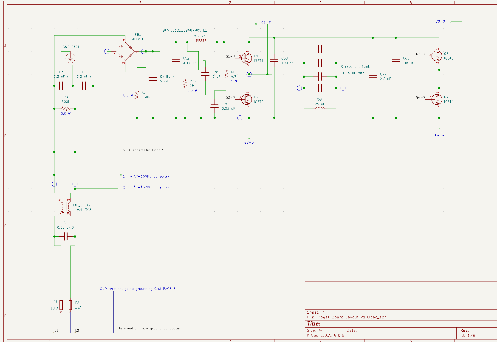
        **Figure 1, AC main -> Rectified DC bus -> Inverter

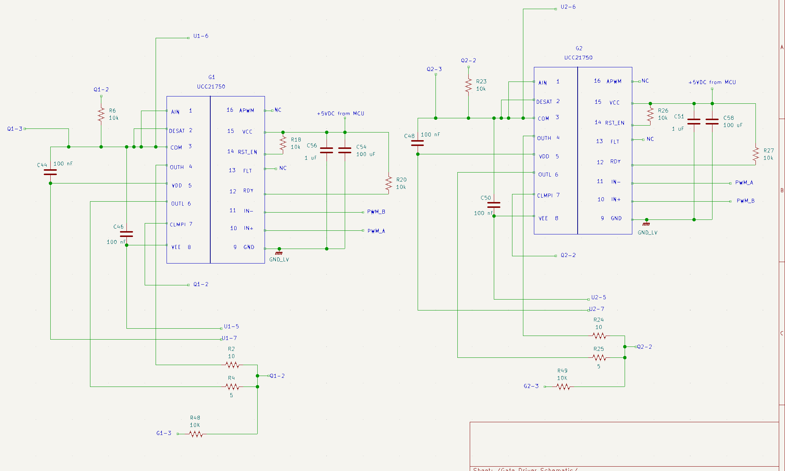
        **Figure 2, Gate Driver IC's for IGBT 1 and 2.

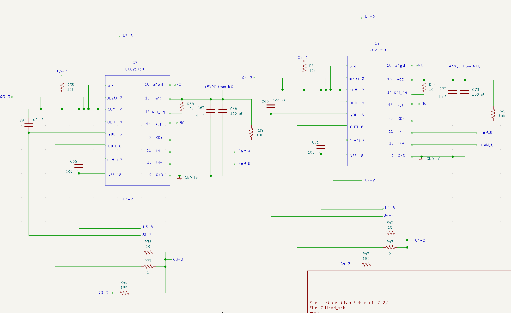
        **Figure 3, Gate Driver IC's for IGBT 3 and 4.

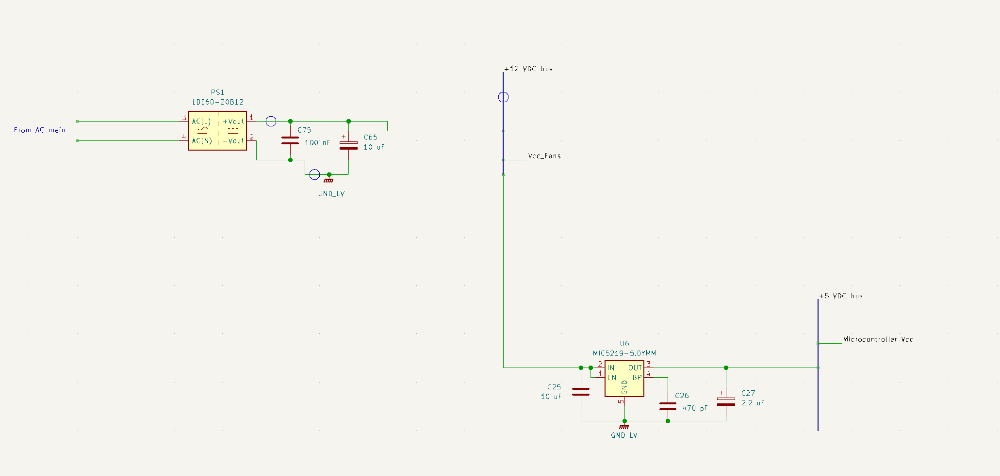
        **Figure 4, Branch conversion for DC buses.

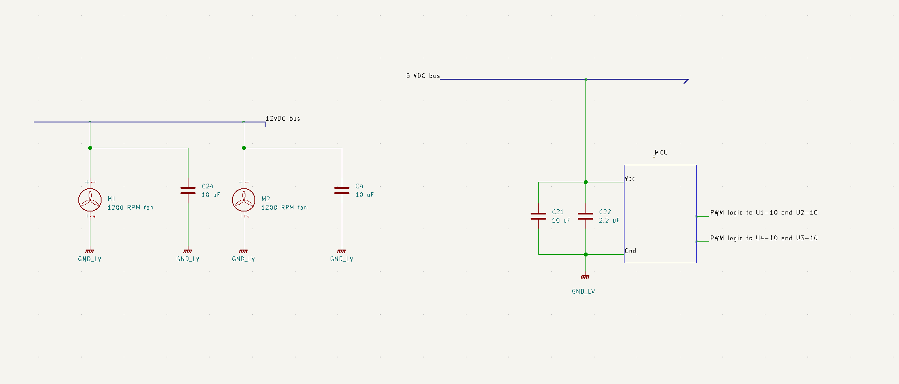
        **Figure 5, DC bus routing to small loads.

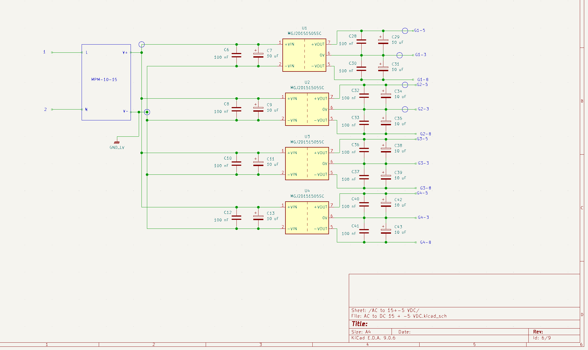
        **Figure 6, AC conversion to DC for Gate Driver IC operation.

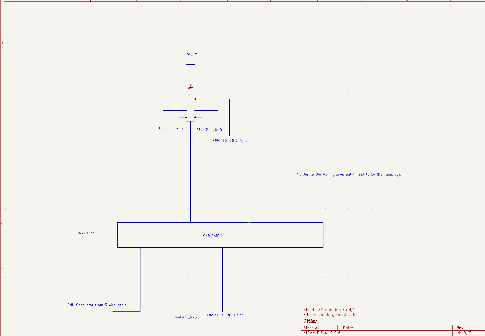
        **Figure 7, Grounding Grid layout.

## BOM

This Section will detail ALL of the necessary information to acquire all components shown in the schematic section above.

| Components         | Manufacturer |  Part#      | Distributor | Dist. Part# | Qty. | Price |  Link |
| ------------------ | ------------ | ----------- | ----------- | ---------- | ---- | ----   | ----- |           
| FB1                |  Panjit      | GBJ3510     | Mouser Electronics | 241-GBJ3510_T0_00601 |1| $2.27 |[mouser.com](https://www.mouser.com/c/semiconductors/discrete-semiconductors/diodes-rectifiers/bridge-rectifiers/?q=GBJ3510 )|       
| Q1,Q2,Q3,Q4        |  ROHM        | RGW80TS65DGC13 | Mouser Electronics | 755-RGW80TS65DGC13 |4|$6.24 | [mouser.com](https://www.mouser.com/ProductDetail/ROHM-Semiconductor/RGW80TS65DGC13?qs=dbcCsuKDzFUOUanxGPiR5w%3D%3D)|
| G1,G2,G3,G4        | Texas Instruments | UCC21750 | Mouser Electronics |595-UCC21750DWR |4 | $4.55|[mouser.com](https://www.mouser.com/ProductDetail/Texas-Instruments/UCC21750DWR?qs=2WXlatMagcGW8IDFLYjShA%3D%3D )|                                                         
| U1,U2,U3,U4  | MURATA | MGJ2D151505SC | Mouser Electronics |580-MGJ2D151505SC| 4 |$8.46 |[mouser.com](https://www.mouser.com/ProductDetail/Murata-Power-Solutions/MGJ2D151505SC?qs=xLDY6iXSiQYIfXYEkf8RzA%3D%3D )|          
|MPM-10-15| MEAN WELL| MPM-10-15 | Mouser Electronics| 709-MPM10-15|  1 | $10.10| [mouser.com](https://www.mouser.com/ProductDetail/MEAN-WELL/MPM-10-15?qs=xhbEVWpZdWesTikav2ic2A%3D%3D)|                             
| U6  | Microchip Technology |  MIC5219-5.0YMM  | Mouser Electronics | 998-MIC5219-5.0YMM | 1 | $1.56|[mouser.com](https://www.mouser.com/ProductDetail/Microchip-Technology/MIC5219-5.0YMM?qs=kh6iOki%2FeLGcAZQ4JCOeow%3D%3D)|    
| C1 | KEMET| R46KN410045N1K | Mouser Electronics     |    80-R46KN410045N1K |1|$1.47|[mouser.com](https://www.mouser.com/ProductDetail/KEMET/R46KN410045N1K?qs=sGAEpiMZZMsh%252B1woXyUXj4OxC4raikkmeB%2FwhDzdQF8%3D)|                         
| C2,C3 | KEMET| R46KN347000S0K | Mouser Electronics|  80-R46KN347000S0K |2 |$3.36 |[mouser.com](https://www.mouser.com/ProductDetail/KEMET/R46KN347000S0K?qs=zsw%2FKduBDDCxrxFscGQ5uQ%3D%3D)|        
| C49 |EPCOS - TDK Electronics|B32676E6205K000 |  Digikey|495-2967-ND | 1  |$3.49| [digikey.com](https://www.digikey.com/en/products/detail/epcos-tdk-electronics/B32676E6205K000/1277731?s=N4IgTCBcDaIEIGYwDYDsyCiywAYCsA0jsSALoC%2BQA )|    
| C53,C56 |Panasonic Electronic Components| ECW-FE2J104PD| Digikey |P124888-ND |2 |$1.48 | [digikey.com](https://www.digikey.com/en/products/detail/panasonic-electronic-components/ECW-FE2J104PD/10292125?gclid=52232bb22e4e1d00d749429b369ded47&gclsrc=3p.ds&msclkid=52232bb22e4e1d00d749429b369ded47)|  
|  C4_Bank | Vishay / Sprague | TVA1703| Mouser Electronics |75-TVA1703 | 1 | $7.81 | [mouser.com](https://www.mouser.com/ProductDetail/Vishay-Sprague/TVA1703?qs=Jc0vmPlqnSzO64EtNsmyOw%3D%3D)| 
| C52| Nichicon | UVR2WR47MPD1TA |Mouser Electronics |647-UVR2WR47MPD1TA |1 |$0.27 |[mouser.com](https://www.mouser.com/ProductDetail/Nichicon/UVR2WR47MPD1TA?qs=sGAEpiMZZMvwFf0viD3Y3bXvgfG2gej7dC5wqpdmRvg7M7%252BgfNUw5Q%3D%3D )| 
|C_resonant_bank |WIMA |MKP10-.22/630/5P22  | Mouser Electronics |505-MKP10-.226305P22 |4 |$1.88 |[mouser.com](https://www.mouser.com/ProductDetail/WIMA/MKP10-22-630-5P22?qs=FsJ%2FjdNESOVRKe%2FLwIXG3Q%3D%3D&mgh=1&utm_source=chatgpt.com)|         
|R1  | YAGEO |   RSF50SJT-52-330K|  Mouser Electronics|603-RSF50SJT-52-330K |1 |$0.18 |[mouser.com](https://www.mouser.com/ProductDetail/YAGEO/RSF50SJT-52-330K?qs=sGAEpiMZZMtlubZbdhIBIMMVXX%252BgggzkwMlyWq3j6Pk%3D )|  
| R9 |  Bourns  | 3362U-1-504RLF  | Mouser Electronics |652-3362U-1-504RLF |1 |$2.05 |[mouser.com](https://www.mouser.com/ProductDetail/Bourns/3362U-1-504RLF?qs=sGAEpiMZZMtlubZbdhIBIAQM2Qjzi%2FAyAEPNZgNnw3U%3D )|
| R22 | Bourns | PV32H105A01B00| Mouser Electronics | 81-PV32H105A01B00 |1 |$2.59|[mouser.com](https://www.mouser.com/ProductDetail/Bourns/PV32H105A01B00?qs=sGAEpiMZZMtlubZbdhIBIIiZvkqlAA9uzG1McxUFrHs%3D )|
|EMI_Choke| KEMET |SC-30-E100 | Digikey|399-SC-30-E100-ND |1 |$15.13 |[digikey.com](https://www.digikey.com/en/products/detail/kemet/SC-30-E100/10385065 )|
|C44,C46,C50,C48,C69,C64,C66,C71,C6,C8,C10,C12,C28,C30,C32,C33,C36,C37,C40,C41,C75|Murata Electronics |RDER71E104K0P1H03B|Digikey| 490-8809-ND| 20 | $5.40 |[digikey.com](https://www.digikey.com/en/products/detail/murata-electronics/RDER71E104K0P1H03B/4770964?s=N4IgTCBcDaIEoBECicDsBGJ6AMAWA0tgAroAS2AzAEIAEIAugL5A )| 
| C56,C51,C72,C67 |TDK Corporation|FG18X7R1E105KRT06  | Digikey|445-173261-1-ND - Cut Tape (CT) |4 | $1.20 |[digikey.com](https://www.digikey.com/en/products/detail/tdk-corporation/FG18X7R1E105KRT06/5802875)| 
|C29,C31,C34,C35,C38,C39,C42,C43,C13,C11,C9,C7,C23,C24,C4,C21,C65 | Panasonic Electronic Components|ECA-1EM100|Digikey| P5148-ND|18 | $2.61 |[digikey.com](https://www.digikey.com/en/products/detail/panasonic-electronic-components/ECA-1EM100/245007?s=N4IgTCBcDaIKIGECChEAgIxwLJoAw5ALoC%2BQA )|    
| C19 |KEMET  |C322C471K3G5TA |Digikey|399-C322C471K3G5TA-ND |1 |$0.38|[digikey.com](https://www.digikey.com/en/products/detail/kemet/C322C471K3G5TA/6656585 )|
| C20,C22 |TDK Corporation |FG18X5R1E225KRT06|Digikey|445-173253-1-ND - Cut Tape (CT) |2 |$0.64|[digikey.com](https://www.digikey.com/en/products/detail/tdk-corporation/FG18X5R1E225KRT06/5802867 )|
| R6,R18,R23,R26,R27,R20,R35,R38,R39,R41,R44,R45,R46,R47,R48,R49 | Stackpole Electronics Inc|CF14JT10K0|Digikey|CF14JT10K0CT-ND|16 |$0.50|[digikey.com](https://www.digikey.com/en/products/detail/stackpole-electronics-inc/CF14JT10K0/1741265)|
| L1 | Pulse Electronics | BFSI001211094R7M05 | Digikey | 553-BFSI001211094R7M05CT-ND - Cut Tape (CT) | 1 | $1.27 | [digikey.com](https://www.digikey.com/en/products/detail/pulse-electronics/BFSI001211094R7M05/16510826)  |
| C74 |KEMET |F861DU225M310R | Digikey |399-F861DU225M310RCT-ND |1 |$2.62 |[digikey.com](https://www.digikey.com/en/products/detail/kemet/F861DU225M310R/18144023) |
| PS1|Mornsun America, LLC |LDE60-20B12 |Digikey |2725-LDE60-20B12-ND |1 |$8.86 |[digikey.com](https://www.digikey.com/en/products/detail/mornsun-america-llc/LDE60-20B12/13168172?s=N4IgTCBcDaIDIBECiA2ADAWjGgQgRggF0BfIA) |
|R8 |Ohmite |WNE5R0FET |Digikey |WNE5R0FETCT-ND |1 |$2.27 |[digikey.com](https://www.digikey.com/en/products/detail/ohmite/WNE5R0FET/3114558) |
|C70 |EPCOS - TDK Electronics |B32922C3224M289 |Digikey |495-B32922C3224M289CT-ND |1 |$0.59 |[digikey.com](https://www.digikey.com/en/products/detail/epcos-tdk-electronics/B32922C3224M289/2504694) |
|R2,R24,R42,R36 |Stackpole Electronics Inc |CF12JT10R0 |Digikey |CF12JT10R0CT-ND |4 | $0.10 |[digikey.com](https://www.digikey.com/en/products/detail/stackpole-electronics-inc/CF12JT10R0/1741018) |
|R43,R37,R4,R25|Ohmite |WHA5R0FET |Digikey |WHA5R0FECT-ND |4 |1.85 |[digikey.com](https://www.digikey.com/en/products/detail/ohmite/WHA5R0FET/678818) |
|F1,F2 |OptiFuse |FSC-18A |Digikey |2298-FSC-18A-ND |2 |$0.88 |[Digikey.com](https://www.digikey.com/en/products/detail/optifuse/FSC-18A/12089887) |
|-------------------|--------------|------------------|-------------|-----------|-------|-------|--------------|
|Total: $174.30 |

## Power Budgeting
The power budget tables are here to note the normal operation maximums of the components in the system, as well as detailing the expected power losses of components that have a significant impact on the efficiency of the system. Table 1 details the power consumption of the system components.  Table 2 details the power losses of the system.

Table 1:

| Components          | Power Consumption (Watts) |        
| ------------------ | ------------ | 
| Fans x 2           | 6             |  
| MCU                | 1             | 
| Pipe Workpiece     | 1600          | 
| Total              | 1607          |

Table 2 below details the estimated losses of the power subsystem.

| Components          | Power Loss (Watts) |        
| ------------------ | ------------ |
| FB1                | 77            |
| Q1,Q2,Q3,Q4        | 100           |
| G1,G2,G3,G4        | 1.5           |  
| U1,U2,U3,U4        | 0.25          |  
| MPM-10-15          | 0.35          |   
| U6                 |  1            |  
| Bleed Resistors    |  1.5          |
| Tank Coil Copper Loss |  20        |
| Total              |  221.36       |

Efficiency of system:   (Load_Power / Input_Power) * 100

        Input Power = Table 1 total + Table 2 total

        
Efficiency will be around 90%

IF the power dissipation of the transistors was a datasheet worst, then the system efficiency would drop to 82%.

## Analysis

The presented induction-heater power system integrates AC input conditioning, high-voltage DC rectification, a full-bridge resonant inverter, fully isolated gate-driver subsystems, and multiple auxiliary low-voltage supplies into a cohesive, robust architecture capable of delivering approximately 1.7 kW of power into a resonant LC heating network. The design begins at the 120 VAC input, where a pair of 18 A line fuses establishes the primary over-current protection boundary. Immediately downstream, the EMI line filter—composed of a 1 mH/30 A common-mode choke and an across-the-line differential capacitor—reduces both common- and differential-mode conducted emissions generated by the high-frequency switching. This filtering stage is critical for compliance with electromagnetic interference regulations and for protecting upstream mains wiring from high-frequency harmonic content. After filtering, the AC line is intentionally branched into three independent paths: a main rectification line that feeds the high-power inverter, a path that supplies an isolated 15 V AC-DC conversion stage, and a high-voltage DC branch that feeds a flyback converter responsible for generating the 12 V and 5 V low-voltage system rails. Branching at the AC stage ensures that the auxiliary systems—namely the gate-drive supplies, the microcontroller, and cooling fans—do not introduce load perturbations onto the resonant DC bus, which preserves inverter stability and improves overall system reliability.

The main power stage rectifies the filtered AC through a GBJ3510 35 A, 1000 V bridge rectifier [5], providing a nominal 169 V DC bus under 120 VAC input. Due to real life voltage drops from filtering and rectification, DC bus voltage will be more in the 167 VDC range. This component is appropriately rated for the anticipated 12-15 A DC current range associated with a 1.7 kW load, and its surge current capability offers margin for capacitor charging and transient events. The rectifier output feeds a multi-stage DC-link network consisting of a 5 mF bulk capacitor, a 5 uH/20 A series inductor, and several high-frequency film and ceramic decoupling capacitors positioned close to the inverter bridge. This network fulfills two roles: first, it attenuates the 120 Hz ripple inherent to rectified mains; second, it provides a tightly-coupled energy reservoir for the high-frequency switching currents demanded by the full-bridge inverter. The combination of bulk capacitance, film capacitors, and ceramic capacitors is standard practice in high-power converter design, as it simultaneously supports slow-timescale load transients, medium-frequency ripple, and extremely fast switching edges. Bleeder resistors across both the DC-bus electrolytics and the EMI capacitors ensure that stored energy safely dissipates after shutdown, improving maintenance safety and preventing shock hazards. The following figures below are placed to show why proper capacitive filtering is needed.

        **Figure 8, No smoothing Capacitor on DC mains.
 
        **Figure 9, Smoothing Capacitor on DC mains.

At the center of the design is the full-bridge inverter composed of four high-voltage IGBTs [6] arranged in a standard H-bridge topology. This inverter is responsible for generating the high-frequency bipolar AC waveform that excites the resonant heating tank. The inverter midpoints feed a parallel LC resonant network consisting of a 25 µH induction coil and a capacitor bank totaling approximately 1.16 µF. The actual inductance of the coil will be able to be tuned in real life to achieve resonance with the capacitance value. This parallel configuration produces a resonant frequency around 30 kHz and presents a high impedance at resonance, which naturally limits inverter current even as coil current becomes large. Such behavior is advantageous in induction-heating applications, which often demand high circulating currents at the load but moderate bus currents at the switching bridge. The use of localized high-frequency decoupling capacitors across each half-bridge minimizes voltage overshoot due to parasitic inductance and improves switching performance. Collectively, these measures ensure the inverter can reliably operate at the required switching frequency while controlling switching losses, limiting electromagnetic emissions, and maintaining stable resonant operation.

The gate-driver topology is designed with particular attention to safety, isolation integrity, and transient immunity. Each IGBT is driven by a dedicated UCC21750 isolated gate-driver IC, powered by its own fully isolated 15 V DC supply derived from Murata MGJ2D151505SC modules [9]. This structure provides four distinct isolated drive domains, preventing cross-talk between high-side and low-side devices and ensuring that each IGBT gate is referenced cleanly to its own emitter node, which is essential in a full-bridge inverter where both high-side devices experience rapid dv/dt at their gate-drive reference. The UCC21750 [7] devices incorporate desaturation protection, fault-reporting, and Miller-clamp functionality, enabling controlled shutdown during short-circuit or fault events and preventing false turn-on during high-frequency switching transients. Each driver is further supported by local ceramic decoupling capacitors, selected gate resistances, and single-point logic grounding, forming a noise-resilient and electrically robust control interface to the inverter.

The auxiliary power architecture provides clean, stable low-voltage rails necessary for system control and thermal management. An LDE60-20B12 AC-DC converter [8] generates a regulated 12 V rail used to drive the forced-air cooling fans. With a max power output of 60 Watts and max current draw this component will be able to supply our DC loads without fear of overload. This power supply is well-suited for high-voltage, isolated bias generation and incorporates  isolation to ensure the logic subsystem is electrically separated from the high-voltage domain. A MIC5219 low-dropout regulator [11] derives a stable, low-noise 5 V rail for the microcontroller and logic circuits, with appropriate output filtering to minimize ripple and ensure digital-signal integrity. The totality of the auxiliary supply chain is electrically and physically segregated from the gate-drive islands, reducing noise coupling and ensuring stable operation even during high-power switching events.

Thermally, the design incorporates fans driven directly from the auxiliary supply, providing forced airflow over the IGBTs, rectifier, and choke assembly. Given expected DC-bus currents near 12 A and switching losses associated with tens of kilohertz operation, enforced convection cooling is essential to maintain semiconductor junction temperatures within safe operating limits. Component ratings—including the 35 A bridge rectifier, 20 A Inductor, 40 A IGBT switches, and 18 A input fuses are selected with deliberate headroom to improve thermal survivability and long-term reliability under sustained load.

Overall, the system architecture demonstrates a disciplined application of power-electronics design principles. The AC input filtering and protective devices satisfy safety and EMC constraints, the DC-bus network provides a stable high-voltage energy reservoir, and the full-bridge inverter with a parallel resonant tank is suited for delivering high circulating current to an induction coil with controlled bus stress. The use of isolated gate drivers with independent floating power domains ensures correct gate-emitter referencing and protects the logic subsystem from high dv/dt environments. The auxiliary supplies are well-segregated and capable of powering the control electronics independently from the resonant stage. With proper PCB layout and heatsinking, the design is well-positioned to achieve the intended performance objectives, meet electrical and thermal constraints, and operate safely and reliably as a high-frequency induction-heating power platform.

See reference [12] to learn more on the full bridge inverter topology that is utilized in this design.

#### Testing

The success of this project includes the ability to test and monitor critical values that determine the operating characteristics of the system. There are 3 main categories that are to be analyzed. Thermal, Power and Standards compliance.

##### Thermal
 
 This system has intelligence implemented by a microcontroller. In other words, there are thermocouples in place around critical pieces of equipment, and also the enclosure of the electronics to send signals back to the MCU for informational processing. From there, the programming can authorize the system to begin countermeasures to regulate heat generation at the load, as well as internally. Likewise, an information readout will be sent to the LCD screen. 

 For more information regarding thermal, please see the detailed designs of Heat Generation and Safety Protections and Controls.

 ##### Power

For the testing of the power aspect of the system. The utilization of differential lab probes, oscilloscopes, and handheld multimeters will be used to measure the voltage and current waveforms of the power signals along different test points on the PCB. From there, measurements of the voltage and currents (AC or DC) will then be used with mathematical manipulation to give insight on the different power types inside the system. These different powers include Real, Reactive, and Apparent. Methods such as Short and Open circuit testing will be used also. Physically, the use of a rated voltage level VARIAC will be able to provide different voltage levels that can be used to test system correctness at low levels to help avoid damage to components that would elsewise be destroyed at full power. 

##### Standards Compliance

From the information obtained from thermal and power measurement testing, the regulations that this project will abide by can be carefully compared with the information from the tests conducted on the PCB. Hence, standards compliance can be ensured.

## References

[1] International Electrotechnical Commission. (2024). IEC CISPR 11:2024 — Industrial, scientific and medical equipment – Radio-frequency disturbance characteristics – Limits and methods of measurement. IEC. 

[2] National Electrical Code (NEC) 2023. NFPA, Article 250, Sec. 250.4(A)(3), National Fire Protection Association, 2023.
[3] National Electrical Code (NEC) 2023. NFPA, Article 422, Sec. 422.10(A), National Fire Protection Association, 2023.
[4] Kolla, S. R., and M. K. Kazimierczuk. “Analysis and Design of High-Frequency Series-Resonant Inverters for Induction Heating.” IEEE Transactions on Power Electronics, vol. 21, no. 5, 2006, pp. 1313–1321.

[5] Panjit International Inc., GBJ3510 Glass Passivated Bridge Rectifier (GBJ-2) Datasheet, Feb. 2025. [Online]. Available: https://www.mouser.com/datasheet/3/3736/1/GBJ3510.pdf
. [Accessed: 28-Nov-2025].

[6] ROHM Semiconductor, RGW80TS65DGC13 Field-Stop Trench IGBT Datasheet. [Online]. Available: https://www.mouser.com/ProductDetail/ROHM-Semiconductor/RGW80TS65DGC13?qs=dbcCsuKDzFUOUanxGPiR5w%3D%3D
. [Accessed: 28-Nov-2025].

[7] Mouser Electronics, Galvanically Isolated Gate Drivers – Product Category Page. [Online]. Available: https://www.mouser.com/c/semiconductors/power-management-ics/galvanically-isolated-gate-drivers/?q=UCC21750
. [Accessed: 28-Nov-2025].

[8] MORNSUN Power GmbH. LDE60-20Bxx Series AC/DC Converter, 60 W. Datasheet, MORNSUN,
https://www.mornsun-power.com/html/pdf/LDE60-20Bxx.pdf
.

[9] Murata Power Solutions, MGJ2D151505SC 2W Isolated DC/DC Converter – Product Page. [Online]. Available: https://www.mouser.com/ProductDetail/Murata-Power-Solutions/MGJ2D151505SC?qs=xLDY6iXSiQYIfXYEkf8RzA%3D%3D
. [Accessed: 28-Nov-2025].

[10] MEAN WELL, MPM-10-15 10 W AC-DC Converter Module – Product Page, Mouser Electronics. [Online]. Available: https://www.mouser.com/ProductDetail/MEAN-WELL/MPM-10-15?qs=xhbEVWpZdWesTikav2ic2A%3D%3D
. [Accessed: 28-Nov-2025].

[11] Microchip Technology, MIC5219-2.9YM5-TR Low-Dropout Voltage Regulator – Product Page. [Online]. Available: https://www.mouser.com/ProductDetail/Microchip-Technology/MIC5219-2.9YM5-TR?qs=U6T8BxXiZAUu28ZTWpa0Sw%3D%3D
. [Accessed: 28-Nov-2025].

[12] S. Abdel-Rahman, Resonant LLC Converter: Operation and Design, Application Note AN 2012-09, V1.0, Infineon Technologies, Sep. 2012. [Online]. Available: https://www.infineon.com/assets/row/public/documents/24/42/infineon-design-example-resonant-llc-converter-operation-and-design-applicationnotes-en.pdf

# 3. b. Detailed Design Safety and Protections Subsystem 

## Function of the Subsystem

The Safety and Protection Controls subsystem is responsible for ensuring the induction heater operates within safe limits, protecting both the user from harm and the device from hardware damage. This system functions continuously in the background, monitoring critical signals such as temperature and current.

If any signal exceeds a predefined safe limit, this subsystem will trigger a fault state, shut down heating operations, and provide a specific error code to the user via the embedded system's LCD screen. It is the primary subsystem responsible for enforcing the constraints set by ethical, professional, and industry standards like the NEC. including NEC Article 665 and 427. Along with this, this subsystem includes the design of a grounded aluminum electronics housing to ensure electrical safety, EMI shielding, and leak prevention.

## Specifications and Constraints

The subsystem's design is governed by the following specifications, which are derived from customer requirements, standards compliance, and analysis of existing hardware:
1. **IGBT Monitoring**: The subsystem shall continuously monitor the temperature of the power switching transistors' (IGBT) heatsink using a dedicated thermocouple.
2. **IGBT Thermal Shutdown**: The subsystem shall shut down induction heating if the IGBT heatsink temperature exceeds $105^\circ\text{C}$ ($\text{221}^\circ\text{F}$).
3. **Current Monitoring**: The subsystem shall Continuously monitor total current draw (LEM HO 15-NP) from the device [1].
4. **Overcurrent Shutdown**: The subsystem shall trigger a system shutdown if the current draw exceeds the rated amperage of a standard 20A circuit.
5. **IGBT Desaturation Protection**: The subsystem shall include hardware-based Insulated Gate Bipolar Transistor (IGBT) desaturation detection that trips a shutdown latch within 5-20 microseconds of a fault.
6. **Ground Fault Protection**: The subsystem shall limit ground fault current such that no more than 50 volts appears on any accessible metal part, per NEC Article 665.
7. **Disconnect Switch**: The "Off" switch shall physically open all ungrounded conductors, ensuring no power can be supplied to the heating coil, per NEC Article 427.
8. **Workpiece Detection**: The subsystem shall prevent the induction coil from energizing if a compatible workpiece, like the steel pipe, is not detected.
9.   **User Notification**: Upon detecting any fault condition, the subsystem shall provide a specific error code to the user display.
10.  **Fault State Latching**: Once a fault state is triggered (either by software or hardware), the subsystem shall remain in a safe, non-operational mode until the user performs a manual power cycle.
11. **Flow Rate Minimum**: Enforce a minimum water flow rate of 1.5 LPM to prevent boiling as well as potential overheating of pipe.
12. **EMI/RFI Shielding**: Utilize a grounded aluminum enclosure to contain high-frequency noise and protect control electronics [9].

## Overview of Proposed Solution

The proposed solution is a hybrid software and hardware design to ensure continuous protection.

 - **Software Controls**: 
The microcontroller will be the primary brain for monitoring slow-moving fault conditions. It will continuously read and condition signals from sensors for total current draw, IGBT heatsink temperature, and water flow. 
    - **Workpiece Detection:** The system performs a 50ms "detection test." The MCU will generate a low-pulse signal and measure the AC current in the resonant tank. Since an empty coil has low series resistance, the software samples the current via the LEM HO 15-NP. If current is below the "No-Load Threshold," operation is blocked.
    - **Water Flow:** A Hall-Effect-based flow sensor outputs a digital pulse train. The microcontroller will use an external interrupt pin to count these pulses over a time interval and calculate the flow rate in Liters Per Minute (LPM).
    - **Current Monitoring:** The system will use two current sensors,the HO 15-NP, to fulfill two different roles. One sensor will read in the input current from the high-side of the DC rail after the bulk capacitor bank before the H-Bridge inverter. This sensor will detect any overcurrents and will keep the system limited to the 20A threshold. The second sensor will monitor the current through the resonant capacitor bank to detemrine power delivery to the coil as well as be used for workpiece sensing.
    - **A Shutdown Event:** If any fault condition is met (thermal, flow, or prolonged over-current), the software will:

       - Immediately send a digital interrupt to the Heat Generation Control subsystem to stop PWM signal generation.

       - Send a specific error code to the Embedded System (PCB) to be displayed on the LCD screen.

       - Enter a latched fault state that requires a manual reset.

 - **Hardware Controls**: For fast-moving catastrophic events, such as an IGBT desaturation or a severe over-current event, a dedicated hardware latch will be implemented. This circuit will operate in parallel with the microcontroller.

     - **Desaturation Latch:** The DESAT (desaturation) pin on each of the four UCC21750 gate drivers will monitor its respective IGBT's collector voltage [2]. If the collector voltage rises excessively while the gate is high (a desaturation event), the driver will immediately pull its FLT (Fault) pin low. This signal will trip an SCR (Silicon Controlled Rectifier) [4], which will immediately pull the RST_EN (Reset/Enable) pin of all gate drivers low, disabling them and placing them in a safe, non-operational state. A physical "OFF" switch will be wired in parallel with this SCR to provide a manual hardware override. This hardware latch will also be tied to the microcontroller's fault state, ensuring the system software is aware of the shutdown.
     - **IGBT Temperature:** The temperature of the IGBT heatsink is provided by a K-Type Thermocouple connected through the MAX31856 amplifier. It features a dedicated FAULT pin and internal registers that detect if the thermocouple is shorted to VCC/GND or if the wire is broken. This thermocouple will be threaded and screwed on to the heatsink to ensure a proper connection to the heatsink. 

This combined approach provides the flexibility of software for general monitoring and the microsecond-level detection of a hardware latch to prevent catastrophic IGBT failure.

### Enclosure
The proposed enclosure utilizes a robust aluminum chassis to meet the functional requirements of housing sensitive electronics while rigorously adhering to safety standards, specifically NEC mandates.

- **Primary Enclosure Material:** While the original plan referenced a non-conductive polycarbonate housing for electrical safety, we propose using an aluminum enclosure for its superior performance characteristics, which significantly enhance system reliability:
  - **EMI/RFI Shielding:** Aluminum provides excellent containment of the high-frequency electrical noise generated by the induction heating process, ensuring the sensitive control electronics are protected from interference [9].
  - **Thermal and Mechanical Strength:** The material offers high mechanical durability and acts as a beneficial element in the system's thermal management plan.
  
  **Mitigation of Conductivity:** To safely utilize the conductive aluminum, the chassis will be bonded to earth ground to comply with NEC Article 665 [9], eliminating shock hazards. Furthermore, all power electronics (IGBTs, heatsink, DC bus capacitors) will be mounted either on a separate, non-conductive substrate (thick fiberglass) or isolated from the chassis using electrically insulating thermal pads and bushings.

#### Safety Aspects
The design incorporates redundant safety features focused on compliance and water resistance:

**Electrical Disconnect and Latching:** The mandatory manual "OFF" switch (which performs a hard shutdown by pulling the RST_EN line low) will be externally mounted and clearly marked. Additionally, a main circuit breaker/disconnect switch will be installed at the power entry point, physically opening all ungrounded conductors as required by NEC Article 427.
**Grounding Integrity:** A heavy-gauge copper wire will be used to create a reliable bond between the aluminum enclosure chassis and the incoming AC power cord's earth ground pin [9], ensuring immediate fault current interruption.  

**Wet/Dry Compartmentalization:** The enclosure will be seperated by a solid internal barrier to create two electrically isolated zones:
  - **Power Zone:** This area houses all of the power electronics as well as the induction coil connections. 
  - **Control Zone:** This area houses the low-voltage control PCB and sensing electronics. The water flow sensor cable will pass between zones only through a sealed connection[10].
  
All connectors entering the enclosure will be watertight to prevent fluid migration. [10].

#### Enclosure Thermal Management
Using the following methods, the enclosure is designed to efficiently remove the heat from the IGBT heatsink.
- **Heatsink Integration:** The IGBT heatsink will be mounted to the enclosure wall to use the entire aluminum chassis as a secondary heat sink [11]. This mounting requires two specific steps:
  1. **Preparation:** The heatsink base must be drilled and tapped to secure the four IGBT modules.
   2. **Joining the Wall and Heatsink**: A custom aluminum bracket will be used, along with thermal paste, to thermally and mechanically couple the heatsink base (from the bottom of the enclosure) to the adjacent vertical chassis wall, ensuring efficient heat transfer to the larger cooling surface.
- **Active Cooling and Venting:** Two well placed vents will ensure effective cooling: one vent will be positioned near the bottom of the enclosure to draw in cooler ambient air, and a second vent, assisted by a fan, will be located near the top to efficiently exhaust warmer air and maintain optimal internal operating temperatures.

### Thermal Analysis and Safety

#### Pipe Thermal Cooling
The Power Subsystem identifies a 20W copper loss in the tank coil and 1.6 kW delivered to the steel pipe. To prevent the water inside the pipe from boiling, the flow rate must be sufficient to remove the waste heat( approx 500W ).

Using the steady-flow thermal energy equation:
$$P_{total} = \dot{m} \cdot C_{p} \cdot \Delta T$$

Where:

$P_{total} \approx 500W$
$\dot{m} \approx 0.025\text{ kg/s (at 1.5 LPM)}$
$\Delta T = \text{ Temperature Rise }$
$C_{p} = \text{Specific Heat Capacity where water at room temp = 4184\text{ J/kg}}$ 

$$\Delta T = \frac{500\text{ W}}{0.025\text{ kg/s} \cdot 4184\text{ J/kg}\cdot^\circ\text{C}} \approx 4.8^\circ\text{C}$$

With a temperature rise of $4.8^\circ\text{C}$, a flow rate of 1.5LPM is sufficient in keeping the water in the pipe from boiling.

#### NEC Grounding Compliance

As the system does not utilize a traditional 20A mechanical circuit breaker for primary fault clearing, compliance focuses on Chassis Bonding and Safe Touch Voltage.
- **Chassis Bonding:** The aluminum enclosure is bonded to the AC Earth Ground using 10 AWG copper.
- **Fault Analysis:** In a fault, the HO 15-NP OCD pin trips at 39.45A. To keep the chassis voltage ($V_c$) below the NEC-mandated 50V, the total ground path impedance must be:$$R_g < \frac{50V}{39.45A} \approx 1.26 \Omega$$
  With 10 AWG copper wire and stainless steel star-washers, the measured ground-path resistance is $< 0.1 \Omega$. At the maximum hardware trip point of the HO 15-NP (39.45A), the maximum touch voltage is $39.45A \times 0.1\Omega = 3.945V$, which is well below the 50V limit."

## Interface with Other Subsystems

This subsystem acts as a central monitor and interfaces with nearly all other subsystems.

- **Power System**

  - **Input:**  Receives two 2.5V-biased AC voltage signal from the Current Sensor circuit (LEM HO 15-NP) [1]. These signals are fed into the microcontroller's ADC pin (PC2 and PC5)

  - **Input:** Receives an analog voltage from an AD8495 thermocouple amplifier, which corresponds to the IGBT heatsink temperature [3].

  - **Input:** Receives direct voltage feedback from the IGBT collectors for the UCC21750 desaturation detection circuits [2].

  - **Output:** Sends a hardware-level signal (from the SCR latch or manual "OFF" switch) to pull the RST_EN (Enable) line of all gate drivers low, disabling them [2].

- **Heat Generation Control**

  - **Input:** Receives temperature readings from thermocouples on the workpiece.

- **Water Heating System**

  - **Input:** Receives a digital signal proportional to the water flow rate.

- **Embedded System (Software & PCB)**

  - **Analog Output:** A linear voltage signal from the AD8495 Thermocouple Amplifier, directly proportional to the IGBT heatsink temperature. This signal is routed directly to the microcontroller's Analog-to-Digital Converter (ADC) input pin for software processing.
  - **Analog Output:** A 2.5V-biased AC voltage signal (from the LEM HO 15NPsensor). This signal is routed to a dedicated ADC input pin and requires the software to calculate RMS current and check for a 20A overcurrent condition over a 500ms duration. The 2.5V DC offset is trimmed using a potentiometer.
  - **Analog Output:** A 2.5V-biased AC voltage signal (from the LEM HO 15NPsensor). This signal is routed to a dedicated ADC input pin and requires the software to calculate RMS current and check for a 20A overcurrent condition over a 500ms duration.
  - **Digital Output:** A digital square wave pulse from the Hall-Effect flow sensor. This signal is routed to a Digital Input/External Interrupt pin for real-time frequency counting to determine the flow rate in LPM.
  - **Hardware Latch Status Output:** A Digital HIGH / LOW signal from the transistor Q1 on the latch circuit. This signal is routed to a Digital Input/Interrupt pin. A change in state indicates that a fast-moving fault (like IGBT desaturation) has occurred, the SCR has latched, and the system is in a hard shutdown state. This allows the software to confirm the hardware status and display the specific error code.

## 3D Model of Custom Mechanical Components

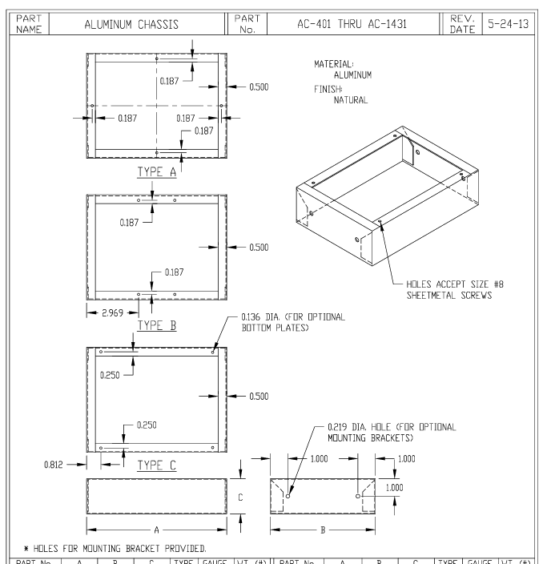
***Figure 1 - Datasheet for Enclosure Base that will be used and modified***

## Buildable Schematic 

The electrical schematics below detail the hardware safety circuits: the IGBT desaturation sensing circuits, the central hardware fault latch, the heatsink temperature sensor, and the AC current sensor.

### Specifications from Schematics
**Protections Latch**
The schematic is divided into two parts:
1.  **Desaturation Sensing:** The UCC21750 gate driver (G1-G4) provides a built-in DESAT pin (pin 2). This pin is connected to the collector of its respective IGBT (Q1-Q4) via a high-voltage, fast-recovery diode (D1-D4). The driver internally handles the blanking time, which is set by an external resistor (R4-R7) and capacitor (CX-C3) connected in parallel from the DESAT pin to that driver's isolated ground (COM) [5].

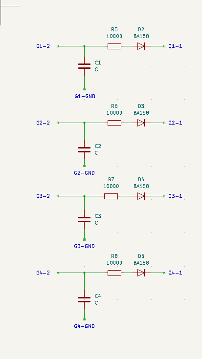

***Figure 2 - Desaturation Sensing Circuit***

2. **Hardware Fault Latch:** This circuit creates a physical "memory" of a fault and provides a manual "OFF" switch.
     - **Fault Trigger:** When any driver detects a desaturation event, its FLT pin (pin 13) is pulled low [5]. All four FLT pins are connected in parallel with a pull-up resistor (R1) to the +5VDC logic rail. This forms a single FAULT_LINE.
     - **Signal Inverter:** A SCR requires a positive voltage on its gate to trigger. The FAULT_LINE provides the opposite (a LOW signal), so it must be inverted. The FAULT_LINE is connected to the base of an NPN transistor (Q1) via a current-limiting resistor (R3). During normal operation, this transistor is held ON, keeping the SCR's gate at ground.
     - **Fault Latch:** When a fault pulls the FAULT_LINE LOW, Q1 turns OFF. This allows a pull-up resistor (R4) to send a HIGH signal to the Gate (pin 2) of the Silicon-Controlled Rectifier (SCR) (D2). The SCR latches ON.
     - **Shutdown Action:** The SCR's Anode (pin 1) is connected to the ENABLE_LINE (which is pulled up to +5VDC by R2 and connects to all RST_EN driver pins, pin 14). The SCR's Cathode (pin 3) is connected to GNDPWR. When the SCR latches on, it creates a direct short from the ENABLE_LINE to GNDPWR. This pulls all RST_EN pins low and instantly disables all four drivers.
     - **Manual Off Switch:** A standard SPST "OFF" switch is connected in parallel with the SCR (from the ENABLE_LINE to GNDPWR). When flipped, this switch performs the same action as the SCR, manually pulling the ENABLE_LINE low and disabling the drivers.
     - **Reset:** The only way to turn off the latched SCR is to interrupt its anode current. This is achieved when the user performs a manual power cycle, which fulfills the "Fault State Latching" specification.

***Figure 3 - Hardware Fault Latch***

References to the Power Systems Circuit are shown in Figure 4 (ie, Q1, ..., Q4, G1,..., G4).

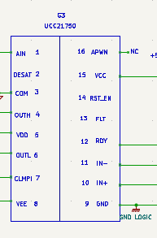
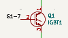

***Figure 4 & 5 - Power Systems Circuit***

**Sensor Interfaces**
The following circuits condition the sensor signals for the microcontroller's analog-to-digital converter (ADC).

  1. **Heatsink Temperature Sensor:** A K-Type ring-terminal thermocouple is bolted to the IGBT heatsink. Its small voltage output is fed into an AD8495 thermocouple amplifier. The amplifier is powered by +5VDC and outputs a clean, linear analog voltage (0V-5V) proportional to the temperature, which is fed directly into an ADC pin on the microcontroller [3].

  2. **AC Current Sensor:** The LEM HO 15-NP Hall-Effect Current Sensor is a self-contained unit that outputs a voltage proportional to the AC current. Its output is already centered around 2.5V when supplied with a 5V reference voltage, which is directly compatible with the microcontroller's ADC input [1].

## Printed Circuit Board Layout

## Flowchart

The operational logic of the Safety and Protections Controls Subsystem is detailed in the flowchart below. This flowchart primarily represents the software-based monitoring loop; the hardware latch operates in parallel to this loop.

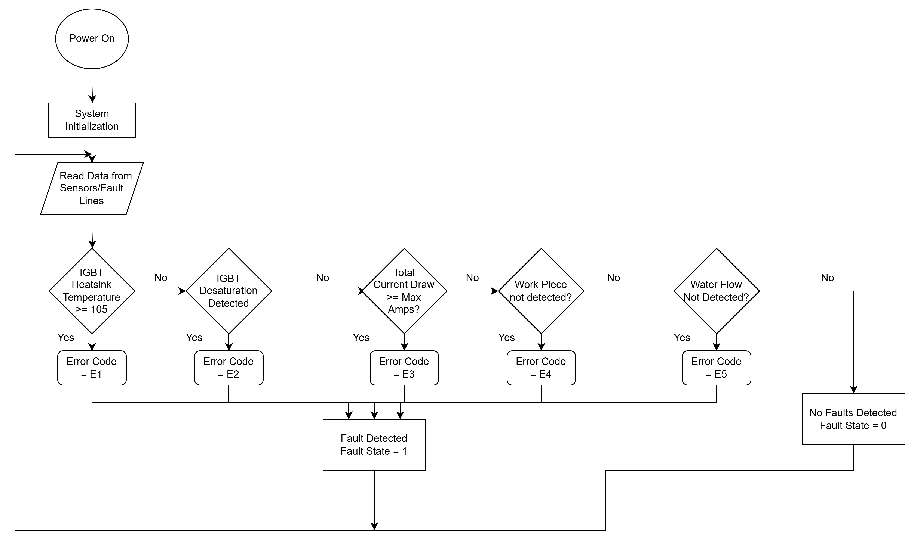

## BOM

*The following Bill of Materials includes only the discrete components required to implement the safety and sensing circuits discussed above. Components from the main power board or driver sheets (UCC21750 drivers) are listed for reference.*

| Component Name | Description | Manufacturer | Part Number | Distributor | Distributor P/N | Qty | Price (ea) | Total |
| :--- | :--- | :--- | :--- | :--- | :--- | :--- | :--- | :--- |
| **Desaturation Sensing (From Driver Sheet)** | | | | | | | | |
| D2, D3, D4, D5 | Diode, Ultrafast, 600V, 1A | onsemi | `MUR160GOS-ND` | Digi-Key | `MUR160G` | 4 | $0.23 | $0.92 |
| R5, R6, R7, R8 | Resistor, 10k $\Omega$, 1/4W | Yageo | `RC0603FR-0710KL` | Digi-Key | `13-RC0603FR-1075KLTR-ND` | 4 | $0.01 | $0.04 |
| N/A | Cap, 100nF, 50V, X7R | Yageo | `CC0603KRX7R9BB104` | Digi-Key | `311-1344-2-ND` | 2 | $0.08 | $0.16 |
| C1, C2, C3, C4| Cap, 220pF, 50V, X7R | Yageo | `C0603C104K5RACTU` | Digi-Key | `311-1344-2-ND` | 6 | $0.08 | $0.48 |
| **Hardware Fault Latch** | | | | | | | | |
| D1 | SCR, 600V, 800mA, 200µA Gate | onsemi | `MCR100-6G` | Digi-Key | `MCR100-6GOS-ND` | 1 | $0.34 | $0.34 |
| R1, R2, R4 | Resistor, 10k $\Omega$, 1/4W | Yageo | `RC0603FR-0710KL` | Digi-Key | `13-RC0603FR-1075KLTR-ND` | 3 | $0.01 | $0.03 |
| R3 | Resistor, 1k $\Omega$, 1/4W | Yageo | `RC0603FR-071KL` | Digi-Key | `13-RC0603FR-7W100RLTR-ND` | 1 | $0.01 | $0.01 |
| SW_OFF | Switch, Toggle | CIT | `	ANT11SECQE` | Digi-Key | `2449-ANT11SECQE-ND` | 1 | $1.94 | $1.94 |
| Disconnect | DBST Switch, Toggle | VCC | `		VTS-1-2Q4PPM-12SNN-0` | Digi-Key | `28-VTS-1-2Q4PPM-12SNN-0-ND` | 1 | $6.08 | $6.08 |
| Q1 | Transistor, NPN, 40V, 200mA | onsemi | `2N3904BU` | Digi-Key | `2N3904BU-ND` | 1 | $0.28 | $0.28 |
| **Heatsink Temp Sensor** | | | | | | | | |
| U1 | Thermocouple Amp | Adafruit Industries LLC | `3263` | Digi-Key | `1528-1772-ND` | 1 | $17.50 | $17.50 |
| TC1 | Thermocouple, K-Type, Bolt-On | McMASTER-CARR | `3648K24` | McMASTER-CARR | `3648K24` | 1 | $36.57 | $36.57 |
| **Current Sensors** | | | | | | | | |
| SEN-Current(1-2) | Current Sensor | LEM | `HO 15-NP` | Digi-Key | `398-1142-ND` | 2 | $11.35 | $22.70 |
| N/A | Cap, 0.1uF | Yageo | `CC0603KRX7R9BB104` | Digi-Key | `311-1344-2-ND` | 6 | $0.08 | $0.48 |
| **Flow Sensor** |See Embedded System |
| **Enclosure** | | | | | | | | |
| N/A | 10 AWG Grounding Wire (25ft) | Lowes | `5994007` | Lowes | `5994007` | 1 | $21.33 | $21.33 |
| N/A | #10 Thread Internal Tooth Washer| Lowes | `453906` | Lowes | `453906` | 1 | $1.48 | $1.48 |
| N/A | #10 Thread Flat Washer| Lowes | `336610` | Lowes | `336610 ` | 1 | $1.48 | $1.48 |
| N/A | #10 Thread Stainless Steel Bolt (4)| Lowes | `214015` | Lowes | `214015` | 1 | $2.78 | $2.78 |
| N/A | AC-428 | Bud Industries | `AC-428` | Digi-Key | `377-1031-ND` | 1 | $57.20 | $57.20 |
| N/A | BPA-1598 - Bottom Plate to AC-428 | Bud Industries | `BPA-1598` | Digi-Key | `377-1054-ND` | 1 | $19.90 | $19.90 |
| N/A | 510-6U - Aluminum Heatsink | Wakefield Thermal Solutions | `510-6U` | Digi-Key | `345-1200-ND` | 1 | $64.82 | $64.82 |
| N/A | TC3-1G Thermal Paste | Chip Quik Inc. | `TC3-1G` | Digi-Key | `315-TC3-1G-ND` | 2 | $5.95 | $11.90   |
| N/A | Insulating Shoulder Washer | Essentra Components | `MNI-M3-1.3` | Digi-Key | `MNI-M3-1.3-ND` | 5 | $0.304 | $1.52 |
| N/A | Mica Insulator for IGBT Isolation | Aavid | `56-77-9G` | Mouser | `532-56-77-9G` | 6 | $0.75 | $4.5 |
| N/A | Steel Pipe | Ferguson | `GBSPA106BD` | Ferguson | `GBSPA106BD` | 6ft | $3.29 | $19.74 |
| N/A | Fan | Orion Fans | `OD6025-12HSS` | Digi-Key | `1053-1238-ND` | 2 | $7.93 | $15.86 |
| N/A | Hose-Sink Adapter 3/4 to 3/4 | Lowes | `877063` | Lowes | `877063` | 1 | $6.94 | $6.94 |
| N/A | Hose to Flow 3/4 to 1/2 Female to Female | Lowes | `877217` | Lowes | `877217` | 1 | $11.34 | $11.34 |
| N/A | 1/2 to 1/2 Female to Female | Lowes | `877211` | Lowes | `877211` | 1 | $8.93 | $8.93 |
| N/A | 1/2 to 3/4 F to M | Lowes | `877205` | Lowes | `877205` | 1 | $8.09 | $8.09 |
| N/A | 15Ft Hose | Lowes | `2626706` | Lowes | `2626706` | 2 | $12.98 | $25.96 |
| N/A | Plumbers Tape | Lowes | `456833` | Lowes | `456833` | 1 | $1.48 | $1.48 |
| | | | | | **Subsystem Total:** | **$372.62** | |  |

## Analysis
The system employs a hybrid safety architecture; integrating a high-speed hardware latch with versatile software monitoring. This hybrid approach ensures protection against all identified failure modes, from slow thermal issues to catastrophic, microsecond-level component failures.

### Hardware Analysis
This sections is dedicated to rapid shutdown events that occur "faster than the clock" of the microcontroller, preventing catastrophic damage.
- **IGBT Desaturation Protection:** The dedicated hardware latch, triggered by the UCC21750's DESAT pin, is essential for microsecond-level detection of IGBT failure.
- **SCR Latching Mechanism:** The choice of the sensitive-gate SCR MCR100 provides the necessary "memory" of the fault. The $SCR latches ON when the fault TRIGGER signal goes high (after logic inversion by the NPN transistor Q1), immediately pulling the RST_EN line low and disabling all drivers. This fulfills the 'Fault State Latching' requirement, guaranteeing the system remains non-operational until a manual power cycle interrupts the SCR's anode current.
- **Manual Override:** The manual "OFF" switch wired in parallel with the SCR provides a critical, physical means of disabling the drivers, ensuring the "Off" state is a true, hardware-enforced shutdown, not just a software standby request. This also covers specification 7, where it will pull all of the gate drivers to ground.
- **Thermalcouple - Overheat Fault:** The MAX31856 Amplifier was chosen as it gives an explicit fault pin that is configurable. This allows us to monitor the following conditions:

  - Open Circuit: If the K-type thermocouple wire breaks or vibrates loose, the MAX31856 detects infinite impedance.

  - Short to Rail: If the insulation melts and the thermocouple shorts to the 120V lines, the chip detects the overvoltage.

  - Action Logic: In either case, the MAX31856 pulls its active-low FAULT pin to GND.

### Software Analysis
This section handles slower, environmental, and prolonged fault conditions by using the microcontroller's ADC and Digital interrupt capabilities.

The primary challenge in an induction heater is that the AC tank current is a reactive sine wave, while the power supply limit is a DC average. By using two current sensors:

- The first HO 15-NP provides a clean DC signal for power limit enforcement and short protection.

- The second HO 15-NP provides the high-frequency AC data needed for workpiece detection.

Finally, Water Flow is monitored using a Hall-Effect Flow Sensor. This sensor is beneficial as it provides a digital pulse train, eliminating the need for an ADC channel. The signal is routed to an External Interrupt pin, where the microcontroller accurately calculates the flow rate. This allows the software to enforce a shutdown if the flow rate drops below a minimum safety threshold for a prolonged period.

### Enclosure Design and Safety Compliance
The selection of a grounded aluminum enclosure is a safety-critical design decision driven by the need for EMI shielding and mechanical strength.
- **EMI/RFI Shielding:** The aluminum chassis acts as an effective Faraday cage, protecting sensitive control electronics from the high dV/dt noise inherent to induction heating [9].
- **NEC Compliance and Grounding:** Using conductive aluminum requires strict adherence to NEC Article 665. This is achieved by rigorously connecting the chassis to the earth ground pin [9] and isolating all high-voltage components (IGBTs) from the grounded chassis using insulating pads.
- **Environmental Safety:** The seperation of sections into a "Wet/Power Zone" and "Dry/Control Zone" is essential to prevent coolant leaks from contacting the PCB's, ensuring both electrical safety and device longevity.
- **Thermal Management:** The selection of the Wakefield 510-6U extruded aluminum heatsink and associated components is a critical engineering decision designed to meet the IGBT heatsink temperature limit. 
  - **High-Performance Heatsink:** The Wakefield 510-6U is specifically chosen for its low thermal resistance under forced air conditions. This heatsink is mounted to the large AC-428 aluminum chassis to utilize the enclosure wall as a secondary heatsink [11], maximizing passive heat dissipation in conjunction with the active cooling fans.
  - **Thermal Interface with IGBT:** Two units of TC3-1G Thermal Paste are budgeted to ensure optimal heat transfer. This high-conductivity TIM must be applied both between the IGBT isolating pads and the heatsink, and also between the heatsink's base (via the custom bracket) and the aluminum chassis wall.
  - **Electrical Isolation:** To prevent the high-voltage IGBT collector tabs from shorting to the grounded heatsink and chassis, meticulous isolation is enforced:
    - **Mica Insulators:** Mica Insulators (Aavid 56-77-9G) are used as the primary thermal barrier between the IGBT case and the Wakefield heatsink. Along with thermal insulation, it will help provide electrical isolation between the heatsink and the IGBT's.

## References

[1] LEM, "HO 6/10/25-P Series Hall Effect Current Sensor Datasheet," 2022. [Online]. Available: https://www.lem.com/sites/default/files/products_datasheets/ho_6_10_25-p_series.pdf

[2] Texas Instruments, "UCC21750-Q1 Isolated Single Channel Gate Driver With 30-A Peak Source, 30-A Peak Sink," 2020. [Online]. Available: https://www.ti.com/lit/ds/symlink/ucc21750-q1.pdf

[3] Analog Devices, "AD8494/AD8495/AD8496/AD8497 K-Type Thermocouple Amplifier," 2017. [Online]. Available: https://www.analog.com/media/en/technical-documentation/data-sheets/ad8494_8495_8496_8497.pdf

[4] T. Kuphaldt, "The Silicon-Controlled Rectifier (SCR)," All About Circuits, 2023. [Online]. Available: https://www.allaboutcircuits.com/textbook/semiconductors/chpt-7/the-silicon-controlled-rectifier-scr/

[5] Onsemi, "MCR100-3, MCR100-4, MCR100-6, MCR100-8 Sensitive Gate Silicon Controlled Rectifiers," 2005. [Online]. Available: https://www.onsemi.com/pdf/datasheet/mcr100-d.pdf

[6] Littelfuse, "C106 Series Sensitive Gate SCRs," 2017. [Online]. Available: https://www.littelfuse.com/~/media/electronics/datasheets/switching_thyristors/littelfuse_thyristor_c106_datasheet.pdf.pdf

[7] Onsemi, "2N3904, MMBT3904, PZT3904 General Purpose Transistors," 2016. [Online]. Available: https://www.onsemi.com/pdf/datasheet/pzt3904-d.pdf

[8] T. Williams, "Oscillator, Shutdown Circuitry," Seven Transistor Labs, 2005. [Online]. Available: https://www.seventransistorlabs.com/tmoranwms/Elec_IndHeat6.html

[9] M. J. Orloff, "Shielding and Grounding Principles for Noise Reduction," Interference Technology EMC Directory & Design Guide, 2018.

[10] National Electrical Manufacturers Association (NEMA), NEMA Standards Publication 250: Enclosures for Electrical Equipment (1000 Volts Maximum), 2014.

[11] R. D. White, "Thermal Management in Power Electronics: Using the Enclosure as a Heat Sink," Power Systems Design, 2021.

# 3. c. Detailed Design PCB Subsystem

## Function of the Subsystem

The printed circuit board (PCB) serves as the foundation for the induction heater controller. It connects every vital subsystem into a package that fits together. It allows communication between all subsystems, whether it be distributing power, processing sensor feedback, or controlling signals under the micro controller. Together, these functions require a layout that has  proper organization of both high power and low power circuitry for a safe and reliable operation. 

For this reason, the PCB subsystem will be divided into two separate boards: the Power PCB, which will provide the circuitry needed to convert the AC power into regulated waveforms to energise the induction coil, and the Terminal I/O PCB, which organises the microcontroller's I/O pins/ports for user interaction and external connections. With this, these boards will provide a structure that is required for the induction heater to operate according to the conceptual design, as well as ensuring that all subsystems remain connected and functional.

## Specifications and Constraints

### Electrical Constraints
- **Maximum Input Voltage: 240 VAC**  
*Rationale:* If 240 VAC is exceeded, this could lead to insulation failure or failure of components. [1]
- **Isolation Between High and Low Voltage Domains > 6.4 mm creepage/clearance**  
*Rationale:* This is a requirement by IPC 2221B[2] and IEC 60950[3]  to prevent arcing and ensure safe operation.
- **Maximum Switching Frequency: < 50 kHz**  
*Rationale:* If any higher frequencies were used, this would increase Electromagnetic Interference and thermal stress.
- **EMI Reduction**  
  *Rationale:* The PCB layout must minimize EMI to prevent interference with other components. [4]
- **Grounding Requirements**  
  *Rationale:* The PCB will need to have a dedicated ground plane to prevent damaging components and reduce noise. [2]
### Thermal Constraints
- **Maximum Microcontroller Temperature: 125*C**  
*Rationale:* These limitations are stated within the Datasheet to prevent MCU failure.[5]
- **Minimum Copper Thickness: 2 oz on Power PCB**  
*Rationale:* This is required to support the high currents and to reduce trace heating.[6]
### Mechanical and Layout Constraints
- **Two Board Architecture (Power PCB + Terminal I/O PCB)**  
*Rationale:* Separating the high power circuits from the lower voltage user circuits helps with safety concerns as well as reducing any Electromagnetic Interference.
- **Minimum Trace Width for Power Paths: > 100 mil**  
*Rationale:* This will ensure sufficient current carrying capacity.[6]
### User Interface & I/O Constraints
- **Keypad and LCD Wired Only Through Terminal I/O PCB**  
*Rationale:* This will help prevent the user interfaces from being exposed to any high voltage noise environments.
- **External Connectors Must Be Reinforced (Screw Terminals)**  
 *Rationale:* This will help prevent any accidental disconnects and improve mechanical stability.
### Safety Constraints (Standards / Ethical Requirements)
- **Fusing Required on AC Line Input**  
*Rationale:* UL/IEC compliance; this prevents fire hazards and protects users from catastrophic failures.[5][7]
- **High Voltage Traces Must Be Physically Isolated from User I/O**  
*Rationale:* This is an ethical obligation to ensure safe operation and prevent accidental shock.

### Socio Economic Constraints
- **Use Components that are Available from Multiple Vendors**  
*Rationale:* This will avoid any supply chain risk issues and help with serviceability.
- **Design Should Allow Easy Assembly and Rework**  
*Rationale:* This will make it much easier for the team to assemble as well as aiding any future improvements.

## Overview of Proposed Solution

The proposed solution for the PCB subsystem consists of a two board architecture that is designed to meet all constraints established in the Specifications and Constraints section. As stated within the function of the subsystem section, the PCB subsystem is divided into two boards, the Power PCB  and the Terminal I/O PCB. Separating these sections into two boards confirms that the creepage/clearance requirements are met, helps reduce electromagnetic interference within components, and even aids with organization of components.

The Power PCB solution is to  provide a platform that converts 240 VAC into a regulated waveform used to energize the induction coil, provided with the control electronics required for this operation of inducting heat. The power PCB will include multiple circuit subsystems, this includes rectification, DC bus filtering, inverter switching, gate drivers, power sensing, and protection/safety hardware. In addition to these functions, the PCB will maintain wide power traces, proper copper thickness, and thermal management practices to support high-current operation while remaining below component temperature limits. 

The Terminal I/O PCB will essentially function as a bread board for the microcontroller, but with better organization and sturdiness.The Terminal I/O Board will carry the user interaction by linking the micro controller with the power PCB, as well as be used for external wiring interface. It will allow the connection of the keypad and rotary encoder modules for the user to operate, as well as connecting the LCD screen for the usage of monitoring live data. The Terminal I/O Board safeguards system modularity and keeps noisy high power circuit subsystems physically separated from user connectors and displays, as well as protecting the microcontroller from any faults within the power PCB.

This two board solution will satisfy all subsystem specifications,which includes voltage limitation, thermal boundaries, EMI considerations, mechanical spacing rules, and safety requirements. This architecture ensures that each functional block can operate within its defined constraints while maintaining system modularity, manufacturability, and long term reliability.

## Interface with Other Subsystems
PCB aids in the communication with every other subsystem of the induction controller. The two board configuration helps with supporting the interfaces of the microcontroller subsystem, power subsystem, and the controls subsystem.

### 1. Interfaces of the Power PCB

#### 1.1 Inputs
- **240 VAC Mains Input**  
  This is delivered through a shielded connector for the rectification process and the conversion into DC voltage.

- **Sense Input**  
  The signals from the sensors will be routed back to the microcontroller for monitoring of data.

- **Microcontroller Input into Power PCB**  
  Low-voltage signals indicating what's the next state for the Power PCB to enter into (enable gate drivers, emergency stop, etc.)

#### 1.2 Outputs
- **Gate Drive Signals**  
  The PWM signals generated from the gate drivers to control the IGBT switching.

- **Fault Output to Microcontroller**  
  Logic signals triggered by any faults occur, this including overcurrent or over temperature.

- **Power Distribution to Terminal I/O PCB**  
The power PCB will supply a regulated 5 V to the microcontroller for powering the board and voltage to components connected to the terminal I/O board.

### 2. Interfaces of the Terminal I/O PCB

#### 2.1 Inputs
- **User Input Signals**  
  These are read by the microcontroller through the GPIO.

- **External Sensor or Auxiliary Inputs**  
  Additional low voltage sensors connected through the screw terminals.

- **Low Voltage Power from Power PCB**  
The 5 V supply to the microcontroller to power the board and supply voltage to components connected to the Terminal I/O board.

#### 2.2 Outputs
- **LCD Display**  
  I2C/SPI/parallel data lines routed between the microcontroller and display that is connected through the terminal I/O board. 

- **Microcontroller Communication Lines**  
  Routes of every user interface data between the Terminal I/O PCB and Power PCB.

### 3. Summary of Data Communication Methods

| Interface / Signal Type | Direction | PCB | Method | Description |
|-------------------------|-----------|-----|--------|-------------|
| AC Main Power           | Input     | Power PCB | Hardwired | 240 VAC input to rectifier |
| PWM Gate Signals        | Output    | Power PCB | Digital PWM | Controls IGBT switching |
| Sensor Feedback (I, V, T) | Input   | Power PCB | Analog to ADC | Real-time measurements |
| Fault Line              | Output    | Power PCB | Digital logic | Signals abnormal conditions |
| LCD Control             | Output    | Terminal I/O | I2C / SPI | Sends display data |
| User Input            | Input     | Terminal I/O |  GPIO | User command input |
| Low-Voltage Power Rails | Both      | Both PCBs | Hardwired | 5 V distribution |

## 3D Model of Custom Mechanical Components

In this screenshot from the PCB Library Component Designer, this 3D model of a 0603 capacitor shows how the the physical part will sit on the PCB. The footprint includes the pads, outline, and spacing so the component can actually be soldered correctly. The '.Designator' text is just the label (like R1, C5, U3) that tells you which part it is when you're assembling or troubleshooting the board. The box around the footprint represents the component's physical boundary, which helps with placement, clearance, and making sure nothing overlaps when everything is routed.

## Buildable Schematic 

Below are the screenshot of the scematics for both the Power PCB and the Terminal I/O board. Separating the schematics into seperate sections makes it much easier to read and understand what each part of the circuit is doing. If everything was crammed into one big page, it would be messy and hard to follow, especially when you're trying to troubleshoot or make changes. Breaking it into pieces lets you keep related components together and clearly label each function. 

This is a screenshot of the schematic for the Terminal I/O Board. 
The proceeding schematics are from both Austin Ducrest and Aaron Neuharth, just remade within Altium 

AC conversion schematic

DC schematic part 1

DC schematic part 2

Safety schematic part 1

Safety schematic part 2

Safety schematic part 3

Gate Driver 1

Gate Driver 2

Gate Driver 3

Gate Driver 4

Root Schematic part 1

Root Schematic part 2

Root Schematic part 3

Root Schematic part 4
## Printed Circuit Board Layout

Power PCB board

Power PCB board with Routes

IO shield Board

IO shield Board with Routes

## Flowchart

This Block diagram gives a visual representation of how the set up of the two boards will be connected to each other. The Power PCB handles the high-power side and connects directly to the induction coil, while the Terminal I/O board sits between the power stage and the microcontroller. The microcontroller communicates through the Terminal I/O board to control the Power PCB, and interfaces with the user controlled peripherals as well as display data on the display interface. 

## BOM

 The  Terminal IO board is designed for a 4 layer stack up for the dedicated power, signal, and ground planes. The rough maximum board size is around 5 × 4 inches, with 1 oz copper on both the inside and outside layers fwith a 1.6mm thickness to help with strength and thermal management. Based on these specs, the estimated manufacturing cost from JLCPCB comes out to about **$47.38**.[8]

 **Terminal IO shield Board Components**
| Components         | Manufacturer | Part#           | Distributor | Dist. Part#      | Qty. | Price | Link |
| ------------------ | ------------ | --------------- | ----------- | ---------------- | ---- | ----- | ---- |
| J1,J10,J13,J16     | Samtec       | SSW-110-06-G-S  | Digikey     | SSW-110-06-G-S-ND | 4   | $8.52   | [digikey.com](https://www.digikey.com/en/products/detail/samtec-inc/SSW-110-06-G-S/7877530)
| J2,J5,J6,J9,J11,J12,J14,J15 | On Shore Technology | OSTVN10A150 | Digikey | ED10567-ND | 8 | $29.76 | [digikey.com](https://www.digikey.com/en/products/detail/on-shore-technology-inc/ostvn10a150/1588870) |
| J3,J4              | Sullins Connector Solutions | PPPC202LFBN-RC | Digikey | S7123-ND | 2 | $3.92 | [digikey.com](https://www.digikey.com/en/products/detail/sullins-connector-solutions/pppc202lfbn-rc/810259) |
| ------------------- | ------------ | --------------- | ----------- | ---------------- | ---- | ----- | ---- |
| **Total:** | | | | | | **$42.20** | |

 The  Power board is designed for a 6 layer stack up for the dedicated power, signal, and ground planes. The rough maximum board size is around 12 × 12 inches, with 2 oz copper on both the inside and outside layers for a toal of 4oz of copper, aswell as 2mm thickness to help with strength and thermal management. there will also be edge plating to support EMC performance and grounding. Based on these specs, the estimated manufacturing cost from JLCPCB comes out to about **$376.46**.[8]

 **Power Board Components**
| Components         | Manufacturer | Part#           | Distributor | Dist. Part#      | Qty. | Price | Link |
| ------------------ | ------------ | --------------- | ----------- | ---------------- | ---- | ----- | ---- |
| B1                 | KEMET        | SC-30-E100      | Digikey     | 399-SC-30-E100-ND | 1   | $15.13 | [digikey.com](https://www.digikey.com/en/products/detail/kemet/SC-30-E100/10385065) |
| C1,C3,C5,C7,C9,C11,C13,C15,C17,C19,C21,C22,C28,C29,C30,C31,C36,C37,C38,C39, C57, C63, C69, C70, C71 | Murata Electronics | RDER71E104K0P1H03B | Digikey | 490-8809-ND | 20 | $6.00 | [digikey.com](https://www.digikey.com/en/products/detail/murata-electronics/RDER71E104K0P1H03B/4770964) |
| C2,C4,C6,C8,C10,C12,C14,C16,C18,C20,C23,C47,C48,C50,C55,C68, C49 | Panasonic Electronic Components | ECA-1EM100 | Digikey | P5148-ND | 16 | $2.33 | [digikey.com](https://www.digikey.com/en/products/detail/panasonic-electronic-components/ECA-1EM100/245007) |
| C24,C26,C32,C34    | TDK Corporation | FG18X7R1E105KRT06 | Digikey | 445-173261-1-ND | 4 | $1.20 | [digikey.com](https://www.digikey.com/en/products/detail/tdk-corporation/FG18X7R1E105KRT06/5802875) |
| C25,C27,C33,C35    | ROHM Semiconductor | KTD250B107M80A0B00 | Mouser | 511-KTD250B107M80A0B00CT-ND | 4 | $46.60 | [mouser.com](https://www.mouser.com/ProductDetail/Chemi-Con/KTD250B107M80A0B00?qs=YQnJFR48xcDR2vQIc5p%2FHg%3D%3D&srsltid=AfmBOoqyxxk7kuU38xjR_rxIa0Q1O5qtc2bZE9aHthkMnr-nPpf-SEqL) |
| C40,C41,C58,C59,C60,C61 | Panasonic Electronic Components | ECW-FE2J104PD | Digikey | P124888-ND | 6 | $0.89 | [digikey.com](https://www.digikey.com/en/products/detail/panasonic-electronic-components/ECW-FE2J104PD/10292125) |
| C42                | EPCOS - TDK Electronics | B32676E6205K000 | Digikey | 495-2967-ND | 1 | $3.49 | [digikey.com](https://www.digikey.com/en/products/detail/epcos-tdk-electronics/B32676E6205K000/1277731) |
| C43                | Vishay / Sprague | TVA1703 | Mouser Electronics | 75-TVA1703 | 1 | $7.81 | [mouser.com](https://www.mouser.com/ProductDetail/Vishay-Sprague/TVA1703?qs=Jc0vmPlqnSzO64EtNsmyOw%3D%3D) |
| C44,C45,C46        | Nichicon | UVR2WR47MPD1TA | Mouser Electronics | 647-UVR2WR47MPD1TA | 3 | $0.81 | [mouser.com](https://www.mouser.com/ProductDetail/Nichicon/UVR2WR47MPD1TA?qs=sGAEpiMZZMvwFf0viD3Y3bXvgfG2gej7dC5wqpdmRvg7M7%252BgfNUw5Q%3D%3D) |
| C49                | Murata Electronics | RHS7J2H152J2M2H01A | Digikey | EF2225-ND | 1 | $1.01 | [mouser.com](https://www.mouser.com/ProductDetail/Murata-Electronics/RHS7J2H152J2M2H01A?qs=xhbEVWpZdWf0OAcKZ3HSkA%3D%3D) |
| C51                | KEMET | ECQ-E2225KF | Digikey | 399-R60MF3220AA30KCT-ND | 1 | TBD | [digikey.com](https://www.digikey.com/en/products/detail/panasonic-electronic-components/ECQ-E2225KF/56504?gclsrc=aw.ds&gad_source=1&gad_campaignid=120565755&gbraid=0AAAAADrbLlhVFA4kdfKtYjLTu0_u02k_z&gclid=CjwKCAiAqKbMBhBmEiwAZ3UboHY70d4FeZLD8wrnPCVvqRdf6d-axy_DXUqKA9Gkq7ldYvKHpf8kIhoC-FUQAvD_BwE) |
| C52                | KEMET | R46KI322050M1K | Mouser | 80-R46KI322050M1K
 | 1 | $0.92 | [Mouser.com](https://www.mouser.com/ProductDetail/KEMET/R46KI322050M1K?qs=D0iH%252BVFiYPNDy%252BpzFjt46g%3D%3D&srsltid=AfmBOornaXK3x8LsjX38B5_fvM7R6vKl9AuGBts-nAzb0jyb5uJ-Gc_O) |
| C53,C62            | TDK Corporation | FG18X5R1E225KRT06 | Digikey | 445-173253-1-ND | 2 | $0.64 | [digikey.com](https://www.digikey.com/en/products/detail/tdk-corporation/FG18X5R1E225KRT06/5802867) |
| C54                | KEMET | C322C471K3G5TA | Digikey | 399-C322C471K3G5TA-ND | 1 | $0.38 | [digikey.com](https://www.digikey.com/en/products/detail/kemet/C322C471K3G5TA/6656585) |
| C56                | KEMET | R46KN410045N1K | Mouser | 80-R46KN410045N1K | 1 | $1.47 | [mouser.com](https://www.mouser.com/ProductDetail/KEMET/R46KN410045N1K?qs=D0iH%252BVFiYPOpDN60Y4GCFA%3D%3D&srsltid=AfmBOorubpOkagTzxH3SXlWjrFuPFZxt4yWrAjUvWnKOd_3Cv_s6EwX6) |

| C64,C65,C66,C67    | WIMA | MKP10-.22/630/5P22 | Mouser Electronics | 505-MKP10-.226305P22 | 4 | $7.52 | [mouser.com](https://www.mouser.com/ProductDetail/WIMA/MKP10-22-630-5P22?qs=FsJ%2FjdNESOVRKe%2FLwIXG3Q%3D%3D) |
| D6                 | Littelfuse | S4X8ES | Digikey | S4X8ES-ND | 1 | $0.82 | (https://www.digikey.com/en/products/detail/littelfuse-inc/S4X8ES/1212630) |
| D7,D8,D9,D10       | ON Semiconductor | MUR160 | Digikey | MUR160GOS-ND | 4 | $0.84 | [digikey.com] (https://www.digikey.com/en/products/detail/onsemi/MUR160G/1482797) |
| F1,F2              | Littelfuse | 01240061H | Digikey | F9278-ND | 4 | $3.40 | [digikey.com](https://www.digikey.com/en/products/detail/littelfuse-inc/01240061H/14641014?gclsrc=aw.ds&gad_source=1&gad_campaignid=120565755&gbraid=0AAAAADrbLlhVFA4kdfKtYjLTu0_u02k_z&gclid=CjwKCAiAqKbMBhBmEiwAZ3UboMDA6BU6LVDkoFpAK7lJX3YsO-URDur913YgReQoGCJUEeFF2KtIwxoCJ84QAvD_BwE) |
| FR1                | Panjit | GBJ3510 | Digikey | 1655-GBJ3510-ND | 1 | $2.27 | [digikey.com](https://www.digikey.com/en/products/detail/panjit-international-inc/GBJ3510/16526896) |
| G1,G2,G3,G4        | Texas Instruments | UCC21750DW | Mouser Electronics | 595-UCC21750DWR | 4 | $18.20 | [mouser.com](https://www.mouser.com/c/semiconductors/power-management-ics/galvanically-isolated-gate-drivers/?q=UCC21750) |
| J1,J2              | TE Connectivity | 2393237-1 | Digikey |17-2393237-1TR-ND | 4 | $1.68 | [digikey.com](https://www.digikey.com/en/products/detail/te-connectivity-amp-connectors/2393237-1/19512806) |

| K1,K2                 | Panasonic | ANT11SECQE | Digikey | 2449-ANT11SF1CQE-ND | 1 | $4.26 | [digikey.com] (https://www.digikey.com/en/products/detail/cit-relay-and-switch/ANT11SF1CQE/12503396?gclsrc=aw.ds&gad_source=1&gad_campaignid=120565755&gbraid=0AAAAADrbLlhVFA4kdfKtYjLTu0_u02k_z&gclid=CjwKCAiAqKbMBhBmEiwAZ3UboK9P5cN5Dz5Ppoylcq0cd_m2U7qj8OI3U7KcLsEqeFR_H33_HLtN2RoC4DMQAvD_BwE)) |
| L1                 | Pulse Electronics | BFSI001211094R7M05 | Digikey | 553-BFSI001211094R7M05CT-ND | 1 | $1.27 | [digikey.com](https://www.digikey.com/en/products/detail/pulse-electronics/BFSI001211094R7M05/16510826) |
| PS1                | MEAN WELL | MPM-10-15 | Mouser Electronics | 709-MPM10-15 | 1 | $10.10 | [mouser.com](https://www.mouser.com/ProductDetail/MEAN-WELL/MPM-10-15?qs=xhbEVWpZdWesTikav2ic2A%3D%3D) |
| PWR1,PWR2          | Eaton | YK8810303000G | Digikey |YK8810303000G-ND | 2 | $5.42 | [digikey.com] (https://www.digikey.com/en/products/detail/amphenol-anytek/yk8810303000g/4962666?_gl=1*1m066aa*_up*MQ..*_gs*MQ..&gclid=CjwKCAiAqKbMBhBmEiwAZ3UboK9P5cN5Dz5Ppoylcq0cd_m2U7qj8OI3U7KcLsEqeFR_H33_HLtN2RoC4DMQAvD_BwE&gclsrc=aw.ds&gbraid=0AAAAADrbLlhVFA4kdfKtYjLTu0_u02k_z) |
| Q1,Q2,Q3,Q4        | ROHM | RGW80TS65DGC13 | Mouser Electronics | 755-RGW80TS65DGC13 | 4 | $24.96 | [mouser.com](https://www.mouser.com/ProductDetail/ROHM-Semiconductor/RGW80TS65DGC13?qs=dbcCsuKDzFUOUanxGPiR5w%3D%3D) |
| Q6                 | ON Semiconductor | 2N3904BU | Digikey | 2N3904BU-ND | 1 | $0.28 | [digikey.com](https://www.digikey.com/en/products/detail/onsemi/2n3904bu/1413?_gl=1*1x9clm*_up*MQ..*_gs*MQ..&gclid=CjwKCAiAqKbMBhBmEiwAZ3UboK9P5cN5Dz5Ppoylcq0cd_m2U7qj8OI3U7KcLsEqeFR_H33_HLtN2RoC4DMQAvD_BwE&gclsrc=aw.ds&gbraid=0AAAAADrbLlhVFA4kdfKtYjLTu0_u02k_z) |
| R1,R2,R3,R4,R5,R6,R11,R12,R13,R14,R15,R16 | Stackpole Electronics | CF14JT10K0 | Digikey | CF14JT10K0CT-ND | 12 | $0.50 | [digikey.com](https://www.digikey.com/en/products/detail/stackpole-electronics-inc/CF14JT10K0/1741265) |
| R7,R8,R17,R18      | Yageo | CFR-25JT-52-5R | Digikey | 5.0XBK-ND | 4 | $0.68 | [digikey.com] (https://www.mouser.com/ProductDetail/YAGEO/CFR-25JT-52-5R?qs=xZ%2FP%252Ba9zWqbg6zyLXgADzg%3D%3D&srsltid=AfmBOooo5sWQgdBxMGZDLWCbKUu_X3gMonGBzFHYfccJuqG3_fC1fLiC) |
| R9,R10,R19,R20,R25,R26,R27,R28 | Stackpole Electronics | CF14JT10R0 | Digikey | CF14JT10R0CT-ND | 8 | $0.80 | [digikey.com] (https://www.digikey.com/en/products/detail/stackpole-electronics-inc/CF14JT10R0/1741276) |
| R21                | Stackpole Electronics | CF12JT1M00 | Digikey | CF12JT1M00CT-ND | 1 | $0.10 | [digikey.com] (https://www.digikey.com/en/products/detail/stackpole-electronics-inc/cf12jt1m00/1741064) |
| R22                | Yageo | RSF-50JT-52-330K | Mouser Electronics | 603-RSF50SJT-52-330K | 1 | $0.18 | [mouser.com](https://www.mouser.com/ProductDetail/YAGEO/RSF50SJT-52-330K?qs=sGAEpiMZZMtlubZbdhIBIMMVXX%252BgggzkwMlyWq3j6Pk%3D) |
| R23                | Vishay Dale | RN65E5003FB14 | Digikey | RN65E5003FB14CT-ND | 1 | $2.33 | [digikey.com](https://www.digikey.com/en/products/detail/vishay-dale/rn65e5003fb14/3349704) |
| R24                | Ohmite | WNE5R0FET | Digikey | WNE5R0FETCT-ND | 1 | $2.27 | [digikey.com](https://www.digikey.com/en/products/detail/ohmite/WNE5R0FET/3114558) |
| R31,R32,R33,R34,R35,R36,R38 | Vishay Dale | CRCW080510K0FKEA | Digikey | 541-10KCCCT-ND | 7 | $0.70 | [digikey.com](https://www.digikey.com/en/products/detail/vishay-dale/crcw080510k0fkea/1175751) |
| R37                | Stackpole Electronics | CF14JT1K00 | Digikey | CF14JT1K00CT-ND | 1 | $0.10 | [digikey.com](https://www.digikey.com/en/products/detail/stackpole-electronics-inc/cf14jt1k00/1741314) |
| TB1,TB2,TB4        | On Shore Technology | OSTVN06A150 | Digikey | ED10564-ND | 3 | $7.05 | [digikey.com](https://www.digikey.com/en/products/detail/on-shore-technology-inc/OSTVN06A150/1588866) |
| TB3                | On Shore Technology | OSTVN02A150 | Digikey | ED10560-ND | 1 | $0.87 | [digikey.com](https://www.digikey.com/en/products/detail/on-shore-technology-inc/ostvn02a150/1588862) |
| U1,U2,U3,U4        | Murata | MGJ2D151505SC | Mouser Electronics | 580-MGJ2D151505SC | 4 | $33.84 | [mouser.com](https://www.mouser.com/ProductDetail/Murata-Power-Solutions/MGJ2D151505SC?qs=xLDY6iXSiQYIfXYEkf8RzA%3D%3D) |
| U5                 | Mornsun America | LDE60-20B12 | Digikey | 2725-LDE60-20B12-ND | 1 | $8.86 | [digikey.com](https://www.digikey.com/en/products/detail/mornsun-america-llc/LDE60-20B12/13168172) |
| U7                 | Texas Instruments | LM2940IMP-12/NOPB | Digikey | 296-LM2940IMP-12/NOPBCT-ND | 1 | $2.15 | [digikey.com](https://www.digikey.com/en/products/detail/texas-instruments/lm2940imp-12-nopb/363888) |
| U6,U8              | LEM | HO 15-NP | Digikey | 398-1142-ND | 2 | $22.70 | [digikey.com](https://www.digikey.com/en/products/detail/lem-usa-inc/HO-15-NP-0000/4331965) |

|-------------------|--------------|------------------|-------------|-----------|-------|-------|--------------|
|**Total:**  **$233.45** | |

## Analysis

The two-board PCB setup should meet safety and functionality requirements, as it separates the high-power circuitry from the low-voltage control circuitry. Keeping the Power PCB separate from the microcontroller and user interface components reduces electromagnetic interference and makes it easier to meet the spacing rules listed earlier, especially the creepage and clearance limits for high-voltage applications.

From a thermal and electrical standpoint, the Power PCB is designed to handle the high current going through the inverter and bus lines. Using 2 oz copper and wide power traces helps reduce trace heating and keeps components like the rectifier diodes, MOSFETs/IGBTs, and power-sensing parts from overheating. Air gaps and isolation gaps will also be implemented to help prevent flashover or surface tracking [9]. This will also help the microcontroller stay cooler since it's placed on the Terminal I/O PCB, which is physically away from the heat generating parts of the power stage. This helps the microcontroller stay within its temperature rating and reduces the chance of noise coupling into the control signals.

Grounding and signal routing also play a big role in making the system work correctly. A dedicated ground plane on both PCBs gives signals a solid return path and helps prevent noise issues like voltage spikes or incorrect ADC readings. Sensor signals such as current, voltage, and temperature feedback are routed on the Terminal I/O PCB instead of the Power PCB, so they don't get affected by the fast switching from the inverter stage. EMI shielding tape will also be placed around the Terminal I/O board to help reduce any noise coming off the Power PCB from interfering with the microcontroller. This improves the accuracy of the measurements that the microcontroller depends on. Test points will also be added on both boards so that key measurements can be checked during debugging and verification. This makes it easier to check sensor readings, gate signals, and power rails without having to probe directly on small components, reducing the chance of damaging the board during testing.

The Terminal I/O PCB also helps keep the user interface safe and organized. Since the keypad, LCD, and status LEDs only connect to the low voltage board, the user never interacts with anything close to high voltage. This also keeps the boards easier to build and troubleshoot because each board has its own purpose. With this, based on the electrical, thermal, grounding, and safety considerations, the proposed PCB design should meet the constraints and allow the induction heater to function as intended.

## References

[1]National Fire Protection Association, "NFPA 70: National Electrical Code," Section 210, Branch Circuits, 2023

[2]IPC, "IPC-2221B: Generic Standard on Printed Board Design," Table 6-1 and Table 6-2, 2012

[3]International Electrotechnical Commission, "IEC 60950-1: Information Technology Equipment - Safety - Part 1: General Requirements," Annex G, Table 2Q, 2005.

[4]International Electrotechnical Commission, "IEC 61000-6-3: Electromagnetic Compatibility (EMC) - Part 6-3: Generic Standards - Emission Standard for Residential, Commercial and Light-Industrial Environments," 2020.

[5]STMicroelectronics, "AN5036: Guidelines for Thermal Management on STM32 Applications," Application Note, 2020. [Online]. Available: https://www.st.com/resource/en/application_note/an5036-guidelines-for-thermal-management-on-stm32-applications-stmicroelectronics.pdf

[6]IPC, "IPC-2152: Standard for Determining Current Carrying Capacity in Printed Board Design," 2009.

[7]Underwriters Laboratories, "UL 248-14: Low-Voltage Fuses - Part 14: Supplemental Fuses," 2010.

[8] JLCPCB, “Online PCB Quotation Tool,” 2025. Accessed: Dec. 2, 2025. [Online]. Available: https://cart.jlcpcb.com/quote?stencilLayer=2&stencilWidth=100&stencilLength=100&stencilCounts=5&spm=Jlcpcb.Homepage.1010

[9] Texas Instruments, Designing for High Voltage: PCB Layout Guidelines, Application Report SLVA987, 2021. Available: https://www.ti.com/lit/an/slva987/slva987.pdf

# 3. d. Detailed Design Heat Generation Subsystem 

## Function of the Subsystem 

The Heat Generation Subsystem is the part of the project that contols the induction heating. This subsystem ensures that customer specifications are met accurately and reliably by utilizing closed loop feedback to compare the actual temperature of the pipe to the reference temperature inferred from user-specified power inputs. This subsystem provides information critical to meeting customer specifcations such as the total temperature rise of the metal. The Heat Generation Subsystem primarily consists of the thermocouples used to measure the temperature of the pipe and the PID control logic implemented using software to reduce error and ensure consistent results. 

## Specifications and Constraints

### Specifications
The deliverables given to us by Lochinvar:
1. This controller shall have multiple power settings similar to current induction cook tops.
2. This controller shall be capable of inducing surface eddy currents and internal heating.
3. This controller shall test circular bar stock and standard black pipe thermocouple in such a manner to validate the success of the heating.
4. This controller shall measure total electrical power consumed.  
5. This controller shall measure the total temperature rise of the metal.

This subsystem is primarily concerned with meeting the customer Specifications 3 and 5, and interfacing with the other subsystems to meet Specifications 1, 2, and 4. 

1. The heat generation subsystem shall measure the initial temperature of the bar stock using a thermocouple and store this temperature using a microcontroller.
2. The heat generation subsystem shall check for over- and under- heating of the bar stock using a thermocouple.
3. The heat generation subsystem shall increase the power delivered to the induction coil if the thermocouple senses temperatures below the desired temperature output based on user specified power input.
4. The heat generation subsystem shall reduce the power delivered to the induction coil if the thermocouple senses temperatures exceeding the desired temperature output based on user specified power input.
5. The heat generation subsystem shall accurately measure the final temperature of the bar stock using thermocouple and store this temperature using a microcontroller.

### Contraints

ANSI/IEEE 844-200 [1] applies directly to induction heating for pipelines and vessels. This standard states that the electric shock hazard for induction heating is minimal, but the high temperatures and induced current flow are design considerations, maximum maintainance temperature is anything exceeding 1200°F (649°C), and magnetic isolation is required. For the heat generation subsystem, the high temperatures are the main consideration. 

1. The subsystem shall limit the temperature rise of the metal to meet customer specs. The application is primarily a water heater rather than a water boiler, so the temperature of the metal does not need to greatly exceed 212°F (100°C). Many sensor bodies are rated for temps up to 425°F (220°C), so this subsystem will set the max temp induced to be 350°F (177°C) to ensure specs are met without damaging equipment. 
2. The Embedded Subsytem utilizes a Nucleo-STM32L476RG microcontroller, so any control implemented must be compatible with that microcontroller. 
3. The Power Subsystem will be responsible for generating heat on the pipe by inducing current on the coil, and the voltage source should remain constant. So, the primary method of control will operate by changing the duty cycle of the current delivered to the coil.  

## Overview of Proposed Solution

The subsystem can be best understood using a control block diagram: 

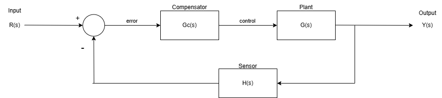

For our system: 
 - R(s) = user desired temperature (based on user power input)
 - Y(s) = temperature of the pipe
 - G(s) = dynamics of the induction heating 
 - H(s) = dynamics of the thermocouple sensor
 - Gc(s) = PID compensation to implemented using microcontroller 
 - summing junction = signals to and from microcontroller

PID control [2] is compensation solution that is the most comprehensive of compensators available. PID by definition is a Proportional, Integral, and Derivative control that allows for the reduction of error, noise, and chattering of signals respectively. This is achieved primarily by adjusting the values of and ratios of constants Kp, Ki, and Kd associated with each PID parameter. 

These constants can be calculated using control theory if the system specifications are known and the transfer functions of the plant and sensor are known. For most applications, including this one, the dynamics of the system and the dynamics of the sensor are not easily determined. However, these dynamics can be approximated using experimental data and knowledge of the behavior of the systems [3]. It is not always necessary to know the exact physics of these systems since the controller / compensator can be tuned as needed to ensure the best response is attained. This can be attained using Zigler-Nichols Tuning Rules, trial and error, or similar ad hoc approaches [4].  

PID can be implemented using software or hardware, but it is typically done using software for modern applications [3]. The chosen microcontroller of the Software Subsystem is a Nucleo-STM32L476RG, so this subsystem will implement the PID control using C code to ensure compatibility. 

Typical PID control implemented using C code is of the following form according to Digikey [5]: 
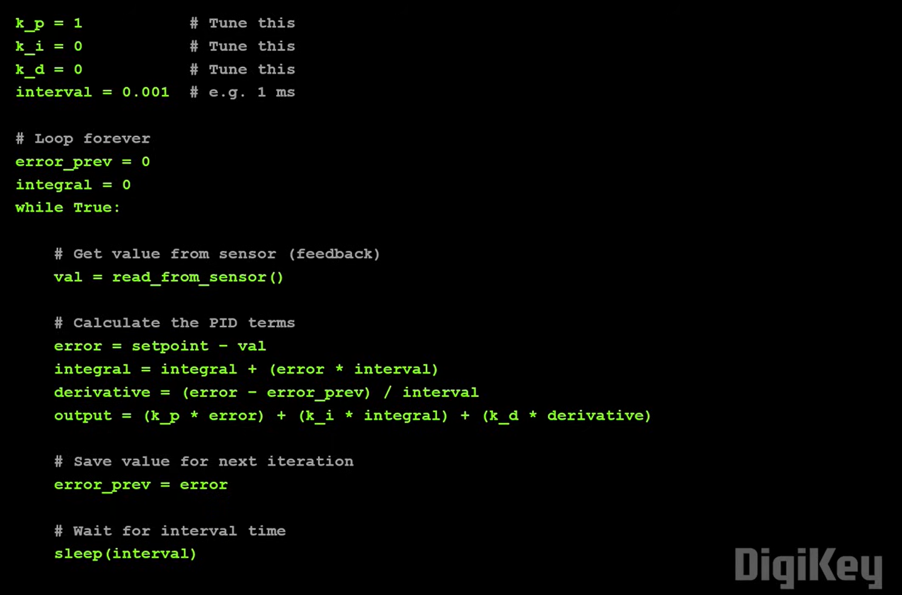

Where the constants are adjusted using control theory or ad hoc methods, the interval is the sampling rate of the microcontroller, and the output for this system is the PWM signal controlling the duty cycle controlling the amount of amps delivered to the coil which controls the temperature of the pipe. The PID controller recieves an error signal based on the difference between the actual temperature of the pipe and the user desired temperature of the pipe, and the controller outputs a controller signal that determines the PWM signal delivered to the power subsystem. 

An additional part of this subsystem is the implementation of thermocouple sensors. A PID controller operates by trying to reduce the error of output by as much as possible, and thus requires feedback sensors to be able to read error values. Thermocouples are used as these sensors to meet customer specs. Thermocouples operate by producing a Seebeck voltage in reponse to metals being heated, and this voltage can be measured by an ADC (analog to digital converter) to tell the controller the measured temperature of the part [6].

Thermocouple Voltage [6]: 
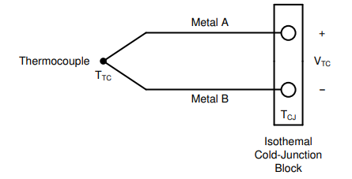

When an ADC is used the Nucleo operates on an analog supply voltage between 1.62 and 3.6 V [7]. This is much higher than the typical millivolt output of a thermocouple [6]. Therefore, amplification will be required for this system's thermocouples. This can be accomplished a number of ways using standard circuit components, but can be more easily done using dedicated thermocouple amplifiers. 

Adafruit produces an Adafruit Universal Thermocouple Amplifier MAX31856 Breakout Board [8,9] that solves both the issue of amplification and cold junction amplification: 

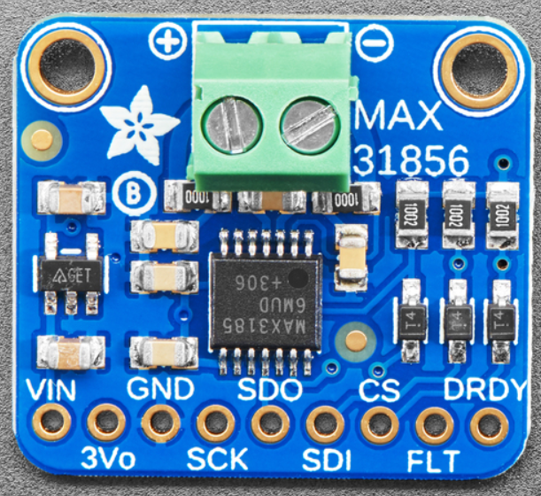

There are many different thermocouples available with price mostly depending on how the thermocouple connects to the workpiece. K-type thermocouples are general purpose thermocouples and have a temperature range [6] suitable for this system's applications, with capabilities to read from –270 to 1370 °C. The critical requirement for the thermocouple chosen for this application is electromagnetic interference (EMI) shielding. This is because of the chosen coil geometry. 

Recall, the induction coil will be wrapped around the pipe: 

The thermocouple must be placed near or around such coil geometry in order to best measure the temperature rise of the pipe due to induction. Thus, to reduce the noise from EMI, the thermocouple used requires EMI shielding. The Omega KMQSS-062U-12 K type thermocouple has a 0.062" diameter 304 Stainless Steel (SS) sheath [10] that provides decent EMI shielding, mechanical strength, and corrosion resistance [11] that will be useful for an application involving noise from the induction coil and ensure durability from potential hazards such as heat or water: 

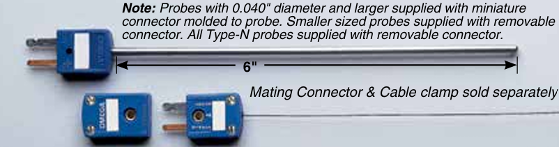

The implementation of the Omega KMQSS-062U-12 thermocouple and MAX31856 thermocouple amplifier will allow for accurate temperature measurements of the pipe being heated. The Nucleo will need to be able to store these temperature measurements in order to measure the total temperature rise of the metal. This can be accomplished fairly simply by writing a program to store the measured temperature of the pipe when the user selects to start the operation and to store the measured temperature of the pipe when the measured temperature is within ± 5% of the user desired temperature. 

The user desired temperature shall be determined from the user desired power input setting and common practices. Typical hot water temperatures for residential use vary between 120 °F and 160 °F [12], so the pipe should be heated to around those temperatures. However, the heating of the water would be slower than the heating of the pipe, so the pipe temperature may be increased if faster water heating is desired. For this application, temperature values between 120 °F and 160 °F provide a good baseline for desired temps. 

## Interface with Other Subsystems

This subsystem primarily consists of the thermocouple sensors, any necessary components to make the thermocouples work, and the PID controller code to control the system. 

#### 1. Power Subsystem 
- **Inputs:**
The MAX31856 thermocouple amplifier is the primary component of this subsystem requiring power. According to the datasheet the MAX31856 works best when supplied with 5 V [8] with a power consumption of less than 5 mW. It should be noted that the KMQSS-062U-12 thermocouple does not require any power input, only the amplifier. 
- **Outputs:**
The Nucleo shall send a PWM signal controlling the duty cycle controlling the amount of amps delivered to the coil which controls the temperature of the pipe. 

#### 2. Embedded Subsystem 
- **Outputs:**
The MAX31856 thermocouple amplifier shall connect to the Nucleo-STM32L476RG ADC 1 CH14 on PC4 providing an analog voltage signal.The Nucleo provides the brain act as a controller to enable the sending of a PWM signal to the power subsystem.

## Buildable Schematic 

Schematic from Adafruit for MAX31856 [8]: 
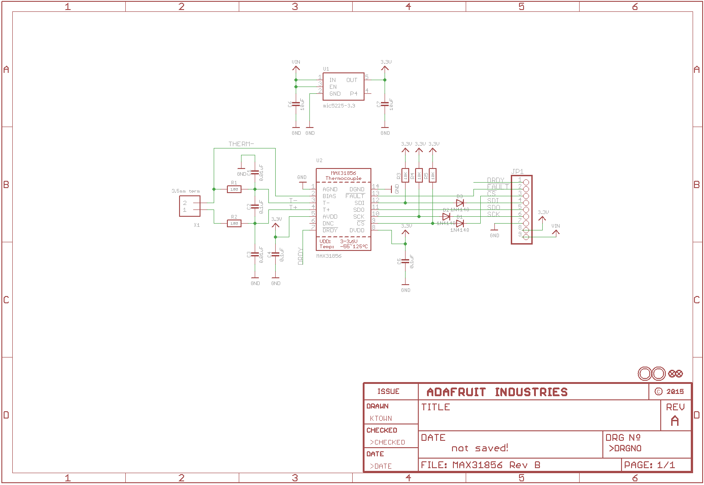

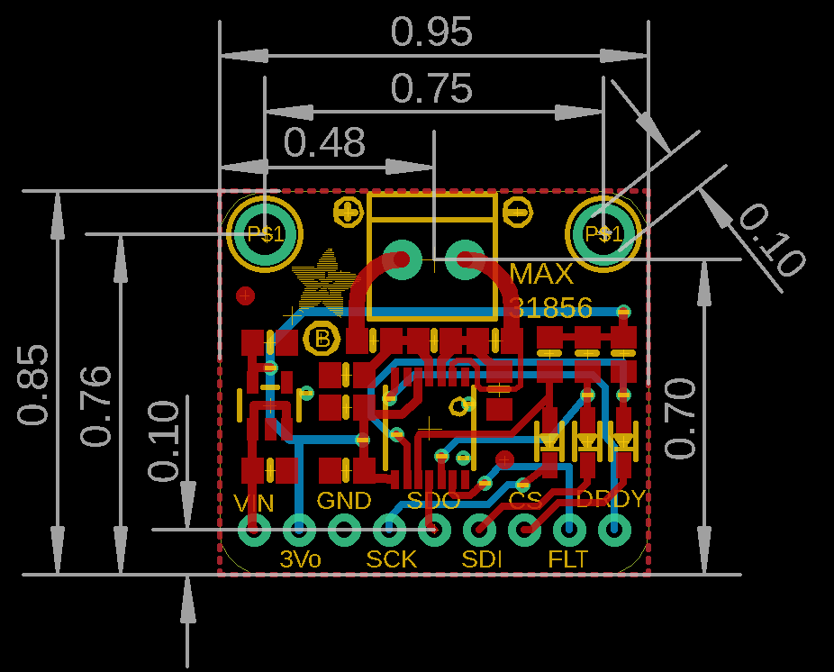

Simplified KiCAD Schematic with Nucleo Connection: 
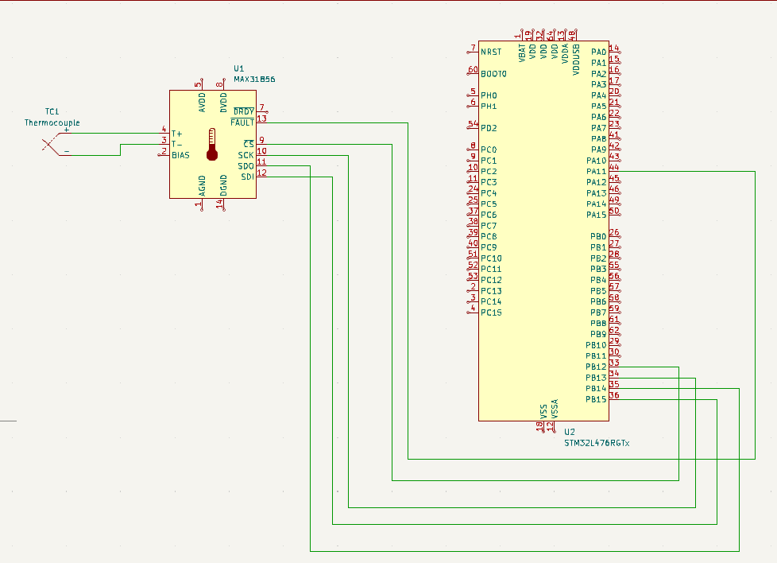

Pseudo Code for system implemented in the Nucleo: 
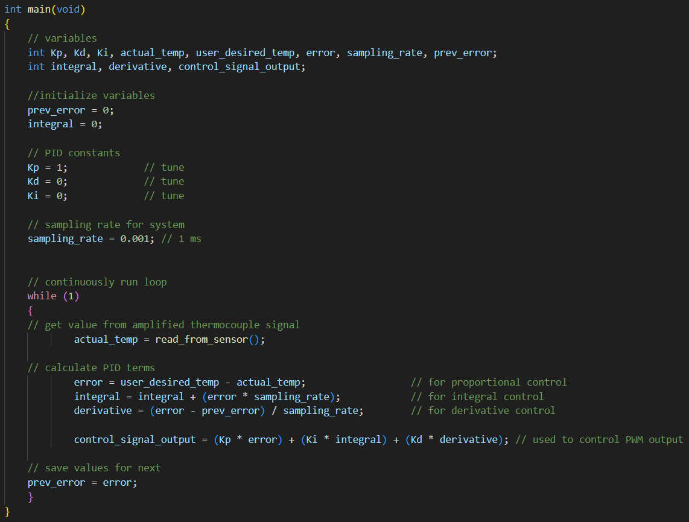

## Flowchart

#### Shown below is a detailed flow chart of the Heat Generation Subsystem's Hardware Components: 

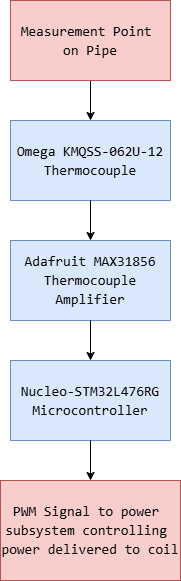

#### Shown below is a detailed flow chart of how the Hardware Components read the pipe surface temperature: 

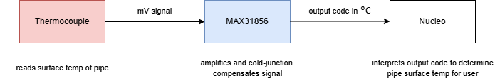

#### Shown below is a detailed flow chart of the Heat Generation Subsystem's Software Components: 

where: 
- red ellipses are start and end points
- blue rectangles and squares are actions
- yellow diamonds are questions

## BOM

| Component | Manufactuer | Part Number | Distrubutor | Distributor Part Number | Quantity | Price | Purchasing Website URL |
| --------- | ----------- | ----------- | ----------- | ----------------------- | -------- | ----- | ---------------------- |
| Surface Temp Thermocouple | Omega | KMQSS-062U-12 | Digikey | 5880-KMQSS-062U-12-ND | 1 | $72.24 | [Link](https://www.digikey.com/en/products/detail/omega/KMQSS-062U-12/25632840) |
| Thermocouple Amplifier | Adafruit | 3263  | Digikey | 1528-1772-ND | 1 | $17.50 | [Link](https://www.digikey.com/en/products/detail/adafruit-industries-llc/3263/6227009) |
| Ceramic Cement | Rutland | 78 | Amazon | B000V4LTXC | 1 | $11.99 | [Link](https://www.amazon.com/Rutland-Stove-Gasket-Cement-Cartridge/dp/B000V4LTXC/ref=pd_bxgy_d_sccl_1/134-4821432-9170960?pd_rd_w=cU7Um&content-id=amzn1.sym.9bef5913-5870-4504-8883-3ba89d7f8e39&pf_rd_p=9bef5913-5870-4504-8883-3ba89d7f8e39&pf_rd_r=Y39JSRBEYQNH54AASQZK&pd_rd_wg=k0ZDf&pd_rd_r=f9976f11-6d41-48c8-9771-a0034455f62a&pd_rd_i=B000V4LTXC&th=1) |
| Total Cost | N/A | N/A | N/A | N/A | N/A | $101.73 | N/A |

The Embedded Subsystem includes the cost of the Nucleo and provides more detail about the nature of the connections between the Nucleo and the MAX31856. The Embedded Subsystem also includes the cost for shielded extension wire used for connecting the Nucleo and MAX31856 using terminal blocks.  

The Power Subsystem includees the cost of testing equipment such as a variac that will be used to experimentally obtain data. The variac will be used to increase the voltage slowly so that the team can test the response of the system in a safe manner, starting with lower voltages before increasing the voltage to minimize risk in case of system failure during testing. The math for the control theory remains the same. 

## Analysis

#### PID Closed Loop Control
Temperature systems have plant dynamics that can be approximated as a first order order system due to the dynamics of their operation. 

Typical response of a temperature system [13]: 
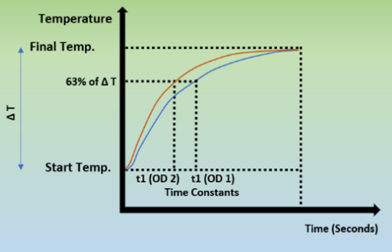

First order approximation [14]: 
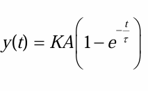
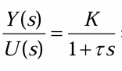
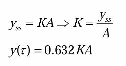

where: 

  yss = steady state output 
  A = analog input 

This model should give an approximation of the the system dynamics, but it would be necessary to experimentally collect data in order to find values of K and tau which cannot be accomplished until the coil and pipe hardware are implemented. Thus this model will serve primarily as an approximation of the expected dynamics to make the PID constants a bit easier to predict.  

It is difficult to accurately predict the exact response of the system without having an physical model of the pipe and coil. Typical system identification using the black box method requires the ability to get experimental data from the system given a known input and output [3]. An alternative method is to analytically derive the transfer function of the system using the laws of physics. This would require knowledge about the material, the resistance, the length, and the diameter of the section of the pipe heated; the number of turns of and the material of the coil; and knowledge about thermodynamics. It is difficult to determine analytically the exact temperature output in response to a certain current input. 

It is more practical and efficient to experimentally derive the plant dynamics when able, but this will not be practical for this application until after parts are ordered and when the team is able to start constructing the physical system and able to obtain experimental data. When the team is experimenting with the system the current delivered to the coil will be kept low with the ability to stop the system using an emergency stop if the temperature output is suspected of being unstable. Once this data is obtained it will be possible to analytically and experimentally determine the values for the PID constants. 

This systems PID control is implemented using C code to ensure compatibility with the Nucleo-STM32L476RG. It is possible to implement PID control using dedicated PID blocks using PLC or LabVIEW software, but these items would add unneccessary cost and compatibility issues to the system. Implementing PID control using C code is best to keep costs low and maximize compatibility with the Nucleo. A notable constraint from the Safety and Protections Subsystem is that the Heat Generation subsystem will be unable to operate if the 

#### Thermocouple Requirements Overview 
Thermocouples are used as the sensors to meet customer specs. Thermocouples operate by producing a Seebeck voltage in reponse to metals being heated, and this voltage can be measured by an ADC (analog to digital converter) to tell the controller the measured temperature of the part [6]. Thermocouple sensors themselves do not require any power to operate, but thermocouples do require power for their peripherals interpreting the data being sent. For this subsystem, the only peripheral is the thermocouple amplifier, which only consumes approximately 4.95 milliWatts [8]. 

The Nucleo-STM32L476RG has three 12 bit ADCs with 16 channels each and three SPIs. When an ADC is used the Nucleo operates on an analog supply voltage between 1.62 and 3.6 V [7]. This is much higher than the typical millivolt output of a thermocouple [6]. Therefore, amplification will be required for this system's thermocouples. This can be accomplished a number of ways using standard circuit components, but can be more easily done using dedicated thermocouple amplifiers. Dedicated thermocouple amplifiers interface easily with microcontrollers and thermocouples which would lead to faster and more efficient build times [13]. Thermocouples typically require cold junction compensation because the standard reference tables in use are designed for a reference temperature of 0˚C [15]. Cold junction compensation is often included with dedicated thermocouple amplifiers [9]. 

#### Adafruit Universal Thermocouple Amplifier MAX31856 Breakout Board
Adafruit produces an Adafruit Universal Thermocouple Amplifier MAX31856 Breakout Board [8,9] that solves both the issue of amplification and cold junction amplification: 

The Adafruit Adafruit Universal Thermocouple Amplifier MAX31856 Breakout Board is able to read any type of thermococouple, including the K-type thermocouple selected for this application. Furthermore, the MAX31856 performs the amplication of the thermocouple signals. 

The MAX31856 Datsheet [8] states "The temperature conversion process consists of five steps as described in the sections below: 
1. The input amplifier and ADC amplify and digitize the thermocouple’s voltage output. 
2. The internal temperature sensor measures the cold-junction temperature. 
3. Using the internal lookup table (LUT), the ADC code corresponding to the cold junction temperature for the selected thermocouple type is determined. 
4. The thermocouple code and the cold-junction code are summed to produce the code corresponding to the cold-junction compensated thermocouple temperature. 
5. The LUT is used to produce a cold-junction compensated output code in units of °C." [8]

The output signal from the MAX31856 is then sent to the Nucleo. The Nucleo recieves a signal indicating the temperature of the surface of the pipe, as determined using the thermocouple and MAX31856, in the form of code. The Nucleo is then able to perform closed loop control using this information.  

The MAX31856 also includes the ability to produce fault signals to ensure safety is maintained. The fault helps reduce unneccessary delays from the microcontroller trying to shut off power using code. The breakout board is set up in the basic configuration as seen in the buildable schematic, so the primary issue of integration will be connecting the thermocouple leads, the power to the amplifier, and the output to the PCB. This set up is detailed by the PCB and Embedded subsystems. 

#### Thermocouple Noise Reduction 
The critical requirement for the thermocouple chosen for this application is the reduction of noise in the sensor in order to maintaining accurate readings. Thus determining the proper thermocouple focused on noise reduction as the critical factor and focusing on other features later to isolate the exact model to implement. 

The thermocouple must be placed near or around such coil geometry in order to best measure the temperature rise of the pipe due to induction. Thus, to reduce the noise from EMI, the thermocouple used requires EMI shielding. This can be accomplished on the wire by buying mineral insulated thermocouples, or by buying shielded thermocouple extension wire. Mineral insulated thermocouples have EMI shielding by nature. The Omega KMQSS-062U-12 has a 304 Stainless Steel (SS) sheath [10] that provides decent EMI shielding and physical protections [11] that will be useful for an application involving noise from the induction coil and ensure durability from potential hazards such as heat or water. 

Thermocouples are available in grounded, ungrounded, and exposed junctions configurations. Grounded and exposed junctions have typically have faster temperature resonses, but they are more susceptible to noise due to the electrical contact [4]. Ungrounded junctions have slower temperature responses, but ungrounded junctions isolate the sensor from noise [13]. Isolation from noise is desirable due to the EMI of the coil; therefore, the thermocouple shall be ungrounded. The Omega KMQSS-062U-12 is ungrounded [10]. 

The sheath diameter can be decreased to increase response time [13], but it also reduces durability so the KMQSS-062U-12's 0.062" diameter sheath should be a good compromise as it is half the size of Omega's next largest diameter 0.125" diameter sheaths but within a few thousandths of the other sizes offered [10]. The KMQSS-062U-12's standard 12" is preferred to ensure the thermcouple can measure the length of the pipe as needed without picking up too much noise from the coil since the pipe measured is expected to be at least 1-2 feet or greater. The standard 6" provides less reach capabilities for only a couple US Dollars less. 

#### Thermocouple Mounting 
The Omega KMQSS-062U-12 thermocouple should be placed along the pipe a short distance away from the coil but not inside the coil. The electromagnetic field within the coil could induce voltage and / or heating in the thermocouple [18]. This would create unstable reading and potentially damage the thermocouple. The pipe will be heated outside the coil by conduction and allow for accurate readings. This provides about two potential locations for the thermocouple to measure, to the left or to the right of the coil. Thus, welding's permanence should not be an issue for control as the temperature of the pipe should not drastically change from one side to another. 

The Omega KMQSS-062U-12 Thermocouple will need to be mechanically attached to the pipe's surface. This can be accomplished a few different ways, such as welding or using adhesive or mechanical mounting equipment [16]. Utilizing pipe clamps to connect the thermocouple to the pipe, but these can add additional parts costs to the BOM. A pipe clamp would be more convenient to move the thermocouple compared to welding, but ideally the KMQSS-062U-12 thermocouple should not have to be moved. 

If welding is chosen, the sheath of the ungrounded thermocouple would be welded to the pipe. Capacitive discharge (CD) welding [17] is recommended for welding thermocouples to pipe [16] to minimize the amount the thermocouple is heated up. If the sheath and the pipe are welded together is chosen, the  sheath will heat up due to the conduction of heat between the sheath and the pipe. The welded connection would also ground the sheath of the thermocouple. This would require additional protective casings to prevent operators from touching the sheath's hot surface. Notably, if the sheath is heated up too much during the welding process, the thermocouple wires may become joined to the sheath and have a shorted connection to the pipe. This would destroy the thermocouple's ability to function. Welding as a service would be free using the fabrication shop at TTU's Brown building, but the possibility of destroying a thermocouple is not desirable because of wait times and cost for replacing the Omega KMQSS-062U-12 Thermocouple. 

An additional option is to drill a small hole partially into the surface of the pipe and to mount the thermocouple there using thermal rated epoxy or ceramic cements [16]. This method is simpler and cheaper than other mounting methods with less room for fabrication errors. Epoxies are typically rated for lower temperatures, around 550 °F [19] compared to ceramic cement [16], and for this induction heating application the temperature may spike to higher temperatures.

Ceramic cement is thermal insulating [20], so this will slow the thermal response of the thermocouple. To minimize the effect of this in the application it will be important to avoid applying too much cement, only enough to make the connection between the thermocouple sheath and the pipe. Ceramic cement is likely to fail due to constant shock loads and vibrations due to its brittle nature [20]. This system, an Induction Heater Controller for a water pipe should not suffer from these issues unless the system is dropped, and if the connection fails reconnection is possible using more cement. Ceramic Cement is eletrically nonconductive due to the properties of ceramic as an insulator, so the use of ceramic cement should not suffer from picking up any extra noise. Ceramic cement is available from suppliers such as Amazon for relatively cheap, such as Rutland Stove and Gasket Cement [21], which can be purchased for around $12. Rutland does not explicity state it is ceramic cement, but the chemical makeup and the reviews match with common properties of ceramic cement. This specific adhesive must sit for at least 1 hour and then have a heat cure performed within 30 days. The team can utilize scrap wood from the fabrication shop in Brown as or to make supports to keep the thermocouple straight while the ceramic cement is drying and/or during operation. 

The Omega KMQSS-062U-12 comes with a glass filled nylon connector body compatible with mating connectors and clamps sold seperately. 

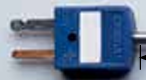

This feature is not necessary for our project, so there is no need to spend additional money on these mating connectors and clamps. The quick connect body can be removed in the fabrication shop if the plugs are unable to fit in the MAX31856 breakout board's terminal blocks, as seen in the picture above [9] it is the green connectors with screws with (+) and (-) indicators. In that case, the quick connect body can simply be cut off and the thermocouple wires fed directly into terminal blocks. 

The Nucleo will need to be able to store the temperature measurements from the Omega KMQSS-062U-12 thermocouple as amplified by the MAX31856 thermocouple amplifier in order to measure the total temperature rise of the metal. This will be accomplished by writing a program to store the measured temperature of the pipe when the user selects to start the operation and to store the measured temperature of the pipe when the measured temperature is within ± 5% of the user desired temperature, which will be around 120 °F and 160 °F [12]. The Embedded Subsystem will also include a SD card act as memory to store these values, with more details on that implementation in that Subsystem's document. 

## References
[1] N. R. Rafferty and G. Tarbutton, “IEEE 844-2000: Recommended Practice for Electrical Impedance, Induction, and Skin Effect Heating of Pipelines and Vessels,” IEEE Transactions on Industry Applications, vol. 38, no. 4, pp. 921–926, Jul. 2002, doi: https://doi.org/10.1109/tia.2002.800586.  

[2] E. Chen, “Controls and Signals Maslab IAP 2011.” Accessed: Oct. 27, 2025. [Online]. Available: https://web.mit.edu/6.186/2011/Lectures/controls/ControlsandSignals.pdf

[3] MATLAB, "What Is System Identification?," https://youtu.be/Z1QS6FsxrJI?si=gIbGyuVUAKYjSpp5 (accessed Nov. 04, 2025).

[4] J. Bennett, “9.3: PID Tuning via Classical Methods,” Engineering LibreTexts, May 19, 2020. https://eng.libretexts.org/Bookshelves/Industrial_and_Systems_Engineering/Chemical_Process_Dynamics_and_Controls_(Woolf)/09%3A_Proportional-Integral-Derivative_(PID)_Control/9.03%3A_PID_Tuning_via_Classical_Methods

[5] “What is a PID Controller? | DigiKey,” www.youtube.com. https://www.youtube.com/watch?v=tFVAaUcOm4I (accessed Nov. 02, 2023).

[6] J. Wu, “A Basic Guide to Thermocouple Measurements.” Accessed: Nov. 06, 2025. [Online]. Available: https://www.ti.com/lit/an/sbaa274a/sbaa274a.pdf?ts=1762432799418&ref_url=https%253A%252F%252Fwww.google.com%252F

[7] “STM32L476RG Datasheet,” ST, 2019. Available: https://www.st.com/resource/en/datasheet/stm32l476rg.pdf

[8] “MAX31856 Datasheet.” Available: https://cdn-learn.adafruit.com/assets/assets/000/035/948/original/MAX31856.pdf
‌
[9] A. Industries, “Adafruit Universal Thermocouple Amplifier MAX31856 Breakout,” www.adafruit.com. https://www.adafruit.com/product/3263

[10] “Omega KMQSS-062U-12 Datasheet,” Omega, Accessed: Nov. 17, 2025. [Online]. Available: https://assets.omega.com/pdf/test-and-measurement-equipment/temperature/sensors/thermocouple-probes/JMQSS.pdf

[11] “What is the Best Material for EMI Shielding? 10 Top Recommendations for 2025,” www.emcnoordin.com, May 20, 2025. https://www.emcnoordin.com/what-is-the-best-material-for-emi-shielding10-top-recommendations-for-2025/ (accessed Nov. 17, 2025).

[12] State Water Heaters, "A Technical Guide to Designing Energy-Efficient Commercial Water Heater Systems," Available: https://assets.statewaterheaters.com/damroot/Original/10008/317913-000.pdf (accessed 18 Nov. 2025).

[13] D. Dlugos, “Grounded vs. Ungrounded Thermocouple Junctions: Why Select One over the Other?,” Ashcroft.com, Sep. 26, 2024. https://blog.ashcroft.com/grounded-vs-ungrounded-thermocouple-junctions (accessed Nov. 17, 2025).

[14] Alouani, Ali. ECE 3260_DAQ_Notes P.12.

[15] D. Szmulewicz, “Implementing a Thermocouple Interface With ADC12_A Application Report Implementing a Thermocouple Interface With ADC12_A,” 2011. Accessed: Nov. 12, 2025. [Online]. Available: https://www.ti.com/lit/an/slaa501/slaa501.pdf?ts=1762893695464

[16] “Correct Mounting Techniques for Surface and Immersion Thermocouples,” Instrunexus.com, 2025. https://instrunexus.com/correct-mounting-techniques-for-surface-and-immersion-thermocouples/ (accessed Nov. 24, 2025).
‌
[17] “Understanding Capacitor Discharge Welding: An In-Depth Technical Overview | Process Equipment Company Welding Services,” Peco-us.com, 2025. https://peco-us.com/understanding-capacitor-discharge-welding-an-in-depth-technical-overview/ (accessed Nov. 24, 2025).
‌
[18] “Temperature Measurement in Electromagnetic Environments,” https://www.dwyeromega.com/en-us/, 2023. https://www.dwyeromega.com/en-us/resources/temperature-measurement-in-electromagnetic-environments

[19] “HighHeat Syringe,” J-B Weld, 2026. https://www.jbweld.com/product/high-heat-syringe (accessed Feb. 09, 2026).
‌
‌[20] P. R. Mehta, “An In-Depth Analysis of Ceramic Cement: Properties and Future Directions,” Physixis, Nov. 08, 2024. https://physixis.com/articles/ceramic-cement-analysis-properties-applications/ (accessed Feb. 09, 2026).

[21] “Stove & Gasket Cement,” Rutland, 2022. https://rutland.com/products/stove-gasket-cement (accessed Feb. 09, 2026).
‌

# 3.e. Detailed Design Embedded Susbystem 

<!-- This document delineates the objectives of a comprehensive system design. Upon reviewing this design, the reader should have a clear understanding of:

- How the specific subsystem integrates within the broader solution
- The constraints and specifications relevant to the subsystem
- The rationale behind each crucial design decision
- The procedure for constructing the solution

## General Requirements for the Document

The document should include:

- Explanation of the subsystem’s integration within the overall solution
- Detailed specifications and constraints specific to the subsystem
- Synopsis of the suggested solution
- Interfaces to other subsystems
- 3D models of customized mechanical elements*
- A buildable diagram*
- A Printed Circuit Board (PCB) design layout*
- An operational flowchart*
- A comprehensive Bill of Materials (BOM)
- Analysis of crucial design decisions

*Note: These technical documentation elements are mandatory only when relevant to the particular subsystem. -->

## Function of the Subsystem

<!-- This segment should elucidate the role of the subsystem within the entire system, detailing its intended function, aligned with the conceptual design. -->

The Embedded Subsystem describes the software for the microcontroller, the connections to the microcontroller, and the connections to the sensors, power PCB, etc. The software on the microcontroller will control the heating of the pipe and the water, check for faults within the system, display to the LCD, interpret sensors, and use inputs. The connections will be via terminal blocks on other peripherals and on the shield PCB for the microcontroller.

## Specifications and Constraints

1. This Microcontroller **shall** not exceed 100°C during operation.  [1]  
2. This Microcontroller **shall** control the switching frequency of the power board. [2], [3], [4], [5]  
3. This Microcontroller **shall** output PWM and toggle its pins. [3], [4], [5]  
4. This Microcontroller **shall** interpret sensors.   [6]  
5. This Microcontroller **shall** have Analog-to-Digital converting capabilities.   [6]
6. This Microcontroller **shall** interpret user interface inputs. 
7. This Microcontroller **shall** interface with an LCD. [7]
8. This Microcontroller **shall** have multiple power settings
   
## Overview of Proposed Solution

1. The microcontroller should not exceed 100°C so that the microcontroller does not overheat, requiring the MCU to be replaced.
2. The microcontroller should control the switching frequency of the power board gate drivers. The frequency will control the power level as the frequency shifts away from the resonance frequency of the coil.
3. The Microcontroller will use GPIO pins to interface with peripherals and use PWM signals to control the frequency sent to the gate drivers.
4. The Microcontroller will interpret sensors using SPI, I2C communication protocols, and ADC, then scale the value.
5. The Microcontroller will need ADC to read sensors.
6. The Microcontroller will interpret user input from a rotary encoder and keypad. The rotary encoder will be used to change constants within the system. The keypad will be used to change number values as well, and change the mode of the LCD.
7. The Microcontroller will interface with an LCD to display the current value of sensors, constants, and the current mode. 
8. The Microcontroller will have multiple power settings changed via the user interface which changes the duty cycle of the PWM sent to the  gate drivers

<!-- This section should provide a list of constraints applicable to the subsystem, along with the rationale behind these limitations. For instance, constraints can stem from physics-based limitations or requirements, subsystem prerequisites, standards, ethical considerations, or socio-economic factors.

The team should set specifications for each subsystem. These specifications may require modifications, which must be authorized by the team. It could be necessary to impose additional constraints as further information becomes available.

Every subsystem must incorporate at least one constraint stemming from standards, ethics, or socio-economic factors. -->

<!-- Describe the solution and how it will fulfill the specifications and constraints of this subsystem. -->
## Interface with Other Subsystems
<!--
Provide detailed information about the inputs, outputs, and data transferred to other subsystems. Ensure specificity and thoroughness, clarifying the method of communication and the nature of the data transmitted.
-->
### Inputs:
#### Overview:
 1. 5V DC from the power board
 2. Reading Micro SD Interface
 3. MAX31856 ADC to SPI for the Pipe Thermocouple
 4. MAX31856 ADC to SPI for the IGBT Thermocouple
 5. MCP9600 ADC to I2C for a Thermocouple
 6. AD8495 Amplification of a Thermocouple
 7. Keypad
 8. Rotary Encoder
 9. Flow Sensor
 10. Source Current Sensor
 11. Tank Current Sensor

#### Specifics:
 1. 5V DC from the power board. 
 The STM32L476RG needs 5V from the power board to run all the devices [8].  
 2. Reading Micro SD Interface
 A micro SD card interface will be read using SPI 1. SPI 1 MISO on PA7 will receive the data from the SD card. SP1 SCLK will output a clock signal to time the data being received on PA5. The CS Pin, which enables data transfer, is on PB6. The Micro SD interface will be used to grab the old state of the system, including the desired temperature, what mode the LCD is in, etc [8] [9].
 3. MAX31856 ADC to SPI for the Pipe Thermocouple
 MAX31856 ADC to SPI for a Thermocouple will take the < 50 mV signal from the Thermocouple, then amplify the signal. Next, it ADCs the signal and sends that information bit by bit via SPI, in this case, SPI 2. This Thermocouple converter will be for the Pipe temperature. Uses SPI 2 MISO on PB14 to receive the data. The SPI 2 CN pin is on PB12, which enables the data reception. The SPI 2 SCLK is on PB13 to time the data. [8] [10]. 
 4. MAX31856 ADC to SPI for the IGBT Thermocouple
 MAX31856 ADC to SPI for a Thermocouple will measure the temperature of the IGBT Temp. Uses SPI 3 MISO on PC11. The SPI 3 SCLK pin is on PC10. The CN pin is on PD2. [8] [10].
 5. (optional) MCP9600 ADC to I2C for a Thermocouple
 MCP9600 ADC to I2C for a Thermocouple is to measure the Input water Temperature on the power board to make sure it does not exceed 100°C. The I2C 1 SDA is on SB9, which is the data pin, and I2C 1 SCL is the clock pin on PB8 [8] [11] [12].
 6. (optional) AD8495 Amplification of a Thermocouple
 AD8495 Amplification of a Thermocouple will amplify the thermocouple voltage so that the board can ADC the voltage to get a temperature. This thermocouple converter will be for the pipe that is being heated. The signal is received by ADC 1 CH14 on PC4. [8] [13].
 7. Keypad
 The Keypad will be checked via 4 row pins: PB11, PB10, PB4, and PB5, respectively, assigned to interrupts. Then the 4 column pins: PB3, PA11, PB2, and PC4, respectively, will be output pins and will be scanned to determine which button was pressed on an interrupt. The keypad will be able to set values for the system and change the mode of the LCD [8] [14].
 8. Rotary Encoder
 The Rotary Encoder will be able to change values for the system as well, depending on the mode of the LCD. This uses TIM 3 in encoder mode on channels 1 and 2 on interrupts to determine if the encoder has changed position. PC6 is TIM 3 CH1 and PC7 is TIM 3 CH2. [8] [15].
 1. Flow Sensor
 The flow sensor will use GPIO Interrupt 3 on PC3. The flow sensor will detect when the water is flowing, then turn on the induction gate driver [8] [16].
 1.   Source Current Sensor
 The current sensor will use ADC 1 CH 3 on PC2. The current sensor will ensure that the electrical current flowing in the system is at a safe value so that components don't explode [17] [8]. 
 1.   Tank Current Sensor
 The current sensor will use ADC 2 CH 14 on PC5. The current sensor will ensure that the electrical current flowing in the Tank is at a safe value so that components don't explode [17] [8]. 

### Outputs:
#### Overview:
 1. LCD
 2. PWM signals to Gate Drivers
 3. Writing Micro SD Interface
 4. Setting Pipe Fault Temperature For Amplifier
 5. Setting IGBT Fault Temperature For Amplifier

#### Specifics:
 1. LCD
 The LCD uses 6 GPIO Pins. PB8, which is PA0, connects to the register Select, RS pin. The read/write pin is tied to ground since the LCD only needs to be written to. PB9, connects to the Enable pin, EN pin. The 4 data pins which connect to D4-D7 on the LCD, which is pins PA15, PB7, PA12, and PA11 respectively. [8].
 1. PWM signals to Gate Drivers
 PWM signals to Gate Drivers are driven using a master slave complex of TIM1 CH2 driving TIM8 CH3 to get the same frequency signals, but 0-180 degrees out of phase. The modulation of the phase is used to reduce the power output to the coil. TIM1 CH2 is on PA9 and TIM8 CH3 is on PC8 [8].
 1. Writing Micro SD Interface
 Writing Micro SD Interface uses SPI 1 MOSI on PA7 to write data to the micro SD card. Inputs 2. explains the rest of the connection for the SD card interface [8] [9].
 1. Setting Pipe Fault Temperature For Amplifier
 Setting Pipe Fault Temperature uses SPI 2 MOSI on PB15. Inputs 4. explains the rest of the connections for the Pipe Temperature Amplifier [8] [10].
 1. Setting IGBT Fault Temperature For Amplifier
 Setting IGBT Fault Temperature uses SPI 3 MOSI on PC12. Inputs 5. explains the rest of the connections for the IGBT Temperature Amplifier [8] [10].
## Buildable Schematic 

<!-- THe instruction text was commented out not sure what you are referring to. 

Integrate a buildable electrical schematic directly into the document. If the diagram is unreadable or improperly scaled, the supervisor will deny approval. Divide the diagram into sections if the text and components seem too small.

The schematic should be relevant to the design and provide ample details necessary for constructing the model. It must be comprehensive so that someone, with no prior knowledge of the design, can easily understand it. Each related component's value and measurement should be clearly mentioned. -->
#### Embedded System Connection Diagram
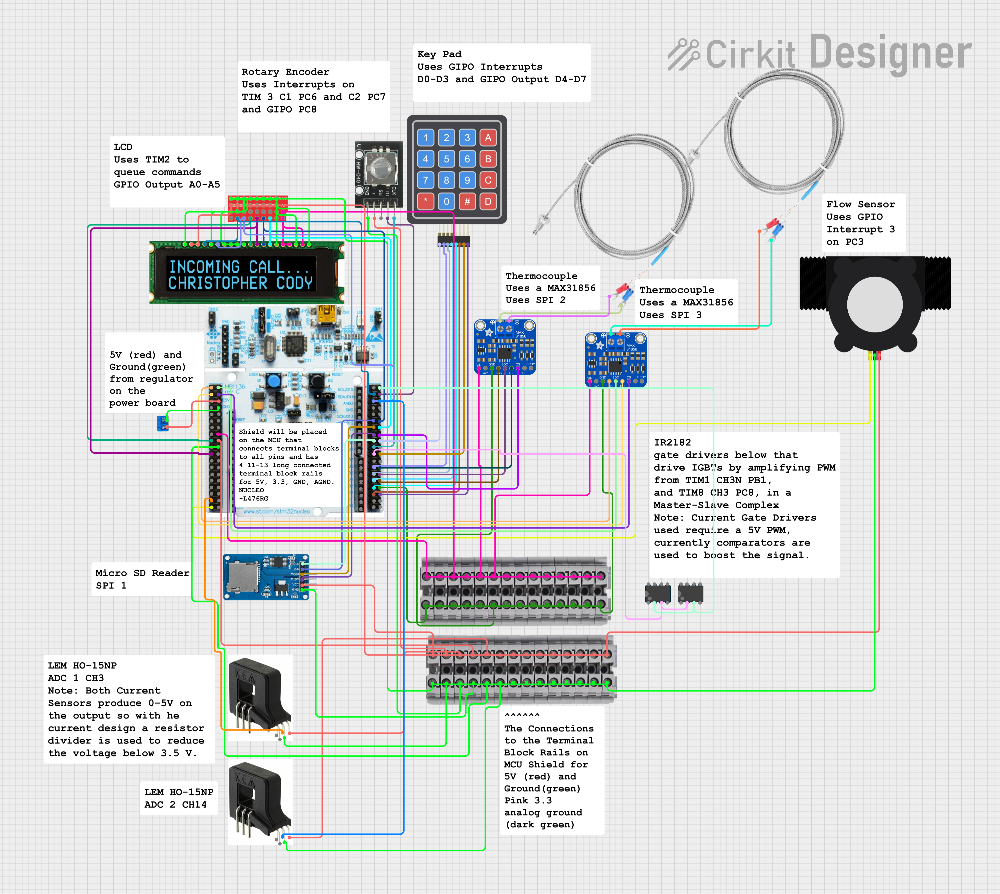

## Printed Circuit Board Layout

<!-- Include a manufacturable printed circuit board layout. -->

The microcontroller will have a terminal shield that the PCB subsystem will design. The shield will have 2 sets of double female headers, 20 long, which will mate to the 2 sets of double male headers on the microcontroller. The female double headers will be soldered to the shield. The left and right sides, which will be 19 pins long, of the double headers will be connected to terminal blocks through copper PCB traces. The rows of terminal blocks are soldered to the opposite side of the PCB as the female headers. Each pin on the headers will have its own terminal block. Both sets of headers will be connected to single-row terminal blocks. The headers are on opposite sides of the Terminal blocks. The headers and Terminal Blocks pins are spaced 2.54 mm apart. In between the inner rows of terminal blocks, there will be 4 rows of 10 for the microcontroller 5V, 3.3V, ground, and analog ground. The output of the sensor ADCS and amplifiers will be Terminal blocked as well.

## Flowcharts

<!-- For sections including a software component, produce a chart that demonstrates the decision-making process of the microcontroller. It should provide an overview of the device's function without exhaustive detail. -->

The LCD Abstracted logic Flow chart describes modes for the LCD and the actions that can occur in each mode. The top flow shows the key pad influencing the modes. Whereas, the bottom shows the different modes in action. 

### Proportional Differential Integral Controller Flow Chart
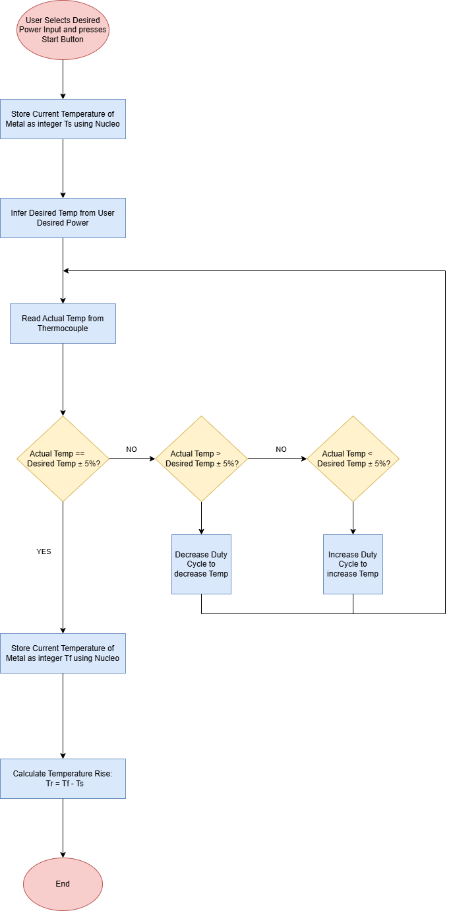

The Proportional Differential Integral Flow Chart Controller shows the function of the proportional Differential Integral Controller shows the function of a proportional controller. Depending on the response of the closed-loop proportional controller, the integral and differential components might be needed.

The Delay System Flow Chart explains the function of the logic behind the LCD. The right 3 flows show the 3 different functions that queue runs at different frequencies and life times. The left flow handles the logic which executes the run queue, ticking down delayLeft, and on time it runs the callback, and if the return of run until is true, it removes the delay.
  

The Micro-Tasked LCD System Flow Chart examines the process by which the LCD runs. The top flow shows the function that queues a byte of data into the circular queue, which could be a command or data that can have a delay. The bottom flow shows the processing of that queue. The program uses a state machine to make sure that the latches have enough time to be detected.

### Electro-Cookie for LCD
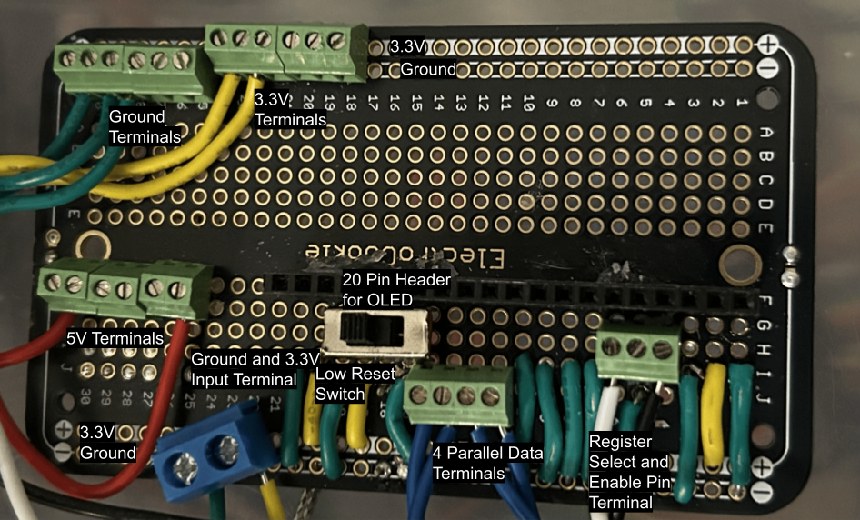
An Electro-Cookie is basically a Perf Board but it has through holes that are connected similar to a breadboard ie a permanent breadboard. This allows the LCD to be interfaced without designing a PCB and without the jankiness of a breadboard. It has a 4 long terminal block for the 4 data pins, a 2 long terminal block for the input ground and 3.3V, three 6 long terminals for ground, 3.3V and 5V, a 3 long block where the outer 2 inputs are used for Enable and register select, and a low LCD reset switch. 

### Electro-Cookie for Voltage Scaling and MicroSD Card Reader

This allows the Voltage of the PWM to be scaled to 5V via comparators. The 5V PWM is needed by the gate drivers. The comparators output is pulled up to 5V and the threshold Voltage is 1.56V via a voltage divider from 5V. It as a 2 long block for scaler input and a 2 long block for output. There is also to voltage divider that take a 0-5V signal and convert it to 0-3.3V. The current sensors output 5V at 60 amps so there is a possibly of 5V damaging the ADC; thus, a resistor divider is needed. A 2 long block for divider input and a 2 long block for output is used. Also the a 6 long block is used to interface and power the MicroSD card reader. There is a 4 block for 5V and a 6 block for ground. As well as a 2 block for input ground and input 5V.  

## BOM

<!--
Provide a comprehensive list of all necessary components along with their prices and the total cost of the subsystem. This information should be presented in a tabular format, complete with the manufacturer, part number, distributor, distributor part number, quantity, price, and purchasing website URL. If the component is included in your schematic diagram, ensure inclusion of the component name on the BOM (i.e R1, C45, U4).
-->

| Component Name                                               | Component Id      | Cost   | Operating Voltage (V) | Max Operating Current (mA) | Power Cost (mW)  | Amount | Total Power (mW) | Total Cost ($)         | Product Link                                                                                           |
| ------------------------------------------------------------ | ----------------- | ------ | --------------------- | -------------------------- | ---------------- | ------ | ---------------- | ---------------------- | ------------------------------------------------------------------------------------------------------ |
| STM32Microcontroller [8] [19]                                | NUCLEO-L476RG     | $14.52 | 5-12                  | 500                        | 2500 (at 5 V)    | 1      | 2500.0           | $14.52                 | [digikey.com](https://www.digikey.com/en/products/detail/stmicroelectronics/NUCLEO-L476RG/5347711)     |
| Adafruit SPI Thermocouple Amplifier [10] [20]                | MAX31856 Breakout | $17.50 | 3.3                   | 1.5                        | 4.95             | 2      | 9.9              | $35.12                 | [adafruit.com](https://www.adafruit.com/product/3263)                                                  |
| Adafruit I2C Thermocouple Amplifier (optional)[12] [11] [21] | MCP9600 Breakout  | $15.95 | 2.7-5                 | 2.5                        | 8.25 (at 3.3 V)  | 1      | 8.25             | $15.95                 | [adafruit.com](https://www.adafruit.com/product/4101)                                                  |
| Analog Output Thermocouple Amplifier (optional)[13] [22]     | AD8495 Breakout   | $11.95 | 2.7-36                | 0.180                      | 0.594 (at 3.3 V) | 1      | 0.594            | $11.95                 | [adafruit.com](https://www.adafruit.com/product/1727)                                                  |
| Keypad [23] [14]                                             | 3844              | $5.95  | 3.3                   | 33                         | 108.9            | 1      | 108.9            | $5.95                  | [digikey.com](https://www.digikey.com/en/products/detail/adafruit-industries-llc/3844/9561536)         |
| Rotary Encoder [24] [15]                                     | SEN0235           | $2.90  | 5V                    | 10                         | 50               | 1      | 50               | $2.90                  | [digikey.com](https://www.digikey.com/en/products/detail/dfrobot/SEN0235/7597223)                      |
| LCD [25] [18]                                                | NHD-0216CW-AB3    | $30.87 | 3.3-5                 | 135                        | 675 (at 5 V)     | 1      | 135.0            | $30.87                 | [digikey.com](https://www.digikey.com/en/products/detail/newhaven-display-intl/NHD-0216CW-AB3/5022941) |
| Adafruit Micro SD Card Interface [26] [9]                    | N/A               | $3.50  | 3.3                   | 150                        | 495              | 1      | 495.0            | $3.50                  | [adafruit.com](https://www.adafruit.com/product/4682)                                                  |
| Lem Electric Current Sensor [27] [17]                        | HO 15-np          | $11.35 | 5                     | 25                         | 125              | 2      | 125.0            | $22.70                 | [lem.com](https://www.digikey.com/en/products/detail/lem-usa-inc/HO-15-NP-0000/4331965)                |
| Liquid Flow Meter 1/2" [28] [16]                             | YF-S201           | $8.99  | 5-18                  | 15                         | 85               | 1      | 85               | $8.99                  | [amazon.com](https://a.co/d/027tJyEe)                                                                  |
| 8C 22AWG AMESB Shielded Cable Wire                           | UL2464            | $27.54 | N/A                   | N/A                        | N/A              | 1      | N/A              | $27.54                 | [amazon.com](https://a.co/d/0g2Ra5RD)                                                                  |
| TUOFENG 20 AWG Wire Solid Core Hookup Wire                   | 20awg             | $16.99 | N/A                   | N/A                        | N/A              | 1      | N/A              | $16.99                 | [amazon.com](https://a.co/d/08RgLeMz)                                                                  |
| Total (electricals not including MCU nor                     | N/A               | N/A    | N/A                   | 203.5 mA (at 5V) < 500 mA  |                  | N/A    | 1008.8           | $189.08 (includes MCU) | N/A                                                                                                    |
| ADC/I2C Thermocouple AMP as optional)                        |                   |        |                       |                            |                  |        |                  |                        |                                                                                                        |
## Analysis

<!-- Deliver a full and relevant analysis of the design demonstrating that it should meet the constraints and accomplish the intended function. This analysis should be comprehensive and well articulated for persuasiveness. -->

#### Microcontroller (Constraint 5.)
NUCLEO-L476RG is the microcontroller used since it is what the team is most comfortable with. Also, the MCU fits the teams needs of being low power and having GPIO, ADC, TIMERS, 80MHZ max clock, I2C, SPI, and PWM capabilities. The MCU will have a shield placed on the MCU's double male headers, connecting all the MCU’s pins to terminal blocks. Terminal blocks are used to allow for more flexibility if something needs to be added, removed, or moved. With a PCB that hard-connects all the pins, the PCB would need to be reordered if something changed [8]. 

#### Sensor and Fault Interfacing (Constraint 4. and 3.)
Reading the sensors, temperature sensors will be polled with PID logic, as the temperature sensors do not need to be as fast. The shut off temperatures for the objects the sensors are measuring can be programmed on the amplifier signal directly, a fault after the temperature passes a certain threshold for the MCP9600 and MAX31856 via which is threshold is configured via I2C and SPI, respectively [10] [11]. The MCP9600 and the AD8495 will be optional as measuring the input and output water temperature directly is not necessarily needed. Direct wiring of fault signals from the amplifier would speed up an issue, disabling the circuit. Due to the majority of the pins on the microcontroller being used, the thermocouples will need to be amplified in different ways. There are only 3 ADC, 3 SPI, and 3 I2C [8]. Since the system has 6 interfaces/sensors, they have to be spread across the ways of interfacing. The thermocouple that is reading the pipe can have the amplifier setup to fault pass a certain temperature. The direct fault signal will speed up the disabling of the system, bypassing SPI interfacing speeds. To set the threshold fault temperature, SPI MOSI will be used. The IGBT termocouples on the power board will have a similar capability. The IGBT will be set up similarly to the pipe amplifier. The fault for the IGBT and the pipe thermocouple will be directly be wired to disable power to the induction circuit. To display a IGBT or Pipe temperature fault the MCU will read the values and once a threshold is pasted it will display that the system faulted. The IGBT and Pipe will be amplified and ADCed via a MAX31856 via SPI 3 and SPI 2, respectively, both configured to full duplex master, meaning the MCU can input from and to the output device. The output water temp will be amplified via an AD8495 and ADC 1, as ADC reads a lot faster than I2C. The input water temperature will be amplified via an MCP9600 via I2C as it does not need to read as fast as the output, since it will change at a minimum of every hour. 

#### Keypad and User Interface (Constraint 6. and 7.)
The keypad will be used to set the desired temperature and interface with the system. The key A-C will set 3/4 modes of the LCD. The First 3 are the display temp mode (A key), the set temp (B key), and the set power level (C key). The display temp mode displays the desired temperature or power level, the pipe temperature, the output and input water temperature, and the IGBT temperature. Basically, a system vitals mode. The second mode allows the user to change the desired temperature via the keypad or the rotary encoder. The temperature is entered when the user presses pound on the keypad. The same operation is done for the third mode, but for the power level. The 4th mode is the fault mode, it occurs when the system has a fault via overcurrent in the current transducer or over over-temperature fault from any MAX31856 amplifier. Faults are only cleared via the star key. The keypad and rotary encoder will work off of interrupts. D0-D3 interrupts and TIM 3 configured to encoder mode with interrupts [8].

#### Micro SD Card Interface (Constraint 4.)
Adafruit Micro SD Card Interface will be used to save the state of the system and log the system's values over time. The Micro SD Interface is used over ROM as the Interface is easier viewable on a computer for displaying data. The Interface will use SPI 1 configured to full duplex master and set up to use DMA so that the thread is not blocked while saving with the SD card [9]. The interface will log the system pipe temperature, IGBT temperature, Flow Rate, system source current, and possibly the water input and output temperatures with timestamps. The system state will be a saved C struct and will not be readable without a program parsing the data. [8]

#### Liquid Flow Meter (Constraint 4.)
The Liquid Flow Meter will determine if the system is sending power. Having a flow meter to control the sending of power is standard in most tankless water heaters. The system will use a GPIO Interrupts to count the pulses per second, which is 7.5 times more than the flow rate in Liters per minute. [16] The GPIO Interrupts will need to be debounced to make sure that a sprit of noise did not falsely trigger the interrupt. To debounce the interrupt, the system will use runIntervalUntil at 10ms for 100ms, check that the flow is greater than 1 L/min which checks if the signal is continuous. If the signal is continuous, then the system will start sending power to the coil based on the PID controller.  [8]

#### Current Transducer (Constraint 4.)
The LEM current transducer, LEM HO-15NP, will use ADC 1 for the Source Current and ADC 2 for the tank current. The value from ADC will be scaled with a constant value to show the real current value since the ADC will return a value from 0 to 4096 and is proportional to 0 to 5V. This value will be displayed on the LCD in the temperature display mode. It will also be logged to the SD Card. A fault will be Determined via the values coming to the MCU.

#### Power Board Interfacing (Constraint 2.)
The Microcontroller will have to interface with the power board by sending 20-50 kHz PWM signals. Two that are 180 degrees out of phase which can be done via a negated timer alternate pin. The power board also needs an 80KHz PWM signal. The MCU will also receive 5V from a regulator on the power board. The duty cycle of these signal will be changed to increase or reduce the power sent to the coil. 0% being no power and 50% being maximum power. Also, the further away from the resonant frequency the PWM signal is, the less power the pipe will receive from the coil. [8]

#### Wiring and Noise 
The wiring that connects between terminal blocks will most likely need to be multicolored so that the layout of the wiring is less of a mess. most wires that leave the microcontroller section or the housing complete will need to be shielded. Since we are using terminal blocks solid conductor is preferred as stranded has to be tined to make a proper connection with the terminal block. 

#### Testing
Most of the testing will be with the oscilloscope to verify that the frequency and duty cycle of the PWM sent to the gate driver is correct. Other testing is are component input/output signals functioning correctly which can be verified with a multimeter or oscilloscope. Other testing is visually that each component is working via is vitals/function on the LCD. 

#### Safety, Ethics, and Broader Impacts. (Constraint 1.)
The safety concerns are that the microcontroller could over heat. The microcontroller has a thermistor to make sure it does not exceed 100°C and will shutoff if it detects a temperature greater than 100°C [1]. The microcontroller will be in a compartment in the housing, and the digital wires will be insulated to prevent shock, even though 5V tends not to be hazardous. The amplifier for the pipe thermocouple will be outside the housing, but be in its own electrical box so that the cold junction compensation can have a similar ambient temperature as the termocouples. The ethical concerns are that if a user could set any temperature or the PID constants issues could arise. If an LCD mode is added for setting the PID constants, the mode will be password protected to prevent an unauthorized user from setting the values. If any temperature could be set to any value, the system would heat forever, causing the pipe to melt or the water to flash boil, creating a bomb. The temperature setting for the pipe will need to be capped below that which would transfer too much energy causing boiling water, as if the water boils in the pipe, a pipe bomb could be created. If the pipe heats too much, the pipe could melt, or the fittings could also melt. The proportional and integral can be set too high, causing massive overshoot and could cause the system to be unstable, which is similar to if the temperature settings were set too high. The boarder impacts are that in the temperature control will reduce the power consumption over time by only supplying the minimum amount of power to the coil to maintain the desired temperature. The recyclability of the microcontroller shield PCB could be used for other projects to allow for more secure connections but still is still adaptable. 

#### Proportional Integral Differential Controller
The proportional integral differential controller will be implemented on the microcontroller ran about a 100ms interval. The interval will be around 100 ms, as that is the conversion time for the MAX31856, which the pipe will use [10]. The first conversion takes around 200ms, so that will be to be accounted for in the setup of the thermocouple. The proportional component will have a constant that we can change in code, which affects the proportional gain. The proportional gain determines how fast the system reaches the target value. The integral term also has a configurable constant which the term reduces the residual error, increasing the accuracy. The term also configurable smooths out the response and reduces overshoot caused by the integral and differential terms. [29] The controller will be implemented on the microcontroller to get the pipe temperature to a desired value and keep it within a small range around the desired temperature. The goal is within 5 degrees Celsius. Depending on the tuning process, all terms or just the proportional term might be needed. [8]  

#### Micro-Task Delay System
The purpose of the delay system is not to busy wait for a long duration. The system checks every millisecond, counting down from the delay value. This allows other processes to run between the millisecond checks/runs. The contrast is HAL_Delay(), which uses a while loop checking how many ticks have past while is why the system is micro-tasked. Run interval is to repeatedly run a task at a specific interval. The run timeout delays for a specific amount of time then runs the task. The run-interval-until function will run a task-specific interval until the until-callback returns true. [8]

#### Micro-Tasked LCD  System
The LCD system is micro-tasked, as the LCD displaying information is not as important as, for example, the PID controller. Writing data and commands to the LCD will queue to instructions in a circular queue so that reading the next instruction and adding the the queue is O(1) time. The queue runs on a 200-microsecond interval, so it can write a char per 1 ms. The micro-tasked system allows for other tasks to run between the LCD writes so that the processor is more efficiently used. HAL_Delay() is also removed from the system to avoid any busy waiting which this can happen as a uint is stored in the queue. The most significant 7 bits are after the LCD instruction delay from 0-127 ms. The delay is so that the LCD can process the instruction until the next command. The Delay is set based on the LCD data sheet per command execution time [18]. The 9th bit controls whether the instruction is data or a command. Then the 8 least significant bits are the data. [8]

#### Interrupts vs Polling 
Interrupts will be used over polling for user inputs as actions for inputs will only need to take up the thread when the users interacts with an interface. The keypad is for buttons to control the lcd and set values. A rotary controller will also be used to set values. The fault display signals from the sensors will be on interrupts. For less important display and setting of inputs, they will be on Interrupts, so CPU time is not wasted. [8]

<!--
chat
// ...existing code...
Adafruit Micro SD Card Interface will be used to save the state of the system and log the system vitals over time. The Micro SD Interface is used over ROM as the Interface is easier viewable on a computer for displaying data. The Interface will use SPI 1 configured to full duplex master. [9]
// ...existing code...
Adafruit Micro SD Card Interface will be used to save the state of the system and log the system vitals over time. The breakout is formatted with FatFs so log files can be written as CSV snapshots (timestamp, operating mode, temperatures, current, flow rate, fault codes) at 1 Hz during normal operation and immediately upon any fault interrupt. At boot the firmware checks for a configuration file that stores the last commanded temperature, power level, and LCD mode so those values can be restored if power is lost mid-run. SPI1 runs in full-duplex master mode with a DMA-backed double buffer to keep the logging task non-blocking; chip select on `PB6` is abstracted through the [`logging::sd_card`](Software/embedded_system/src/logging/sd_card.cpp) driver so higher-level tasks only queue structured records. A card-detect line on `PA4` forces the system into a safe “no logging” mode with warning banner on the LCD if the SD card is removed, preventing silent data loss. Every file is closed and flushed after each write burst to minimize corruption risk in the event of an unexpected shutdown. [9]
// ...existing code...
Liquid Flow Meter will determine if the system is sending power. Having a flow meter to control the sending of power is standard in most tankless water heaters. The system will use a GPIO Interrupts to count the pulses per second which is 7.5 times more than the flow rate in Liters per minute. [16] [8]
// ...existing code...
Liquid Flow Meter will determine if the system is sending power. Having a flow meter to control the sending of power is standard in most tankless water heaters. Each rising edge on `PC3` increments a hardware counter serviced by EXTI3; pulses are accumulated over a 250 ms window and converted to flow using $Q_{\text{LPM}}=\frac{N_{\text{pulses}}}{7.5}$. A four-sample moving average filters turbulence-induced jitter, while an adaptive timeout flags “no-flow” after 500 ms with zero pulses, immediately inhibiting the gate-driver enable. Calibration constants can be adjusted in `flow_meter_config.json` on the SD card to compensate for viscosity changes. The ISR also debounces the reed output, discarding intervals shorter than 2 ms to avoid double counts caused by mechanical chatter. [16] [8]
// ...existing code...
The Microcontroller will have to interface will the power board by sending 20-50Khz PWM signals. Two that are 180 degrees out of phase which can be done via a negated timer alternate pin. The power board also needs a 80Khz PWM signal. The MCU will also receive 5V from a regulator on the power board. [8]
// ...existing code...
The Microcontroller will have to interface with the power board by sending 20–50 kHz PWM signals that drive the full-bridge through the isolated gate driver. TIM8 is configured in center-aligned mode with complementary outputs on `TIM8_CH3` (`PB1`) and `TIM8_CH3N` (`PA7`) plus programmable dead time, guaranteeing the two legs remain exactly 180° out of phase while protecting against shoot-through. Frequency trimming is executed via ARR updates synchronized to the update event so the firmware can sweep away from resonance without glitching the duty cycle. A secondary carrier on `TIM4_CH2` (`PB8`) generates the fixed 80 kHz excitation required by the resonant tank pre-charge circuitry; its enable line is ANDed with the hardware fault input (BKIN) so any latched fault immediately blanks all PWM. The MCU receives regulated 5 V from the power board through the shield backplane, where local LDOs derive the 3.3 V analog plane and reference for ADC measurements; star-ground routing keeps the logic return separate from the high-current switching ground to reduce injected noise. [8]
// ...existing code...
-->
## References

[1] K. Enisz, G. Kohlrusz, D. Fodor, and L. Kovacs, "Degradation Analysis of DC-Link Aluminum Electrolytic Capacitors Operating in PWM Power Converters," Power Engineering and Electrical Engineering, vol. 18, no. 2, 2020. Available: https://www.researchgate.net/publication/342538837_Degradation_Analysis_of_DC-Link_Aluminium_Electrolytic_Capacitors_Operating_in_PWM_Power_Converters (Accessed: Nov. 23, 2025).

[2] Power Electronics News, "IGBTs for Induction Heaters," 2023. Available: https://www.powerelectronicsnews.com/igbts-for-induction-heaters/ (Accessed: Nov. 23, 2025).

[3] Arrow Electronics, "What’s the Right Switch for You? When to Use Si MOSFETs, IGBTs, and SiC Devices," Whitepaper, 2023. Available: https://static4.arrow.com/-/media/Arrow/Files/Pdf/Arrow-IGBT7-Whitepaper.pdf (Accessed: Nov. 23, 2025).

[4] AllPCB, "MOSFET vs. IGBT: Key Differences," 2022. Available: https://www.allpcb.com/allelectrohub/mosfet-vs-igbt-key-differences (Accessed: Nov. 23, 2025).

[5] JSW XDH, "IGBT vs. MOSFET: Choosing the Right Semiconductor for High-Power Applications," 2021. Available: https://www.jswxdh.com/IGBT-Vs-MOSFET-Choosing-The-Right-Semiconductor-for-High-Power-Applications-id40319716.html (Accessed: Nov. 23, 2025).

[6] IPC, "IPC-2222: Sectional Design Standard for Rigid Organic Printed Boards," 2013.

[7] IPC, "IPC-7351B: Generic Requirements for Surface Mount Design and Land Pattern Standard," 2010.

[8] STMicroelectronics, "STM32 Nucleo-64 boards (MB1136) user manual (UM1724)," PDF, Available: https://www.st.com/resource/en/user_manual/um1724-stm32-nucleo64-boards-mb1136-stmicroelectronics.pdf (Accessed: Nov. 23, 2025).

[9] Adafruit, "MicroSD SPI/SDIO Library Guide," PDF, Available: https://cdn-learn.adafruit.com/downloads/pdf/adafruit-microsd-spi-sdio.pdf (Accessed: Nov. 23, 2025).

[10] Analog Devices, "MAX31856 Cold-Junction Compensated Thermocouple-to-Digital Converter," Datasheet, Available: https://www.analog.com/media/en/technical-documentation/data-sheets/MAX31856.pdf (Accessed: Nov. 23, 2025).

[11] Microchip, "MCP9600 Thermocouple EMF Converter with Cold-Junction Compensation," Datasheet, Available: https://cdn.sparkfun.com/assets/a/b/e/5/5/MCP9600-Data-Sheet-DS20005426D.pdf (Accessed: Nov. 23, 2025).

[12] Adafruit, "MCP9600 I2C Thermocouple Amplifier," Guide, Available: https://cdn-learn.adafruit.com/downloads/pdf/adafruit-mcp9600-i2c-thermocouple-amplifier.pdf (Accessed: Nov. 23, 2025).

[13] Analog Devices, "AD8494/AD8495/AD8496/AD8497 Thermocouple Amplifiers," Datasheet, Available: https://cdn-shop.adafruit.com/datasheets/AD8494_8495_8496_8497.pdf (Accessed: Nov. 23, 2025).

[14] Adafruit, "3844 Membrane Keypad Technical Docs," PDF, Available: https://mm.digikey.com/Volume0/opasdata/d220001/medias/docus/761/3844_Web.pdf (Accessed: Nov. 23, 2025).

[15] DFRobot, "EC11 Rotary Encoder Module Datasheet," PDF, Available: https://raw.githubusercontent.com/Arduinolibrary/DFRobot_SEN0235_EC11_Rotary_Encoder_Module/master/EC11I-152%20Datasheet.pdf (Accessed: Nov. 23, 2025).

[16] Adafruit, "YF-S201 Flow Meter Datasheet," PDF, Available: https://cdn-shop.adafruit.com/product-files/828/C898+datasheet.pdf (Accessed: Nov. 23, 2025).

[17] LEM, "HO 8/15/25-NP Series Datasheet," PDF, Available: https://www.lem.com/sites/default/files/products_datasheets/ho-np-0000-series-v8.pdf (Accessed: Nov. 23, 2025).

[18] Newhaven Display, "NHD-0216CW-AB3 Specification," PDF, Available: https://newhavendisplay.com/content/specs/NHD-0216CW-AB3.pdf (Accessed: Nov. 23, 2025).

[19] STMicroelectronics, "NUCLEO-L476RG Product Page," Available: https://www.digikey.com/en/products/detail/stmicroelectronics/NUCLEO-L476RG/5347711 (Accessed: Nov. 23, 2025).

[20] Adafruit Industries, “MAX31856 Thermocouple Amplifier Breakout,” Product Page, 2025. Available: https://www.adafruit.com/product/3263 (Accessed: Nov. 23, 2025).

[21] Adafruit Industries, “MCP9600 Thermocouple Amplifier Breakout,” Product Page, 2025. Available: https://www.adafruit.com/product/4101 (Accessed: Nov. 23, 2025).

[22] Adafruit Industries, “AD8495 Thermocouple Amplifier Breakout,” Product Page, 2025. Available: https://www.adafruit.com/product/1727 (Accessed: Nov. 23, 2025).

[23] Adafruit, "Keypad - 3x4," Product Page, Available: https://www.digikey.com/en/products/detail/adafruit-industries-llc/3844/9561536 (Accessed: Nov. 23, 2025).

[24] DFRobot, "SEN0235 EC11 Rotary Encoder Module," Product Page, Available: https://www.digikey.com/en/products/detail/dfrobot/SEN0235/7597223 (Accessed: Nov. 23, 2025).

[25] Newhaven Display, "NHD-0216CW-AB3 16x2 OLED Module," Product Page, Available: https://www.digikey.com/en/products/detail/newhaven-display-intl/NHD-0216CW-AB3/5022941 (Accessed: Nov. 23, 2025).

[26] Adafruit, "MicroSD Card Breakout Board+," Product Page, Available: https://www.adafruit.com/product/4682 (Accessed: Nov. 23, 2025).

[27] LEM, "HO 15-NP" Product Page, Available: https://www.digikey.com/en/products/detail/lem-usa-inc/HO-15-NP-0000/4331965 (Accessed: Nov. 23, 2025). 

[28] Amazon, "Liquid Flow Meter - 1/2\"," Product Page, Available: https://a.co/d/027tJyEe (Accessed: Nov. 23, 2025).

[29] LibreTexts, “PID Tuning via Classical Methods,” Chemical Process Dynamics and Controls, 2023. Available: https://eng.libretexts.org/Bookshelves/Industrial_and_Systems_Engineering/Chemical_Process_Dynamics_and_Controls_(Woolf)/09:_Proportional-Integral-Derivative_(PID)_Control/9.03:_PID_Tuning_via_Classical_Methods (Accessed: Nov. 23, 2025).

# 4. Experimental Analysis

## Introduction
The goal of this experimental analysis is to evaluate how well the induction heater controller meets its critical specifications, safety constraints, and measures of success. This report documents the design, execution, and results of experiments intended to validate the system's ability to safely and accurately heat metal piping while providing real-time data feedback.

## Experimental Design and Procedure

### Experiment 1 - Safety Subsystem: Hardware Latch & Logic Verification
  - **Purpose**: The purpose of this experiment is to verify the functionality of the hardware-based safety system. This subsystem must independently disable the inverter if a fault is detected, bypassing the microcontroller to ensure a "fail-safe" state.
  - **Hypothesis / Expected Results:** Applying a fault-level voltage to any logic input of the hardware latch will immediately pull the enable signal LOW, disabling the gate drivers. The system should remain disabled until a manual hardware reset is triggered.
  - **Procedure:** 
    - Assemble the safety logic circuit on a breadboard using the specified hardware latches and logic gates.
    - Connect a 5V power source to the logic rail.
    - Simulate fault conditions by applying a 5V signal (Logic HIGH) to each input pin sequentially.
    - Monitor the output of the latch using a multimeter or LED.
    - Attempt to toggle the microcontroller’s PWM pin while the latch is in a fault state to verify the signal is blocked.
    - Trigger the manual reset button and verify the output returns to an "Enabled" state.
  - **Results:** All logic inputs to the safety latch circuit were verified to disable the gate drivers and latch the system in an off state.
  - **Conclusions:** The breadboard testing confirms that the hardware latching logic effectively overrides the microcontroller. This ensures that even in the event of a software crash, the induction heater will safely shut down if physical limits are exceeded.

### Experiment 2 - Power Subsystem: Half-Bridge Inverter Verification
   - **Purpose**: This experiment evaluates the performance of the half-bridge inverter, specifically checking the gate driver's ability to switch the IGBTs effectively under a controlled DC load.
  - **Hypothesis / Expected Results:** With a square wave input from the waveform generator, the gate drivers should produce a clean ±15V or -5-15V signal at the IGBT gates. The output across the half-bridge should reflect the 30V DC supply voltage.
  - **Procedure:** 
     - Set up the half-bridge inverter on the PCB.
     - Apply a 30V DC power supply to the main bus.
     - Connect a waveform generator to the gate driver inputs, providing a 30 kHz square wave.
     - Use a two-channel oscilloscope to monitor the high-side and low-side gate signals.
     - Measure the output voltage at the midpoint of the half-bridge.
  - **Results:** Measured waveforms at the emitter and gate of the IGBTs showed two square waves that were 180 degrees out of phase from eachother. Along with this, the waveforms produced a signal from -5-15V.
  
  - **Conclusions:** The half-bridge successfully switched the 30V rail at the target frequency. The gate drivers provided sufficient voltage to fully saturate the IGBTs. The transition to a half-bridge topology (from the original full-bridge plan) remains valid for meeting the project's revised budget and performance goals.

### Experiment 3 - Heat Generation: Thermocouple Accuracy
   - **Purpose**: Verify the accuracy of the Omega KMQSS-062U-12 thermocouple to ensure proper readings for the Heat Generation Subsystem.
  - **Hypothesis / Expected Results:** With a square wave input from the waveform generator, the gate drivers should produce a clean ±15V or -5-15V signal at the IGBT gates. The output across the half-bridge should reflect the 30V DC supply voltage.
  - **Procedure:** 
     The accuracy was verified using an induction cooker as a heat source and a McMaster-Carr 3648K24 as a reference. Both were immersed in boiling water to test at a consistent 100°C.
  - **Results:**

| Thermocouple    | Average Temp (C) | Error From 100C |
| -------- | ------- | ------ |
| Omega KMQSS-062U-12   | 100.227   |   0.23%     |
| McMaster-Carr 3648K24 | 98.544   |   -1.46%     |
  
  - **Conclusions:** The thermocouples were tested to ensure that they stay within the standard error of +-2C.

### Experient 4 - Embedded PWM Generation Accuracy

1. **Purpose and Justification**:

The purpose of this experiment is to evaluate the accuracy of the PWM output after it is level-shifted from 3.3V to 5V using an LM311P comparator. The goal is to ensure that the average phase error remains within 10%, which is acceptable given the LM311P’s optimal switching range of 10–50 kHz. While the PWM signal without the comparator has an error within 2%, this experiment verifies that the signal quality does not degrade beyond the 10% threshold after voltage shifting.

2. **Detailed Procedure**:

   1. Set up the embedded system as described in [Detailed Design Embedded](./Embedded_System/Detailed%20Design%20Embedded.md).
   
   

   2. Connect two jumper wires to the LM311P output terminal blocks as shown in the image above.
   3. Set up a two-channel oscilloscope and connect each probe to the free end of each jumper wire.
   4. Connect a ground jumper wire to the microcontroller.
   5. Attach both oscilloscope probe ground leads to the ground wire.
   6. Power the microcontroller via micro USB or by connecting a 5V source to the E5V pin.
   7. Enable PWM by pressing 'D', then 'D' again until the cursor is on the PWM setting, then press '1' and '#'.
   8. Adjust the power level by pressing 'A' and entering the desired value on the keypad.
   9. Record the phase difference between channels 1 and 2 on the oscilloscope.
   10. For each channel, record the top voltage, minimum voltage, and frequency.
   11. Repeat steps 7–11 for each power level.

3. **Expected Results**:

   The average phase error should be less than 10%. The average minimum voltage should be 0 V, the average top voltage should be 5 V, and the average frequency should be 30 kHz.

4. **Actual Results**:

#### PWM Performance Analysis Report

##### 1. Summary Data (Power Level > 0%)
| Metric                  | Value    |
| :---------------------- | :------- |
| **Average Phase Error** | -9.52%   |
| **Average Top Voltage** | 5.066 V  |
| **Average Min Voltage** | -0.716 V |

---

##### 2. Detailed Power Level Measurements

###### Power Level: 100.00%
| Phase         | Top Voltage (V) | Min Voltage (V) | Frequency (Hz) | Phase Error |
| :------------ | :-------------- | :-------------- | :------------- | :---------- |
| **PWM CH1 A** | 175.7           | 5               | -0.96          | 3.01E+04    | -2.39% |
| **PWM CH8 B** | 5.02            | -0.64           | 3.01E+04       | -           | -      |

###### Power Level: 80.00%
| Phase         | Top Voltage (V) | Min Voltage (V) | Frequency (Hz) | Phase Error |
| :------------ | :-------------- | :-------------- | :------------- | :---------- |
| **PWM CH1 A** | 132.3           | 5.1             | -0.96          | 3.01E+04    | -8.12% |
| **PWM CH8 B** | 5.01            | -0.48           | 3.01E+04       | -           | -      |

###### Power Level: 60.00%
| Phase         | Top Voltage (V) | Min Voltage (V) | Frequency (Hz) | Phase Error |
| :------------ | :-------------- | :-------------- | :------------- | :---------- |
| **PWM CH1 A** | 98.67           | 5.17            | -0.32          | 3.01E+04    | -8.64% |
| **PWM CH8 B** | 4.98            | -0.48           | 3.01E+04       | -           | -      |

###### Power Level: 40.00%
| Phase         | Top Voltage (V) | Min Voltage (V) | Frequency (Hz) | Phase Error |
| :------------ | :-------------- | :-------------- | :------------- | :---------- |
| **PWM CH1 A** | 64.97           | 5.16            | -0.96          | 3.01E+04    | -9.76% |
| **PWM CH8 B** | 5.03            | -0.76           | 3.01E+04       | -           | -      |

###### Power Level: 20.00%
| Phase         | Top Voltage (V) | Min Voltage (V) | Frequency (Hz) | Phase Error |
| :------------ | :-------------- | :-------------- | :------------- | :---------- |
| **PWM CH1 A** | 29.28           | 5.12            | -0.88          | 3.01E+04    | -18.67% |
| **PWM CH8 B** | 5.07            | -0.72           | 3.01E+04       | -           | -       |

###### Power Level: 0.00%
| Phase         | Top Voltage (V) | Min Voltage (V) | Frequency (Hz) | Phase Error |
| :------------ | :-------------- | :-------------- | :------------- | :---------- |
| **PWM CH1 A** | 0               | 0.16            | 0              | 3.01E+04    | 0.00% |
| **PWM CH8 B** | 0.24            | 0               | 3.01E+04       | -           | -     |

5. **Interpretation and Conclusions**:

   The measured phase error was 9.52%, slightly below the 10% target. This error is acceptable, though it is elevated due to the charging time of a capacitor in the LM311P comparator, which introduces additional switching delay beyond the intended dead time. Slight differences in switching times between the two comparators also affect the phase. The average top voltage was 5.066 V (1.32% error), which is reasonable and likely due to the comparator slightly boosting the 5V output. The average minimum voltage of -0.716 V is attributed to a transient spike when the comparator switches.

### Summary and Findings

The project successfully meets all critical safety and performance criteria. While the move to a half-bridge inverter was a scope change due to shipping delays, experimental analysis proves it is a viable and stable solution for the controller. The hardware safety latches provide the necessary protection for high-power operation.

## Documenting and Part Tracking

## Statement Of Contributions

Aaron Neuharth - Safety Subsystem, Documentation and Part Tracking, Report

Austin DuCrest - Power Subystem

Cole Wilson - Heat Generation Subsystem

Dow Cox - Embedded SubSystem

John Donnell - PCB Subsystem
