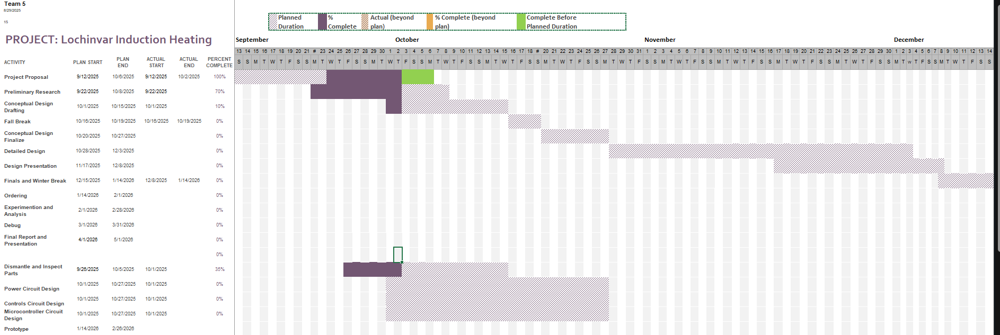
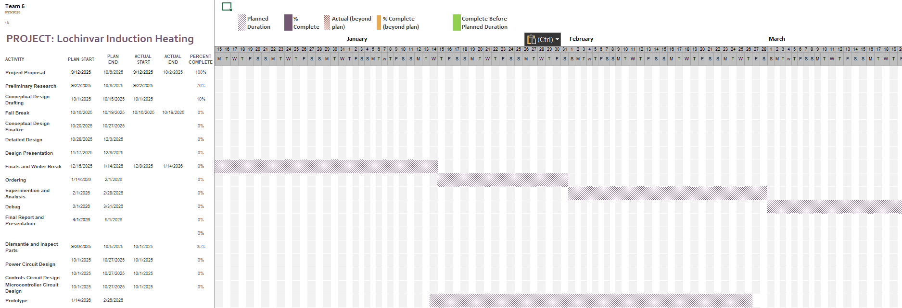
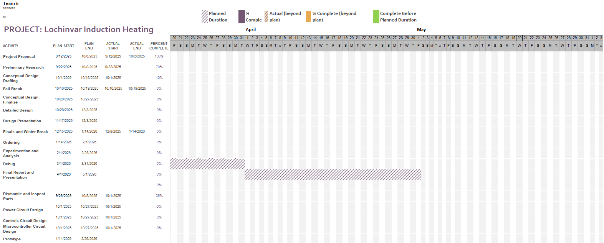

# Project Proposal

## Introduction

Induction heating has proven itself to be a reliable and effective method for transferring energy into materials. By allowing eddy currents to flow through conductive materials, this technology enables accurate and controllable heating for various applications, including industrial metal processing and consumer induction cooktops. Although the fundamentals of the heating process are well known, the controller, on the other hand, the component that is responsible for regulating power delivery, modes of operation, as well as feedback measurements, wholeheartedly determines the performance of the induction system.

This project proposes the design and prototyping of an induction heater controller that can heat both the internal and surface-level material of a circular heating element. The prototype will also be able to verify temperature rise against electrical power, as well as deliver measured performance data and offer a variety of user-selectable power settings.This prototype will also be validated by its effectiveness through testing circular bar stock and standard black pipe, with thermocouples measuring temperature rise against electrical power input. With the gathering of this data, the system will supply a clear display of how different control modes can and will affect heating performance, efficiency, and usability.

Within this proposal, the remainder of the document will discuss:
- The formulation of the problem at hand 
- The background of induction heating and control systems 
- The specifications anf constraints that go into the controller 
- Surveying of already existing solutions to the problem of controlling induction heating
- Timeline of the project 
- What will be the expected outcome and benefits of the project

## Formulating the Problem

The issue at hand is not the induction heater itself; however, it’s the controller that needs to be able to be customizable for the many applications and particular use cases. There are industrial and commercial induction heaters that lack vital measurement capabilities in addition to the flexibility required for controlled testing and validation. A customized controller is necessary if wanted to show variable heating performances, collect data, and act as a prototype platform for additional research.

The controller must safely and efficiently handle high power transfer while also allowing accurate user control and measurement; this is not a single person task.  Current consumer grade induction heaters lack the instrumentation and adjustability needed for this project because they are designed for cooking applications. Thus, a customized engineered system is required, which involves a multiple disciplinary engineering effort.

### Background

Induction heating is a non-contact method of transferring energy into conductive materials through electromagnetic induction. When a time-varying magnetic field surrounds a conductive body, eddy currents are induced within the material, and in ferromagnetic materials additional heat arises from magnetic hysteresis losses [9]. These induced currents are typically concentrated near the surface due to the skin effect, which means the depth of heating strongly depends on frequency and material properties [10]. The technique is valued for its efficiency, cleanliness, and ability to deliver rapid and localized heating [11].

In applications where uniform heating is critical, focusing exclusively on surface-level heating can lead to overheating of the outer regions while the core lags behind in temperature. Conversely, targeting only internal heating may cause surface underheating or delays in reaching the desired surface temperature. This imbalance reduces efficiency and can compromise performance. For circular heating elements in particular, temperature uniformity is heavily influenced by coil geometry, pattern design, and coil–workpiece spacing; suboptimal coil layouts produce visible nonuniformities across the surface [12]. Multi-field finite element and semi-analytical simulations confirm that coupling between electromagnetic fields and thermal diffusion results in uneven temperature distribution, especially in thicker or more complex shapes [13].

The key to addressing this challenge lies in the design of the induction heater’s controller. By enabling real-time adjustment of inverter frequency and output power, the controller can shift the balance between surface-level and internal heating depending on operational needs [14]. Modern inverter designs use resonant tracking, frequency modulation, and energy-dosing strategies to maintain efficiency while adapting penetration depth [15],[16]. Furthermore, modern control strategies integrate feedback from sensors—ranging from infrared temperature sensors to magnetic-field or inductive sensors that respond to changes near the Curie point—allowing closed-loop operation that dynamically adapts to the heating profile [17]. Such adaptive approaches improve energy efficiency, enhance safety, and expand the flexibility of induction heating systems in both industrial and consumer applications [18].

### Specifications and Constraints

#### Specifications

Based on the deliverables given to us by Lochinvar:

1. This controller shall have multiple power settings similar to current induction cook tops.

2. This controller shall be capable of inducing surface eddy currents and internal heating.

3. This controller shall test circular bar stock and standard black pipe thermocouple in such a manner to validate the success of the heating.

4. This controller shall measure total electrical power consumed.  

5. This controller shall measure the total temperature rise of the metal.

#### Constraints

NEC Article 427 [4] covers Fixed Electric Heating Equipment for Pipelines and Vessels. Part V covers the codes regarding Induction Heating, and Part VII covers the Controls and Protection. Notably if the controller contains an off switch it should not be able to enerize automatically while in the off position, and selecting off should open all ungrounded conductors.

NEC Article 665 [7] covers Induction and Dielectric Heating Equipment. Part I has guidelines "the current flow from the output circuit to ground under operating and ground-fault conditions shall be limited to a value that does not cause 50 volts or more to ground to appear on any accessible part of the heating equipment and its load." Part II states the control panel should be dead front construction, that is: no live circuits at risk of shocking people. 

ANSI/IEEE 844-200 [8] applies directly to induction heating for pipelines and vessels. It states that the elctric shock hazard for induction heating is minimal, but the high temperatures and induced current flow are design considerations [8]. There are a couple other IEEE standards related to heating such as ANSI/IEEE 515-2011 with standards for industrial electrical trace heating applications and ANSI/NECA 202-2013 with standards for installing and maintaining industrial heat tracing systems [4]. 

## Survey of Existing Solutions 

Lochinvar has supplied the team with an Intertek SK-IH18G23T induction cooker[1]. This induction cooker is designed to be used with smooth, flat bottom base cookware and would not be sufficient to properly accurately control the temperature of circular bar stock or standard black pipe thermocouple. However, this cooker provides insight into some commercial induction heating controllers available. The cooker utilizes an open loop control system operating based on user selcted power and time settings. This cooker has no feedback to know the actual temperature of the part heated, but it is able to predict the temperature from the power selected by the user. The cooker is preprogrammed to 10 temperatures of 120°F to 460°F correlating to 180 Watts to 1800 Watts [2]. Preprogrammed open loop control provides a cost effective and user intuitive solution, but the relation between temperature and power would need to be tested using a temperature sensor to meet this project's specifications. The sensors utilized in this cooker are oriented towards user safety rather than controlling the heating directly, such as checking for compatible cookware or if the cooker itself is being overheated [2]. The team's solution may include some of these safety features to protect the user. 

Commercially there are a few induction heaters available with closed loop control, such as Impulse Labs' Impulse Cooktop[3]. The Impulse Cooktop features sensors in each burner [3] which allows for much more accurate temperature control. These sensors allow the cooktop to know the actual temperature of the part being measured, so the controller does not have to approximate the part's temperature based on previous tests. Closed loop control is more expensive than open loop control and requires more time to design the system to properly respond to the feedback loops, but may be necessary depending on how accurate you need to know the actual temperature of the part being measured rather than approximating. To meet specifications the team may need to implement a similar closed loop control without exceeding budget or time contraints. 

## Measures of Success

The success of the induction heating controller will be defined through a series of structured experiments designed to evaluate its ability to meet the outlined specifications. Each specification corresponds to a measurable performance indicator, and the validation process ensures that the system satisfies both functional and operational constraints.

First, the controller’s ability to operate at multiple power settings will be assessed in a manner consistent with current induction cooktops. The verification will involve subjecting the system to incremental power adjustments and recording the output response. Successful operation will be demonstrated if the controller reliably delivers stable heating at all programmed power levels without introducing instability or performance degradation.

Second, the project will evaluate the controller’s capacity to induce both surface-level eddy currents and deeper internal heating. This will be verified using test samples of circular bar stock and standard black pipe equipped with thermocouples at different depths. By monitoring the thermal gradients, it will be possible to confirm whether the controller can effectively shift between surface heating and volumetric heating modes. The degree of temperature penetration will serve as a benchmark for success.

Third, the system will undergo thermal validation tests to confirm the heating outcomes on the specified test materials. Thermocouples attached at critical points on the bar stock and pipe will provide direct feedback on the temperature rise over time. A successful outcome will be indicated by consistent and reproducible heating profiles that match the expected thermal response under each power setting.

Fourth, the measurement of total electrical power consumed will be incorporated into the test methodology. Power sensors will record the input energy drawn by the induction system under varying operational modes. Success will be determined by the controller’s ability to provide accurate energy usage data, which will later serve as the basis for efficiency calculations.

Finally, the total temperature rise of the metal will be analyzed to verify thermal performance. The methodology will involve comparing the recorded thermal rise against expected values derived from simulation and analytical predictions. A successful result will show alignment between predicted and experimental data, demonstrating both accuracy of control and effectiveness of the heating process.

Through this combination of controlled experiments, sensor-based measurements, and comparative analysis, the project will establish clear criteria for determining whether the induction heating controller meets its specifications. The ability to validate performance across multiple dimensions—power flexibility, surface versus internal heating, energy monitoring, and temperature control—will collectively define the success of the system.

## Resources
For this project to be successful, an estimated budget and allocation of personnel is needed to ensure adequate preparations are made in a timely manner. Below, the budget and personnel is shown.

### Budget

The budget of the project will need to not only meet the expenses required for any components required for the induction controller, but also take into account unforseen expsenses. Below is a table that shows a list of components needed as well as an estimated cost for each listed.
| Components      | Estimated Cost |      Link      |
| ------------    | -------------- | -------------- |
| Litz Wire       |       $30      |       N/A      |
| PCB             |       $50      |       N/A      |
| Display         |       $10      |      [Link](https://www.digikey.com/en/products/detail/display-visions/EA-DOGM132L-5/4896710)              |
| Microcontroller |       $25      |      [Link](https://www.bestmodulescorp.com/en/ht45f0059-16nsop.html)       |
| Encasing        |       $70      |       N/A      |

This brings the total estimated budget for the project to be $185

### Personnel

The team has a strong foundation in analyzing electrical circuits and programming. However, to meet the goal of designing an induction coil controller to heat a circular heating element, our team will need to possess the following additional skills:

 - AutoCAD Electrical
 - C++
 - Circuit Design
 - PCB Design
 - Control System Design
 - Power System Design

Additionaly, the team will need to have a fundamental understanding of key topics including:
 - Data Analysis from Measurements
 - Material Response to Induction Heating

Through the use of these skills and topics, the team will be able to successfully navigate the design and prototyping of an induction heater controller.

Daniel Rushing, an electrical engineer from Lochinvar, has stepped in as our supervisor over this project. Rushing will provide guidance and direction for the project.

The team has asked Dr. Ali Alouani to assist in analyzing the controls for an induction coil as he has extensive knowledge of controls and sensor analysis.

### Timeline

## Specific Implications

The specific implications of solving this problem is faster heating, more precise temperature control, better efficiency, and improved safety. Induction heating is faster as it heats directly within the object as opposed to indirectly with conventional resistance-based heating methods. Since the heating is faster, the temperature of the object can be controlled more precisely. Also, induction heating has more control over how deep and which parts of the material are heated. The energy efficiency is improved as a majority of the energy is directly entering the material from the electric current from the electromagnetic fields from the induction coils. With traditional electric heating, the resistive elements blast a lot more heat energy into the air, as not all the energy is conductively transferred to the material being heated. Induction is safer as only the material heats up, not the coils, unlike regular electric heating.

## Broader Implications, Ethics, and Responsibility as Engineers

The broader impacts of this problem include creating a cheaper option for controlling industrial induction heating applications, which, through the team's success, the industry will hopefully gain a cost-effective option. The ethical considerations and responsibilities of solving this problem are notifying the user that it is heating the object, the cost of the controller compared to other heating options, making sure it operates within intended temperatures, and does not use more power than the specified recommended amount. With an induction cooktop, users report that they have a hard time telling that the stove is heating a pot, as without some notification or signal, there is no indication that the cooktop is working. When the team designs the controller, telling the user that it is on with an LED light or message will be crucial for the heater to be safe. Checking a heater by touching it is dangerous. 

Although induction heating can be more expensive than traditional heating methods, the advantages explained above in the Specific Implications outweigh the increased cost. The team will have to make sure the heater does not overheat the object, as that could damage it by being heated past its melting point. Along with this, the controller must make sure it does not surpass the object's temperature differential maximum by heating the material too quickly. The heater has to be controlled without surpassing the amperage limit of the circuit the heater is wired to. Finally, the team will need to make the temperature range, maximum power draw, and temperature differential all configurable, making this controller more versatile and allowing the heater to operate more efficiently. 

## References

[1]“Amazon.com: OMEO Portable Induction Cooktop Hot Plate Countertop Burner 1800 Watts Induction Burner with LCD Sensor Touch, LED Display, 10 Temperature Levels, Child Safety Lock, Auto Shutoff Function: Home & Kitchen,” Amazon.com, 2025. https://www.amazon.com/OMEO-Portable-Induction-Cooktop-Function/dp/B0CQMHM9G6?th=1 (accessed Oct. 04, 2025).

[2]“INDUCTION COOKER User Manual Model: SK-IH18G23T.”

[3]Impulse Labs, “The Impulse Cooktop: The Highest Performing Stove,” YouTube, Jan. 09, 2024. https://www.youtube.com/watch?v=r0U3mTAiV-k (accessed Oct. 04, 2025).

[4]opitts2k, “Article 427,” The NEC Wiki, 2021. https://thenecwiki.com/2021/02/article-427/ (accessed Sep. 25, 2025).
‌
[5] S. Salkowski, “Hot topic: Dispelling the myths about induction stoves,” Acadia Center, [https://acadiacenter.org/hot-topic-dispelling-the-myths-about-induction-stoves/?gad_source=1&gad_campaignid=22858216787&gbraid=0AAAAADcED4I34TheDlrXP_tno7EhyL51z&gclid=Cj0KCQjw0NPGBhCDARIsAGAzpp32uNfoZ_91Cf5AoCcbgiRRpbQHGZyFujKQ54woGBVXDbM_sppvIYEaAhEvEALw_wcB](https://acadiacenter.org/hot-topic-dispelling-the-myths-about-induction-stoves/?gad_source=1&gad_campaignid=22858216787&gbraid=0AAAAADcED4I34TheDlrXP_tno7EhyL51z&gclid=Cj0KCQjw0NPGBhCDARIsAGAzpp32uNfoZ_91Cf5AoCcbgiRRpbQHGZyFujKQ54woGBVXDbM_sppvIYEaAhEvEALw_wcB) (accessed Sep. 25, 2025).
‌
‌[6] P. Hope, A. St. John                                                                                                                                        Senior Home & Tech Writer, and D. Yao, “Pros and cons of induction cooktops and ranges,” Consumer Reports, [https://www.consumerreports.org/appliances/ranges/pros-and-cons-of-induction-cooktops-and-ranges-a5854942923/](https://www.consumerreports.org/appliances/ranges/pros-and-cons-of-induction-cooktops-and-ranges-a5854942923/) (accessed Sep. 25, 2025).

[7] opitts2k, “Article 665,” The NEC Wiki, 2021. https://thenecwiki.com/2021/02/article-665/ (accessed Sep. 29, 2025).

[8]N. R. Rafferty and G. Tarbutton, “IEEE 844-2000: Recommended Practice for Electrical Impedance, Induction, and Skin Effect Heating of Pipelines and Vessels,” IEEE Transactions on Industry Applications, vol. 38, no. 4, pp. 921–926, Jul. 2002, doi: https://doi.org/10.1109/tia.2002.800586.
‌
[9] “Thermal Analysis of Electromagnetic Induction Heating for Cylinder-Shaped Objects.” Electrophoresis, 2025, https://pubmed.ncbi.nlm.nih.gov/39831469/. Accessed 3 Oct. 2025.

[10] Jankowski, T. A., et al. “Approximate Analytical Solution for Induction Heating of Solid Cylinders.” Applied Mathematical Modelling, 2015, https://www.osti.gov/pages/biblio/1225114. Accessed 3 Oct. 2025.

[11] “State of the Art and Future Trends in Monitoring for Induction Surface Hardening.” Electronics, 2024, https://www.mdpi.com/2079-9292/13/13/2591. Accessed 3 Oct. 2025.

[12] Xia, Z., et al. “Design and Temperature Uniformity Optimization of Three Circular Coil Patterns.” Energies, 2025, https://www.mdpi.com/1996-1073/18/11/2695. Accessed 3 Oct. 2025.

[13] Areitioaurtena, M., et al. “A Semi-Analytical Coupled Simulation Approach for Induction Heating.” AMSES Journal, 2021, https://amses-journal.springeropen.com/articles/10.1186/s40323-021-00199-0. Accessed 3 Oct. 2025.

[14] Madzharov, N., B. Gilev, and N. Hinov. “Design of Resonant Inverters with Energy Dosing, Based on Optimization with Reference Curve.” Electronics, 2025, https://www.mdpi.com/2079-9292/14/2/327. Accessed 3 Oct. 2025.

[15] Madzharov, N., and N. Hinov. “Analysis and Design of Resonant DC/AC Converters with Energy Dosing for Induction Heating.” Energies, 2023, https://www.mdpi.com/1996-1073/16/3/1462. Accessed 3 Oct. 2025.

[16] Shimizu, M., et al. “Fully soft switched high step-up/down bidirectional buck/boost converter with reduced switch voltage stress.” IET Power Electronics, vol. 16, no. 2, 2023, pp. 250–259. https://doi.org/10.1049/pel2.12457. Accessed 3 Oct. 2025.

[17] “Non-Contact Infrared Sensing in Induction Heating: Thermal Monitoring of Inductive Hardening.” Optris, https://optris.com/application/metal/inductive-hardening-of-a-crankshaft/. Accessed 3 Oct. 2025.

[18] “Validation of the Analytical Approximation for Induction Heating of Ionic Solutions Using COMSOL.” COMSOL, 2017, https://www.comsol.de/paper/download/680221/Validation_of_the_analytical_approximation_for_induction_heating_ionic_solutions_using_COMSOL.pdf. Accessed 3 Oct. 2025.

## Statement of Contributions
Aaron Neuharth - Measures of Success, Resources, Budget, Timeline, Personnel

Dow Cox - Specific Implications and Broader Implications, Ethics, and Responsibility as Engineers. Reference [5] and [6]

Austin DuCrest - Background, Survey of Existing Solutions, Measures of Success. Reference [9], [10], [11], [12], [13], [14], [15], [16], [17], [18] 

John Donnell - Introduction and formulating the problem 

Cole Wilson - Specifications, Contraints, and Survey of Existing Solutions. Reference [1], [2], [3], [4], [7], [8]

